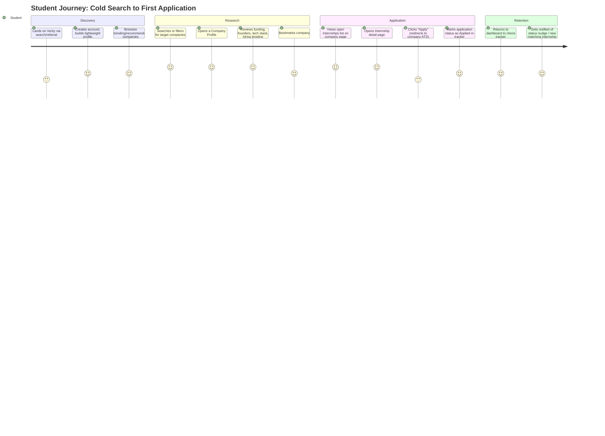
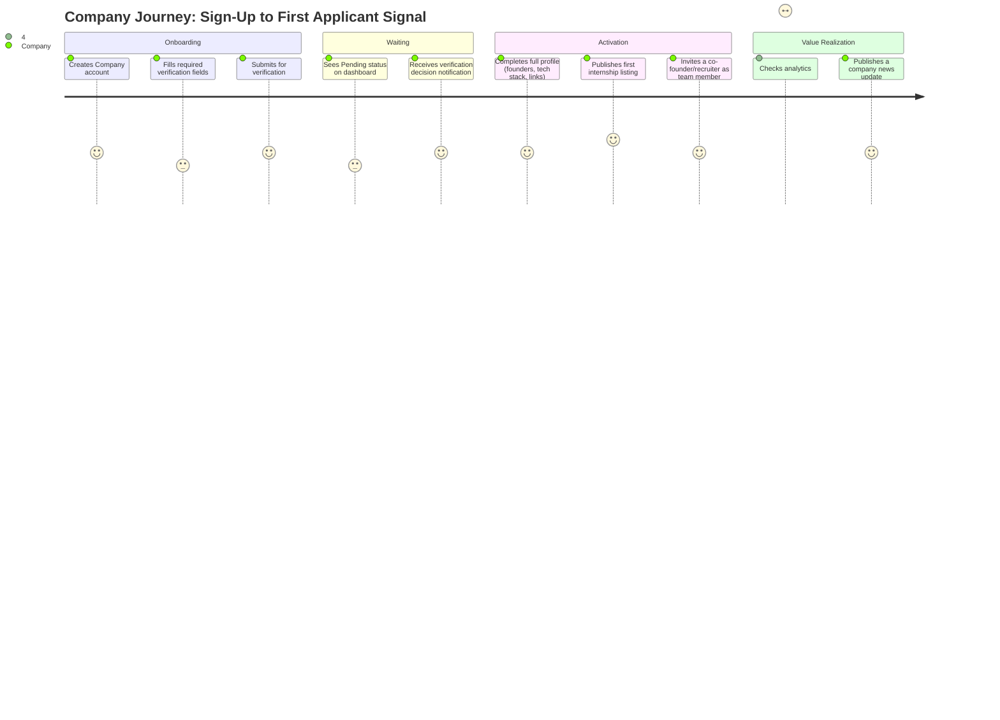
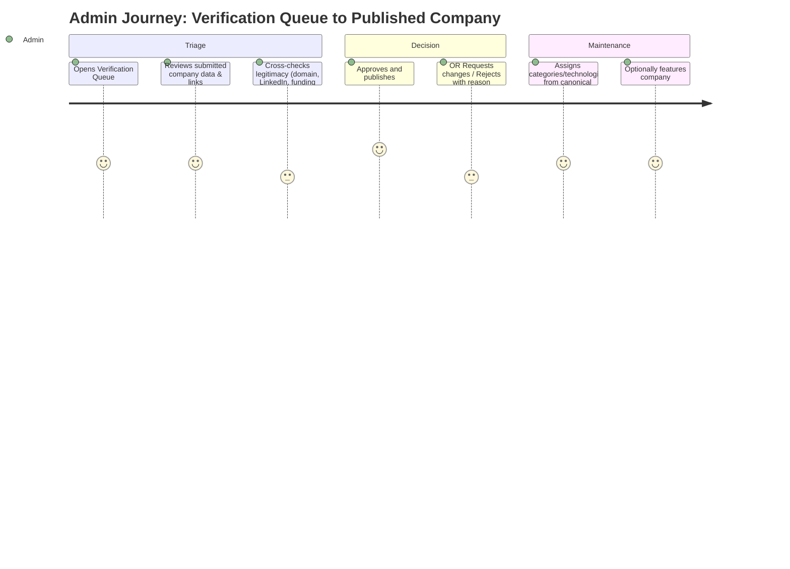

# Verity — Product Requirements Document (PRD)

**Document:** 01-PRD.md
**Version:** 1.0 (V1 Scope)
**Status:** Draft for Engineering Sign-off
**Owner:** Product
**Last Updated:** 2026-07-03

**Tagline:** Discover. Research. Apply.

---

## Table of Contents

1. Executive Summary
2. Vision
3. Mission
4. Product Goals
5. Business Goals
6. Problem Statement
7. Competitive Analysis
8. User Personas
9. User Stories
10. User Journey Maps
11. Information Architecture
12. Functional Requirements
13. Non-Functional Requirements
14. Feature Specifications
    - 14.1 Student Portal
    - 14.2 Company Portal
    - 14.3 Admin Portal
15. Dashboard Specifications
16. Search Specifications
17. Company Page Specifications
18. Internship Specifications
19. Analytics
20. Notifications
21. Future AI Features
22. Risks
23. Edge Cases
24. Success Metrics & KPIs
25. Acceptance Criteria
26. MVP Definition
27. Future Roadmap

---

## 1. Executive Summary

Verity is a **Career Intelligence Platform** purpose-built for students seeking internships and early-career roles. It replaces the fragmented, hour-per-company research ritual — bouncing between LinkedIn, Wellfound, Greenhouse, Lever, company careers pages, Crunchbase, the YC directory, and raw Google search — with a single, curated, high-trust source of truth.

Where a job board answers "what roles are open," Verity answers the three questions students actually ask before they apply:

1. **Is this company legitimate, funded, and actually hiring?** (Company Intelligence)
2. **Who works here, who founded it, and who do I talk to?** (Founder & People Intelligence)
3. **What does the role look like, and how do I track my application?** (Internship Discovery & Application Tracking)

V1 is deliberately **manual and curated** — no scraping, no AI, no automated data ingestion. Every company, founder, and internship listing is entered by a Company account or verified by an Admin. This is a product decision, not a technical limitation: trust is the product's core differentiator, and trust cannot be scraped. The architecture, however, is built so that scraping, AI matching, and automated enrichment can be layered on in V2+ without a rewrite.

Verity ships three portals from a single Next.js codebase — **Student**, **Company**, and **Admin** — sharing one Postgres database, one Prisma schema, and one design system. This document defines the full V1 product surface: every screen, every role's permissions, every data model implication, every edge case, and the metrics that will tell us whether the bet paid off.

**In one sentence:** Verity is Crunchbase's rigor, LinkedIn's people-graph, and Linear's craft, applied to the internship search.

---

## 2. Vision

**Verity becomes the default first stop for every student who types "internships at [company]" into a search engine.**

In five years, Verity is the canonical, trusted record of which companies are actually hiring students, what those companies are really like, and who within them makes hiring decisions — the way Crunchbase became the canonical record of startup funding. Students bookmark Verity company pages the way they bookmark LinkedIn profiles. Companies treat an unclaimed, unverified Verity profile the way they'd treat an unclaimed Glassdoor listing: an urgent problem to fix.

The long-term vision extends beyond discovery into **outreach and matching** — AI-assisted resume analysis, personalized cold emails, and a recommendation engine that proactively surfaces companies a student didn't know to search for. V1 intentionally does none of this. It builds the trusted data layer those features will eventually stand on. A recommendation engine trained on sparse, low-trust data recommends garbage; Verity earns the right to build AI features by first proving it can build a dataset worth training on.

---

## 3. Mission

**To give every student the same quality of company intelligence that VCs, recruiters, and founders already have — for free, in one place, in minutes instead of hours.**

---

## 4. Product Goals

| # | Goal | Why it matters |
|---|------|-----------------|
| G1 | Reduce company research time from ~60 minutes to under 5 minutes per company | This is the core value proposition; if we don't move this number, nothing else matters |
| G2 | Reach 100 fully-verified, high-quality company profiles before public launch | Quality-over-quantity is a stated philosophy; a sparse but trustworthy catalog beats a large unreliable one |
| G3 | Give companies a self-serve portal so profile maintenance doesn't bottleneck on Admin | Manual curation must scale via delegation, not just Admin headcount |
| G4 | Build an Admin verification pipeline that can process a new company in under 10 minutes | Verification is the trust mechanism; if it's slow, the catalog stalls |
| G5 | Ship an architecture that supports future AI/scraping without a schema rewrite | V2 velocity depends on V1 not painting us into a corner |
| G6 | Achieve a student profile-to-bookmark conversion rate that signals genuine research intent | Bookmarking is the leading indicator of "this page did its job" |

---

## 5. Business Goals

| # | Goal | Target (V1 / first 2 quarters post-launch) |
|---|------|----------------------------------------------|
| B1 | Establish Verity as a credible, fundable product for demo/investor purposes | Complete, polished V1 live on a production domain |
| B2 | Prove organic demand from students without paid acquisition | 1,000+ unique student sign-ups via organic/campus channels |
| B3 | Prove companies will self-serve their own profiles | 20+ companies complete self-serve verification without Admin hand-holding |
| B4 | Establish a defensible data moat | 100+ verified companies with founder/team-level detail unavailable elsewhere in one place |
| B5 | Validate a future monetization path (verified badges, featured placement, analytics for companies) | Directional signal only in V1 — no billing implementation required, but data model must not block it |

---

## 6. Problem Statement

Finding a legitimate internship as a student in 2026 requires synthesizing information scattered across **at least six different tools**, each of which was built for a different job:

- **LinkedIn** — good for people, bad for structured company data, ads-cluttered, algorithmically noisy.
- **Wellfound (AngelList Talent)** — good for startup listings, weak on non-YC/non-tech-forward companies, sparse founder detail.
- **Greenhouse / Lever job boards** — only show open roles, zero company context, no comparison across companies.
- **Company careers pages** — inconsistent format, no cross-company comparability, often stale.
- **Crunchbase** — excellent funding data, but no internship listings, paywalled beyond basics.
- **YC Directory** — only covers YC-backed companies, no application tracking.
- **Google** — the fallback for everything above, which is itself the symptom of the problem.

The result: a student evaluating whether to apply to a given company spends **45–90 minutes** stitching together funding stage, headcount, founders, tech stack, remote policy, and whether the company is even still hiring — often only to discover the listing is six months stale. This research tax falls hardest on students without existing networks (first-generation students, students outside target schools for a given company), widening an already unequal playing field.

Verity's bet: if this data lives in one place, is manually verified for accuracy, and is structured consistently across every company, the research time collapses and application quality goes up because students can be selective and informed rather than exhausted and scattergun.

---

## 7. Competitive Analysis

| Product | Strength | Gap Verity fills |
|---|---|---|
| **LinkedIn** | People graph, network effects, huge inventory | No structured company research view; job posts drown in feed noise; no application tracker tied to research |
| **Wellfound** | Startup-native, equity/salary transparency | Weak coverage outside venture-backed tech; thin founder/team profiles; no research-depth pages |
| **Handshake** | Deep campus/university integration | Optimized for university career centers, not student-led company research; UX feels institutional, not consumer-grade |
| **Crunchbase** | Best-in-class funding & company data | No internship listings, no student workflow, paywall on depth |
| **Glassdoor** | Reviews, salary data | Reviews are unverified/anecdotal, not structured company intelligence; no listings-to-tracker flow |
| **YC Directory / Job Board** | High-signal for YC companies specifically | Zero coverage outside the YC portfolio |
| **Google Search** | Universal fallback | No structure, no verification, no memory of what you already researched |

**Verity's differentiated position:** the only product that combines *verified* company intelligence (Crunchbase-grade) with *internship-specific* listings (Wellfound-grade) and a *personal workflow layer* (bookmarks + application tracker) students never have to leave to do their research end-to-end.

**Explicit non-goals for V1 (by design, not oversight):**
- Not competing with LinkedIn on networking/social features.
- Not competing with Handshake on university-specific integrations (no SSO with school career centers in V1).
- Not competing with Glassdoor on anonymous reviews (unverified content contradicts the trust thesis).

---

## 8. User Personas

### Persona 1 — "Priya," The Sophomore Researcher (Student)
- **Age:** 19, Computer Science, State University
- **Context:** First internship search. No existing network at target companies. Applying to 40+ places.
- **Goals:** Quickly tell which companies are legitimate and actively hiring interns; avoid wasting an application on a company that stopped hiring interns last cycle; find companies with visa sponsorship (international student).
- **Frustrations:** Company career pages that say "we're hiring" with no open internship roles; LinkedIn "Easy Apply" listings that are reposted/stale; no way to track which of the 40 companies she's already applied to without a spreadsheet.
- **Verity value:** One dashboard for search, bookmarks, and application tracking; verified badge tells her a listing is real *today*.

### Persona 2 — "Marcus," The Selective Senior (Student)
- **Age:** 21, applying to a short, curated list of 8 late-stage-startup companies for a return-offer-track internship.
- **Goals:** Deep-dive research — funding history, founding team backgrounds, hiring manager identities — before he applies, because he only wants to submit to companies he's genuinely excited about.
- **Frustrations:** Founder backgrounds require independently searching LinkedIn + Crunchbase + company blog; no single "hiring timeline" view to know if a company is early or late in its cycle.
- **Verity value:** Company Profile depth (founders, funding, hiring timeline, tech stack) replaces 5 tabs of research with one page.

### Persona 3 — "Elena," The Startup Recruiter (Company — Admin role at a company account)
- **Age:** 27, Head of Talent at a 40-person Series A startup.
- **Goals:** Get in front of qualified student applicants without paying for a job board; keep the company profile current with minimal ongoing effort; understand how many students are viewing/bookmarking the profile.
- **Frustrations:** Maintaining presence on 4+ job boards is a part-time job; no analytics on which platforms actually drive quality applicants.
- **Verity value:** Self-serve Company Dashboard, lightweight profile maintenance, basic analytics (views, bookmarks) to justify time spent.

### Persona 4 — "David," The Founder (Company — Owner role)
- **Age:** 31, co-founder/CEO of a seed-stage startup, 12 employees.
- **Goals:** Be visible to ambitious students without a dedicated recruiter; showcase founding team credibility to help win a first intern hire.
- **Frustrations:** Too early-stage to show up meaningfully on LinkedIn or Wellfound search; no way to control how the company is publicly represented as a hiring-team-of-one juggling everything.
- **Verity value:** Founder-level profile fields let him put his own credibility (previous company, school) directly in front of student researchers.

### Persona 5 — "Admin (Aisha)," The Verity Operator (Admin)
- **Age:** N/A — internal role.
- **Goals:** Keep the catalog free of fake/duplicate/inactive companies; process new company verification requests quickly; maintain a single canonical taxonomy of categories and technologies so search/filtering stays useful.
- **Frustrations (anticipated):** Verification queue backing up; inconsistent company-submitted data (typos in tech stack names, duplicate categories); reported abuse/spam.
- **Verity value:** Purpose-built Admin Dashboard with a verification queue, moderation tools, and canonical taxonomy management.

---

## 9. User Stories

Format: `As a [role], I want to [action], so that [benefit].` Each story maps to a functional requirement in Section 12.

### Student Stories
- S1. As a Student, I want to search companies by name, so that I can quickly jump to a company I already know about.
- S2. As a Student, I want to filter companies by category, technology, funding stage, remote policy, and visa sponsorship, so that I only see companies relevant to my situation.
- S3. As a Student, I want to view a full company profile, so that I can research a company in one place instead of six tabs.
- S4. As a Student, I want to see a company's hiring timeline, so that I know whether they're actively recruiting interns right now.
- S5. As a Student, I want to bookmark companies and internships, so that I can return to them later without re-searching.
- S6. As a Student, I want to track the status of my applications (saved, applied, interviewing, offer, rejected), so that I don't lose track across dozens of applications.
- S7. As a Student, I want to see founders' and hiring managers' backgrounds, so that I can tailor my outreach and understand who I'd be working near.
- S8. As a Student, I want to see recently added companies and trending companies, so that I discover opportunities I wasn't already searching for.
- S9. As a Student, I want to build a profile (school, major, grad year, interests), so that the recommended companies section becomes more relevant over time.
- S10. As a Student, I want to see a list of a company's currently open internships with clear open/closed status, so that I never apply to a stale listing.
- S11. As a Student, I want to see recent company news, so that I can reference it in interviews and outreach.

### Company Stories
- C1. As a Company owner, I want to create a company account and submit it for verification, so that my company appears as a trusted, badge-verified profile.
- C2. As a Company admin, I want to edit our company profile (about, products, funding, tech stack, links), so that our page stays accurate without contacting Verity support.
- C3. As a Company admin, I want to publish a new internship listing, so that verified students can discover and apply to it.
- C4. As a Company admin, I want to archive/close an internship listing, so that students never see a stale "open" role.
- C5. As a Company admin, I want to invite team members (co-founders, hiring managers, recruiters) with defined roles, so that multiple people can maintain the profile without sharing one login.
- C6. As a Company admin, I want to publish short company news/updates, so that our profile stays fresh and gives students a reason to revisit.
- C7. As a Company admin, I want to see basic analytics (profile views, bookmark counts, internship view counts), so that I can justify the time spent maintaining our Verity presence.
- C8. As a Company admin, I want to see our verification status and what's blocking approval, so that I'm not stuck guessing why we're not live.

### Admin Stories
- A1. As an Admin, I want a verification queue of pending company submissions, so that I can review and approve/reject them efficiently.
- A2. As an Admin, I want to moderate reported companies or internships, so that spam and fraudulent listings don't stay live.
- A3. As an Admin, I want to manage the canonical list of categories and technologies, so that filtering and search stay consistent across the catalog.
- A4. As an Admin, I want to feature specific companies on the student dashboard, so that I can editorially surface high-quality or newly-verified companies.
- A5. As an Admin, I want to manage user accounts (students and company members), so that I can handle abuse reports, disable accounts, or assist with account recovery.
- A6. As an Admin, I want platform-wide analytics (companies, students, internships, applications, search terms), so that I can track platform health and prioritize outreach.
- A7. As an Admin, I want to directly create or edit a company profile on behalf of a company that hasn't yet self-served, so that I can seed the catalog to 100 companies before self-serve volume ramps up.

---

## 10. User Journey Maps

### 10.1 Student Journey — "From Cold Search to First Application"

**Key insight driving design:** the moment of highest drop-off risk is the transition from "Research" to "Application" — if the Company Profile doesn't clearly surface *currently open* internships, students bounce to Google to double-check. The Company Profile and Internship list must never show ambiguous or stale status.

### 10.2 Company Journey — "From Sign-Up to First Verified Applicant Signal"

### 10.3 Admin Journey — "Verification Queue to Published Company"

---

## 11. Information Architecture

```mermaid
graph TD
    Root[Verity]
    Root --> Public[Public / Unauthenticated]
    Root --> StudentApp[Student Portal]
    Root --> CompanyApp[Company Portal]
    Root --> AdminApp[Admin Portal]

    Public --> P1[Landing Page]
    Public --> P2[Public Company Directory - preview]
    Public --> P3[Sign Up / Sign In]

    StudentApp --> S1[Student Dashboard]
    StudentApp --> S2[Search]
    StudentApp --> S3[Company Profile Page]
    StudentApp --> S4[Internship Detail Page]
    StudentApp --> S5[Bookmarks]
    StudentApp --> S6[Application Tracker]
    StudentApp --> S7[Student Profile Settings]
    StudentApp --> S8[Categories Browse]

    CompanyApp --> C1[Company Dashboard]
    CompanyApp --> C2[Company Profile Editor]
    CompanyApp --> C3[Internship Manager]
    CompanyApp --> C4[Company News Manager]
    CompanyApp --> C5[Team Members]
    CompanyApp --> C6[Verification Status]
    CompanyApp --> C7[Company Analytics]
    CompanyApp --> C8[Company Settings]

    AdminApp --> A1[Admin Dashboard]
    AdminApp --> A2[User Management]
    AdminApp --> A3[Company Management]
    AdminApp --> A4[Internship Management]
    AdminApp --> A5[Verification Queue]
    AdminApp --> A6[Reports / Moderation]
    AdminApp --> A7[Platform Analytics]
    AdminApp --> A8[Categories Management]
    AdminApp --> A9[Technologies Management]
    AdminApp --> A10[Feature Management]
```

**Design rationale:** Each portal is a distinct route group (`/app` for Student, `/company` for Company, `/admin` for Admin) sharing one auth provider (Clerk) and one Postgres database, differentiated entirely by RBAC middleware rather than separate deployments. This keeps V1 to a single deployable Next.js app while still giving each role a purpose-built, uncluttered navigation shell (see 02-TRD.md for the middleware implementation).

---

## 12. Functional Requirements

Requirements use MoSCoW prioritization: **M**ust, **S**hould, **C**ould, **W**on't (this version).

### 12.1 Authentication & Account Management
| ID | Requirement | Priority |
|---|---|---|
| FR-01 | System shall support account creation via Clerk (email/password, Google OAuth) | M |
| FR-02 | System shall support three distinct account types: Student, Company, Admin | M |
| FR-03 | A single email may only be associated with one Student account | M |
| FR-04 | Company accounts shall support multiple invited team members with distinct roles (Owner, Admin, Recruiter, Viewer) | M |
| FR-05 | Admin accounts shall only be creatable by an existing Admin (no public Admin sign-up) | M |
| FR-06 | Users shall be able to reset password and update email via Clerk-managed flows | M |
| FR-07 | System shall support account deactivation (self-serve) and account suspension (Admin-initiated) | S |

### 12.2 Company Profile Management
| ID | Requirement | Priority |
|---|---|---|
| FR-10 | Company Owner shall be able to create a company profile with required fields (name, domain, description, category, logo) | M |
| FR-11 | Company profile shall support optional fields per Section 17 (Company Page Specifications) | M |
| FR-12 | Company profile shall enter "Pending Verification" state upon submission and be invisible to Students until "Verified" | M |
| FR-13 | Company Admin/Owner roles shall be able to edit all profile fields at any time; edits to a Verified company do not require re-verification unless flagged | S |
| FR-14 | Admin shall be able to manually create/edit a Company profile on behalf of a company (seed data path) | M |
| FR-15 | System shall enforce one canonical profile per unique company domain (duplicate detection at submission) | M |
| FR-16 | Company logo and media uploads shall be stored via Cloudinary with size/type validation | M |

### 12.3 Internship Management
| ID | Requirement | Priority |
|---|---|---|
| FR-20 | Company Admin shall be able to create an internship listing with required fields (title, description, category, location, remote policy, application link, open/close date) | M |
| FR-21 | Internship listings shall have a status: Draft, Open, Closed/Archived | M |
| FR-22 | Only Verified companies may publish an internship listing with status Open (visible to students) | M |
| FR-23 | Company Admin shall be able to archive a listing, which removes it from Student-facing search/browse but retains it for analytics | M |
| FR-24 | System shall auto-flag (not auto-close) internships with no activity/edits past a configurable staleness threshold for Admin review | S |
| FR-25 | Internship "Apply" action shall deep-link to the company's external ATS/application URL (no in-app application form in V1) | M |

### 12.4 Search & Discovery
| ID | Requirement | Priority |
|---|---|---|
| FR-30 | Students shall be able to full-text search companies by name, description, category, and tech stack | M |
| FR-31 | Search shall support filters: category, technology, funding stage, remote policy, visa sponsorship, employee count range, location | M |
| FR-32 | Search results shall be sortable by relevance, recently added, and (future) trending score | M |
| FR-33 | System shall track and store aggregate search queries for Admin analytics | S |
| FR-34 | Student Dashboard shall surface Trending Companies, Recommended Companies, and Recently Added Companies as distinct modules | M |

### 12.5 Bookmarking & Application Tracking
| ID | Requirement | Priority |
|---|---|---|
| FR-40 | Students shall be able to bookmark/unbookmark a Company | M |
| FR-41 | Students shall be able to bookmark/unbookmark an Internship | M |
| FR-42 | Students shall be able to add an Internship to their Application Tracker with a status (Saved, Applied, Interviewing, Offer, Rejected, Withdrawn) | M |
| FR-43 | Students shall be able to manually update tracker status and add private notes per application | M |
| FR-44 | Application Tracker entries are private to the Student; not visible to the Company or Admin (see Privacy, Section 13.6) | M |

### 12.6 Verification & Moderation
| ID | Requirement | Priority |
|---|---|---|
| FR-50 | Admin shall have a Verification Queue listing all Pending companies with submitted data and quick-review links (domain, LinkedIn) | M |
| FR-51 | Admin shall be able to Approve, Request Changes (with reason, returned to Company), or Reject (with reason) a pending company | M |
| FR-52 | Any user (Student or Company) shall be able to submit a Report against a company or internship (spam, inaccurate, fraudulent, offensive) | M |
| FR-53 | Admin shall have a Reports queue with company/internship context and resolution actions (dismiss, warn, suspend, remove) | M |
| FR-54 | Admin shall manage a canonical, deduplicated list of Categories and Technologies used platform-wide | M |
| FR-55 | Admin shall be able to mark a Verified company as Featured for a configurable time window | S |

### 12.7 Notifications
| ID | Requirement | Priority |
|---|---|---|
| FR-60 | System shall notify a Company when verification status changes (approved / changes requested / rejected) | M |
| FR-61 | System shall notify a Student when a bookmarked company publishes a new internship | S |
| FR-62 | System shall notify a Company Owner when a new team member accepts an invite | S |
| FR-63 | V1 notifications are in-app + email; no push/SMS | M (scope), W (push/SMS) |

### 12.8 Analytics
| ID | Requirement | Priority |
|---|---|---|
| FR-70 | System shall track per-company profile views, bookmark counts, and per-internship view counts | M |
| FR-71 | Company Dashboard shall expose aggregate, non-PII analytics to that company's own team only | M |
| FR-72 | Admin Dashboard shall expose platform-wide analytics: total users by role, total companies by status, total internships by status, top search terms, growth over time | M |

---

## 13. Non-Functional Requirements

### 13.1 Performance
- Server-rendered pages (Company Profile, Search Results) shall achieve a Largest Contentful Paint under **2.0s** on a simulated Fast 3G / mid-tier mobile profile.
- Search queries shall return results in under **300ms** at the p95 percentile for a catalog of up to 10,000 companies (PostgreSQL Full Text Search with proper indexing — see 02-TRD.md).
- Dashboard data (Student/Company/Admin) shall load in under **1.5s** on broadband.

### 13.2 Scalability
- Database schema and query patterns must not require a redesign to scale from 100 companies (V1 launch target) to 10,000+ companies.
- Architecture must support horizontal read scaling (read replicas) without application-layer changes, in anticipation of V2 growth.

### 13.3 Reliability & Availability
- Target **99.5% uptime** for V1 (single-region Vercel deployment is acceptable; no multi-region requirement in V1).
- Automated daily database backups with a documented restore procedure (see 10-deployment.md).

### 13.4 Security
- All authentication flows delegated to Clerk; no self-managed password storage.
- All mutating routes (Server Actions / Route Handlers) must enforce RBAC checks server-side — client-side role checks are UX-only, never a security boundary.
- All user-submitted content (company descriptions, news posts) must be sanitized against XSS before render.
- File uploads (logos, media) restricted by MIME type and size at both client and server layers.

### 13.5 Accessibility
- WCAG 2.1 AA compliance target for all Student-facing pages (the highest-traffic, most diverse audience).
- All interactive elements keyboard-navigable; color contrast ratios validated in the design system (see 03-design.md).

### 13.6 Privacy
- Application Tracker data (status, private notes) is Student-private data; never exposed to Company or Admin views, and excluded from Company-facing analytics aggregation.
- Company Analytics are aggregate and anonymized — Companies see "142 profile views" and "18 bookmarks," never a list of which Students viewed or bookmarked.
- Admin Platform Analytics may access aggregate/anonymized cross-role data for platform health only, not individual Student browsing history in identifiable form outside of moderation/support investigations.

### 13.7 Data Quality (unique to Verity's trust thesis)
- Every field on a Verified company profile must have a `lastVerifiedAt` or `lastEditedAt` timestamp surfaced to Admin, enabling staleness auditing.
- Category and Technology values are constrained to the Admin-managed canonical taxonomy (no freeform tag sprawl) to keep filters meaningful at scale.

---

## 14. Feature Specifications

### 14.1 Student Portal

**Core capability set:** Search, Browse, Research, Bookmark, Track, Personalize.

- **Search & Browse:** Global search bar (persistent in nav) with typeahead; Category browse grid on entry; filter sidebar on results (category, technology, funding stage, remote policy, visa sponsorship, employee count, location).
- **Company Profile:** Full read-only view of all fields in Section 17. Primary CTAs: Bookmark, View Open Internships (anchor-scrolls to Internships module on same page).
- **Internship Detail:** Title, full description, requirements, location, remote policy, compensation (if disclosed), open/close window, and an external "Apply on [Company]'s site" CTA. Secondary CTA: Bookmark + Add to Tracker.
- **Bookmarks:** Two tabs — Companies and Internships — both list views with quick-remove and quick-navigate.
- **Application Tracker:** Kanban-style board (Saved → Applied → Interviewing → Offer / Rejected / Withdrawn) with drag-to-update-status and a list-view toggle for accessibility. Per-entry private notes field.
- **Student Profile / Settings:** School, major, graduation year, areas of interest (mapped to Category taxonomy), resume upload placeholder (future — field exists in schema, upload UI deferred), notification preferences.
- **Recommendations (V1 scope note):** "Recommended Companies" in V1 is **rules-based, not AI** — driven by overlap between Student's declared interests/major and Company category/technology tags, plus recency and featured-status weighting. True ML-based recommendation is explicitly a V2+ feature (Section 21).

### 14.2 Company Portal

**Core capability set:** Profile Management, Internship Publishing, Team Collaboration, News Publishing, Analytics.

- **Onboarding:** Multi-step guided form collecting required verification fields (Section 17), ending in a "Submitted for Verification" state with an estimated review time shown to set expectations.
- **Company Profile Editor:** Form-based editor mirroring the public profile's structure (Hero, About, Products, Funding, Hiring Timeline, Tech Stack, Founders/Team, Links). Autosave with a visible "last saved" indicator; explicit "Publish changes" action for any field flagged as re-verification-sensitive (e.g., changing the registered domain).
- **Internship Manager:** List/table view of all internships (Draft, Open, Closed) with inline status toggles, a create/edit form, and archive action. Cannot publish an Open listing unless the company's overall verification status is Verified (enforced server-side).
- **Company News Manager:** Lightweight CMS for short update posts (title, body, optional link) shown on the public profile's "Recent News" module, reverse-chronological, with a soft cap (e.g., last 10 shown) to avoid the page becoming a blog feed.
- **Team Members:** Invite by email, assign role (Owner, Admin, Recruiter, Viewer — see RBAC table in 02-TRD.md), revoke access, transfer ownership (Owner-only action, requires confirmation).
- **Verification Status:** Persistent status banner (Pending / Changes Requested / Verified / Rejected) with Admin-provided reason text when applicable, and a clear "what to fix" checklist when Changes Requested.
- **Analytics:** Profile views over time, bookmark count, per-internship view counts, all aggregate/anonymized per Section 13.6.

### 14.3 Admin Portal

**Core capability set:** Verification, Moderation, Taxonomy Management, User Management, Platform Analytics, Featuring.

- **Verification Queue:** List of Pending companies sorted oldest-first, with a review panel showing all submitted fields side-by-side with quick-access external links (company domain, LinkedIn) opened in new tabs for manual cross-checking. Actions: Approve, Request Changes (reason required, freeform + optional canned reasons), Reject (reason required).
- **Company Management:** Full CRUD over any company profile (the "seed data" path for reaching the 100-company V1 launch target before self-serve volume is meaningful), plus the ability to suspend/unpublish a previously-Verified company.
- **Internship Management:** Cross-company table of all internships with status, company, posted date, and moderation actions (unpublish, flag as stale).
- **Reports / Moderation:** Queue of user-submitted reports (Section 12.6) with resolution actions and an audit trail of past resolutions per company.
- **Categories & Technologies Management:** CRUD over the canonical taxonomy with merge/rename tooling (e.g., merging a duplicate "React.js" tag into "React") to keep filters clean as the catalog grows.
- **Feature Management:** Select which Verified companies appear in the Student Dashboard's "Featured" module, with a start/end date for the placement window.
- **User Management:** Search/view Student and Company accounts, disable/reinstate accounts, view basic account metadata for support purposes (no raw password/auth data, which lives in Clerk).
- **Platform Analytics:** Section 19 detail.

---

## 15. Dashboard Specifications

### 15.1 Student Dashboard
Modules, in default order:
1. **Search** (persistent header, not a scrollable module)
2. **Categories** — horizontal scroll of category chips linking to filtered browse
3. **Trending Companies** — highest bookmark/view velocity over a rolling 7-day window
4. **Recommended Companies** — rules-based per Section 14.1
5. **Recently Added** — newest Verified companies, reverse-chronological
6. **Latest Internships** — newest Open internships across all companies
7. **Bookmarks** — condensed preview (3–5 items) with "View all" link to full Bookmarks page
8. **Application Tracker** — condensed Kanban preview with "View all" link
9. **Recent Activity** — a lightweight feed of the Student's own recent actions (bookmarked X, status changed on Y) — self-referential, not social

### 15.2 Company Dashboard
Modules:
1. **Verification Status banner** (top, persistent when not fully Verified)
2. **Company Analytics** — summary cards (views, bookmarks, internship views) + trend chart
3. **Company Profile** — completion-state summary with "edit" deep links per section
4. **Internships** — status-grouped counts (Draft/Open/Closed) with quick-create CTA
5. **Company News** — recent posts with quick-create CTA
6. **Team Members** — avatar list with roles, invite CTA
7. **Settings** — account-level (billing placeholder, notification prefs, danger zone)

### 15.3 Admin Dashboard
Modules:
1. **Verification Queue** — count badge + top 5 oldest-pending preview
2. **Reports** — count badge + top 5 most-recent preview
3. **Platform Analytics** — headline KPI cards (Section 24) + trend charts
4. **User Management** — quick search
5. **Company Management** — quick search + "create company" CTA (seed path)
6. **Categories / Technologies** — quick access to taxonomy management
7. **Feature Management** — currently-featured companies with quick add/remove

---

## 16. Search Specifications

**Engine:** PostgreSQL Full Text Search (`tsvector`/`tsquery`) in V1 — explicitly not Elasticsearch/Algolia, to avoid infrastructure overhead before the catalog size justifies it (see 02-TRD.md Search Architecture for the migration trigger threshold).

**Indexed fields (weighted):**
| Field | Weight | Rationale |
|---|---|---|
| Company name | A (highest) | Exact/near-exact name matches must rank first |
| Category names | B | High-intent filtering signal |
| Technology tags | B | High-intent filtering signal |
| Company short description | C | Useful but lower-precision matches |
| Founder names | C | Supports "who works at X" style queries |
| Internship titles | B | Students frequently search by role type (e.g., "frontend intern") |

**Filter facets:** Category (multi-select), Technology (multi-select), Funding Stage (single/multi-select: Pre-seed, Seed, Series A, Series B+, Public, Bootstrapped), Remote Policy (Remote, Hybrid, On-site), Visa Sponsorship (Yes/No/Unknown), Employee Count (bucketed ranges: 1–10, 11–50, 51–200, 201–500, 500+), Location (city/region, sourced from company's declared Locations).

**Sort options:** Relevance (default when a query is present), Recently Added (default when no query, only filters), Most Bookmarked *(V1: stretch)*, Alphabetical.

**Empty/zero-result state:** Never a dead end — zero-result search states surface "Browse by category instead" and a "Suggest a company" affordance that routes to a lightweight lead-capture form for Admin follow-up (turns search misses into catalog growth signal).

**Typeahead:** Debounced client query (250ms) against a lightweight `/api/search/suggest` endpoint returning up to 8 company-name matches for fast in-nav jumping, separate from the full filtered search results endpoint.

---

## 17. Company Page Specifications

Every Company Profile is composed of the following modules, in display order. Fields marked **(Req.)** are required for a company to reach Verified status; all others are optional but strongly encouraged (profile completeness is surfaced to the Company as a % complete score to nudge richer profiles).

| Module | Fields |
|---|---|
| **Hero** | Logo (Req.), Company name (Req.), Tagline/one-liner (Req.), Category (Req.), Verified badge (system-set), Employee count bucket, Funding stage |
| **About** | Long-form description (Req.), Founded year, Headquarters location |
| **Products** | List of product name + short description entries (repeatable) |
| **Recent News** | Reverse-chronological list of Company-published updates (title, body, optional link, date) |
| **Funding** | Total raised, Latest round (stage, amount, date, lead investor — freeform text in V1, not integrated with a live funding data source) |
| **Hiring Timeline** | Freeform/structured note on recruiting cycle (e.g., "Rolling — reviews weekly," "Cohort: applications close March 1") |
| **Internships** | Live list of this company's Open internships, pulled from the Internship entity, each linking to its Internship Detail page |
| **Tech Stack** | Multi-select from canonical Technology taxonomy, rendered as badges/logos |
| **Founders** | Name, title, short bio, LinkedIn link, photo (repeatable) |
| **Co-founders** | Same shape as Founders — modeled as the same underlying entity with a role flag (see 04-database.md) |
| **Hiring Managers** | Name, title, short bio, LinkedIn link (repeatable) — Company-designated, not necessarily a platform account holder |
| **Recruiters** | Same shape as Hiring Managers |
| **Company Links** | Website (Req.), Careers page, Blog, Docs (as applicable) |
| **Social Media** | LinkedIn, X/Twitter, Instagram, YouTube (each optional, validated URL format) |
| **Remote Policy** | Enum: Remote, Hybrid, On-site (Req.) |
| **Visa Sponsorship** | Enum: Yes, No, Case-by-case, Unknown (Req.) |
| **Employee Count** | Bucketed range (Req.) |
| **Funding Stage** | Enum, see Search Specifications table (Req.) |
| **Locations** | One or more city/region entries (Req. — at least one) |

**Verification-gating logic:** A company can be saved as Draft with any subset of fields filled, but the "Submit for Verification" action is only enabled once all **(Req.)** fields are populated — enforced client-side for UX and re-validated server-side as the actual gate (per NFR 13.4).

---

## 18. Internship Specifications

| Field | Required | Notes |
|---|---|---|
| Title | Yes | e.g., "Frontend Engineering Intern — Summer 2027" |
| Description | Yes | Rich text (sanitized), role responsibilities |
| Category | Yes | From canonical taxonomy, drives search/filter |
| Location | Yes | City/region or "Remote" |
| Remote Policy | Yes | Enum, may differ from company-level default (e.g., a company that's mostly on-site but this role is remote) |
| Compensation | No | Freeform text (many companies won't disclose in V1; structured salary bands deferred to V2) |
| Application Deadline | No | Date; drives an "Apply soon" UI treatment when within 7 days |
| Application URL | Yes | External deep-link to company ATS — V1 has no in-app application form |
| Status | System-managed | Draft / Open / Closed-Archived, per FR-21 |
| Posted Date | System-set | Timestamp on first publish to Open |
| Closed Date | System-set | Timestamp on archive action |

**Staleness handling (FR-24):** Any Open internship untouched (no edit, no status change) for 45+ days is flagged in the Company Dashboard with a "Still open?" prompt, and surfaced to Admin in a lightweight staleness report if the Company doesn't respond within a further 15 days — never auto-closed without a Company or Admin action, to avoid falsely closing a genuinely long-running rolling listing.

---

## 19. Analytics

### 19.1 Company-Facing Analytics (aggregate, anonymized — see NFR 13.6)
- Profile views (total, and trend over last 30/90 days)
- Bookmark count (total, and trend)
- Per-internship view counts
- Profile completeness score

### 19.2 Admin-Facing Platform Analytics
- Total Students, Companies (by verification status), Internships (by status) — headline counts + growth trend
- New sign-ups per role, daily/weekly/monthly
- Verification queue throughput (avg. time-to-decision, backlog size)
- Top search terms (surfaces unmet demand — e.g., a spike in searches for a company that doesn't exist in the catalog yet is a direct signal for outreach)
- Bookmark and Application Tracker aggregate activity (platform engagement health, always anonymized/aggregated even for Admin views per 13.6)
- Report volume and resolution time

### 19.3 Instrumentation approach
V1 tracks events via first-party database writes to a lightweight `AnalyticsEvent` table (see 04-database.md) rather than a third-party product analytics tool, keeping the trust/privacy story fully first-party for V1. A future migration to a dedicated analytics pipeline (e.g., an event stream + warehouse) is a V2+ infrastructure concern (see 07-architecture.md).

---

## 20. Notifications

| Trigger | Recipient | Channel (V1) |
|---|---|---|
| Company verification approved | Company Owner + Admins | In-app + Email |
| Company verification changes requested | Company Owner + Admins | In-app + Email |
| Company verification rejected | Company Owner + Admins | In-app + Email |
| New team member invite accepted | Company Owner | In-app |
| Bookmarked company publishes new internship | Student | In-app + Email (batched daily digest, not real-time, to avoid notification fatigue) |
| Report submitted against your company | Company Owner | In-app |
| Report resolved | Reporting user | In-app |

**Explicit V1 constraint:** No push notifications, no SMS. In-app notification center + transactional email only. Real-time delivery (e.g., websockets) is not required — polling/on-navigation refresh is sufficient for V1 volumes.

---

## 21. Future AI Features (Explicitly Out of Scope for V1)

Documented here so engineering can make forward-compatible decisions (e.g., schema fields, storage of resume files) without building the features themselves.

- **AI Resume Analysis** — parse an uploaded resume for structured skills/experience data.
- **Resume Matching** — score a Student's resume against a specific Internship's requirements.
- **Personalized Cold Emails** — AI-drafted outreach to a company's hiring manager/founder, grounded in the Student's profile and the Company's public data.
- **Personalized LinkedIn Messages** — same concept, LinkedIn-native format.
- **Company Recommendation Engine** — true ML-based recommendation (V1 ships a rules-based approximation only, Section 14.1).
- **Browser Extension** — surface Verity company intelligence while browsing LinkedIn/other job boards.
- **Recruiter Dashboard** — a company-side AI-assisted applicant-screening view (distinct from today's Company Dashboard, which has no applicant-facing data at all in V1 since applications happen off-platform).

**Forward-compatibility notes for engineering:**
- The Student `Resume` field should exist in the schema as a file-reference placeholder now, even though the upload UI is deferred, so V2 doesn't require a migration to *add* the concept.
- `AnalyticsEvent` and search-query logging (Section 19.3) should be designed to also be a future training/signal source for the Recommendation Engine.
- Internship and Company entities should carry enough structured taxonomy (Category, Technology) that a future matching model has clean features to start from, rather than needing an NLP pass over freeform text first.

---

## 22. Risks

| Risk | Likelihood | Impact | Mitigation |
|---|---|---|---|
| Catalog stays too thin (chicken-and-egg: students won't return without enough companies, companies won't self-serve without enough student traffic) | High | High | Admin seeds the first 100 companies manually (FR-14) before any self-serve growth loop is expected to work; do not launch publicly until the 100-company bar (G2) is met |
| Verification queue becomes a bottleneck as self-serve submissions grow | Medium | Medium | Track queue throughput as a Platform Analytics KPI (Section 19.2) from day one; staff/process fix, not an engineering fix, but the dashboard must make the problem visible early |
| Stale internship listings erode the trust thesis | Medium | High | Staleness flagging (FR-24) plus a clear Posted Date shown to Students on every listing so staleness is at least transparent even before enforcement catches up |
| Companies submit low-effort/incomplete profiles that hurt catalog quality perception | Medium | Medium | Profile completeness score visible to Company (nudge) + Admin discretion to hold verification on clearly thin profiles even if required fields are technically filled |
| Duplicate company submissions (two people from the same company both create accounts) | Medium | Low | Domain-based duplicate detection at submission (FR-15); Admin merge tooling as a fallback |
| Students use bookmarks/tracker as their only workflow and never return post-graduation, capping long-term retention by design | High (expected) | Low | Accepted as inherent to the category (like Handshake/campus recruiting tools) — the growth model is not retention-per-user but a renewing student population; not a defect to fix in V1 |
| Manual data entry doesn't scale past a few hundred companies without disproportionate Admin/Company effort | Medium | Medium | Explicitly why V1's architecture must support future scraping/AI enrichment (Section 21, 02-TRD.md) — accepted V1 limitation, not a launch blocker |

---

## 23. Edge Cases

- **Company submits, then the submitting user's account is deactivated before Admin review.** The company record persists in Pending state; Admin can still review and approve, and the profile becomes claimable by another verified team member invite once approved (edge-case handling detailed in 02-TRD.md Authorization).
- **A Student bookmarks an internship that is later archived by the Company.** The Bookmark and Tracker entries persist (Section 13.6 privacy — Student data is theirs to keep) but the UI must clearly show a "This internship is no longer open" state rather than silently breaking the link.
- **Two companies share a near-identical name (e.g., "Verity Inc." vs "Verity Labs").** Search ranking uses exact-name weighting (Section 16) but duplicate-name collisions are surfaced to Admin at submission time as a manual-review flag, not auto-blocked, since legitimate name collisions do happen.
- **A Company's registered domain changes (e.g., after a rebrand).** Domain is a re-verification-sensitive field (Section 14.2); editing it reverts status to Pending and re-queues for Admin review rather than silently updating a Verified profile's core identity field.
- **Admin rejects a company, but the company resubmits with corrections.** Resubmission creates a new Pending review cycle referencing the prior rejection reason so Admin has context, rather than treating it as an entirely fresh submission.
- **A featured company's feature window expires while it's mid-display on a Student's dashboard session.** Feature Management timestamps are checked server-side on every dashboard render, not cached client-side, so expiry is respected immediately.
- **A Student's declared major/interests don't map to any existing Category.** Recommended Companies module gracefully falls back to "Recently Added" / "Trending" content rather than showing an empty module (never show a broken/empty state where a fallback exists).
- **A Company team member with Viewer role attempts a mutating action via direct URL/API manipulation.** Server-side RBAC (NFR 13.4) rejects the action regardless of client-side UI state — this is a security requirement, not just a UX nicety.

---

## 24. Success Metrics & KPIs

| Metric | Definition | V1 Launch Target |
|---|---|---|
| Verified Company Count | Companies with status = Verified | 100+ before public launch (G2) |
| Time-to-Research | (Proxy metric, self-reported via a short post-signup survey) student-perceived research time per company | Under 5 minutes perceived (G1) |
| Student Sign-ups | Unique Student accounts created | 1,000+ within first 2 quarters post-launch (B2) |
| Self-Serve Company Verification Rate | % of Verified companies that completed onboarding without Admin manually creating the profile | 20+ companies self-serve (B3) |
| Bookmark Rate | % of Students who bookmark at least one company within their first session | Leading indicator of profile page quality — tracked, target set post-baseline |
| Application Tracker Adoption | % of Students who add at least one entry to their Tracker within 7 days of sign-up | Leading indicator of retention intent — tracked, target set post-baseline |
| Verification Queue Time-to-Decision | Median time from submission to Approve/Reject/Changes-Requested decision | Under 10 minutes median (G4) once queue tooling is live (excludes initial manual seeding phase) |
| Search Zero-Result Rate | % of searches returning zero results | Tracked as a direct signal for catalog gaps (Section 16 empty-state design) |

---

## 25. Acceptance Criteria

V1 is considered feature-complete and launch-ready when **all** of the following are true:

1. All three portals (Student, Company, Admin) are deployed and accessible with role-based routing enforced server-side.
2. A Company can complete the full lifecycle unassisted: sign up → fill required fields → submit → (Admin approves) → edit profile → publish an internship → invite a team member → view analytics.
3. A Student can complete the full lifecycle unassisted: sign up → build a lightweight profile → search/filter/browse → view a Company Profile → bookmark → view Internship detail → add to Tracker → update Tracker status.
4. An Admin can complete the full lifecycle unassisted: review Verification Queue → approve/reject/request-changes → manage Categories/Technologies → resolve a Report → feature a company → view Platform Analytics.
5. All Functional Requirements marked **M** (Must) in Section 12 are implemented and demonstrably testable per 09-testing.md.
6. All Non-Functional Requirements in Section 13 have a documented verification method (load test, accessibility audit, security review) even if full-scale load isn't reachable pre-launch with real traffic.
7. The catalog contains 100+ Verified companies (G2) prior to public/marketing launch, though the platform itself may be technically feature-complete earlier.
8. No Functional Requirement depends on scraping or AI — a full manual-data-entry walkthrough must be possible with zero external automation, per the stated V1 Constraints.

---

## 26. MVP Definition

The MVP is intentionally **narrower than "all of V1 as specified above" for the first internal/demo milestone**, and widens to the full V1 scope for public launch. Two milestones:

### Milestone A — Internal Demo / Hackathon-Ready MVP
- Student: search, browse, view Company Profile (all modules read-only), bookmark, basic Application Tracker (status changes only, no notes).
- Company: manual seed only via Admin (no self-serve onboarding required yet) — i.e., Company Portal self-serve onboarding (FR-10 through FR-16 as a *self-serve* flow) can be stubbed, with Admin's FR-14 CRUD path covering the demo catalog.
- Admin: Company Management CRUD (seed path), Categories/Technologies management, basic Verification Queue (can be a simple status toggle if the full review UI isn't ready).
- **Rationale:** proves the core student research and discovery loop — the primary value proposition — without requiring the full three-sided marketplace machinery to be production-grade on day one.

### Milestone B — Full V1 Public Launch
- Everything in Section 26's Acceptance Criteria (Section 25), including self-serve Company onboarding, full Verification Queue workflow, Reports/Moderation, Notifications, and Analytics for both Company and Admin.

---

## 27. Future Roadmap

**V1 (this document):** Manual, curated Career Intelligence Platform — Student/Company/Admin portals, zero AI, zero scraping.

**V1.1 (fast-follow, still manual data):**
- In-app resume upload (storage only, no analysis)
- Featured/sponsored placement groundwork for future monetization
- Expanded notification triggers (deadline-approaching nudges)

**V2 (AI-assisted, still human-in-the-loop):**
- AI Resume Analysis and Resume Matching (Section 21)
- Personalized Cold Email / LinkedIn Message drafting (Section 21)
- True ML-based Company Recommendation Engine, trained on V1's accumulated first-party engagement data (Section 19.3)
- Admin-side AI-assisted verification triage (e.g., auto-flagging likely-duplicate or likely-fraudulent submissions for human review — always human-approved, never auto-published)

**V3 (automation-assisted catalog growth):**
- Controlled, permissioned scraping/enrichment pipelines to suggest (not auto-publish) candidate company profiles and internship listings for human verification — preserving the trust thesis by keeping a human approval gate even as sourcing automates
- Browser Extension (Section 21)
- Recruiter Dashboard with applicant-side data, contingent on introducing in-app applications (a scope change from V1's external-ATS-only model)

**Explicit non-roadmap (not currently planned at any horizon):**
- Anonymous company reviews (Glassdoor-style) — conflicts with the verified-data trust thesis unless a fundamentally different moderation model is designed.
- Full-service in-app hiring/ATS replacement — Verity's position is intelligence and discovery, not becoming a recruiting operations tool for companies.

---

*End of 01-PRD.md — awaiting approval before generating 02-TRD.md.*
