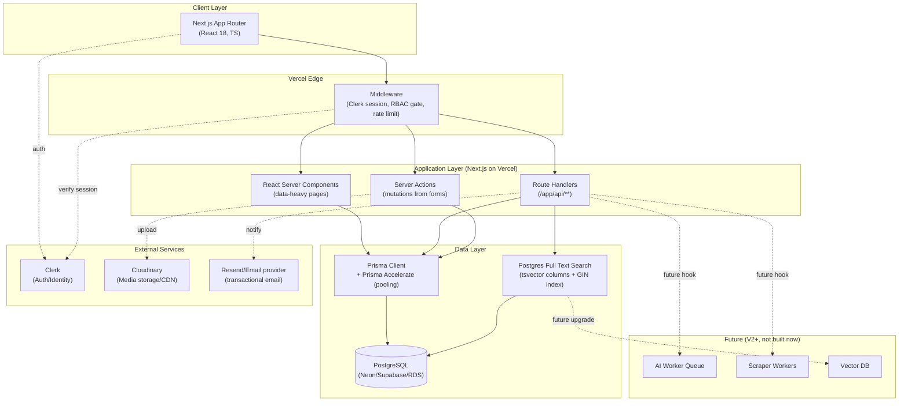
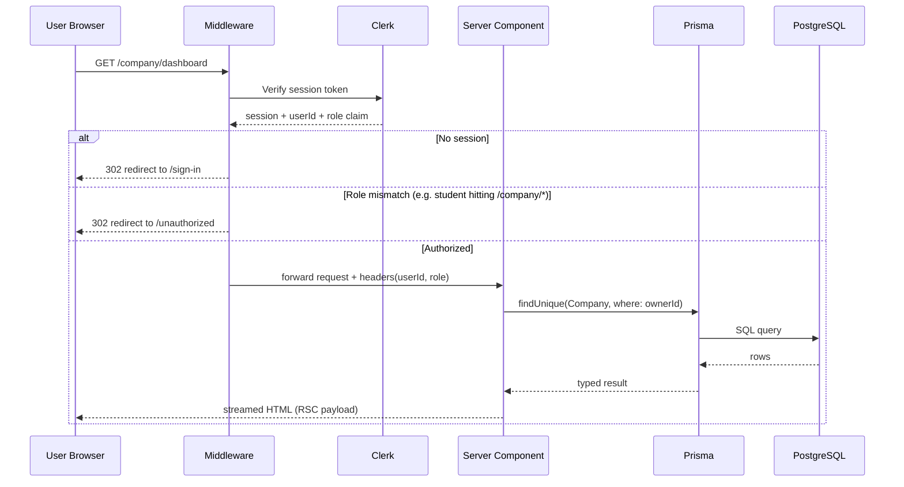
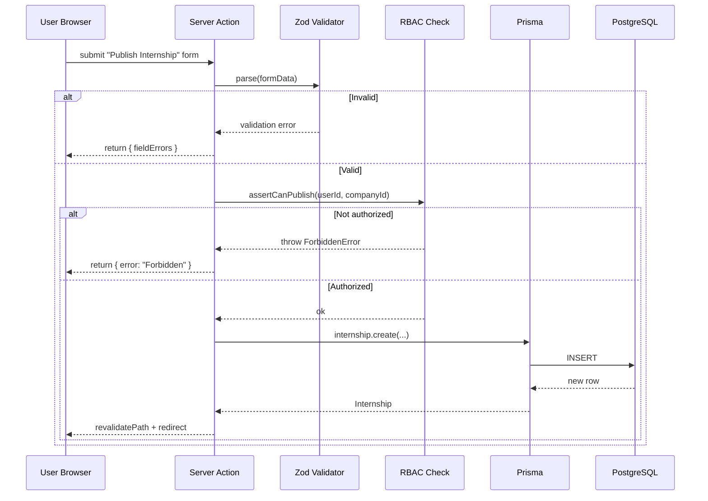
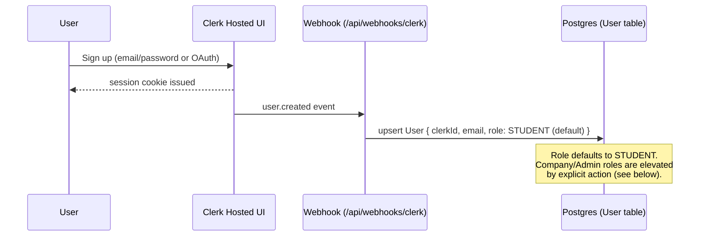
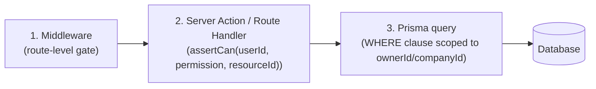
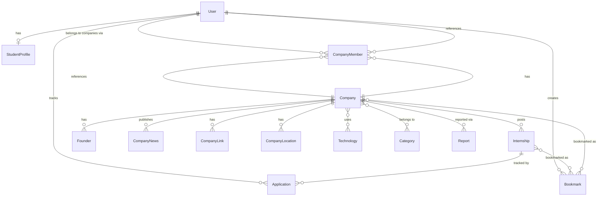
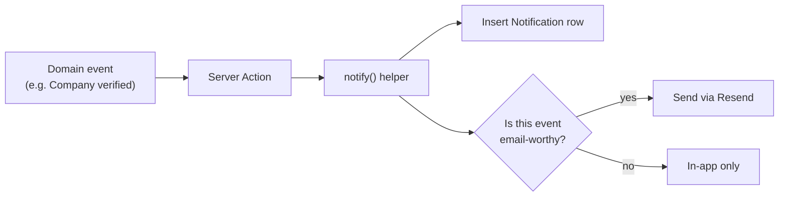

# 02 — Technical Requirements Document (TRD)
## Verity — Career Intelligence Platform

**Version:** 1.0
**Status:** Draft for Engineering Review
**Owner:** Founding Engineering Team
**Companion Document:** 01-PRD.md

---

## Table of Contents

1. Purpose & Scope
2. High-Level Architecture
3. Low-Level Architecture
4. Folder Structure
5. Feature Modules
6. Authentication
7. Authorization & RBAC
8. Middleware
9. API Design
10. Database Design & Prisma Schema
11. Entity Relationships
12. Search Architecture
13. Caching Strategy
14. Security
15. Performance
16. Logging
17. Monitoring
18. Deployment
19. CI/CD
20. Testing Strategy
21. Error Handling
22. Future AI Architecture
23. Future Scraper Architecture
24. Queue Architecture
25. Notification Architecture
26. Scalability Plan

---

## 1. Purpose & Scope

This TRD translates the product requirements in `01-PRD.md` into an engineering blueprint. It defines *how* Verity is built, not *what* it does — the PRD is the source of truth for behavior; this document is the source of truth for implementation.

Every architectural decision below is made with three constraints in mind, in this priority order:

1. **Ship V1 fast on a single Next.js monolith** — no premature microservices.
2. **Never block future automation** — every manual-entry table and flow must have an obvious "who/what would call this API instead of a human" story, even though V1 has no scraping or AI.
3. **Vercel-native, low-ops** — the founding team is small; infra choices should minimize operational surface area (managed Postgres, managed auth, managed storage) rather than optimize for cost at scale we don't have yet.

### Why a monolith and not microservices in V1

A three-role platform (Student / Company / Admin) with shared entities (Company, Internship, User) benefits from a single Prisma schema and a single deploy unit. Splitting into services now would mean distributed transactions for things like "publish an internship" (which touches Internship, Company, Notification, Search-index) with no corresponding benefit — we don't have independent scaling needs or independent teams yet. Section 23 (Scalability Plan) defines the concrete signals that would trigger a services split later (e.g., search read volume outpacing write volume by 50x, or AI inference needing GPU-backed infra separate from the web tier).

---

## 2. High-Level Architecture



### Architectural principles

- **Server-first rendering.** Company profiles, search results, and dashboards are React Server Components fetching directly via Prisma — no client-side data-fetching waterfalls for primary content. This matters for a content/SEO-driven product like Verity where company pages should be crawlable and fast on first paint.
- **Server Actions for mutations, Route Handlers for anything external.** Form submissions (bookmark, apply, edit profile) use Server Actions for progressive-enhancement and reduced client JS. Route Handlers exist specifically for: (a) endpoints that need to be called by non-browser clients (future browser extension, future mobile), and (b) webhooks (Clerk, Cloudinary).
- **One Postgres, one Prisma schema.** All three portals (Student/Company/Admin) read/write the same database through role-scoped queries — not separate databases — because the core value of Verity is that student-facing data and company-facing data are the *same* rows viewed differently.
- **Cloudinary owns all binary assets.** No file bytes ever touch our own storage; Prisma only stores Cloudinary URLs/public IDs. This keeps the app layer stateless and horizontally scalable by default (a prerequisite Vercel already gives us, but worth being deliberate about).

---

## 3. Low-Level Architecture

### 3.1 Request lifecycle (authenticated dashboard page)



### 3.2 Request lifecycle (mutation via Server Action)



### 3.3 Layered code organization (per feature module)

Every feature module follows the same four-layer internal structure, so any engineer can predict where code lives regardless of which feature they're touching:

| Layer | Responsibility | Example file |
|---|---|---|
| `schema.ts` | Zod validation schemas, shared between client forms and server actions | `features/internships/schema.ts` |
| `queries.ts` | Read-only Prisma queries, used by Server Components | `features/internships/queries.ts` |
| `actions.ts` | Server Actions (mutations), calls RBAC + Zod + Prisma | `features/internships/actions.ts` |
| `components/` | Feature-scoped React components (client + server) | `features/internships/components/` |

This is enforced by convention (documented here) rather than by a lint rule in V1, but Section 9 (Testing) includes a structural test that fails CI if a Server Action file imports Prisma without also importing the corresponding RBAC guard, to prevent unauthorized mutations from slipping through.

---

## 4. Folder Structure

```
verity/
├── app/                              # Next.js App Router
│   ├── (marketing)/                  # Public routes, no auth required
│   │   ├── page.tsx                  # Landing page
│   │   ├── companies/
│   │   │   ├── page.tsx              # Company directory/search
│   │   │   └── [slug]/page.tsx       # Public company profile
│   │   └── internships/
│   │       ├── page.tsx
│   │       └── [slug]/page.tsx
│   ├── (student)/
│   │   ├── layout.tsx                # Student shell (sidebar/nav)
│   │   ├── dashboard/page.tsx
│   │   ├── bookmarks/page.tsx
│   │   ├── applications/page.tsx
│   │   └── profile/page.tsx
│   ├── (company)/
│   │   ├── layout.tsx                # Company shell, gated by role
│   │   ├── dashboard/page.tsx
│   │   ├── internships/
│   │   │   ├── page.tsx
│   │   │   ├── new/page.tsx
│   │   │   └── [id]/edit/page.tsx
│   │   ├── team/page.tsx
│   │   ├── analytics/page.tsx
│   │   └── settings/page.tsx
│   ├── (admin)/
│   │   ├── layout.tsx                # Admin shell, gated by role
│   │   ├── dashboard/page.tsx
│   │   ├── verification-queue/page.tsx
│   │   ├── users/page.tsx
│   │   ├── companies/page.tsx
│   │   ├── categories/page.tsx
│   │   ├── technologies/page.tsx
│   │   ├── reports/page.tsx
│   │   └── featured/page.tsx
│   ├── api/
│   │   ├── webhooks/
│   │   │   ├── clerk/route.ts        # user.created, user.updated sync
│   │   │   └── cloudinary/route.ts   # upload notifications
│   │   ├── companies/route.ts        # public REST (Section 9)
│   │   ├── internships/route.ts
│   │   └── search/route.ts
│   ├── sign-in/[[...sign-in]]/page.tsx
│   ├── sign-up/[[...sign-up]]/page.tsx
│   ├── unauthorized/page.tsx
│   ├── layout.tsx                    # Root layout
│   └── globals.css
├── features/                         # Feature modules (see Section 3.3)
│   ├── companies/
│   │   ├── schema.ts
│   │   ├── queries.ts
│   │   ├── actions.ts
│   │   └── components/
│   ├── internships/
│   ├── students/
│   ├── bookmarks/
│   ├── applications/
│   ├── verification/
│   ├── admin/
│   ├── analytics/
│   └── notifications/
├── lib/
│   ├── db.ts                         # Prisma client singleton
│   ├── auth.ts                       # Clerk helpers, getCurrentUser()
│   ├── rbac.ts                       # can(), assertCan() guards
│   ├── rate-limit.ts
│   ├── logger.ts
│   ├── search.ts                     # Postgres FTS query builder
│   └── cloudinary.ts
├── components/
│   ├── ui/                           # shadcn/ui primitives
│   └── shared/                       # cross-feature composites (Navbar, Sidebar, EmptyState)
├── prisma/
│   ├── schema.prisma
│   ├── migrations/
│   └── seed.ts
├── middleware.ts                     # Clerk + RBAC edge middleware
├── types/
│   └── index.ts
├── config/
│   ├── site.ts
│   └── roles.ts                      # Permission matrix (Section 7)
├── tests/
│   ├── unit/
│   ├── integration/
│   └── e2e/
└── docs/                             # This documentation suite
```

**Rationale for route groups.** `(marketing)`, `(student)`, `(company)`, `(admin)` are Next.js route groups — they don't affect the URL but let each portal have its own `layout.tsx` (and therefore its own nav shell) while sharing the same deploy. This mirrors the three-portal product structure from the PRD directly in the codebase, so a new engineer can map PRD sections to folders immediately.

---

## 5. Feature Modules

| Module | Owns | Depends on |
|---|---|---|
| `companies` | Company CRUD, profile sections, founders/team, links | `verification`, `technologies` |
| `internships` | Internship CRUD, publish/archive lifecycle | `companies` |
| `students` | Student profile, resume upload (future) | — |
| `bookmarks` | Company & internship bookmarking | `companies`, `internships` |
| `applications` | Application tracker (manual status entries by student) | `internships` |
| `verification` | Company verification workflow, admin queue | `companies`, `admin` |
| `admin` | User mgmt, categories, technologies, featured companies, reports | all modules (read access) |
| `analytics` | Aggregation queries for company/admin dashboards | `internships`, `companies` |
| `notifications` | In-app + email notification dispatch | all modules (write access) |

Each module is intentionally a **Prisma-adjacent slice**, not a bounded microservice — modules can import each other's `queries.ts` directly (read composition is cheap and encouraged), but a module should only call another module's `actions.ts` (mutations) through an explicitly exported function, never by reaching into its internals. This is the internal contract that keeps the monolith splittable later without a rewrite.

---

## 6. Authentication

**Provider:** Clerk (session management, social login, email/password, email verification).

### Why Clerk over NextAuth/Auth.js for V1

Clerk gives us hosted UI components (`<SignIn/>`, `<UserButton/>`), built-in organization support (useful later if a Company account needs multiple team members under one "org"), and webhook-based user sync — all of which reduces the auth surface area we have to build and secure ourselves. The tradeoff is vendor lock-in and per-MAU cost at scale, which is acceptable for V1 given the team-size and time constraints stated in the PRD.

### Identity flow



### Role elevation (not self-service for Company/Admin)

- A user signs up as a **Student by default.**
- To become a **Company** account: the user completes a "Register your company" flow, which creates a `Company` row and a `CompanyMember` row linking their `User.id` to it with role `OWNER`. Their platform-level `User.role` is updated to `COMPANY` only after this succeeds — role and entity creation are wrapped in a single Prisma transaction so we never have a `COMPANY`-role user with no associated `Company`.
- **Admin** accounts are never self-service. They are seeded directly in the database (`prisma/seed.ts` for local dev) or promoted manually by an existing Admin through the Admin → User Management screen, which itself requires `ADMIN` role to access (see Section 7).

### Session data available in middleware/server

Clerk's session claims are extended with a custom claim (`publicMetadata.role`) synced from our `User.role` column on every webhook update, so `middleware.ts` can make routing decisions **without a database round-trip** on every request — it reads the role straight off the verified JWT. The database remains the source of truth; the JWT claim is a performance-motivated cache of it, refreshed on every `user.updated` webhook and on manual role changes triggered by Admin actions (which explicitly call Clerk's `updateUserMetadata` API as part of the same transaction).

---

## 7. Authorization & RBAC

### 7.1 Roles

| Role | Description |
|---|---|
| `STUDENT` | Default role. Read access to public data, write access to own bookmarks/applications/profile. |
| `COMPANY` | Platform role for any user tied to a `Company` via `CompanyMember`. Actual permissions within the company (owner vs. recruiter) are further scoped by `CompanyMember.role`. |
| `ADMIN` | Full platform access. |

### 7.2 Company-level sub-roles (`CompanyMember.role`)

| Sub-role | Can edit profile | Can publish internships | Can manage team | Can view analytics |
|---|---|---|---|---|
| `OWNER` | ✅ | ✅ | ✅ | ✅ |
| `RECRUITER` | ❌ | ✅ | ❌ | ✅ |

This two-tier model (platform role + company sub-role) exists because the PRD's Company Dashboard includes "Manage Team Members" — a single `COMPANY` platform role isn't granular enough once a company has more than one person publishing internships.

### 7.3 Permission matrix (config/roles.ts)

```ts
// config/roles.ts
export const PERMISSIONS = {
  STUDENT: [
    "bookmark:create", "bookmark:delete",
    "application:create", "application:update:own",
    "profile:update:own",
  ],
  COMPANY_OWNER: [
    "company:update:own", "company:team:manage",
    "internship:create", "internship:update:own", "internship:archive:own",
    "analytics:view:own",
  ],
  COMPANY_RECRUITER: [
    "internship:create", "internship:update:own", "internship:archive:own",
    "analytics:view:own",
  ],
  ADMIN: [
    "user:manage", "company:verify", "company:moderate",
    "internship:moderate", "category:manage", "technology:manage",
    "featured:manage", "report:handle", "analytics:view:all",
  ],
} as const;
```

### 7.4 Enforcement — defense in depth (three layers, every mutation)



- **Layer 1 (Middleware):** coarse-grained — blocks a `STUDENT` from ever reaching `/company/*` or `/admin/*` routes at the edge, before any React renders.
- **Layer 2 (`assertCan`):** fine-grained — checks the specific permission against the specific resource (e.g., "can this `userId` archive *this* `internshipId`," which requires loading the internship's `companyId` and checking membership).
- **Layer 3 (Prisma `WHERE`):** belt-and-suspenders — every mutation query includes an explicit ownership filter (`WHERE companyId = ctx.companyId`) so that even a bug in Layer 2 cannot leak a write into another company's row; the query simply returns zero rows affected instead.

This three-layer redundancy is deliberate: role-based systems fail most often at the boundary between "route is protected" and "the specific row being mutated actually belongs to this user," and Layer 3 catches exactly that class of bug.

---

## 8. Middleware

`middleware.ts` runs on the Vercel Edge for every request matching the configured matcher and performs, in order:

1. **Clerk session verification** (`authMiddleware` from `@clerk/nextjs`).
2. **Public route allowlist check** — marketing pages, company/internship public profiles, and `/api/search` bypass auth entirely.
3. **Role-based path gating** — maps route-group prefixes to required roles using the table below.
4. **Rate limiting** on unauthenticated write-adjacent routes (e.g., search) to prevent abuse, using a sliding-window counter (Section 15).

| Path prefix | Required role |
|---|---|
| `/student/*`, `/dashboard`, `/bookmarks`, `/applications` | `STUDENT` (or any authenticated user, since students are the default) |
| `/company/*` | `COMPANY` + active `CompanyMember` |
| `/admin/*` | `ADMIN` |
| `/api/webhooks/*` | Signature verification instead of session (see Section 14) |

Unauthorized access attempts redirect to `/unauthorized` rather than returning a raw 403, so the marketing shell can render a helpful message with a link back to the correct portal — this matters for a platform where a Company user might legitimately mis-click into a Student route.

---

## 9. API Design

### 9.1 Design principles

- **Route Handlers are for external/programmatic access; Server Actions are for in-app forms.** The REST API below exists primarily so the (future, PRD-listed) browser extension and mobile clients have something stable to call, and so this documentation can be handed to a hackathon judge or investor as evidence the platform isn't a closed black box.
- **All list endpoints are paginated by default** — no endpoint returns an unbounded array.
- **Versioning:** all routes are implicitly `v1` via `/api/*` in V1; a breaking change introduces `/api/v2/*` rather than mutating `v1` in place.

### 9.2 Endpoint reference

#### Companies

| Method | Path | Auth | Description |
|---|---|---|---|
| `GET` | `/api/companies` | Public | List/search companies. Supports filtering & pagination (below). |
| `GET` | `/api/companies/:slug` | Public | Full company profile. |
| `POST` | `/api/companies` | `COMPANY` (new) | Register a company (creates `Company` + `CompanyMember(OWNER)`). |
| `PATCH` | `/api/companies/:id` | `COMPANY_OWNER` (own) | Update profile fields. |
| `POST` | `/api/companies/:id/verify` | `ADMIN` | Approve verification. |

**`GET /api/companies` query params:**

```
?q=string              // full-text search (name, about, products)
&category=slug         // e.g. "fintech"
&technology=slug       // e.g. "react"
&fundingStage=SEED|SERIES_A|...
&remotePolicy=REMOTE|HYBRID|ONSITE
&visaSponsorship=true|false
&sort=trending|recent|name
&page=1&pageSize=20
```

**Response shape:**

```json
{
  "data": [
    {
      "id": "clx...",
      "slug": "sarvam-ai",
      "name": "Sarvam AI",
      "logoUrl": "https://res.cloudinary.com/...",
      "tagline": "Building AI for India",
      "fundingStage": "SERIES_A",
      "remotePolicy": "REMOTE",
      "verified": true,
      "openInternshipCount": 3
    }
  ],
  "meta": { "page": 1, "pageSize": 20, "totalCount": 187, "totalPages": 10 }
}
```

#### Internships

| Method | Path | Auth | Description |
|---|---|---|---|
| `GET` | `/api/internships` | Public | List/search internships. |
| `GET` | `/api/internships/:id` | Public | Internship detail. |
| `POST` | `/api/internships` | `COMPANY` (member) | Create (defaults to `DRAFT`). |
| `PATCH` | `/api/internships/:id` | `COMPANY` (own) | Update. |
| `POST` | `/api/internships/:id/publish` | `COMPANY` (own) | `DRAFT` → `PUBLISHED`. |
| `POST` | `/api/internships/:id/archive` | `COMPANY` (own) | → `ARCHIVED`. |

#### Bookmarks & Applications (student-scoped, requires auth)

| Method | Path | Description |
|---|---|---|
| `POST` | `/api/bookmarks` | Body: `{ targetType: "COMPANY"|"INTERNSHIP", targetId }` |
| `DELETE` | `/api/bookmarks/:id` | Remove bookmark |
| `GET` | `/api/applications` | List current student's tracked applications |
| `POST` | `/api/applications` | Create tracked application entry |
| `PATCH` | `/api/applications/:id` | Update status (`APPLIED → INTERVIEW → OFFER/REJECTED`) |

#### Admin

| Method | Path | Description |
|---|---|---|
| `GET` | `/api/admin/verification-queue` | Pending company verifications |
| `POST` | `/api/admin/users/:id/role` | Change a user's platform role |
| `GET` | `/api/admin/reports` | List content reports |
| `PATCH` | `/api/admin/reports/:id` | Resolve a report |

### 9.3 Standard error response

Every error response — regardless of endpoint — follows the same envelope so client error-handling code is written once:

```json
{
  "error": {
    "code": "FORBIDDEN",
    "message": "You do not have permission to edit this company.",
    "requestId": "req_9f2c..."
  }
}
```

| HTTP status | `code` | Meaning |
|---|---|---|
| 400 | `VALIDATION_ERROR` | Zod parse failure; includes `fieldErrors` |
| 401 | `UNAUTHENTICATED` | No valid session |
| 403 | `FORBIDDEN` | Authenticated but lacks permission |
| 404 | `NOT_FOUND` | Resource doesn't exist or is soft-deleted |
| 409 | `CONFLICT` | e.g., slug already taken |
| 429 | `RATE_LIMITED` | Too many requests |
| 500 | `INTERNAL_ERROR` | Unhandled; logged with `requestId` for correlation |

### 9.4 Rate limits

| Scope | Limit |
|---|---|
| Public unauthenticated (`/api/companies`, `/api/internships`, `/api/search`) | 60 req/min per IP |
| Authenticated read | 300 req/min per user |
| Authenticated write | 30 req/min per user |
| Admin | Unthrottled (trusted, small user set) |

---

## 10. Database Design & Prisma Schema

### 10.1 Design decisions

- **Soft deletes everywhere user-generated content can be moderated.** `Company`, `Internship`, and `User` all carry a `deletedAt` column instead of hard deletes, because Admin moderation actions (Section on Admin in PRD) require the ability to reverse a takedown and to audit what was removed.
- **Enums over free-text for controlled vocabularies** (`FundingStage`, `RemotePolicy`, `ApplicationStatus`, `VerificationStatus`) — these are exactly the fields the future recommendation/AI-matching engine will filter and rank on, so they must be structured data from day one, not strings.
- **`slug` fields are unique and immutable-by-default** on `Company` and `Internship` for stable, SEO-friendly URLs (`/companies/sarvam-ai`) — changing a slug after publish would break inbound links, so slug edits are an explicit Admin-gated action, not part of normal profile editing.

### 10.2 Prisma schema (core)

```prisma
// prisma/schema.prisma

generator client {
  provider = "prisma-client-js"
}

datasource db {
  provider = "postgresql"
  url      = env("DATABASE_URL")
}

enum PlatformRole {
  STUDENT
  COMPANY
  ADMIN
}

enum CompanyMemberRole {
  OWNER
  RECRUITER
}

enum VerificationStatus {
  UNVERIFIED
  PENDING
  VERIFIED
  REJECTED
}

enum FundingStage {
  BOOTSTRAPPED
  PRE_SEED
  SEED
  SERIES_A
  SERIES_B
  SERIES_C_PLUS
  PUBLIC
}

enum RemotePolicy {
  REMOTE
  HYBRID
  ONSITE
}

enum InternshipStatus {
  DRAFT
  PUBLISHED
  ARCHIVED
}

enum ApplicationStatus {
  SAVED
  APPLIED
  OA
  INTERVIEW
  OFFER
  REJECTED
  WITHDRAWN
}

enum BookmarkTargetType {
  COMPANY
  INTERNSHIP
}

model User {
  id          String        @id @default(cuid())
  clerkId     String        @unique
  email       String        @unique
  name        String?
  avatarUrl   String?
  role        PlatformRole  @default(STUDENT)

  studentProfile   StudentProfile?
  companyMemberships CompanyMember[]
  bookmarks        Bookmark[]
  applications     Application[]
  reportsFiled     Report[]      @relation("ReportedBy")

  createdAt   DateTime      @default(now())
  updatedAt   DateTime      @updatedAt
  deletedAt   DateTime?

  @@index([role])
}

model StudentProfile {
  id          String   @id @default(cuid())
  userId      String   @unique
  user        User     @relation(fields: [userId], references: [id])
  college     String?
  gradYear    Int?
  resumeUrl   String?  // Cloudinary URL — future AI resume analysis input
  bio         String?
  createdAt   DateTime @default(now())
  updatedAt   DateTime @updatedAt
}

model Company {
  id                  String              @id @default(cuid())
  slug                String              @unique
  name                String
  tagline             String?
  about               String?
  logoUrl             String?
  bannerUrl           String?
  websiteUrl          String?
  fundingStage        FundingStage?
  remotePolicy        RemotePolicy?
  visaSponsorship      Boolean            @default(false)
  employeeCountRange  String?             // e.g. "11-50"
  verificationStatus  VerificationStatus  @default(UNVERIFIED)
  isFeatured          Boolean             @default(false)
  searchVector        Unsupported("tsvector")?  // generated column, see 10.4

  members         CompanyMember[]
  internships     Internship[]
  founders        Founder[]
  news            CompanyNews[]
  links           CompanyLink[]
  locations       CompanyLocation[]
  technologies    CompanyTechnology[]
  categories      CompanyCategory[]
  bookmarks       Bookmark[]              @relation("CompanyBookmarks")
  reports         Report[]                @relation("ReportedCompany")

  createdAt   DateTime @default(now())
  updatedAt   DateTime @updatedAt
  deletedAt   DateTime?

  @@index([verificationStatus])
  @@index([isFeatured])
}

model CompanyMember {
  id        String            @id @default(cuid())
  companyId String
  userId    String
  role      CompanyMemberRole @default(RECRUITER)
  company   Company           @relation(fields: [companyId], references: [id])
  user      User              @relation(fields: [userId], references: [id])
  createdAt DateTime          @default(now())

  @@unique([companyId, userId])
}

model Founder {
  id          String   @id @default(cuid())
  companyId   String
  company     Company  @relation(fields: [companyId], references: [id])
  name        String
  title       String?      // "Co-founder & CEO"
  linkedinUrl String?
  twitterUrl  String?
  photoUrl    String?
  isHiringManager Boolean  @default(false)
  createdAt   DateTime @default(now())
}

model CompanyNews {
  id        String   @id @default(cuid())
  companyId String
  company   Company  @relation(fields: [companyId], references: [id])
  title     String
  url       String?
  publishedAt DateTime
  createdAt DateTime @default(now())
}

model CompanyLink {
  id        String   @id @default(cuid())
  companyId String
  company   Company  @relation(fields: [companyId], references: [id])
  type      String   // "twitter" | "linkedin" | "github" | "crunchbase" | ...
  url       String
}

model CompanyLocation {
  id        String   @id @default(cuid())
  companyId String
  company   Company  @relation(fields: [companyId], references: [id])
  city      String
  country   String
  isHQ      Boolean  @default(false)
}

model Technology {
  id      String   @id @default(cuid())
  slug    String   @unique
  name    String
  companies CompanyTechnology[]
}

model CompanyTechnology {
  companyId    String
  technologyId String
  company      Company    @relation(fields: [companyId], references: [id])
  technology   Technology @relation(fields: [technologyId], references: [id])

  @@id([companyId, technologyId])
}

model Category {
  id        String   @id @default(cuid())
  slug      String   @unique
  name      String
  companies CompanyCategory[]
}

model CompanyCategory {
  companyId  String
  categoryId String
  company    Company  @relation(fields: [companyId], references: [id])
  category   Category @relation(fields: [categoryId], references: [id])

  @@id([companyId, categoryId])
}

model Internship {
  id          String            @id @default(cuid())
  companyId   String
  company     Company           @relation(fields: [companyId], references: [id])
  slug        String            @unique
  title       String
  description String
  location    String?
  remotePolicy RemotePolicy?
  stipend     String?
  duration    String?
  applyUrl    String
  status      InternshipStatus  @default(DRAFT)
  publishedAt DateTime?
  searchVector Unsupported("tsvector")?

  bookmarks     Bookmark[]     @relation("InternshipBookmarks")
  applications  Application[]

  createdAt   DateTime @default(now())
  updatedAt   DateTime @updatedAt
  deletedAt   DateTime?

  @@index([status])
  @@index([companyId])
}

model Bookmark {
  id             String              @id @default(cuid())
  userId         String
  user           User                @relation(fields: [userId], references: [id])
  targetType     BookmarkTargetType
  companyId      String?
  company        Company?            @relation("CompanyBookmarks", fields: [companyId], references: [id])
  internshipId   String?
  internship     Internship?         @relation("InternshipBookmarks", fields: [internshipId], references: [id])
  createdAt      DateTime            @default(now())

  @@unique([userId, companyId, internshipId])
}

model Application {
  id            String             @id @default(cuid())
  userId        String
  user          User               @relation(fields: [userId], references: [id])
  internshipId  String
  internship    Internship         @relation(fields: [internshipId], references: [id])
  status        ApplicationStatus  @default(SAVED)
  notes         String?
  appliedAt     DateTime?
  updatedAt     DateTime           @updatedAt
  createdAt     DateTime           @default(now())

  @@unique([userId, internshipId])
}

model Report {
  id              String   @id @default(cuid())
  reportedById    String
  reportedBy      User     @relation("ReportedBy", fields: [reportedById], references: [id])
  targetCompanyId String?
  targetCompany   Company? @relation("ReportedCompany", fields: [targetCompanyId], references: [id])
  reason          String
  status          String   @default("OPEN") // OPEN | RESOLVED | DISMISSED
  createdAt       DateTime @default(now())
  resolvedAt      DateTime?
}
```

### 10.3 Notes on modeling choices

- **`CompanyTechnology` / `CompanyCategory` as explicit join models** (not implicit Prisma many-to-many) so we can later add metadata to the relation (e.g., `proficiencyLevel` or `addedBy`) without a breaking migration.
- **`Bookmark` is polymorphic via `targetType` + two nullable FKs** rather than two separate tables (`CompanyBookmark`, `InternshipBookmark`), because the Student Dashboard's "Bookmarks" view (PRD Section: Student Dashboard) needs one unified, sortable-by-date list — a single table with a discriminator is simpler to paginate than a `UNION` across two tables.
- **`Application` is a per-student manual tracker**, intentionally decoupled from `Internship.applyUrl` — Verity does not process real applications in V1 (no ATS integration), it only lets students log where they've applied, matching the PRD's "no automation in V1" constraint.

### 10.4 Full-text search columns

Postgres `tsvector` generated columns are added via raw SQL migration (Prisma's `Unsupported("tsvector")` type marks the column as schema-aware but unmanaged):

```sql
-- migration: add_search_vectors.sql
ALTER TABLE "Company" ADD COLUMN "searchVector" tsvector
  GENERATED ALWAYS AS (
    setweight(to_tsvector('english', coalesce(name, '')), 'A') ||
    setweight(to_tsvector('english', coalesce(tagline, '')), 'B') ||
    setweight(to_tsvector('english', coalesce(about, '')), 'C')
  ) STORED;

CREATE INDEX company_search_idx ON "Company" USING GIN ("searchVector");

ALTER TABLE "Internship" ADD COLUMN "searchVector" tsvector
  GENERATED ALWAYS AS (
    setweight(to_tsvector('english', coalesce(title, '')), 'A') ||
    setweight(to_tsvector('english', coalesce(description, '')), 'B')
  ) STORED;

CREATE INDEX internship_search_idx ON "Internship" USING GIN ("searchVector");
```

Weighting (`A` > `B` > `C`) ensures a match on `Company.name` ranks above a match buried in `about` text — matters for the PRD's "search should feel instant and relevant" requirement.

---

## 11. Entity Relationships



---

## 12. Search Architecture

V1 uses **PostgreSQL native full-text search** — not Elasticsearch/Algolia/Typesense — as an explicit, cost-and-complexity-motivated decision.

### Why Postgres FTS over a dedicated search service

At V1 scale (PRD targets "100 verified companies" as the quality bar, not tens of thousands), a dedicated search service adds an entire second system to operate, sync, and pay for, in exchange for query latency and relevance features we don't need yet. Postgres FTS with `tsvector`/`GIN` indexes gives us:

- Sub-50ms query latency at this data volume.
- Zero additional infrastructure — search lives in the same transaction-consistent database as writes, so a newly-published internship is searchable immediately (no indexing lag).
- A clean upgrade path: Section 22/26 describe migrating to a vector-search-augmented engine once semantic ("find me companies like Stripe but in fintech infra") search is needed for the AI recommendation engine — at that point Postgres FTS becomes a fast fallback/pre-filter rather than being thrown away.

### Query construction

```ts
// lib/search.ts
export async function searchCompanies(query: string, filters: CompanyFilters) {
  return prisma.$queryRaw`
    SELECT *, ts_rank("searchVector", websearch_to_tsquery('english', ${query})) as rank
    FROM "Company"
    WHERE "searchVector" @@ websearch_to_tsquery('english', ${query})
      AND "deletedAt" IS NULL
      ${filters.category ? Prisma.sql`AND EXISTS (...)` : Prisma.empty}
    ORDER BY rank DESC, "isFeatured" DESC
    LIMIT ${filters.pageSize} OFFSET ${filters.offset}
  `;
}
```

`websearch_to_tsquery` is used (not `plainto_tsquery`) specifically because it supports user-typed operators like quoted phrases and `-exclude` terms without us building our own query parser — the search bar can expose "advanced search" syntax for free.

---

## 13. Caching Strategy

| Layer | What's cached | TTL / invalidation |
|---|---|---|
| Next.js Data Cache (`fetch`/`unstable_cache`) | Public company/internship profile pages | Tag-based: `revalidateTag('company:{slug}')` fired on every `PATCH`/`publish` action |
| Next.js Full Route Cache | Marketing pages, static company directory shell | Time-based, 60s, since these are read-heavy and low-mutation |
| CDN (Vercel Edge Network) | All public GET responses, images via Cloudinary | Standard HTTP caching headers |
| No caching | Dashboards (Student/Company/Admin), search results | Always fresh — these are exactly the pages where staleness (e.g., a stale bookmark count, a stale verification queue) is a correctness bug, not just a UX nit |

Trending/Recommended company lists on the Student Dashboard (PRD: "Trending Companies", "Recommended Companies") are computed by a scheduled aggregation (see Section 20 note on cron) written to a small `TrendingSnapshot` table rather than computed live on every dashboard load — keeps dashboard reads O(1) regardless of platform activity volume.

---

## 14. Security

- **Input validation:** every Server Action and Route Handler validates input through a Zod schema before touching Prisma — no raw `request.json()` reaches the database layer anywhere in the codebase.
- **SQL injection:** eliminated by construction — all queries go through Prisma's parameterized query builder; the one raw-SQL exception (Section 12, full-text search) uses Prisma's tagged-template `$queryRaw`, which parameterizes interpolated values automatically.
- **Webhook signature verification:** Clerk and Cloudinary webhooks are verified using their respective signing-secret HMAC schemes (`svix` for Clerk) before any payload is trusted — an unverified webhook request is rejected with 401 before it reaches business logic.
- **CSRF:** Server Actions get built-in Next.js CSRF protection (origin-checking) for free; Route Handlers that accept mutations from browsers additionally check the `Origin` header against an allowlist.
- **File upload validation:** Cloudinary uploads are constrained by signed upload presets (max file size, allowed MIME types: image/png, image/jpeg, image/webp, application/pdf for resumes) so arbitrary file types can't be uploaded even if a client is tampered with.
- **Secrets:** all API keys/secrets live in Vercel Environment Variables, scoped per-environment (Development/Preview/Production), never committed — see Section 18.
- **PII minimization:** `StudentProfile.resumeUrl` and `email` are the only PII fields in V1; access to student PII is restricted to the student themselves and Admins (never exposed to Company accounts, since Verity V1 has no application-forwarding — Companies only see aggregate analytics, not individual student data), directly reflecting the PRD's "no automation" and privacy-conscious posture.

---

## 15. Performance

- **Target:** p75 Largest Contentful Paint < 1.8s on public company/internship pages (these are the SEO/discovery entry points and must feel "premium and fast" per PRD Product Philosophy).
- **Server Components by default**, Client Components only where interactivity is required (search-as-you-type, bookmark toggle buttons, forms) — minimizes shipped JS.
- **Image optimization:** all Cloudinary URLs pass through Cloudinary's `f_auto,q_auto` transformation params, and are additionally wrapped in `next/image` for responsive `srcset` generation.
- **Database indexes:** every foreign key gets an index by default (Prisma convention); additional indexes on `Company.verificationStatus`, `Company.isFeatured`, `Internship.status` support the dashboard's most common filter predicates (see schema in Section 10.2).
- **Pagination everywhere:** enforced at the API contract level (Section 9.1) — no unbounded list query exists in the codebase, preventing accidental N+1 page-weight growth as data scales.
- **Rate limiting** (Section 9.4) doubles as a performance safeguard against a single abusive client degrading shared database connections.

---

## 16. Logging

Structured JSON logging via a thin wrapper (`lib/logger.ts`) around `console.log`/`console.error`, since Vercel automatically captures stdout/stderr into its log pipeline without needing a separate logging agent.

```ts
// lib/logger.ts
type LogLevel = "info" | "warn" | "error";

export function log(level: LogLevel, message: string, meta?: Record<string, unknown>) {
  console[level === "info" ? "log" : level](JSON.stringify({
    level, message, timestamp: new Date().toISOString(), ...meta,
  }));
}
```

Every Server Action and Route Handler logs, at minimum: the acting `userId`, the resource affected, and outcome (`success`/`error` + `requestId`). Errors additionally log the Zod/Prisma error shape so failures are diagnosable from logs alone without needing to reproduce locally.

---

## 17. Monitoring

| Concern | Tool | Notes |
|---|---|---|
| Uptime / request errors | Vercel Analytics + Vercel Monitoring | Built-in, zero setup, sufficient for V1 traffic |
| Application errors | Sentry (Next.js SDK) | Captures unhandled exceptions in both server and client with source maps |
| Database health | Provider dashboard (Neon/Supabase/RDS) | Connection pool saturation, slow query log |
| Business metrics | Admin Analytics dashboard (PRD-specified) | Built on top of the same Prisma models — no separate analytics pipeline in V1 |

Alerting thresholds (Sentry): any 5xx spike >1% of requests over 5 minutes pages the on-call founder-engineer via Sentry's alert integration (email/Slack — no dedicated on-call tooling needed at this team size).

---

## 18. Deployment

Full detail lives in `10-deployment.md`; summary here for architectural completeness:

- **Vercel** hosts the Next.js app across Development, Preview (per-PR), and Production environments.
- **Database migrations** run via `prisma migrate deploy` as a Vercel Build step gated behind a manual approval for Production (to avoid an in-flight migration racing a deploy under load).
- **Environment variables** (`DATABASE_URL`, `CLERK_SECRET_KEY`, `CLOUDINARY_URL`, etc.) are scoped per-environment in the Vercel dashboard; Preview deployments point at a separate seeded staging database, never Production data.

---

## 19. CI/CD

```mermaid
flowchart LR
    PR["Pull Request opened"] --> Lint["Lint + Typecheck"]
    Lint --> Unit["Unit tests"]
    Unit --> Build["next build"]
    Build --> Preview["Vercel Preview Deploy"]
    Preview --> E2E["E2E smoke tests against Preview URL"]
    E2E --> Review["Human review + approval"]
    Review --> Merge["Merge to main"]
    Merge --> ProdMigrate["Prisma migrate deploy (Production)"]
    ProdMigrate --> ProdDeploy["Vercel Production Deploy"]
```



GitHub Actions runs lint/typecheck/unit tests on every push; Vercel's native Git integration handles Preview and Production deploys. E2E smoke tests (Section 20) run against the live Preview URL rather than a local server, so what's tested is exactly what a reviewer clicks through.

---

## 20. Testing Strategy

Summary here; full matrix in `09-testing.md`.

| Type | Tool | Scope |
|---|---|---|
| Unit | Vitest | Zod schemas, RBAC `can()` logic, pure utility functions |
| Integration | Vitest + a test Postgres instance | Server Actions end-to-end against a real (dockerized/CI-provisioned) database, including RBAC + Prisma layers together |
| E2E | Playwright | Critical flows: sign-up → company registration → publish internship → student bookmarks → search finds it |
| Structural/lint rule | Custom ESLint rule | Fails CI if a file under `features/*/actions.ts` imports `prisma` without also importing from `lib/rbac` (Section 3.3) |

---

## 21. Error Handling

- **Server Actions** never throw raw errors to the client; they catch and return a discriminated-union result: `{ success: true, data } | { success: false, error: { code, message, fieldErrors? } }`, matching the API error envelope (Section 9.3) so UI error-rendering components are shared between REST-consuming and Server-Action-consuming surfaces.
- **Route Handlers** use a shared `withErrorHandling` wrapper that catches thrown `AppError` subclasses (`ValidationError`, `ForbiddenError`, `NotFoundError`, `ConflictError`) and maps them to the correct HTTP status + envelope automatically, so individual handlers just `throw new ForbiddenError(...)` and don't hand-roll status codes.
- **Unhandled exceptions** are caught by Next.js `error.tsx` boundaries per route group, showing a portal-appropriate fallback UI (Student/Company/Admin each get their own, matching their shell), and are reported to Sentry with the `requestId` for correlation with server logs.

---

## 22. Future AI Architecture (Not Built in V1)

Explicitly deferred, but the schema and module boundaries above are designed so these slot in without a rewrite:

- **Resume Matching / Recommendation Engine:** would read `StudentProfile.resumeUrl` + `Internship`/`Company` structured fields (already enum-typed per Section 10.1) and write to a new `Recommendation` table, scored offline by a worker (Section 24 Queue Architecture) rather than computed synchronously in a request.
- **Personalized Cold Email/LinkedIn generation:** an AI Route Handler (`/api/ai/outreach`) calling an LLM with `Founder` + `Company` context already modeled in Section 10.2 — no schema change needed, only a new module (`features/outreach/`).
- **Vector search:** would add a `pgvector` extension to the same Postgres instance (co-located, not a separate vector DB, to avoid a second system) storing embeddings of `Company.about`/`Internship.description`, used to augment — not replace — the Section 12 Postgres FTS.

---

## 23. Future Scraper Architecture (Not Built in V1)

- Scrapers would run as isolated worker processes (Vercel Cron + separate serverless functions, or a small dedicated worker service if volume demands it) that write into the **same `Company`/`Internship` tables** but with a `source: MANUAL | SCRAPED` field (schema addition, not present in V1 per PRD's "no scraping" constraint) so Admin moderation can filter scraped-but-unverified rows before they're publicly visible — reusing the existing `VerificationStatus` enum rather than inventing a parallel review pipeline.

---

## 24. Queue Architecture (Not Built in V1)

V1 has no background jobs beyond Vercel Cron for scheduled aggregation (Section 13, Trending snapshots). When AI scoring, scraping, or bulk notification sending (Section 25) outgrow synchronous request-response, the plan is a managed queue (e.g., Vercel Queue / QStash / Inngest) rather than self-hosted Redis+BullMQ, keeping the "low-ops" principle from Section 1 intact.

---

## 25. Notification Architecture

**V1 scope:** in-app notifications only (a `Notification` table, not shown in Section 10.2 core schema for brevity, following the same pattern as `Report`) plus transactional email for account-critical events (verification approved/rejected, welcome email) via Resend.



Push notifications and digest emails ("weekly trending companies") are explicitly V2 — the `notify()` helper is written as the single call-site so adding new channels later doesn't require touching every feature module that currently calls it.

---

## 26. Scalability Plan

| Signal | Response |
|---|---|
| Postgres CPU/connection saturation | Add Prisma Accelerate/PgBouncer connection pooling (if not already default), then read replicas for public GET traffic |
| Search latency degrades as company count grows past ~10k rows | Migrate Section 12 to a dedicated search service (Typesense/Meilisearch first, Elasticsearch if relevance needs grow further) |
| AI workloads need GPU/long-running compute | Extract `features/outreach` and `features/recommendations` into a separate worker service called via the Section 24 queue, rather than running inside Vercel's serverless function limits |
| Company Dashboard analytics queries slow down | Move from live Prisma aggregation to a scheduled materialized-view / summary-table pattern (same technique already used for Trending, Section 13) |
| Traffic requires true multi-region | Vercel Edge already serves static/cached content globally by default; only the database becomes a bottleneck, addressed by the read-replica step above before considering a full multi-region write architecture |

The throughline across every row: **scale the specific bottleneck with the smallest architectural change that resolves it**, deferring the monolith-to-services split (Section 2) until a concrete, measured signal — not a hypothetical one — demands it.

---

*End of 02-TRD.md. Awaiting approval before generating 03-design.md.*
