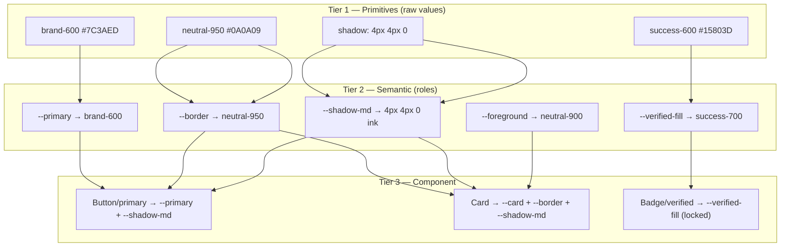
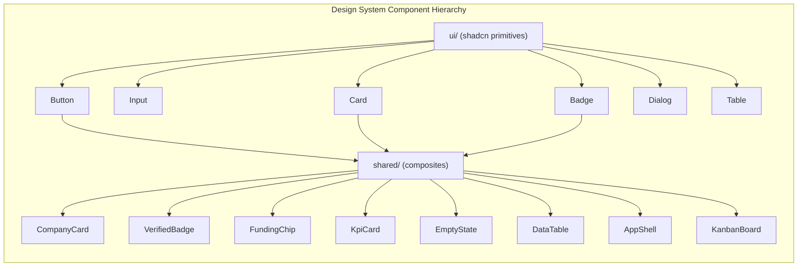

# 03 — Design System

## Verity — Career Intelligence Platform

**Document:** 03-design.md
**Version:** 1.0
**Status:** Draft for Engineering & Design Sign-off
**Owner:** Design Systems
**Companion Documents:** 01-PRD.md, 02-TRD.md
**Tagline:** Discover. Research. Apply.
**Aesthetic:** NeoBrutalism × Modern SaaS

---

## Table of Contents

1. Design Philosophy
2. Brand & Voice
3. Color Palette
4. Typography
5. Grid & Layout
6. Spacing Scale
7. Radius
8. Borders (The 2px Rule)
9. Shadows & Elevation Ladder
10. Iconography
11. Token Architecture
12. Component Specifications
    - 12.1 Buttons
    - 12.2 Cards
    - 12.3 Inputs & Form Controls
    - 12.4 Tables
    - 12.5 Search
    - 12.6 Sidebar
    - 12.7 Navbar
    - 12.8 Dialogs & Sheets
    - 12.9 Badges & Chips
    - 12.10 Kanban Board (Application Tracker)
13. Empty States
14. Loading States (Skeletons)
15. Error States
16. Motion System (Framer Motion)
17. Accessibility (WCAG 2.1 AA)
18. Responsive Design
19. Dark Theme & Light Theme
20. Tailwind Tokens (Full Config)
21. globals.css (CSS Variables)
22. Component Naming Conventions
23. UI Patterns (Page Shells, Forms, Data Density)
24. Dos and Don'ts

---

## 1. Design Philosophy

### 1.1 The core tension we are designing for

Verity sells **trust**. The PRD is unambiguous: "trust is the product's core differentiator, and trust cannot be scraped" (01-PRD.md §1). A student decides whether to spend one of their ~40 applications based on whether they believe a company is "legitimate, funded, and actually hiring" (01-PRD.md §1). That belief is manufactured almost entirely by the interface. A verified badge that looks like a toy erodes the very thing it certifies.

At the same time, Verity is a **research tool**. Personas like "Marcus, the Selective Senior" (01-PRD.md §8) come to *read* — funding history, founder backgrounds, hiring timelines, tech stacks — and to compare companies side by side. A research tool that is visually loud at the expense of legibility fails its primary job.

The design system resolves this tension deliberately:

> **NeoBrutalism provides the confidence and memorability; Modern SaaS provides the restraint and data-density. Every screen is a negotiation between the two, and the negotiation is always won by legibility at the point of reading.**

### 1.2 Why NeoBrutalism for a trust/data product

NeoBrutalism is usually pitched as "playful" — the wrong reason to pick it here. We pick it for three product-grounded reasons:

1. **Hard edges read as "no smoke and mirrors."** Thick 2px borders and hard-offset shadows (`4px 4px 0 #000`) have zero ambiguity — a border is exactly where it says it is, an element is exactly as elevated as it looks. There is no soft-focus blur hiding the seams. For a product whose thesis is "we show you the real, verified truth," an aesthetic with literally nothing hidden in a gradient is thematically honest, not just decorative.
2. **High contrast is a legibility asset, not a liability.** Crunchbase-grade data density (funding rounds, employee buckets, founder rows) demands that the eye separate fields instantly. Brutalism's mandatory high contrast and structural borders turn a dense company profile into a scannable grid instead of a gray soup of cards-within-cards.
3. **Memorability drives the vision.** The PRD's five-year vision is "the default first stop… the way Crunchbase became the canonical record" (01-PRD.md §2). Canonical products have a *look*. Linear, Vercel, and Raycast are all instantly recognizable in a screenshot. A verified Verity company page should be as recognizable as a LinkedIn profile — bookmarkable, screenshot-shareable, unmistakable.

### 1.3 Why Modern SaaS restraint is the counterweight

Pure NeoBrutalism does not survive contact with a data table of 200 internships or an Admin verification queue. So we borrow the discipline of Linear/Stripe:

- **Color is earned, not sprayed.** The loud accent (`--brand`) appears on *one* primary action per view and on the verified badge — never on ten things at once. Neutrals carry 90% of every screen.
- **Density modes are first-class.** Admin and Company data tables use a "compact" density; Student research pages use a "comfortable" density. Same tokens, different spacing multipliers.
- **Motion is functional.** Hard-offset shadows invite a satisfying "press" interaction, but animation always communicates state (pressed, loading, appeared), never decorates idle pixels.

### 1.4 Design principles (the six we hold each other to)

| # | Principle | What it means in a PR review |
|---|---|---|
| P1 | **Legibility wins ties.** | If brutalist styling ever fights readability of data, readability wins. |
| P2 | **One loud thing per view.** | Exactly one primary CTA / one accent focal point per screen region. |
| P3 | **Borders are structure, not decoration.** | A 2px border means "this is a distinct interactive or content boundary." Don't border things that aren't boundaries. |
| P4 | **Shadows encode elevation, consistently.** | The elevation ladder (§9) is a fixed vocabulary. A dialog is always higher than a card is always higher than the page. |
| P5 | **The verified badge is sacred.** | Its color, shape, and placement never change and are never reused for anything else. Trust signals must be unforgeable-looking. |
| P6 | **Respect the reader's motion budget.** | Everything degrades gracefully under `prefers-reduced-motion`. No exceptions. |

### 1.5 Aesthetic reference points

- **Linear** — density, keyboard-first, the "crafted" feeling of state transitions.
- **Vercel** — monochrome restraint, typographic confidence, the black/white contrast backbone.
- **Raycast** — chunky-but-precise, command-palette interaction model, playful-yet-pro.
- **Stripe** — documentation-grade clarity, trustworthy data presentation.
- **Figma / Apple** — spatial consistency, the discipline of a real elevation model.

Verity = Vercel's monochrome backbone + Raycast's chunk + a single confident brand accent + a brutalist border/shadow language, tuned for data density.

---

## 2. Brand & Voice

### 2.1 Logo lockup

The wordmark **Verity** is set in the display grotesk (§4) at weight 800, tracking `-0.02em`, always paired — in the primary lockup — with a 2px-bordered square "verified check" glyph carrying the signature hard shadow. The mark *is* a verified badge; the brand and the trust signal are the same object by design (principle P5).

### 2.2 Voice in the UI

Copy is **plain, confident, and specific** — matching Stripe docs. Never cutesy in trust-critical surfaces (verification, errors, security). A little personality is allowed in empty states and onboarding, never in a rejection reason or a security warning.

| Surface | Tone | Example |
|---|---|---|
| Verified badge tooltip | Factual | "Verified by Verity on Mar 3, 2026." |
| Empty bookmarks | Warm, directive | "Nothing saved yet. Find a company worth remembering." |
| Verification rejected | Direct, respectful | "We couldn't verify this domain. Here's what to fix:" |
| 500 error | Honest, calm | "Something broke on our end. We've logged it." |

---

## 3. Color Palette

### 3.1 Philosophy

The palette is a **near-monochrome spine** (ink + paper + a full neutral ramp) with **one confident brand accent** and a disciplined set of semantic and domain colors. Brutalism's high-contrast requirement is satisfied by the ink/paper extremes; SaaS restraint is satisfied by making saturated color rare and meaningful.

Every foreground/background pair used for text is validated against WCAG 2.1 AA (§17). Hex values below are the canonical source; Tailwind token names (§20) and CSS variables (§21) are generated from them.

### 3.2 Brand — "Verity Violet"

Violet was chosen over the default SaaS blue because (a) blue is over-indexed in the competitive set (LinkedIn, Handshake, Wellfound all lean blue), and violet reads as "premium/editorial" alongside a monochrome spine; (b) it holds contrast well on both paper and ink; (c) it is distinct from every semantic color, so a primary action is never confused with a success or info state.

| Token | Hex | Usage |
|---|---|---|
| `brand-50` | `#F5F3FF` | Tint backgrounds, hover fills (light) |
| `brand-100` | `#EDE9FE` | Selected row tint, chip fill |
| `brand-200` | `#DDD6FE` | Subtle borders on brand surfaces |
| `brand-300` | `#C4B5FD` | Disabled brand text |
| `brand-400` | `#A78BFA` | Dark-mode brand text/icon |
| `brand-500` | `#8B5CF6` | Secondary brand usage |
| `brand-600` | `#7C3AED` | **Primary brand — default CTA fill** |
| `brand-700` | `#6D28D9` | CTA hover / pressed |
| `brand-800` | `#5B21B6` | CTA active, high-emphasis text on tint |
| `brand-900` | `#4C1D95` | Deepest brand, dark surfaces |
| `brand-950` | `#2E1065` | Rare — brand-tinted ink |

`brand-600 (#7C3AED)` on `paper (#FFFFFF)` → contrast **5.9:1** (AA for normal text, AAA for large). White text on `brand-600` → **4.9:1** (AA). This is the exact reason the CTA fill is `600` not `500`.

### 3.3 Neutrals (ink / paper ramp, 50–950)

The workhorse. 90% of every screen is neutrals. `neutral-950` is the brutalist "ink" used for the mandatory hard borders and shadows in light theme.

| Token | Hex | Light role | Dark role |
|---|---|---|---|
| `neutral-50` | `#FAFAF9` | App background (paper) | Highest text |
| `neutral-100` | `#F4F4F2` | Subtle surface, table stripe | High text |
| `neutral-200` | `#E7E5E1` | Hairline dividers (non-structural) | Muted text |
| `neutral-300` | `#D4D2CC` | Input idle border tint | Disabled text |
| `neutral-400` | `#A8A59E` | Placeholder text, muted icons | Border (dark) |
| `neutral-500` | `#78756E` | Secondary text | Secondary text |
| `neutral-600` | `#57544E` | Body text (light) | Surface-3 (dark) |
| `neutral-700` | `#3F3D38` | Strong body / headings | Surface-2 (dark) |
| `neutral-800` | `#2A2825` | Headings | Surface-1 / card (dark) |
| `neutral-900` | `#1C1B19` | Highest emphasis text | App background (dark) |
| `neutral-950` | `#0A0A09` | **Ink — borders & hard shadows (light)** | Deepest well (dark) |

Design note: the neutral ramp is intentionally **warm-tinted** (a whisper of stone/olive, not pure gray). Pure `#000/#FFF/#808080` grays read as "unfinished wireframe." The warm cast makes the monochrome spine feel like premium paper stock — the Stripe/Apple move — while `neutral-950` stays effectively black for border purposes.

### 3.4 Semantic colors

Each semantic color ships a `-fg` (text/icon), `-bg` (tint fill), and `-border` triad so a status surface is a one-line composition. Values below are the `600`-tier anchors; full 50/600/700 tints in §20.

| Semantic | `-fg` (hex) | `-bg` light (hex) | `-border` (hex) | Meaning in Verity |
|---|---|---|---|---|
| `success` | `#15803D` | `#DCFCE7` | `#166534` | Verified, Open internship, Offer status |
| `warning` | `#B45309` | `#FEF3C7` | `#92400E` | Changes Requested, "Apply soon" (deadline < 7d), stale flag |
| `error` | `#B91C1C` | `#FEE2E2` | `#991B1B` | Rejected, Closed, destructive actions, form errors |
| `info` | `#1D4ED8` | `#DBEAFE` | `#1E40AF` | Pending, neutral system messages, tips |

`success-fg #15803D` on `success-bg #DCFCE7` → **5.1:1** (AA). `error-fg #B91C1C` on `error-bg #FEE2E2` → **6.2:1** (AA). All triads validated in §17.4.

### 3.5 Accent (secondary highlight) — "Signal Lime"

A single non-brand accent used sparingly for **editorial highlights only**: the "Trending" flame, "Featured company" ribbon (Admin-curated, PRD §14.3 Feature Management), and "New" recency pips. Never used for interactive affordances (that's brand) or status (that's semantic).

| Token | Hex | Usage |
|---|---|---|
| `accent-300` | `#D9F99D` | Ribbon fill / tint |
| `accent-400` | `#BEF264` | Featured ribbon, trending pip |
| `accent-500` | `#A3E635` | Accent border/emphasis |
| `accent-foreground` | `#1A2E05` | Text on accent fills |

`accent-foreground #1A2E05` on `accent-400 #BEF264` → **11.4:1** (AAA). Lime-on-ink is the "Raycast pop" — high energy, but rationed to <1% of surface area.

### 3.6 The Verified Badge color (P5 — sacred)

The verified badge has a **fixed, reserved** color pairing that appears nowhere else in the system. This is a trust-integrity decision: if the verified color were reused on a random button, the badge would be forgeable-by-familiarity.

```
--verified-fill:   #15803D   (success-700 tier — a deep, unmistakable "trust green")
--verified-check:  #FFFFFF   (the checkmark glyph)
--verified-ring:   #0A2E13   (2px brutalist border, near-black green)
--verified-shadow: #052B10   (hard offset shadow, dark theme uses #FFFFFF-derived, see §19)
```

Anatomy: a `rounded-md` (8px) square, `border-2` in `--verified-ring`, `bg-[--verified-fill]`, a `lucide-check` (or `BadgeCheck`) glyph in white at 14px, and a `2px 2px 0` hard shadow. It is **never** rendered in gray, never outline-only, never animated on load beyond a single reveal (§16). Tooltip always states the verification date (PRD §13.7 `lastVerifiedAt`).

### 3.7 Funding-stage chip colors

Funding stage is a first-class filter and profile field (PRD §16, §17; `FundingStage` enum in TRD §10.2). Each stage gets a **distinct, ordered** chip color so a student scanning search results can read "stage" pre-attentively — early stages cool, late/liquid stages warm-to-green, mapping intuitively to "risk → maturity."

| Enum (`FundingStage`) | Label | Chip `-bg` | Chip `-fg` | Chip `-border` | Rationale |
|---|---|---|---|---|---|
| `BOOTSTRAPPED` | Bootstrapped | `#F4F4F2` | `#3F3D38` | `#0A0A09` | Neutral — no external funding signal |
| `PRE_SEED` | Pre-seed | `#EEF2FF` | `#3730A3` | `#312E81` | Coolest — earliest |
| `SEED` | Seed | `#EDE9FE` | `#5B21B6` | `#4C1D95` | Brand-adjacent violet — nascent |
| `SERIES_A` | Series A | `#CFFAFE` | `#155E75` | `#164E63` | Cyan — traction |
| `SERIES_B` | Series B | `#D1FAE5` | `#065F46` | `#064E3B` | Teal-green — scaling |
| `SERIES_C_PLUS` | Series C+ | `#DCFCE7` | `#166534` | `#14532D` | Green — mature |
| `PUBLIC` | Public | `#FEF9C3` | `#854D0E` | `#713F12` | Gold — liquid/established |

All seven pairings pass AA (≥4.5:1). The ordering (cool → green → gold) is intentional and documented so the palette is never reshuffled arbitrarily — the color *is* information.

### 3.8 Application-status colors (Kanban)

The Application Tracker Kanban (PRD §14.1; `ApplicationStatus` enum in TRD §10.2) needs a column-header color per status. Reuses semantic colors where meaning aligns; adds two process-neutral hues.

| Status | Column accent | Hex | Maps to |
|---|---|---|---|
| `SAVED` | Neutral | `#78756E` | neutral-500 |
| `APPLIED` | Info | `#1D4ED8` | info |
| `OA` | Brand | `#7C3AED` | brand-600 (in-process) |
| `INTERVIEW` | Warning | `#B45309` | warning (active/attention) |
| `OFFER` | Success | `#15803D` | success |
| `REJECTED` | Error | `#B91C1C` | error |
| `WITHDRAWN` | Muted | `#A8A59E` | neutral-400 |

### 3.9 Data-visualization ramp (Analytics)

Company & Admin analytics (PRD §19) use a categorical + sequential palette derived from brand/accent so charts feel native to the system.

```
Categorical (up to 6 series):
  #7C3AED  #A3E635  #1D4ED8  #B45309  #15803D  #78756E
Sequential (single-metric intensity, e.g. profile-views heatmap):
  #F5F3FF → #DDD6FE → #A78BFA → #7C3AED → #5B21B6 → #2E1065
```

---

## 4. Typography

### 4.1 Type strategy

Three families, each with a job. Brutalism wants a **confident display face**; SaaS data-density wants a **highly legible neutral sans** for body and tables; structured data (funding amounts, dates, IDs, code-like slugs) wants a **mono**.

| Role | Family | Fallback stack | Why |
|---|---|---|---|
| Display / Headings | **Space Grotesk** | `"Space Grotesk", "Inter", system-ui, sans-serif` | A grotesk with quirky-but-controlled letterforms; reads confident and modern (Raycast/Linear energy) without novelty-font risk. Variable, ships weights 400–700. |
| Body / UI | **Inter** | `"Inter", system-ui, -apple-system, "Segoe UI", sans-serif` | The definitive data-dense UI sans — tuned for small sizes, huge x-height, tabular figures, exhaustive language coverage. Carries 90% of pixels. |
| Mono / Numeric | **JetBrains Mono** | `"JetBrains Mono", "SF Mono", ui-monospace, monospace` | For funding amounts, dates, employee-count buckets, slugs, IDs, and analytics figures where column alignment matters. |

All three are loaded via `next/font` (self-hosted, zero layout shift, `display: swap`). Inter and Space Grotesk are variable fonts; we subset to Latin + Latin-Ext for V1.

```ts
// app/fonts.ts
import { Inter, Space_Grotesk, JetBrains_Mono } from "next/font/google";

export const fontSans = Inter({
  subsets: ["latin"],
  variable: "--font-sans",
  display: "swap",
});

export const fontDisplay = Space_Grotesk({
  subsets: ["latin"],
  weight: ["500", "600", "700"],
  variable: "--font-display",
  display: "swap",
});

export const fontMono = JetBrains_Mono({
  subsets: ["latin"],
  variable: "--font-mono",
  display: "swap",
});
```

```tsx
// app/layout.tsx (excerpt)
<html
  lang="en"
  className={`${fontSans.variable} ${fontDisplay.variable} ${fontMono.variable}`}
>
```

### 4.2 Type scale

A modular scale (~1.2 minor-third for text, opening up at display sizes) on a 4px baseline grid. `rem` assumes a 16px root.

| Token | Size (rem / px) | Line-height | Weight | Tracking | Family | Usage |
|---|---|---|---|---|---|---|
| `display-2xl` | `4.5rem / 72` | `1.02` (73px) | 700 | `-0.03em` | Display | Marketing hero only |
| `display-xl` | `3.5rem / 56` | `1.05` (59px) | 700 | `-0.03em` | Display | Landing section headers |
| `display-lg` | `2.75rem / 44` | `1.1` (48px) | 700 | `-0.02em` | Display | Page hero (company name on profile) |
| `h1` | `2rem / 32` | `1.15` (37px) | 700 | `-0.02em` | Display | Page titles |
| `h2` | `1.5rem / 24` | `1.25` (30px) | 600 | `-0.01em` | Display | Section titles |
| `h3` | `1.25rem / 20` | `1.3` (26px) | 600 | `-0.01em` | Display | Card titles, module headers |
| `h4` | `1.125rem / 18` | `1.4` (25px) | 600 | `0` | Sans | Sub-section, dialog titles |
| `body-lg` | `1.125rem / 18` | `1.6` (29px) | 400 | `0` | Sans | Company "About" long-form |
| `body` | `1rem / 16` | `1.6` (26px) | 400 | `0` | Sans | Default body |
| `body-sm` | `0.875rem / 14` | `1.55` (22px) | 400 | `0` | Sans | Dense UI, table cells, secondary |
| `caption` | `0.75rem / 12` | `1.4` (17px) | 500 | `0.01em` | Sans | Metadata, timestamps, helper text |
| `overline` | `0.6875rem / 11` | `1.3` (14px) | 700 | `0.08em` | Sans | UPPERCASE labels, chip text, table headers |
| `mono-sm` | `0.8125rem / 13` | `1.5` (20px) | 500 | `0` | Mono | Funding figures, IDs, dates |

### 4.3 Usage rules

- **Display grotesk for headings, Inter for everything a user reads at length.** Long-form company descriptions (`body-lg`) never use the display face — grotesk quirks tax sustained reading.
- **Numbers that must align use `tabular-nums` + mono.** Analytics KPI cards, funding amounts, table numeric columns: `font-mono tabular-nums`. Non-aligned inline numbers (e.g., "3 open roles") stay in Inter with `tabular-nums` utility.
- **`overline` is the brutalist label voice.** UPPERCASE, tracked, weight 700 — used for table headers, chip labels, and section eyebrows. This is where NeoBrutalism's typographic boldness lives without harming reading.
- **Max line length 68ch** for body copy (`max-w-[68ch]`) — the Stripe-docs readability rule.
- **Never go below `caption` (12px)** for any text a user must read; below that is decorative only.

```tsx
// Tailwind usage examples
<h1 className="font-display text-[2rem] font-bold leading-[1.15] tracking-[-0.02em]">
  Sarvam AI
</h1>
<p className="font-sans text-base leading-relaxed text-neutral-600 max-w-[68ch]">
  Building foundational AI models for India…
</p>
<span className="font-mono text-[0.8125rem] font-medium tabular-nums">
  $41.0M · Series A
</span>
<span className="text-[0.6875rem] font-bold uppercase tracking-[0.08em] text-neutral-500">
  Funding Stage
</span>
```

---

## 5. Grid & Layout

### 5.1 Container widths

| Token | Max-width | Usage |
|---|---|---|
| `container-prose` | `720px` | Long-form reading (About, news article) |
| `container-app` | `1280px` | Default authenticated app shell content |
| `container-wide` | `1536px` | Data-dense Admin tables, analytics grids |
| `container-full` | `100%` | Kanban board, full-bleed hero |

### 5.2 The app shell grid

All three portals share one shell topology (differ only in sidebar contents, per TRD route groups `(student)`/`(company)`/`(admin)`):

```
┌──────────────────────────────────────────────────────┐
│  Navbar (h-16, sticky, 2px bottom border)             │
├────────────┬─────────────────────────────────────────┤
│            │                                          │
│  Sidebar   │   Main content                           │
│  (w-64,    │   (container-app, px-6 py-6,             │
│   2px      │    12-col grid, gap-6)                    │
│   right    │                                          │
│   border)  │                                          │
│            │                                          │
└────────────┴─────────────────────────────────────────┘
```

- **12-column grid**, `gap-6` (24px) desktop, `gap-4` (16px) tablet.
- Sidebar `w-64` (256px), collapses to `w-16` icon-rail at `lg`, becomes a `Sheet` drawer below `md` (§18).
- Content region uses CSS grid: `grid grid-cols-12 gap-6`. Dashboard modules span `col-span-12/6/4/3` responsively.

```tsx
// components/shared/AppShell.tsx
export function AppShell({ sidebar, children }: AppShellProps) {
  return (
    <div className="min-h-dvh bg-background">
      <Navbar />
      <div className="flex">
        <aside className="sticky top-16 hidden h-[calc(100dvh-4rem)] w-64 shrink-0 border-r-2 border-border md:block">
          {sidebar}
        </aside>
        <main className="mx-auto w-full max-w-[1280px] flex-1 px-4 py-6 sm:px-6">
          {children}
        </main>
      </div>
    </div>
  );
}
```

### 5.3 Density modes

Two densities, toggled by a `data-density` attribute on the content root. Student research pages default `comfortable`; Company/Admin tables default `compact`.

| Density | Row height | Cell padding | Font | Applied to |
|---|---|---|---|---|
| `comfortable` | 56px | `px-4 py-3` | `body-sm` | Student profiles, dashboards |
| `compact` | 40px | `px-3 py-2` | `body-sm` | Admin queues, internship manager tables |

---

## 6. Spacing Scale

### 6.1 4px base

All spacing derives from a **4px base unit**. This is the same grid the type line-heights snap to, so vertical rhythm is automatic. Tailwind's default scale already matches; we document the semantic intent.

| Token | px | rem | Semantic usage |
|---|---|---|---|
| `space-0.5` | 2 | 0.125 | Border width, hairline gaps |
| `space-1` | 4 | 0.25 | Icon-to-text gap (tight) |
| `space-2` | 8 | 0.5 | Chip padding-x, inline gaps |
| `space-3` | 12 | 0.75 | Compact cell padding, small button px |
| `space-4` | 16 | 1 | Default gap, card padding (compact) |
| `space-5` | 20 | 1.25 | Input padding-x |
| `space-6` | 24 | 1.5 | Card padding (comfortable), grid gap |
| `space-8` | 32 | 2 | Section gap within a page |
| `space-10` | 40 | 2.5 | Page top padding |
| `space-12` | 48 | 3 | Major section separation |
| `space-16` | 64 | 4 | Hero vertical padding |
| `space-24` | 96 | 6 | Marketing section rhythm |

### 6.2 Rules

- **Never use arbitrary spacing off-grid** (`p-[13px]` is a code-review reject). If a value isn't on the 4px scale, the design is wrong, not the token set.
- **Card internal padding:** `p-6` comfortable, `p-4` compact.
- **Vertical rhythm between stacked modules:** `space-y-8` on dashboards, `space-y-6` inside a module.
- **Icon–label gap:** `gap-2` (8px) is the canonical button/nav icon gap.

---

## 7. Radius

### 7.1 The "chunky but not cartoon" radius scale

NeoBrutalism favors either sharp (0) or chunky radii. We choose a **chunky-controlled** ramp — enough roundness to feel modern and friendly, not so much it looks like a toy. Interactive elements get more radius than structural containers (a Raycast trait).

| Token | px | Usage |
|---|---|---|
| `radius-none` | 0 | Table cells, full-bleed dividers, data-grid |
| `radius-sm` | 4 | Chips, badges, small inline tags |
| `radius-md` | 8 | **Default** — buttons, inputs, verified badge |
| `radius-lg` | 12 | Cards, dialogs, popovers |
| `radius-xl` | 16 | Hero cards, feature modules, dashboard tiles |
| `radius-2xl` | 24 | Marketing cards, large media containers |
| `radius-full` | 9999 | Avatars, pills, icon buttons |

The shadcn/ui `--radius` CSS variable is set to `0.75rem` (12px) as the card default; components override per the table.

### 7.2 Rule

- **Radius pairs with border weight, not against it.** A 2px border + 12px radius reads intentional; a 2px border + 2px radius reads accidental. Keep containers at `lg`+.
- **Data tables use `radius-none` internally** (cells) but the table's *outer frame* is `radius-lg` with the 2px border — the brutalist "framed grid" look.

---

## 8. Borders (The 2px Rule)

### 8.1 The rule

> **Every distinct interactive element or content container carries a `2px` solid border in the ink color (`--border`, i.e. `neutral-950` light / `neutral-700` dark). This is the structural signature of the system.**

`border-2 border-border` is the default for: buttons, inputs, cards, dialogs, chips (structural variant), table frames, sidebar, navbar (bottom edge), avatars (on media), and the verified badge.

### 8.2 Exceptions (where 2px is wrong)

The 2px rule has disciplined exceptions — applying it everywhere creates visual noise (violates P1/P3):

| Context | Border | Why |
|---|---|---|
| Hairline dividers *inside* a bordered container | `1px` `neutral-200` | A divider is not a boundary; 2px inside 2px double-frames and looks broken |
| Table row separators | `1px` `neutral-200` (light) | Rows aren't independent containers; the *table* is the 2px boundary |
| Ghost / link buttons | `0` (border-transparent) | These deliberately recede; they gain a border only on hover/focus |
| Text inputs in a dense form grid | `1px` on non-focus, `2px` on focus | Compact forms would look caged with all-2px; focus promotes to 2px to signal active field |
| Nested sub-cards (card-in-card) | `1px` `neutral-200` | Only the outermost container gets the structural 2px |
| Subtle chips (soft variant) | `0`, tint fill only | Non-structural status tint |

### 8.3 Border color tokens

```
--border          : neutral-950 (#0A0A09) light  /  neutral-700 (#3F3D38) dark
--border-subtle   : neutral-200 (#E7E5E1) light  /  neutral-800 (#2A2825) dark
--border-strong   : neutral-950 (#0A0A09) light  /  neutral-50  (#FAFAF9) dark
--ring            : brand-600  (#7C3AED)  both (focus)
```

In dark theme the structural border is *not* pure black (invisible on a dark bg) — it steps to `neutral-700`, and the "strong" border for maximum-contrast framing steps to `neutral-50` (near-white), inverting the light-theme logic (§19).

---

## 9. Shadows & Elevation Ladder

### 9.1 The hard-offset shadow — signature element

The single most recognizable brutalist trait in Verity: **hard-offset drop shadows with zero blur**, in the ink color. A card doesn't glow; it casts a solid, physical shadow like a sticker on paper.

```css
/* Hard-offset shadow tokens (light theme) */
--shadow-xs:   1px 1px 0 0 var(--shadow-color);   /* chips, small tags */
--shadow-sm:   2px 2px 0 0 var(--shadow-color);   /* inputs, subtle cards */
--shadow-md:   4px 4px 0 0 var(--shadow-color);   /* DEFAULT — cards, buttons */
--shadow-lg:   6px 6px 0 0 var(--shadow-color);   /* popovers, dropdowns, hover-lift */
--shadow-xl:   8px 8px 0 0 var(--shadow-color);   /* dialogs, sheets */
--shadow-2xl: 12px 12px 0 0 var(--shadow-color);  /* marketing hero focal cards */

--shadow-color: #0A0A09;  /* neutral-950 in light theme */
```

### 9.2 Elevation ladder (fixed vocabulary — principle P4)

Elevation is **discrete, not continuous**. A given surface type is always at the same rung. This is what makes the interface feel spatially coherent (the Figma/Apple discipline).

| Rung | Token | Shadow | Border | Surface examples |
|---|---|---|---|---|
| 0 — Page | none | none | none | App background |
| 1 — Resting | `shadow-sm` | `border-2` | Input, table frame, subtle card |
| 2 — Card | `shadow-md` | `border-2` | Dashboard module, company card, KPI tile |
| 3 — Floating | `shadow-lg` | `border-2` | Dropdown, popover, tooltip, select menu |
| 4 — Overlay | `shadow-xl` | `border-2` | Dialog, Sheet, command palette |
| 5 — Hero | `shadow-2xl` | `border-2` | Marketing focal card only |

### 9.3 The interaction rule (why hard shadows are magic)

Hard-offset shadows enable the signature **"press" micro-interaction**: on hover a raised element's shadow *grows* and it translates up-left; on active-press the shadow *collapses to 0* and the element translates down-right into its own shadow — a physical, tactile click. Defined in §16.4.

```css
/* The signature interaction, distilled */
.brutal-raise {
  box-shadow: var(--shadow-md);
  transition: transform 120ms ease, box-shadow 120ms ease;
}
.brutal-raise:hover {
  transform: translate(-2px, -2px);
  box-shadow: var(--shadow-lg);
}
.brutal-raise:active {
  transform: translate(2px, 2px);
  box-shadow: 0 0 0 0 var(--shadow-color);
}
```

### 9.4 Dark-theme shadows (§19 detail)

Pure-black hard shadows are invisible on a near-black background. In dark theme, hard shadows either (a) invert to a subtle light "edge-lift" using a low-alpha white, or (b) for high-emphasis surfaces, use a **saturated brand-tinted** hard shadow so the brutalist offset survives. See §19.3.

---

## 10. Iconography

### 10.1 Library: `lucide-react`

**Choice: `lucide-react`** — it is the shadcn/ui-native icon set, tree-shakeable per-icon, consistent `24×24` grid, `2px` stroke by default, and MIT-licensed. Its 2px stroke *is* the brutalist border weight — icons and borders share a visual weight, which is why lucide fits this system better than a filled/duotone set.

### 10.2 Sizing & stroke rules

| Context | Size | Stroke width | Notes |
|---|---|---|---|
| Inline with `caption`/`body-sm` | `14px` | `2` | Metadata rows, chip icons |
| Default (buttons, nav, body) | `16px` | `2` | The workhorse size |
| Section headers, KPI card | `20px` | `2` | |
| Empty-state / feature | `32–48px` | `2` (or `1.75` at 48px) | Larger icons drop to 1.75 to avoid heaviness |
| Verified badge glyph | `14px` | `3` (or filled `BadgeCheck`) | Slightly heavier for trust emphasis |

```tsx
import { Bookmark, BadgeCheck, Building2 } from "lucide-react";

// Standard
<Bookmark className="size-4" strokeWidth={2} aria-hidden />
// Section header
<Building2 className="size-5 text-neutral-700" strokeWidth={2} aria-hidden />
```

### 10.3 Rules

- **Always `strokeWidth={2}`** unless the size-rule table says otherwise — consistency with border weight.
- **Icons are `aria-hidden` when decorative**; icon-only buttons require an `aria-label` (§17).
- **Never mix icon sets.** Lucide only. If a needed glyph is missing, compose from lucide primitives or request an addition — do not import a second library.
- **Domain icon mapping** (canonical, reused everywhere): `Building2` = company, `Briefcase` = internship, `Bookmark` = bookmark, `BadgeCheck` = verified, `Flame` = trending, `Sparkles` = featured/new, `GraduationCap` = student, `Shield` = admin, `Search` = search, `Filter` = filters.

---

## 11. Token Architecture

Tokens flow in three tiers: **primitive → semantic → component**. Primitives are raw hex/px (§3–§9). Semantic tokens map primitives to roles (`--background`, `--foreground`, `--border`). Component tokens (rare) map semantics to a specific component when it needs to deviate.



**Theme switching happens only at Tier 2.** Light/dark redefine semantic tokens; primitives and component logic never branch on theme. This is why the whole system re-themes by swapping one `:root` / `.dark` block (§21).



---

## 12. Component Specifications

Every component below documents: **anatomy → variants → states → code**. All examples use shadcn/ui + Tailwind + `cva` (class-variance-authority) and inherit the tokens above. A shared helper `cn()` (clsx + tailwind-merge) is assumed.

### 12.1 Buttons

#### Anatomy

```
┌─────────────────────────┐  ← border-2 border-border
│  [icon]  Label  [icon]  │  ← gap-2, font-medium
└─────────────────────────┘  ↘ shadow-md (hard offset)
```

#### Variants

| Variant | Fill | Text | Border | Shadow | Use |
|---|---|---|---|---|---|
| `primary` | `brand-600` | white | 2px ink | `shadow-md` | The one CTA per view (P2) |
| `secondary` | `neutral-50` | `neutral-900` | 2px ink | `shadow-md` | Secondary actions |
| `outline` | transparent | `neutral-900` | 2px ink | `shadow-sm` | Tertiary, filter toggles |
| `ghost` | transparent | `neutral-700` | 0 (hover: subtle) | none | Low-emphasis, toolbar |
| `destructive` | `error-fg` | white | 2px `error-border` | `shadow-md` | Delete, reject, suspend |
| `accent` | `accent-400` | `accent-foreground` | 2px ink | `shadow-md` | Rare — "Feature this company" (Admin) |
| `link` | none | `brand-700` underline | 0 | none | Inline navigation |

#### Sizes

| Size | Height | Padding-x | Font | Icon |
|---|---|---|---|---|
| `sm` | 32px | `px-3` | `body-sm` | 14px |
| `default` | 40px | `px-4` | `body-sm` | 16px |
| `lg` | 48px | `px-6` | `body` | 18px |
| `icon` | 40×40 | 0 | — | 18px |

#### States

- **Hover:** `translate(-2px,-2px)` + shadow grows to `shadow-lg` (the signature raise).
- **Active/pressed:** `translate(2px,2px)` + shadow collapses to 0 (press-into-shadow).
- **Focus-visible:** `ring-2 ring-brand-600 ring-offset-2 ring-offset-background` (never removes the border).
- **Disabled:** `opacity-50 cursor-not-allowed`, shadow removed, no translate.
- **Loading:** spinner (lucide `Loader2` animate-spin) replaces leading icon, label stays, `aria-busy`, pointer-events none.

#### Code

```tsx
// components/ui/button.tsx
import { cva, type VariantProps } from "class-variance-authority";
import { cn } from "@/lib/utils";

const buttonVariants = cva(
  // base
  "inline-flex items-center justify-center gap-2 whitespace-nowrap rounded-md " +
    "font-sans text-sm font-semibold transition-[transform,box-shadow] duration-[120ms] " +
    "ease-out focus-visible:outline-none focus-visible:ring-2 focus-visible:ring-ring " +
    "focus-visible:ring-offset-2 focus-visible:ring-offset-background " +
    "disabled:pointer-events-none disabled:opacity-50 disabled:shadow-none " +
    "active:translate-x-[2px] active:translate-y-[2px] active:shadow-none " +
    "[&_svg]:pointer-events-none [&_svg]:shrink-0",
  {
    variants: {
      variant: {
        primary:
          "border-2 border-border bg-brand-600 text-white shadow-brutal-md " +
          "hover:-translate-x-[2px] hover:-translate-y-[2px] hover:bg-brand-700 hover:shadow-brutal-lg",
        secondary:
          "border-2 border-border bg-neutral-50 text-neutral-900 shadow-brutal-md " +
          "hover:-translate-x-[2px] hover:-translate-y-[2px] hover:bg-neutral-100 hover:shadow-brutal-lg",
        outline:
          "border-2 border-border bg-transparent text-neutral-900 shadow-brutal-sm " +
          "hover:-translate-x-[1px] hover:-translate-y-[1px] hover:bg-neutral-100 hover:shadow-brutal-md",
        ghost:
          "border-2 border-transparent bg-transparent text-neutral-700 " +
          "hover:border-border hover:bg-neutral-100",
        destructive:
          "border-2 border-error-border bg-error-fg text-white shadow-brutal-md " +
          "hover:-translate-x-[2px] hover:-translate-y-[2px] hover:shadow-brutal-lg",
        accent:
          "border-2 border-border bg-accent-400 text-accent-foreground shadow-brutal-md " +
          "hover:-translate-x-[2px] hover:-translate-y-[2px] hover:shadow-brutal-lg",
        link: "text-brand-700 underline-offset-4 hover:underline",
      },
      size: {
        sm: "h-8 px-3 text-[0.8125rem] [&_svg]:size-3.5",
        default: "h-10 px-4 [&_svg]:size-4",
        lg: "h-12 px-6 text-base [&_svg]:size-[18px]",
        icon: "size-10 [&_svg]:size-[18px]",
      },
    },
    defaultVariants: { variant: "primary", size: "default" },
  }
);

export interface ButtonProps
  extends React.ButtonHTMLAttributes<HTMLButtonElement>,
    VariantProps<typeof buttonVariants> {
  isLoading?: boolean;
}

export function Button({
  className,
  variant,
  size,
  isLoading,
  children,
  disabled,
  ...props
}: ButtonProps) {
  return (
    <button
      className={cn(buttonVariants({ variant, size }), className)}
      disabled={disabled || isLoading}
      aria-busy={isLoading}
      {...props}
    >
      {isLoading && <Loader2 className="size-4 animate-spin" aria-hidden />}
      {children}
    </button>
  );
}
```

Usage: `<Button variant="primary" size="lg">Submit for Verification</Button>`

### 12.2 Cards

The primary content container — dashboard modules, company cards, KPI tiles.

#### Anatomy

```
┌────────────────────────────────┐ ← border-2 border-border, rounded-xl
│ CardHeader (title + action)    │ ← p-6, 1px bottom divider optional
├────────────────────────────────┤
│ CardContent (body)             │ ← p-6
├────────────────────────────────┤
│ CardFooter (actions/meta)      │ ← p-6 pt-0
└────────────────────────────────┘ ↘ shadow-md
```

#### Variants

| Variant | Border | Shadow | Hover | Use |
|---|---|---|---|---|
| `default` | 2px ink | `shadow-md` | none | Static content module |
| `interactive` | 2px ink | `shadow-md` | raise → `shadow-lg` | Clickable company/internship card |
| `flat` | 1px subtle | none | none | Nested sub-card, list item |
| `featured` | 2px ink | `shadow-md` | raise | Adds `accent-400` top ribbon (Admin-featured) |
| `elevated` | 2px ink | `shadow-lg` | — | Standalone floating panel |

#### Code

```tsx
// components/ui/card.tsx
export function Card({ className, interactive, ...props }: CardProps) {
  return (
    <div
      className={cn(
        "rounded-xl border-2 border-border bg-card text-card-foreground shadow-brutal-md",
        interactive &&
          "cursor-pointer transition-[transform,box-shadow] duration-150 " +
            "hover:-translate-x-[3px] hover:-translate-y-[3px] hover:shadow-brutal-lg " +
            "focus-visible:outline-none focus-visible:ring-2 focus-visible:ring-ring focus-visible:ring-offset-2",
        className
      )}
      {...props}
    />
  );
}

export const CardHeader = ({ className, ...p }: DivProps) => (
  <div className={cn("flex flex-col gap-1.5 p-6", className)} {...p} />
);
export const CardTitle = ({ className, ...p }: HProps) => (
  <h3 className={cn("font-display text-xl font-semibold leading-tight tracking-[-0.01em]", className)} {...p} />
);
export const CardDescription = ({ className, ...p }: PProps) => (
  <p className={cn("text-sm text-muted-foreground", className)} {...p} />
);
export const CardContent = ({ className, ...p }: DivProps) => (
  <div className={cn("p-6 pt-0", className)} {...p} />
);
export const CardFooter = ({ className, ...p }: DivProps) => (
  <div className={cn("flex items-center gap-3 p-6 pt-0", className)} {...p} />
);
```

#### Composite example — CompanyCard (search result / dashboard)

```tsx
// components/shared/CompanyCard.tsx
export function CompanyCard({ company }: { company: CompanyListItem }) {
  return (
    <Card interactive asChild>
      <Link href={`/companies/${company.slug}`} className="block">
        <CardContent className="flex gap-4 p-4">
          
          <div className="min-w-0 flex-1">
            <div className="flex items-center gap-2">
              <h3 className="truncate font-display text-base font-semibold">
                {company.name}
              </h3>
              {company.verified && <VerifiedBadge size="sm" date={company.verifiedAt} />}
            </div>
            <p className="mt-0.5 line-clamp-1 text-sm text-muted-foreground">
              {company.tagline}
            </p>
            <div className="mt-2 flex flex-wrap items-center gap-2">
              <FundingChip stage={company.fundingStage} />
              <RemoteChip policy={company.remotePolicy} />
              {company.openInternshipCount > 0 && (
                <span className="text-[0.6875rem] font-bold uppercase tracking-wide text-success-fg">
                  {company.openInternshipCount} open
                </span>
              )}
            </div>
          </div>
          <BookmarkButton companyId={company.id} />
        </CardContent>
      </Link>
    </Card>
  );
}
```

### 12.3 Inputs & Form Controls

#### Anatomy

```
Label (overline or body-sm, font-medium)
┌──────────────────────────────────┐ ← border-2, rounded-md, shadow-sm
│ [icon]  value / placeholder      │ ← h-10, px-3
└──────────────────────────────────┘
Helper text (caption, muted)  /  Error (caption, error-fg)
```

#### States

| State | Border | Shadow | Ring |
|---|---|---|---|
| Idle | 2px `border` | `shadow-sm` | none |
| Hover | 2px `border` | `shadow-sm` | bg → `neutral-50` |
| Focus | 2px `border` | `shadow-sm` | `ring-2 ring-brand-600 ring-offset-2` |
| Error | 2px `error-border` | `shadow-sm` | focus ring → `error-fg` |
| Disabled | 2px `border-subtle` | none | `opacity-60`, `bg-neutral-100` |
| Read-only | 1px `border-subtle` | none | `bg-neutral-50` |

#### Code — Input, Label, Field wrapper

```tsx
// components/ui/input.tsx
export const Input = React.forwardRef<HTMLInputElement, InputProps>(
  ({ className, invalid, ...props }, ref) => (
    <input
      ref={ref}
      aria-invalid={invalid}
      className={cn(
        "flex h-10 w-full rounded-md border-2 border-border bg-background px-3 py-2 " +
          "font-sans text-sm shadow-brutal-sm transition-colors " +
          "placeholder:text-neutral-400 " +
          "focus-visible:outline-none focus-visible:ring-2 focus-visible:ring-ring focus-visible:ring-offset-2 focus-visible:ring-offset-background " +
          "disabled:cursor-not-allowed disabled:border-border-subtle disabled:bg-neutral-100 disabled:opacity-60 " +
          "aria-[invalid=true]:border-error-border aria-[invalid=true]:focus-visible:ring-error-fg",
        className
      )}
      {...props}
    />
  )
);
Input.displayName = "Input";
```

```tsx
// components/ui/field.tsx — the labelled field wrapper (used across all forms)
export function Field({ label, hint, error, htmlFor, required, children }: FieldProps) {
  return (
    <div className="flex flex-col gap-1.5">
      <label htmlFor={htmlFor} className="text-sm font-medium text-neutral-800">
        {label}
        {required && <span className="ml-0.5 text-error-fg" aria-hidden>*</span>}
      </label>
      {children}
      {error ? (
        <p className="flex items-center gap-1 text-xs text-error-fg" role="alert">
          <AlertCircle className="size-3.5" aria-hidden /> {error}
        </p>
      ) : hint ? (
        <p className="text-xs text-muted-foreground">{hint}</p>
      ) : null}
    </div>
  );
}
```

Other controls follow identical border/shadow logic:
- **Select / Combobox** (shadcn) — trigger uses `Input` styling; menu is elevation-3 (`shadow-lg`, `border-2`, `rounded-lg`).
- **Checkbox** — 20px, `rounded-sm`, `border-2 border-border`, checked = `bg-brand-600` with white `Check`, hard `shadow-xs`.
- **Switch** — track `border-2`, `rounded-full`, checked track `bg-brand-600`; thumb is a bordered white square-ish `rounded-sm` (brutalist, not a soft pill).
- **Radio** — 20px `rounded-full border-2`, selected = brand-filled dot.
- **Textarea** — same as Input, `min-h-24`, resy.

### 12.4 Tables

Data-density workhorse for Admin verification queue, internship manager, user management (PRD §14.3, §15.3).

#### Anatomy

```
┌─────────────────────────────────────────────────┐ ← outer: border-2, rounded-lg, overflow-hidden
│ THEAD  (overline text, bg-neutral-100, sticky)  │
├───────┬────────────┬──────────┬─────────────────┤ ← 1px row dividers (NOT 2px, §8.2)
│ cell  │ cell       │ cell     │ cell            │
├───────┼────────────┼──────────┼─────────────────┤
│ cell  │ cell       │ cell     │ cell            │  ← hover: bg-neutral-50
└───────┴────────────┴──────────┴─────────────────┘
```

#### Rules

- Outer frame = the 2px structural boundary; internal separators = 1px `border-subtle` (§8.2).
- Header cells: `overline` type (uppercase, tracked, 700), `bg-neutral-100`, sticky on scroll.
- Numeric columns: `text-right font-mono tabular-nums`.
- Row hover: `bg-neutral-50`; selected row: `bg-brand-50`, left 2px `border-l-brand-600`.
- Density `compact` (Admin default): row height 40px, `px-3 py-2`.
- Zebra striping optional (`even:bg-neutral-50/50`) — used only in >8-column Admin tables.
- Sticky first column on horizontal scroll for wide Admin tables (§18).

#### Code

```tsx
// components/ui/table.tsx
export const Table = ({ className, ...p }: TableProps) => (
  <div className="w-full overflow-x-auto rounded-lg border-2 border-border shadow-brutal-sm">
    <table className={cn("w-full caption-bottom border-collapse text-sm", className)} {...p} />
  </div>
);
export const TableHeader = ({ className, ...p }: SectionProps) => (
  <thead className={cn("sticky top-0 z-10 bg-neutral-100 [&_tr]:border-b-2 [&_tr]:border-border", className)} {...p} />
);
export const TableRow = ({ className, ...p }: RowProps) => (
  <tr
    className={cn(
      "border-b border-border-subtle transition-colors last:border-0 " +
        "hover:bg-neutral-50 data-[state=selected]:bg-brand-50 " +
        "data-[state=selected]:border-l-2 data-[state=selected]:border-l-brand-600",
      className
    )}
    {...p}
  />
);
export const TableHead = ({ className, ...p }: CellProps) => (
  <th
    className={cn(
      "h-10 px-3 text-left align-middle text-[0.6875rem] font-bold uppercase tracking-[0.06em] text-neutral-500",
      className
    )}
    {...p}
  />
);
export const TableCell = ({ className, ...p }: CellProps) => (
  <td className={cn("px-3 py-2 align-middle", className)} {...p} />
);
```

#### Table states

- **Loading:** replace `<tbody>` with skeleton rows (§14).
- **Empty:** full-width `<tr>` → `<EmptyState>` (§13) spanning all columns.
- **Error:** full-width row with retry action.
- **Row actions:** trailing cell, `Button variant="ghost" size="icon"` (⋯ `MoreHorizontal`) opening a dropdown (elevation-3).

### 12.5 Search

The persistent, highest-frequency surface (PRD §16). Typeahead debounced 250ms → `/api/search/suggest` (PRD §16, TRD §9). Two forms: **nav search** (compact, in navbar) and **command palette** (`⌘K`, global jump).

#### Nav search anatomy

```
┌─────────────────────────────────────────┐ ← border-2, rounded-md, shadow-sm, w-full max-w-md
│ [Search]  Search companies…      [⌘K]   │ ← leading icon 16px, trailing kbd hint
└─────────────────────────────────────────┘
     └── on focus/typing: dropdown (elevation-3) with up-to-8 results
```

#### Suggest dropdown

- Elevation-3 (`shadow-lg`, `border-2`, `rounded-lg`), max 8 company rows.
- Each row: logo (24px, bordered), name (with `<mark>` highlight on match, `bg-accent-300`), verified badge, funding chip.
- Keyboard: ↑/↓ moves active (bg `brand-50`, `border-l-2 brand-600`), Enter navigates, Esc closes.
- Empty result: never a dead end — "No companies match. Browse by category →" + "Suggest a company" (PRD §16 empty-state → lead capture).

#### Command palette (`⌘K`)

```tsx
// components/shared/CommandPalette.tsx (built on shadcn `cmdk`)
export function CommandPalette({ open, onOpenChange }: CommandPaletteProps) {
  return (
    <CommandDialog open={open} onOpenChange={onOpenChange}>
      {/* Dialog surface: elevation-4, border-2, rounded-lg, shadow-xl */}
      <CommandInput placeholder="Search companies, internships, or jump to…" />
      <CommandList>
        <CommandEmpty>
          <EmptyState
            icon={SearchX}
            title="No matches"
            description="Try a company name, category, or tech."
            action={{ label: "Browse categories", href: "/companies" }}
            compact
          />
        </CommandEmpty>
        <CommandGroup heading="Companies">{/* async results */}</CommandGroup>
        <CommandGroup heading="Quick actions">
          <CommandItem onSelect={() => router.push("/bookmarks")}>
            <Bookmark className="size-4" /> View bookmarks
          </CommandItem>
        </CommandGroup>
      </CommandList>
    </CommandDialog>
  );
}
```

#### Search results page (full filtered search, PRD §16)

Layout: left **filter sidebar** (`w-72`, sticky), right results grid. Filters map exactly to PRD §16 facets: Category, Technology, Funding Stage, Remote Policy, Visa Sponsorship, Employee Count buckets, Location. Applied filters render as removable chips above results. Sort control (Relevance / Recently Added / Most Bookmarked / Alphabetical) top-right. Zero-result state → §13 with "Suggest a company" CTA.

### 12.6 Sidebar

Per-portal navigation (TRD route groups). Same shell, different items.

#### Anatomy

```
┌──────────────────┐ ← w-64, border-r-2 border-border, bg-neutral-50
│ [Logo] Verity    │ ← h-16 header, 2px bottom border
├──────────────────┤
│ ○ Dashboard      │ ← nav item, h-10, rounded-md, gap-2
│ ● Search   (active)│ ← active: bg-brand-50, border-2 border-border, shadow-xs, brand text
│ ○ Bookmarks   [3]│ ← trailing count badge
│ ○ Applications   │
│ ──────────────── │ ← section divider (1px)
│ NAV GROUP LABEL  │ ← overline
│ ○ Settings       │
├──────────────────┤
│ [avatar] Priya   │ ← footer: user menu (elevation-3 popover)
└──────────────────┘
```

#### Active-state treatment (brutalist)

Active nav item gets the full brutalist treatment: `bg-brand-50`, `border-2 border-border`, `shadow-brutal-xs`, brand-700 text + icon. Inactive items are borderless ghost rows (`hover:bg-neutral-100`). This makes "where am I" unmistakable — the active item literally pops off the rail.

#### Per-portal nav items

| Student | Company | Admin |
|---|---|---|
| Dashboard | Dashboard | Dashboard |
| Search | Company Profile | Verification Queue `[n]` |
| Bookmarks `[n]` | Internships | Reports `[n]` |
| Applications | Company News | Companies |
| Profile | Team | Users |
| — | Analytics | Categories / Technologies |
| — | Verification Status | Featured |
| — | Settings | Platform Analytics |

#### Code

```tsx
// components/shared/Sidebar/NavItem.tsx
export function NavItem({ href, icon: Icon, label, count, exact }: NavItemProps) {
  const pathname = usePathname();
  const active = exact ? pathname === href : pathname.startsWith(href);
  return (
    <Link
      href={href}
      aria-current={active ? "page" : undefined}
      className={cn(
        "group flex h-10 items-center gap-2.5 rounded-md px-3 text-sm font-medium transition-colors",
        active
          ? "border-2 border-border bg-brand-50 text-brand-800 shadow-brutal-xs"
          : "border-2 border-transparent text-neutral-600 hover:bg-neutral-100 hover:text-neutral-900"
      )}
    >
      <Icon className="size-4 shrink-0" strokeWidth={2} aria-hidden />
      <span className="flex-1 truncate">{label}</span>
      {count != null && count > 0 && (
        <span className="rounded-sm border-2 border-border bg-background px-1.5 text-[0.6875rem] font-bold tabular-nums">
          {count}
        </span>
      )}
    </Link>
  );
}
```

Collapsed rail (`lg` breakpoint, `w-16`): icon-only, label in tooltip (elevation-3), active state keeps border+shadow.

### 12.7 Navbar

Sticky top bar, `h-16`, `border-b-2 border-border`, `bg-background/95 backdrop-blur`.

#### Anatomy (authenticated)

```
┌──────────────────────────────────────────────────────────────┐
│ [☰ mobile] [Logo]   [ Search ⌘K ]        [🔔] [theme] [avatar]│
└──────────────────────────────────────────────────────────────┘ ← border-b-2
```

- **Left:** mobile menu trigger (`< md`), logo lockup.
- **Center:** nav search (§12.5), hidden `< sm` (becomes an icon that opens command palette).
- **Right:** notification bell (count dot, opens elevation-3 popover — PRD §20 in-app center), theme toggle (§19), user avatar menu.
- Public/marketing navbar swaps center for nav links + right for "Sign in" (`ghost`) / "Get started" (`primary`).

```tsx
// components/shared/Navbar.tsx (structure)
<header className="sticky top-0 z-40 h-16 border-b-2 border-border bg-background/95 backdrop-blur supports-[backdrop-filter]:bg-background/80">
  <div className="mx-auto flex h-full max-w-[1536px] items-center gap-4 px-4 sm:px-6">
    <MobileNavTrigger className="md:hidden" />
    <Logo />
    <div className="mx-auto hidden w-full max-w-md sm:block">
      <NavSearch />
    </div>
    <nav className="ml-auto flex items-center gap-1">
      <NotificationBell />
      <ThemeToggle />
      <UserMenu />
    </nav>
  </div>
</header>
```

### 12.8 Dialogs & Sheets

Overlay surfaces (elevation-4). Dialogs for focused decisions (confirm reject, transfer ownership); Sheets for side-panel forms (quick-edit internship, filters on mobile).

#### Anatomy

```
Overlay: bg-neutral-950/40 backdrop-blur-[2px]
┌─────────────────────────────────┐ ← border-2 border-border, rounded-lg, shadow-xl
│ Title (h4)              [✕]      │
│ Description (body-sm muted)      │
├─────────────────────────────────┤
│ Body                            │
├─────────────────────────────────┤
│           [Cancel] [Confirm]    │ ← footer, primary action rightmost
└─────────────────────────────────┘
```

#### Rules

- **Focus trap** + return focus to trigger on close (Radix handles).
- **Esc closes** unless destructive-in-progress; **overlay click closes** non-destructive dialogs only.
- Destructive confirm dialogs (reject company, suspend user, transfer ownership — PRD §14.2/14.3) use `destructive` primary button and require the action to be the explicit, labeled choice — never auto-focus the destructive button.
- Max-width `max-w-lg` default, `max-w-2xl` for review panels (Admin verification side-by-side).

```tsx
// Confirm dialog pattern (Radix-based shadcn Dialog)
<DialogContent className="border-2 border-border shadow-brutal-xl sm:max-w-lg">
  <DialogHeader>
    <DialogTitle className="font-display">Reject this company?</DialogTitle>
    <DialogDescription>
      The company will be notified with your reason and can resubmit.
    </DialogDescription>
  </DialogHeader>
  <Field label="Reason (sent to company)" required error={errors.reason}>
    <Textarea name="reason" placeholder="What needs to change before we can verify?" />
  </Field>
  <DialogFooter>
    <DialogClose asChild><Button variant="outline">Cancel</Button></DialogClose>
    <Button variant="destructive" isLoading={pending}>Reject &amp; notify</Button>
  </DialogFooter>
</DialogContent>
```

Sheet: same tokens, slides from right (`side="right"`, `w-full sm:max-w-md`), `border-l-2`, `shadow-brutal-xl`. Used for mobile filter panel and quick-edit.

### 12.9 Badges & Chips

The vocabulary of status. Two families: **Badges** (system-set status, non-interactive) and **Chips** (often filter-interactive, dismissible).

#### Badge variants (`cva`)

| Variant | Style | Use |
|---|---|---|
| `verified` | Locked green, 2px ring, `shadow-xs`, check glyph | **Verified badge only** (P5) |
| `solid` | `border-2 border-border`, semantic `-bg`, `-fg` | Status: Pending/Open/Closed/Rejected |
| `soft` | tint `-bg`, `-fg`, no border | Low-emphasis inline status |
| `outline` | `border-2 border-border`, transparent | Neutral tag |
| `funding` | per-stage color (§3.7) | Funding-stage chip |
| `accent` | `accent-400`, `accent-foreground`, 2px border | "Featured" / "Trending" |

#### Code

```tsx
// components/ui/badge.tsx
const badgeVariants = cva(
  "inline-flex items-center gap-1 rounded-sm px-2 py-0.5 " +
    "text-[0.6875rem] font-bold uppercase tracking-[0.04em]",
  {
    variants: {
      variant: {
        verified:
          "gap-1 rounded-md border-2 border-[color:var(--verified-ring)] " +
          "bg-[color:var(--verified-fill)] text-white shadow-brutal-xs normal-case tracking-normal",
        solid: "border-2 border-border",
        soft: "border-0",
        outline: "border-2 border-border bg-transparent text-neutral-700",
        accent: "border-2 border-border bg-accent-400 text-accent-foreground",
      },
      tone: {
        neutral: "bg-neutral-100 text-neutral-700",
        success: "bg-success-bg text-success-fg [&.border-2]:border-success-border",
        warning: "bg-warning-bg text-warning-fg [&.border-2]:border-warning-border",
        error: "bg-error-bg text-error-fg [&.border-2]:border-error-border",
        info: "bg-info-bg text-info-fg [&.border-2]:border-info-border",
      },
    },
    defaultVariants: { variant: "solid", tone: "neutral" },
  }
);
```

#### VerifiedBadge (the sacred component, P5)

```tsx
// components/shared/VerifiedBadge.tsx
import { BadgeCheck } from "lucide-react";
export function VerifiedBadge({ date, size = "md" }: VerifiedBadgeProps) {
  const px = size === "sm" ? "size-5" : "size-6";
  return (
    <Tooltip>
      <TooltipTrigger asChild>
        <span
          role="img"
          aria-label={`Verified by Verity${date ? ` on ${formatDate(date)}` : ""}`}
          className={cn(
            "inline-flex items-center justify-center rounded-md border-2 shadow-brutal-xs",
            px
          )}
          style={{
            background: "var(--verified-fill)",
            borderColor: "var(--verified-ring)",
          }}
        >
          <BadgeCheck className="size-3.5 text-white" strokeWidth={3} aria-hidden />
        </span>
      </TooltipTrigger>
      <TooltipContent>Verified by Verity{date && ` · ${formatDate(date)}`}</TooltipContent>
    </Tooltip>
  );
}
```

#### Status → variant mapping (canonical)

| Domain status | Variant / tone | Label |
|---|---|---|
| `VerificationStatus.VERIFIED` | `verified` | (badge) |
| `VerificationStatus.PENDING` | `solid` / `info` | Pending |
| `VerificationStatus` Changes Requested | `solid` / `warning` | Changes Requested |
| `VerificationStatus.REJECTED` | `solid` / `error` | Rejected |
| `InternshipStatus.PUBLISHED` | `solid` / `success` | Open |
| `InternshipStatus.DRAFT` | `soft` / `neutral` | Draft |
| `InternshipStatus.ARCHIVED` | `soft` / `neutral` | Closed |
| Deadline < 7 days | `solid` / `warning` | Apply soon |
| Stale flag (45d+) | `outline` / `warning` | Still open? |

#### FundingChip

```tsx
// components/shared/FundingChip.tsx
const FUNDING_STYLES: Record<FundingStage, { bg: string; fg: string; bd: string; label: string }> = {
  BOOTSTRAPPED:  { bg: "#F4F4F2", fg: "#3F3D38", bd: "#0A0A09", label: "Bootstrapped" },
  PRE_SEED:      { bg: "#EEF2FF", fg: "#3730A3", bd: "#312E81", label: "Pre-seed" },
  SEED:          { bg: "#EDE9FE", fg: "#5B21B6", bd: "#4C1D95", label: "Seed" },
  SERIES_A:      { bg: "#CFFAFE", fg: "#155E75", bd: "#164E63", label: "Series A" },
  SERIES_B:      { bg: "#D1FAE5", fg: "#065F46", bd: "#064E3B", label: "Series B" },
  SERIES_C_PLUS: { bg: "#DCFCE7", fg: "#166534", bd: "#14532D", label: "Series C+" },
  PUBLIC:        { bg: "#FEF9C3", fg: "#854D0E", bd: "#713F12", label: "Public" },
};
export function FundingChip({ stage }: { stage: FundingStage }) {
  const s = FUNDING_STYLES[stage];
  return (
    <span
      className="inline-flex items-center rounded-sm border-2 px-2 py-0.5 text-[0.6875rem] font-bold uppercase tracking-[0.04em]"
      style={{ background: s.bg, color: s.fg, borderColor: s.bd }}
    >
      {s.label}
    </span>
  );
}
```

### 12.10 Kanban Board (Application Tracker)

The Student Application Tracker (PRD §14.1) — drag-to-update-status board with list-view toggle for accessibility.

#### Anatomy

```
┌─Saved──┐ ┌─Applied─┐ ┌─OA────┐ ┌─Interview┐ ┌─Offer─┐ ┌─Rejected┐
│[card]  │ │[card]   │ │[card] │ │[card]    │ │[card] │ │[card]   │
│[card]  │ │[card]   │ │       │ │[card]    │ │       │ │         │
│+ add   │ │         │ │       │ │          │ │       │ │         │
└────────┘ └─────────┘ └───────┘ └──────────┘ └───────┘ └─────────┘
```

- Column header: `overline` label + status accent (§3.8) top border (`border-t-4`), count badge.
- Column: `w-72`, `bg-neutral-50`, `border-2 border-border`, `rounded-lg`, vertical scroll.
- Card: internship title, company (logo+name), `body-sm` note preview, drag handle. `border-2`, `shadow-sm`, on drag `shadow-lg` + slight rotate (`rotate-2`) for lift.
- **Accessibility:** drag-and-drop (dnd-kit) always paired with a keyboard-accessible status `<select>` per card and a list-view toggle — never drag-only (WCAG 2.1.1). Status change announced via `aria-live`.

```tsx
// Card status control (keyboard path, always present)
<Select value={app.status} onValueChange={(s) => updateStatus(app.id, s)}>
  <SelectTrigger aria-label="Application status" className="h-8 w-full">
    <SelectValue />
  </SelectTrigger>
  <SelectContent>
    {APPLICATION_STATUSES.map((s) => (
      <SelectItem key={s} value={s}>{STATUS_LABEL[s]}</SelectItem>
    ))}
  </SelectContent>
</Select>
```

---

## 13. Empty States

Empty states are **never dead ends** (PRD §16, §23 edge cases: "never show a broken/empty state where a fallback exists"). Every empty state = icon + title + one-line description + a primary action.

#### Anatomy

```
      ┌────┐
      │icon│  ← 48px, in a bordered rounded-xl tile, muted
      └────┘
    Title (h4)
   Description (body-sm, muted, max-w prose)
   [ Primary action ]
```

#### Canonical empty states (per surface)

| Surface | Icon | Title | Description | Action |
|---|---|---|---|---|
| Bookmarks (companies) | `Bookmark` | "Nothing saved yet" | "Save companies worth remembering — they'll show up here." | Browse companies |
| Application Tracker | `Briefcase` | "No applications tracked" | "Add an internship to track it from Saved to Offer." | Find internships |
| Search zero-result | `SearchX` | "No companies match" | "Try fewer filters, or tell us who to add next." | Browse categories · Suggest a company |
| Company internships (0 open) | `Briefcase` | "No open roles right now" | "This company isn't hiring interns at the moment. Bookmark to get notified." | Bookmark company |
| Admin verification queue (empty) | `CheckCircle2` | "Queue's clear" | "No companies waiting on review. Nice." | — |
| Company analytics (pre-data) | `BarChart3` | "No data yet" | "Analytics appear once students start viewing your profile." | Complete your profile |

#### Code

```tsx
// components/shared/EmptyState.tsx
export function EmptyState({ icon: Icon, title, description, action, secondaryAction, compact }: EmptyStateProps) {
  return (
    <div className={cn("flex flex-col items-center justify-center text-center", compact ? "py-8" : "py-16")}>
      <div className="flex size-14 items-center justify-center rounded-xl border-2 border-border bg-neutral-50 shadow-brutal-sm">
        <Icon className="size-7 text-neutral-400" strokeWidth={1.75} aria-hidden />
      </div>
      <h4 className="mt-4 font-display text-lg font-semibold text-neutral-900">{title}</h4>
      <p className="mt-1 max-w-sm text-sm text-muted-foreground">{description}</p>
      {(action || secondaryAction) && (
        <div className="mt-5 flex flex-wrap items-center justify-center gap-3">
          {action && (
            <Button asChild variant="primary" size="sm">
              <Link href={action.href}>{action.label}</Link>
            </Button>
          )}
          {secondaryAction && (
            <Button asChild variant="ghost" size="sm">
              <Link href={secondaryAction.href}>{secondaryAction.label}</Link>
            </Button>
          )}
        </div>
      )}
    </div>
  );
}
```

---

## 14. Loading States (Skeletons)

Server-first rendering (TRD §15) means most content arrives with the HTML — skeletons are for streamed/Suspense boundaries and client-fetched islands (search results, analytics charts).

### 14.1 Principles

- **Skeletons mirror final layout exactly** — same dimensions, same spacing, so there's no reflow when content swaps in.
- **Brutalist skeletons:** bordered blocks (`border-2 border-border-subtle`), `rounded-md`, with a subtle shimmer — not soft gray pills. The skeleton is a wireframe of the real component.
- **Shimmer** is a slow left-to-right sweep, `2s`, disabled under `prefers-reduced-motion` (falls back to a static `bg-neutral-100`).
- Use Suspense + `loading.tsx` per route segment for full-page skeletons; inline `<Skeleton>` for module-level.

### 14.2 Code

```tsx
// components/ui/skeleton.tsx
export function Skeleton({ className }: { className?: string }) {
  return (
    <div
      className={cn(
        "animate-shimmer rounded-md border-2 border-border-subtle bg-neutral-100 " +
          "bg-[length:200%_100%] motion-reduce:animate-none",
        className
      )}
      style={{
        backgroundImage:
          "linear-gradient(90deg, transparent 0%, rgba(255,255,255,0.6) 50%, transparent 100%)",
      }}
      aria-hidden
    />
  );
}
```

```css
/* globals.css — shimmer keyframes */
@keyframes shimmer {
  0%   { background-position: 200% 0; }
  100% { background-position: -200% 0; }
}
.animate-shimmer { animation: shimmer 2s ease-in-out infinite; }
```

### 14.3 Component-specific skeletons

```tsx
// CompanyCard skeleton (matches §12.2 composite dimensions)
export function CompanyCardSkeleton() {
  return (
    <div className="flex gap-4 rounded-xl border-2 border-border p-4 shadow-brutal-md">
      <Skeleton className="size-14 shrink-0" />
      <div className="flex-1 space-y-2">
        <Skeleton className="h-4 w-1/2" />
        <Skeleton className="h-3 w-3/4" />
        <div className="flex gap-2 pt-1">
          <Skeleton className="h-5 w-16" />
          <Skeleton className="h-5 w-14" />
        </div>
      </div>
    </div>
  );
}
```

- **Table skeleton:** 6–10 rows of `Skeleton` cells matching column widths; header renders real (it's static).
- **KPI card skeleton:** big number → `Skeleton h-8 w-24`, label → `h-3 w-16`.
- **Chart skeleton:** bordered box with faint gridlines + a static `Skeleton` bar cluster.
- **Button loading:** in-place spinner (§12.1), not a skeleton.

---

## 15. Error States

Three tiers: **inline (field)**, **section (partial failure)**, **page (boundary)** — matching TRD §21 error handling + §9.3 error envelope.

### 15.1 Inline field errors

Handled by `Field` (§12.3): 2px `error-border`, `role="alert"`, `AlertCircle` icon + message in `error-fg`. Map from the TRD `VALIDATION_ERROR` envelope's `fieldErrors`.

### 15.2 Section errors (a module failed, page didn't)

A bordered `error`-toned panel with retry — used when one dashboard module's data fails but the rest of the page is fine.

```tsx
// components/shared/ErrorPanel.tsx
export function ErrorPanel({ title = "Couldn't load this", message, onRetry }: ErrorPanelProps) {
  return (
    <div className="flex flex-col items-center gap-3 rounded-lg border-2 border-error-border bg-error-bg/40 p-6 text-center">
      <div className="flex size-12 items-center justify-center rounded-xl border-2 border-error-border bg-background shadow-brutal-sm">
        <AlertTriangle className="size-6 text-error-fg" aria-hidden />
      </div>
      <div>
        <p className="font-display text-base font-semibold text-neutral-900">{title}</p>
        {message && <p className="mt-1 text-sm text-muted-foreground">{message}</p>}
      </div>
      {onRetry && <Button variant="outline" size="sm" onClick={onRetry}><RotateCw className="size-4" /> Retry</Button>}
    </div>
  );
}
```

### 15.3 Page-level error boundaries

Per TRD §21, each route group has its own `error.tsx` matching that portal's shell. Copy is honest and calm (§2.2).

```tsx
// app/(student)/error.tsx  — Student portal boundary
"use client";
export default function StudentError({ error, reset }: { error: Error & { digest?: string }; reset: () => void }) {
  return (
    <div className="flex min-h-[60vh] flex-col items-center justify-center gap-4 text-center">
      <div className="flex size-16 items-center justify-center rounded-2xl border-2 border-border bg-neutral-50 shadow-brutal-md">
        <Unplug className="size-8 text-neutral-500" aria-hidden />
      </div>
      <h1 className="font-display text-2xl font-bold">Something broke on our end</h1>
      <p className="max-w-md text-muted-foreground">We've logged it{error.digest && ` (ref: ${error.digest})`}. Try again in a moment.</p>
      <div className="flex gap-3">
        <Button variant="primary" onClick={reset}>Try again</Button>
        <Button variant="ghost" asChild><Link href="/dashboard">Back to dashboard</Link></Button>
      </div>
    </div>
  );
}
```

### 15.4 Specialized states

- **404 / not-found.tsx:** "This page doesn't exist (or was taken down)." + link to directory. Ties to TRD §9.3 `NOT_FOUND` (also covers soft-deleted/moderated content).
- **403 / unauthorized:** friendly redirect target (TRD §8) — "You don't have access to this area" + link to the user's correct portal home.
- **429 / rate-limited:** toast — "Slow down a sec — too many requests." (TRD §9.4).
- **Stale/archived content** (PRD §23 edge case): bookmarked internship later archived → inline `warning` banner "This internship is no longer open" rather than a broken link.
- **Toasts** (via `sonner`): bordered, `shadow-lg`, tone-colored left border (`border-l-4`), auto-dismiss 4s (errors persist until dismissed), `aria-live` region.

---

## 16. Motion System (Framer Motion)

### 16.1 Principles

1. **Motion communicates state, never decorates idle pixels** (P6). Every animation answers "what just happened / what can I do."
2. **Fast in, gentle out.** Enters are quick and confident (120–200ms); exits slightly quicker. Nothing a user waits on exceeds 250ms.
3. **Physical, hard-shadow-aware.** The signature interaction is the press (§9.3): elements move *with* their hard shadow, reinforcing the brutalist physicality.
4. **Reduced-motion is a first-class path**, not an afterthought (§16.6).

### 16.2 Timing & easing tokens

```ts
// lib/motion.ts
export const DURATION = {
  instant: 0.08,   //  80ms — micro toggles, checkbox
  fast:    0.12,   // 120ms — button press, hover raise
  base:    0.18,   // 180ms — most enters, dropdowns
  slow:    0.24,   // 240ms — dialogs, sheets
  slower:  0.32,   // 320ms — page-level, staggered lists
} as const;

export const EASE = {
  out:     [0.16, 1, 0.3, 1],      // "expo-out" — confident settle (default enter)
  inOut:   [0.65, 0, 0.35, 1],     // symmetric — layout shifts
  spring:  { type: "spring", stiffness: 420, damping: 30, mass: 0.9 }, // press/lift
  snappy:  { type: "spring", stiffness: 600, damping: 34 },           // toggles, chips
} as const;
```

Tailwind mirrors these as `transition-timing-function` + `duration-*` utilities for CSS-only cases (§20).

### 16.3 Motion vocabulary (reusable variants)

```ts
// lib/motion.ts (variants)
export const fadeInUp = {
  hidden: { opacity: 0, y: 8 },
  visible: { opacity: 1, y: 0, transition: { duration: DURATION.base, ease: EASE.out } },
};

export const staggerContainer = {
  visible: { transition: { staggerChildren: 0.05, delayChildren: 0.02 } },
};

export const scaleIn = {
  hidden: { opacity: 0, scale: 0.96 },
  visible: { opacity: 1, scale: 1, transition: { duration: DURATION.base, ease: EASE.out } },
};

export const overlayFade = {
  hidden: { opacity: 0 },
  visible: { opacity: 1, transition: { duration: DURATION.fast } },
};
```

### 16.4 Hover effects (the signature press)

Two canonical hover behaviors, both CSS-first (cheaper than JS) with Framer for orchestrated cases:

**A. Brutal raise** (buttons, interactive cards) — hover lifts up-left + shadow grows; active presses down-right into shadow. Pure CSS (§9.3, §12.1).

**B. Framer press** (drag cards, toggles needing spring): 

```tsx
<motion.button
  whileHover={{ x: -2, y: -2 }}
  whileTap={{ x: 2, y: 2, boxShadow: "0px 0px 0px var(--shadow-color)" }}
  transition={EASE.spring}
  className="border-2 border-border bg-brand-600 text-white shadow-brutal-md rounded-md"
>
  Bookmark
</motion.button>
```

**Bookmark toggle** — the highest-frequency delight moment (PRD's key conversion metric): on save, the bookmark icon does a quick `snappy` scale pop (1 → 1.25 → 1) and fill transition, with the accent color flashing once. Announced via `aria-pressed`.

### 16.5 Where motion is applied (and where it isn't)

| Surface | Motion | Notes |
|---|---|---|
| Dashboard module mount | `staggerContainer` + `fadeInUp` | Modules cascade in on first load only |
| Company card grid | stagger (max 12 items, then instant) | Cap stagger so long lists don't feel slow |
| Dialog / Sheet | `scaleIn` + `overlayFade` | Overlay fades, panel scales from 0.96 |
| Dropdown / Popover | `fadeInUp` (y:4) | Fast, `base` |
| Toast | slide-in from bottom-right + `fadeInUp` | |
| Kanban drag | Framer `spring` + `rotate: 2` on lift | Physical card pickup |
| Tab switch | underline slides (`layoutId`) | Shared-layout animation |
| Verified badge reveal | single `scaleIn` pop on first paint | Never loops (P5) |
| Number/KPI count-up | `useMotionValue` tween on mount | Reduced-motion → instant final value |
| **Data tables, body text, static content** | **none** | Data must not move while being read (P1) |

### 16.6 Reduced motion

```tsx
// lib/motion.ts
import { useReducedMotion } from "framer-motion";

export function useMotionSafe<T>(animated: T, still: T): T {
  const reduce = useReducedMotion();
  return reduce ? still : animated;
}
```

- All transform/opacity animations collapse to opacity-only or instant.
- Shimmer, count-up, stagger, and the badge pop are disabled.
- CSS honors it globally:

```css
@media (prefers-reduced-motion: reduce) {
  *, *::before, *::after {
    animation-duration: 0.01ms !important;
    animation-iteration-count: 1 !important;
    transition-duration: 0.01ms !important;
    scroll-behavior: auto !important;
  }
}
```

- The **press translate still fires** (it's an instant, non-vestibular affordance) but its transition is removed — the state change is honored without the animated tween.

---

## 17. Accessibility (WCAG 2.1 AA)

Per NFR 13.5, **AA is the target for all Student-facing pages** (highest-traffic, most diverse audience) and the baseline everywhere.

### 17.1 Contrast — verified pairs

Every text/background pair used in the system is pre-validated. Key pairs:

| Foreground | Background | Ratio | Verdict |
|---|---|---|---|
| `neutral-900 #1C1B19` | `neutral-50 #FAFAF9` | 15.8:1 | AAA |
| `neutral-600 #57544E` | `neutral-50 #FAFAF9` | 6.9:1 | AA (body) |
| `neutral-500 #78756E` | `neutral-50 #FAFAF9` | 4.6:1 | AA (secondary, ≥16px) |
| white | `brand-600 #7C3AED` | 4.9:1 | AA |
| `brand-700 #6D28D9` | `brand-50 #F5F3FF` | 6.8:1 | AA |
| `success-fg #15803D` | `success-bg #DCFCE7` | 5.1:1 | AA |
| `warning-fg #B45309` | `warning-bg #FEF3C7` | 5.4:1 | AA |
| `error-fg #B91C1C` | `error-bg #FEE2E2` | 6.2:1 | AA |
| `info-fg #1D4ED8` | `info-bg #DBEAFE` | 5.6:1 | AA |
| `accent-foreground #1A2E05` | `accent-400 #BEF264` | 11.4:1 | AAA |

Rule: **`neutral-400` and lighter are never used for text a user must read** — only for placeholders, disabled, decorative icons, and dividers. Muted body text bottoms out at `neutral-500` on paper.

### 17.2 Focus rings

- **Never remove focus outlines.** `:focus-visible` shows a `2px` brand ring with `2px` offset (`ring-2 ring-brand-600 ring-offset-2 ring-offset-background`). The offset ensures the ring reads against both the element and its 2px border.
- The brand ring (`#7C3AED`) has **≥3:1** contrast against both paper and every component fill (validated), satisfying WCAG 2.4.11 (Focus Appearance).
- Keyboard focus is *more* prominent than hover — the opposite of mouse-only designs.

### 17.3 Keyboard

- **Every interactive element reachable and operable by keyboard** (WCAG 2.1.1). No drag-only interactions — Kanban has the `<select>` + list-view fallback (§12.10).
- Logical tab order follows DOM/visual order; `Skip to content` link is the first focusable element in the app shell.
- **Command palette (`⌘K` / `Ctrl+K`)** is the keyboard-first power path (Linear/Raycast model).
- Roving tabindex in menus, tabs, and the sidebar nav group (arrow-key navigation).
- Esc closes overlays and returns focus to trigger.

### 17.4 ARIA & semantics

- **Semantic HTML first**, ARIA only to fill gaps. `<nav>`, `<main>`, `<header>`, `<table>`, `<button>` (never a clickable `<div>`).
- Landmarks: one `<main>` per page; sidebar is `<nav aria-label="Student navigation">`.
- **Verified badge:** `role="img"` + descriptive `aria-label` including date (screen-reader users get the trust signal too — critical for the trust thesis).
- Icon-only buttons: mandatory `aria-label`. Decorative icons: `aria-hidden`.
- Live regions: `aria-live="polite"` for toast/status changes (application status update, save confirmation); `role="alert"` (assertive) for form errors.
- Loading: `aria-busy` on the region; skeletons are `aria-hidden` with a visually-hidden "Loading…" announced once.
- Tables: `<caption>` (visually-hidden ok), `scope="col"` on headers, `aria-sort` on sortable columns.
- Forms: every input has an associated `<label>` (via `htmlFor`); errors linked with `aria-describedby`; `aria-invalid` on errored fields.
- Dialogs: Radix provides `role="dialog"`, `aria-modal`, labelled by title, focus trap.

### 17.5 Non-color signaling

Status is **never color-only** (WCAG 1.4.1): every status badge carries text ("Open", "Pending") and/or an icon. Funding chips carry the stage label, not just the color. Chart series use distinct patterns/labels, not color alone.

### 17.6 Touch & target size

Interactive targets are **≥44×44px** effective (WCAG 2.5.5 AAA, targeted for primary actions). Compact table-row action buttons meet ≥24px minimum with adequate spacing; primary CTAs and mobile targets meet 44px.

### 17.7 Testing hooks

- `eslint-plugin-jsx-a11y` in CI.
- Playwright + `@axe-core/playwright` axe scan on critical flows (TRD §20 E2E), failing CI on any AA violation.
- Manual: keyboard-only walkthrough + VoiceOver/NVDA pass on Student sign-up → search → company profile → bookmark → tracker (the PRD §25 acceptance flow).

---

## 18. Responsive Design

### 18.1 Breakpoints

Tailwind defaults, with documented intent per portal:

| Token | Min-width | Primary target | Layout shift |
|---|---|---|---|
| (base) | 0 | Small phones | Single column, bottom tab bar, sidebar → drawer |
| `sm` | 640px | Large phones | Nav search appears |
| `md` | 768px | Tablet | Sidebar rail appears, 2-col grids |
| `lg` | 1024px | Small laptop | Full sidebar, 3-col dashboards, tables un-stack |
| `xl` | 1280px | Desktop | `container-app` max, full data density |
| `2xl` | 1536px | Wide | `container-wide` for Admin analytics |

### 18.2 Sidebar adaptation

| Breakpoint | Sidebar |
|---|---|
| `< md` | Hidden; opens as a `Sheet` drawer via navbar `☰`. Bottom of drawer holds user menu. |
| `md`–`lg` | Icon-only rail (`w-16`), labels in tooltips. |
| `≥ lg` | Full `w-64` labelled sidebar. |

On small screens, Student portal also gets a **bottom tab bar** (Dashboard / Search / Bookmarks / Tracker / Profile) — the mobile-native pattern — with `border-t-2`, active tab in brand.

### 18.3 Table adaptation (the hard one)

Data tables can't just shrink. Strategy by breakpoint:

- **`≥ lg`:** full table.
- **`md`:** hide low-priority columns (marked `data-priority="low"`), horizontal scroll for the rest with a **sticky first column** (company/title).
- **`< md`:** tables **transform into stacked cards** — each row becomes a `Card` with label:value pairs. This is applied to Admin/Company tables via a `<ResponsiveTable>` wrapper that renders `<table>` above `md` and a card list below.

```tsx
// Pattern: column priority + mobile card fallback
<ResponsiveTable
  columns={[
    { key: "name", label: "Company", priority: "high", sticky: true },
    { key: "status", label: "Status", priority: "high" },
    { key: "submittedAt", label: "Submitted", priority: "medium" },
    { key: "domain", label: "Domain", priority: "low" },
  ]}
  data={pendingCompanies}
  renderCard={(row) => <VerificationQueueCard company={row} />}
/>
```

### 18.4 Kanban adaptation

The Application Tracker Kanban is horizontal columns on desktop; on `< md` it switches to the **list view** (already required for accessibility, §12.10) grouped by status with collapsible sections — no horizontal scroll pain on mobile, and the status `<select>` per card handles moves.

### 18.5 Company profile adaptation

- **`≥ lg`:** two-column — sticky right rail (funding, links, quick facts) + main scroll column (about, products, internships, team).
- **`< lg`:** single column, right-rail facts collapse into a bordered "Quick facts" card at the top under the hero.
- Hero: logo + name + verified badge stack vertically on mobile; chips wrap.

### 18.6 Search/filters adaptation

Filter sidebar (`w-72`, desktop) → on `< lg` collapses into a **"Filters" button** that opens a bottom `Sheet` with the same controls + an "Apply (N)" primary button and a live result-count.

---

## 19. Dark Theme & Light Theme

Both themes are first-class. Theme is set via `class` strategy (`.dark` on `<html>`), toggled by `ThemeToggle` (persisted, respects `prefers-color-scheme` on first visit). Only **Tier-2 semantic tokens** re-map (§11).

### 19.1 Full token mapping

| Semantic token | Light | Dark |
|---|---|---|
| `--background` | `neutral-50 #FAFAF9` | `neutral-900 #1C1B19` |
| `--foreground` | `neutral-900 #1C1B19` | `neutral-50 #FAFAF9` |
| `--card` | `#FFFFFF` | `neutral-800 #2A2825` |
| `--card-foreground` | `neutral-900` | `neutral-50` |
| `--muted` | `neutral-100 #F4F4F2` | `neutral-800 #2A2825` |
| `--muted-foreground` | `neutral-500 #78756E` | `neutral-400 #A8A59E` |
| `--popover` | `#FFFFFF` | `neutral-800 #2A2825` |
| `--border` | `neutral-950 #0A0A09` | `neutral-700 #3F3D38` |
| `--border-subtle` | `neutral-200 #E7E5E1` | `neutral-800 #2A2825` |
| `--border-strong` | `neutral-950 #0A0A09` | `neutral-50 #FAFAF9` |
| `--primary` | `brand-600 #7C3AED` | `brand-500 #8B5CF6` |
| `--primary-foreground` | `#FFFFFF` | `#FFFFFF` |
| `--ring` | `brand-600 #7C3AED` | `brand-400 #A78BFA` |
| `--input` | `#FFFFFF` | `neutral-800 #2A2825` |
| `--shadow-color` | `neutral-950 #0A0A09` | see §19.3 |
| `--verified-fill` | `#15803D` | `#22C55E` (brighter for dark) |
| `--verified-ring` | `#0A2E13` | `#14532D` |

Semantic `-fg/-bg/-border` triads also shift for dark (tints darken, foregrounds brighten):

| Triad (dark) | `-fg` | `-bg` | `-border` |
|---|---|---|---|
| success | `#4ADE80` | `#052E16` | `#166534` |
| warning | `#FBBF24` | `#2A1A05` | `#92400E` |
| error | `#F87171` | `#2A0A0A` | `#991B1B` |
| info | `#60A5FA` | `#0A1830` | `#1E40AF` |

Dark semantic `-fg` on dark `-bg` all validated ≥4.5:1 (e.g. `#4ADE80` on `#052E16` → 8.9:1).

### 19.2 Brand adjustment in dark

`brand-600` on a dark background is a touch dim for large fills, so dark theme promotes the primary to `brand-500 #8B5CF6` for buttons (white text → 4.6:1 AA) and uses `brand-400` for text/icons/focus ring on dark surfaces (`brand-400` on `neutral-900` → 6.1:1). Funding chips keep their hues but swap to the darker `-bg` tints from the dark semantic table logic (documented per-stage in the theme file).

### 19.3 How brutalist shadows adapt to dark (the key problem)

A `4px 4px 0 #0A0A09` (near-black) hard shadow is **invisible** on a `#1C1B19` background. Two-part solution:

1. **Default surfaces (cards, resting):** shadow color inverts to a **low-alpha light** so the offset reads as an "edge-lift" glow-free highlight:
   ```
   --shadow-color (dark) : rgba(250, 250, 249, 0.14)
   ```
   The hard offset still exists (`4px 4px 0 rgba(...)`) — you see a crisp light edge on the bottom-right, preserving the brutalist geometry, just inverted (light casts, not dark).

2. **High-emphasis surfaces (primary buttons, active nav, dialogs):** use a **brand-tinted hard shadow** so the signature offset stays punchy and on-brand:
   ```
   --shadow-color-emphasis (dark) : #8B5CF6   /* brand-500, full hard offset */
   ```
   A primary CTA in dark mode casts a `4px 4px 0 #8B5CF6` violet shadow — unmistakably brutalist, and it turns the shadow into a brand moment.

```css
/* Dark theme shadow tokens */
.dark {
  --shadow-color: rgba(250, 250, 249, 0.14);
  --shadow-xs:  1px 1px 0 0 var(--shadow-color);
  --shadow-sm:  2px 2px 0 0 var(--shadow-color);
  --shadow-md:  4px 4px 0 0 var(--shadow-color);
  --shadow-lg:  6px 6px 0 0 var(--shadow-color);
  --shadow-xl:  8px 8px 0 0 var(--shadow-color);
  --shadow-2xl: 12px 12px 0 0 var(--shadow-color);
}
/* Emphasis surfaces opt into the brand-tinted shadow */
.dark .shadow-brutal-emphasis { box-shadow: 4px 4px 0 0 #8B5CF6; }
```

3. **Borders carry more weight in dark.** Since dark shadows are subtler, the 2px `--border` (`neutral-700`) does more of the structural lifting, and `--border-strong` (near-white) is used for maximum-separation framing (dialogs, active elements).

### 19.4 ThemeToggle

```tsx
// components/shared/ThemeToggle.tsx (next-themes)
export function ThemeToggle() {
  const { setTheme, resolvedTheme } = useTheme();
  const next = resolvedTheme === "dark" ? "light" : "dark";
  return (
    <Button variant="ghost" size="icon" aria-label={`Switch to ${next} theme`}
      onClick={() => setTheme(next)}>
      <Sun className="size-[18px] dark:hidden" aria-hidden />
      <Moon className="hidden size-[18px] dark:block" aria-hidden />
    </Button>
  );
}
```

---

## 20. Tailwind Tokens (Full Config)

Complete `tailwind.config.ts` theme extension. Colors reference CSS variables (§21) so themes swap without recompiling; the raw scales are also exposed for direct use.

```ts
// tailwind.config.ts
import type { Config } from "tailwindcss";
import animate from "tailwindcss-animate";

const config: Config = {
  darkMode: ["class"],
  content: [
    "./app/**/*.{ts,tsx}",
    "./components/**/*.{ts,tsx}",
    "./features/**/*.{ts,tsx}",
  ],
  theme: {
    container: {
      center: true,
      padding: "1.5rem",
      screens: { "2xl": "1536px" },
    },
    extend: {
      colors: {
        // --- Semantic (CSS-var driven, theme-aware) ---
        background: "hsl(var(--background) / <alpha-value>)",
        foreground: "hsl(var(--foreground) / <alpha-value>)",
        card: {
          DEFAULT: "hsl(var(--card) / <alpha-value>)",
          foreground: "hsl(var(--card-foreground) / <alpha-value>)",
        },
        popover: {
          DEFAULT: "hsl(var(--popover) / <alpha-value>)",
          foreground: "hsl(var(--popover-foreground) / <alpha-value>)",
        },
        muted: {
          DEFAULT: "hsl(var(--muted) / <alpha-value>)",
          foreground: "hsl(var(--muted-foreground) / <alpha-value>)",
        },
        primary: {
          DEFAULT: "hsl(var(--primary) / <alpha-value>)",
          foreground: "hsl(var(--primary-foreground) / <alpha-value>)",
        },
        border: "hsl(var(--border) / <alpha-value>)",
        "border-subtle": "hsl(var(--border-subtle) / <alpha-value>)",
        "border-strong": "hsl(var(--border-strong) / <alpha-value>)",
        input: "hsl(var(--input) / <alpha-value>)",
        ring: "hsl(var(--ring) / <alpha-value>)",

        // --- Brand primitive scale ---
        brand: {
          50: "#F5F3FF", 100: "#EDE9FE", 200: "#DDD6FE", 300: "#C4B5FD",
          400: "#A78BFA", 500: "#8B5CF6", 600: "#7C3AED", 700: "#6D28D9",
          800: "#5B21B6", 900: "#4C1D95", 950: "#2E1065",
        },
        // --- Neutral primitive scale (warm-tinted) ---
        neutral: {
          50: "#FAFAF9", 100: "#F4F4F2", 200: "#E7E5E1", 300: "#D4D2CC",
          400: "#A8A59E", 500: "#78756E", 600: "#57544E", 700: "#3F3D38",
          800: "#2A2825", 900: "#1C1B19", 950: "#0A0A09",
        },
        // --- Accent (Signal Lime) ---
        accent: {
          300: "#D9F99D", 400: "#BEF264", 500: "#A3E635",
          foreground: "#1A2E05",
        },
        // --- Semantic triads (CSS-var driven for theme swap) ---
        success: {
          fg: "hsl(var(--success-fg) / <alpha-value>)",
          bg: "hsl(var(--success-bg) / <alpha-value>)",
          border: "hsl(var(--success-border) / <alpha-value>)",
        },
        warning: {
          fg: "hsl(var(--warning-fg) / <alpha-value>)",
          bg: "hsl(var(--warning-bg) / <alpha-value>)",
          border: "hsl(var(--warning-border) / <alpha-value>)",
        },
        error: {
          fg: "hsl(var(--error-fg) / <alpha-value>)",
          bg: "hsl(var(--error-bg) / <alpha-value>)",
          border: "hsl(var(--error-border) / <alpha-value>)",
        },
        info: {
          fg: "hsl(var(--info-fg) / <alpha-value>)",
          bg: "hsl(var(--info-bg) / <alpha-value>)",
          border: "hsl(var(--info-border) / <alpha-value>)",
        },
      },
      fontFamily: {
        sans: ["var(--font-sans)", "system-ui", "sans-serif"],
        display: ["var(--font-display)", "var(--font-sans)", "sans-serif"],
        mono: ["var(--font-mono)", "ui-monospace", "monospace"],
      },
      fontSize: {
        "display-2xl": ["4.5rem", { lineHeight: "1.02", letterSpacing: "-0.03em", fontWeight: "700" }],
        "display-xl": ["3.5rem", { lineHeight: "1.05", letterSpacing: "-0.03em", fontWeight: "700" }],
        "display-lg": ["2.75rem", { lineHeight: "1.1", letterSpacing: "-0.02em", fontWeight: "700" }],
        h1: ["2rem", { lineHeight: "1.15", letterSpacing: "-0.02em", fontWeight: "700" }],
        h2: ["1.5rem", { lineHeight: "1.25", letterSpacing: "-0.01em", fontWeight: "600" }],
        h3: ["1.25rem", { lineHeight: "1.3", letterSpacing: "-0.01em", fontWeight: "600" }],
        h4: ["1.125rem", { lineHeight: "1.4", fontWeight: "600" }],
        "body-lg": ["1.125rem", { lineHeight: "1.6" }],
        body: ["1rem", { lineHeight: "1.6" }],
        "body-sm": ["0.875rem", { lineHeight: "1.55" }],
        caption: ["0.75rem", { lineHeight: "1.4", letterSpacing: "0.01em", fontWeight: "500" }],
        overline: ["0.6875rem", { lineHeight: "1.3", letterSpacing: "0.08em", fontWeight: "700" }],
        "mono-sm": ["0.8125rem", { lineHeight: "1.5", fontWeight: "500" }],
      },
      borderWidth: { DEFAULT: "1px", 2: "2px" },
      borderRadius: {
        none: "0",
        sm: "4px",
        md: "8px",
        DEFAULT: "8px",
        lg: "12px",
        xl: "16px",
        "2xl": "24px",
        full: "9999px",
      },
      boxShadow: {
        // Hard-offset brutalist shadows (theme-aware via --shadow-color)
        "brutal-xs": "1px 1px 0 0 var(--shadow-color)",
        "brutal-sm": "2px 2px 0 0 var(--shadow-color)",
        "brutal-md": "4px 4px 0 0 var(--shadow-color)",
        "brutal-lg": "6px 6px 0 0 var(--shadow-color)",
        "brutal-xl": "8px 8px 0 0 var(--shadow-color)",
        "brutal-2xl": "12px 12px 0 0 var(--shadow-color)",
        "brutal-emphasis": "4px 4px 0 0 var(--shadow-color-emphasis)",
      },
      spacing: {
        // 4px base is Tailwind default; add semantic extras
        "18": "4.5rem", // 72px — hero rhythm
      },
      transitionTimingFunction: {
        "brutal-out": "cubic-bezier(0.16, 1, 0.3, 1)",
        "brutal-inout": "cubic-bezier(0.65, 0, 0.35, 1)",
      },
      transitionDuration: {
        "80": "80ms", "120": "120ms", "180": "180ms", "240": "240ms", "320": "320ms",
      },
      keyframes: {
        shimmer: {
          "0%": { backgroundPosition: "200% 0" },
          "100%": { backgroundPosition: "-200% 0" },
        },
        "accordion-down": {
          from: { height: "0" },
          to: { height: "var(--radix-accordion-content-height)" },
        },
        "accordion-up": {
          from: { height: "var(--radix-accordion-content-height)" },
          to: { height: "0" },
        },
      },
      animation: {
        shimmer: "shimmer 2s ease-in-out infinite",
        "accordion-down": "accordion-down 0.18s ease-out",
        "accordion-up": "accordion-up 0.18s ease-out",
      },
      maxWidth: {
        prose: "68ch",
        app: "1280px",
        wide: "1536px",
      },
    },
  },
  plugins: [animate],
};

export default config;
```

---

## 21. globals.css (CSS Variables)

Semantic tokens as HSL triples (enables Tailwind's `<alpha-value>` opacity modifiers). Light in `:root`, dark in `.dark`.

```css
/* app/globals.css */
@tailwind base;
@tailwind components;
@tailwind utilities;

@layer base {
  :root {
    /* Surfaces & text (HSL triples) */
    --background: 60 10% 98%;          /* neutral-50  #FAFAF9 */
    --foreground: 40 5% 10%;           /* neutral-900 #1C1B19 */
    --card: 0 0% 100%;                 /* #FFFFFF */
    --card-foreground: 40 5% 10%;
    --popover: 0 0% 100%;
    --popover-foreground: 40 5% 10%;
    --muted: 60 10% 95%;               /* neutral-100 */
    --muted-foreground: 40 4% 45%;     /* neutral-500 #78756E */

    /* Brand */
    --primary: 262 83% 58%;            /* brand-600 #7C3AED */
    --primary-foreground: 0 0% 100%;
    --ring: 262 83% 58%;

    /* Borders */
    --border: 40 6% 4%;                /* neutral-950 #0A0A09 */
    --border-subtle: 45 10% 90%;       /* neutral-200 #E7E5E1 */
    --border-strong: 40 6% 4%;         /* neutral-950 */
    --input: 0 0% 100%;

    /* Semantic triads */
    --success-fg: 142 72% 29%;         /* #15803D */
    --success-bg: 141 79% 93%;         /* #DCFCE7 */
    --success-border: 142 71% 24%;     /* #166534 */
    --warning-fg: 32 92% 37%;          /* #B45309 */
    --warning-bg: 48 96% 89%;          /* #FEF3C7 */
    --warning-border: 30 87% 32%;      /* #92400E */
    --error-fg: 0 74% 42%;             /* #B91C1C */
    --error-bg: 0 86% 94%;             /* #FEE2E2 */
    --error-border: 0 70% 35%;         /* #991B1B */
    --info-fg: 224 76% 48%;            /* #1D4ED8 */
    --info-bg: 214 95% 93%;            /* #DBEAFE */
    --info-border: 226 71% 40%;        /* #1E40AF */

    /* Verified badge (sacred) */
    --verified-fill: #15803D;
    --verified-ring: #0A2E13;

    /* Brutalist hard-shadow color */
    --shadow-color: #0A0A09;                 /* near-black ink */
    --shadow-color-emphasis: #0A0A09;

    /* shadcn radius base */
    --radius: 0.75rem;                        /* 12px — card default */
  }

  .dark {
    --background: 40 5% 10%;           /* neutral-900 */
    --foreground: 60 10% 98%;          /* neutral-50 */
    --card: 40 5% 15%;                 /* neutral-800 #2A2825 */
    --card-foreground: 60 10% 98%;
    --popover: 40 5% 15%;
    --popover-foreground: 60 10% 98%;
    --muted: 40 5% 15%;
    --muted-foreground: 45 6% 65%;     /* neutral-400 */

    --primary: 258 90% 66%;            /* brand-500 #8B5CF6 */
    --primary-foreground: 0 0% 100%;
    --ring: 255 92% 76%;               /* brand-400 */

    --border: 42 6% 24%;               /* neutral-700 #3F3D38 */
    --border-subtle: 40 5% 15%;        /* neutral-800 */
    --border-strong: 60 10% 98%;       /* neutral-50 — inverts in dark */
    --input: 40 5% 15%;

    --success-fg: 141 74% 58%;         /* #4ADE80 */
    --success-bg: 145 80% 10%;         /* #052E16 */
    --success-border: 142 71% 24%;
    --warning-fg: 43 96% 56%;          /* #FBBF24 */
    --warning-bg: 30 80% 9%;           /* #2A1A05 */
    --warning-border: 30 87% 32%;
    --error-fg: 0 91% 71%;             /* #F87171 */
    --error-bg: 0 65% 11%;             /* #2A0A0A */
    --error-border: 0 70% 35%;
    --info-fg: 213 94% 68%;            /* #60A5FA */
    --info-bg: 222 65% 12%;            /* #0A1830 */
    --info-border: 226 71% 40%;

    --verified-fill: #22C55E;
    --verified-ring: #14532D;

    /* Inverted hard shadow (light edge-lift) + brand emphasis */
    --shadow-color: rgba(250, 250, 249, 0.14);
    --shadow-color-emphasis: #8B5CF6;  /* brand-500 hard offset */
  }
}

@layer base {
  * {
    @apply border-border;
  }
  body {
    @apply bg-background font-sans text-foreground antialiased;
    text-rendering: optimizeLegibility;
    font-feature-settings: "cv11", "ss01"; /* Inter contextual alternates */
  }
  /* Numeric alignment helper */
  .tabular { font-variant-numeric: tabular-nums; }

  /* Global focus-visible baseline (never removed) */
  :focus-visible {
    @apply outline-none ring-2 ring-ring ring-offset-2 ring-offset-background;
  }

  /* Selection */
  ::selection { @apply bg-brand-200 text-brand-950; }
}

@layer utilities {
  /* Signature brutal-raise interaction (CSS-only) */
  .brutal-raise {
    box-shadow: var(--shadow-brutal-md, 4px 4px 0 0 var(--shadow-color));
    transition: transform 120ms cubic-bezier(0.16, 1, 0.3, 1),
                box-shadow 120ms cubic-bezier(0.16, 1, 0.3, 1);
  }
  .brutal-raise:hover { transform: translate(-2px, -2px); box-shadow: 6px 6px 0 0 var(--shadow-color); }
  .brutal-raise:active { transform: translate(2px, 2px); box-shadow: 0 0 0 0 var(--shadow-color); }
}

/* Reduced motion — global honor */
@media (prefers-reduced-motion: reduce) {
  *, *::before, *::after {
    animation-duration: 0.01ms !important;
    animation-iteration-count: 1 !important;
    transition-duration: 0.01ms !important;
    scroll-behavior: auto !important;
  }
}
```

---

## 22. Component Naming Conventions

### 22.1 Files & components

| Concern | Convention | Example |
|---|---|---|
| shadcn primitive | `components/ui/<kebab>.tsx`, export `PascalCase` | `ui/button.tsx` → `Button` |
| Shared composite | `components/shared/<PascalCase>.tsx` | `shared/CompanyCard.tsx` |
| Feature component | `features/<module>/components/<PascalCase>.tsx` | `features/verification/components/VerificationQueueRow.tsx` |
| Domain-specific | Prefix with domain noun | `CompanyCard`, `InternshipCard`, `StudentProfileForm` |
| Variant styling | `cva` block named `<component>Variants` | `buttonVariants` |
| Boolean props | `is`/`has`/`can` prefix | `isLoading`, `hasError`, `canEdit` |
| Event props | `on<Event>` | `onOpenChange`, `onStatusChange` |
| Render props | `render<Thing>` | `renderCard` |

### 22.2 Component API rules

- **Forward refs** on all primitives (Radix/shadcn requirement).
- **`className` always overridable last** via `cn()` (tailwind-merge resolves conflicts).
- **`asChild` (Radix Slot)** for polymorphic composition (e.g., `Button` wrapping `Link`).
- **Variant + size via `cva`**, never boolean-prop explosion (`primary` variant, not `isPrimary`).
- **Domain components accept domain types** from Prisma-generated types, never loose `any` (e.g., `company: CompanyListItem`).

### 22.3 Token naming

- Primitives: `<scale>-<step>` → `brand-600`, `neutral-200`.
- Semantic CSS vars: `--<role>` / `--<role>-<modifier>` → `--background`, `--muted-foreground`.
- Shadow utilities: `shadow-brutal-<size>`.
- Never invent one-off hex in components — if a value is needed twice, it becomes a token.

---

## 23. UI Patterns

### 23.1 Page shell pattern

Every authenticated page follows one skeleton so engineers compose, not reinvent:

```tsx
// Pattern: standard page
export default async function InternshipsPage() {
  return (
    <div className="space-y-6">
      <PageHeader
        title="Internships"
        description="Manage draft, open, and closed listings."
        action={<Button asChild variant="primary"><Link href="/company/internships/new"><Plus className="size-4" /> New internship</Link></Button>}
      />
      <PageToolbar>{/* filters, search, view toggle, density toggle */}</PageToolbar>
      <Suspense fallback={<TableSkeleton rows={8} />}>
        <InternshipTable />
      </Suspense>
    </div>
  );
}
```

```tsx
// components/shared/PageHeader.tsx
export function PageHeader({ title, description, action }: PageHeaderProps) {
  return (
    <div className="flex flex-col gap-3 border-b-2 border-border pb-5 sm:flex-row sm:items-end sm:justify-between">
      <div>
        <h1 className="font-display text-h1 text-foreground">{title}</h1>
        {description && <p className="mt-1 text-sm text-muted-foreground">{description}</p>}
      </div>
      {action && <div className="shrink-0">{action}</div>}
    </div>
  );
}
```

### 23.2 Dashboard module pattern

Dashboards (PRD §15) are grids of self-contained modules. Each module is a `Card` with a header (title + "View all" link) and either content, empty state, or skeleton. Modules stagger-in on mount (§16.5).

```tsx
<div className="grid grid-cols-12 gap-6">
  <DashboardModule title="Trending" href="/companies?sort=trending" className="col-span-12 lg:col-span-8">
    <TrendingCompanies />
  </DashboardModule>
  <DashboardModule title="Your bookmarks" href="/bookmarks" className="col-span-12 lg:col-span-4">
    <BookmarksPreview limit={4} />
  </DashboardModule>
</div>
```

### 23.3 Form pattern

- **`Field` wrapper** (§12.3) for every input — consistent label/hint/error.
- Multi-step forms (Company onboarding, PRD §14.2) use a bordered **Stepper** (numbered, brutalist squares, active = brand fill + shadow) with autosave + "last saved" indicator.
- Submit buttons: primary right-aligned in a `border-t-2` footer; `isLoading` during Server Action pending (via `useFormStatus`).
- Validation mirrors TRD's Zod schemas (`features/*/schema.ts`) client + server; field errors from the `fieldErrors` envelope.
- Required-field gating (PRD §17 verification): "Submit for Verification" disabled until all `(Req.)` fields valid (client UX) — re-checked server-side (the real gate).

```tsx
// Server-action form with pending state
"use client";
export function PublishInternshipForm({ action }: { action: (fd: FormData) => Promise<ActionResult> }) {
  const [state, formAction] = useActionState(action, { success: false });
  return (
    <form action={formAction} className="space-y-5">
      <Field label="Title" required error={state?.fieldErrors?.title}>
        <Input name="title" placeholder="Frontend Engineering Intern — Summer 2027" />
      </Field>
      {/* … */}
      <div className="flex justify-end gap-3 border-t-2 border-border pt-5">
        <Button type="button" variant="outline">Save draft</Button>
        <SubmitButton>Publish</SubmitButton>
      </div>
    </form>
  );
}
function SubmitButton({ children }: PropsWithChildren) {
  const { pending } = useFormStatus();
  return <Button type="submit" variant="primary" isLoading={pending}>{children}</Button>;
}
```

### 23.4 Data-density patterns

- **Company profile (student research):** `comfortable` density, generous whitespace, `body-lg` for About, right-rail quick-facts. Optimized for reading (Marcus persona).
- **Admin verification queue / internship manager:** `compact` density tables, mono for dates/IDs, inline actions, sticky headers, keyboard-navigable rows. Optimized for throughput (Aisha persona, PRD G4 "under 10 min").
- **KPI strip:** 3–4 `KpiCard`s in a row — big `font-mono tabular-nums` number, `overline` label, trend delta with directional arrow (green up / red down, never color-only — arrow + sign).
- **Quick facts list:** label:value rows, `overline` labels left, mono values right, `1px` dividers.

```tsx
// components/shared/KpiCard.tsx
export function KpiCard({ label, value, delta, icon: Icon }: KpiCardProps) {
  const up = (delta ?? 0) >= 0;
  return (
    <Card className="p-5">
      <div className="flex items-center justify-between">
        <span className="text-overline text-muted-foreground">{label}</span>
        {Icon && <Icon className="size-4 text-neutral-400" aria-hidden />}
      </div>
      <div className="mt-2 font-mono text-3xl font-bold tabular-nums text-foreground">{value}</div>
      {delta != null && (
        <div className={cn("mt-1 flex items-center gap-1 text-xs font-semibold", up ? "text-success-fg" : "text-error-fg")}>
          {up ? <ArrowUpRight className="size-3.5" aria-hidden /> : <ArrowDownRight className="size-3.5" aria-hidden />}
          {up ? "+" : ""}{delta}% <span className="font-normal text-muted-foreground">vs last 30d</span>
        </div>
      )}
    </Card>
  );
}
```

### 23.5 Trust-signal pattern

The verified badge, `lastVerifiedAt` timestamps (PRD §13.7), and "Open · N roles" status are grouped into a consistent **trust cluster** at the top of every company card and profile hero — always same order (badge → funding chip → remote → open-count), so students learn to read trust at a glance. This consistency *is* the trust UX.

---

## 24. Dos and Don'ts

| ✅ Do | ❌ Don't |
|---|---|
| Use exactly one `primary` button per view region (P2). | Put three violet CTAs in one card competing for attention. |
| Reserve the verified green + badge shape for verification only (P5). | Reuse `--verified-fill` on a random success toast or button. |
| Give every container the structural `border-2 border-border`. | Nest 2px borders inside 2px borders — use 1px `border-subtle` for internal dividers (§8.2). |
| Use hard-offset shadows from the elevation ladder (§9.2). | Add soft blurred `box-shadow: 0 4px 20px rgba()` — it breaks the brutalist language. |
| Keep body copy on Inter, ≤68ch, ≥`neutral-500` on paper. | Set long paragraphs in Space Grotesk or below 4.5:1 contrast. |
| Snap all spacing to the 4px scale. | Use arbitrary `p-[13px]` / `mt-[7px]` off-grid values. |
| Pair funding-stage color with its text label (§17.5). | Rely on chip color alone to convey stage (color-blind fail). |
| Provide keyboard + list-view fallback for the Kanban (§12.10). | Ship drag-and-drop as the only way to change status. |
| Animate to communicate state; cap list stagger at ~12 (§16.5). | Animate idle decorative elements or move text while it's read. |
| Invert hard shadows to light/brand in dark theme (§19.3). | Keep near-black hard shadows in dark mode (they vanish). |
| Show a helpful action in every empty/zero-result state (§13). | Render a blank panel or a dead-end "No results." |
| Let the 2px focus ring always show on `:focus-visible` (§17.2). | `outline: none` without a replacement focus indicator. |
| Use mono + `tabular-nums` for aligned numeric columns. | Left-align proportional figures in a funding/analytics column. |
| Default to Server Components; add `"use client"` only for interactivity (TRD §15). | Client-fetch primary content and ship a skeleton where SSR would do. |
| Enforce required-field gating client-side *and* re-validate server-side (PRD §17). | Trust the disabled button as the security gate. |
| Compose via `cva` variants + `asChild`. | Explode components into `isPrimary`, `isLarge` boolean-prop soup. |
| Use lucide at `strokeWidth={2}`, one library only. | Mix icon sets or vary stroke weights arbitrarily. |
| Keep status non-color-only (icon/label always). | Communicate Open/Closed/Pending with color hue alone. |

---

## Appendix A — Component ↔ PRD/TRD traceability

| Component / pattern | PRD / TRD reference |
|---|---|
| VerifiedBadge | PRD §17 Hero (Verified badge system-set), §13.7 `lastVerifiedAt`; TRD `VerificationStatus` |
| FundingChip | PRD §16 facets, §17; TRD §10.2 `FundingStage` |
| Kanban (Application Tracker) | PRD §14.1; TRD `ApplicationStatus` |
| Search + Command palette | PRD §16; TRD §9 `/api/search`, §12 FTS |
| Verification Queue table | PRD §14.3, §15.3; TRD §9 admin endpoints |
| CompanyCard trust cluster | PRD §14.1, §17; TRD §9.2 list response shape |
| Empty/zero-result states | PRD §16, §23 edge cases |
| Error boundaries per portal | TRD §21 |
| RBAC-driven nav (3 portals) | PRD §11; TRD §7, §8 route groups |
| Dark/light theming | PRD §13.5; NFR accessibility |
| Density modes | PRD §15 dashboards, §14.3 admin throughput (G4) |

## Appendix B — Design tokens quick reference

```
BRAND     brand-600 #7C3AED (CTA) · brand-700 #6D28D9 (hover)
INK       neutral-950 #0A0A09 (border/shadow) · neutral-900 #1C1B19 (text)
PAPER     neutral-50 #FAFAF9 (bg) · #FFFFFF (card)
ACCENT    accent-400 #BEF264 (featured/trending) · fg #1A2E05
VERIFIED  fill #15803D · ring #0A2E13 · check #FFF   (LOCKED)
SUCCESS   fg #15803D  bg #DCFCE7  border #166534
WARNING   fg #B45309  bg #FEF3C7  border #92400E
ERROR     fg #B91C1C  bg #FEE2E2  border #991B1B
INFO      fg #1D4ED8  bg #DBEAFE  border #1E40AF
RADIUS    md 8 (default) · lg 12 (card) · xl 16 (tile) · full (avatar)
BORDER    2px structural · 1px internal divider
SHADOW    brutal-md 4px 4px 0 (default) · brutal-xl 8px (dialog)
FONT      Space Grotesk (display) · Inter (body) · JetBrains Mono (numeric)
MOTION    fast 120ms (press) · base 180ms (enter) · slow 240ms (overlay)
```

---

*End of 03-design.md. Consistent with 01-PRD.md (V1 scope, three portals, trust/verification thesis, no AI/scraping) and 02-TRD.md (Next.js App Router + React + TS + Tailwind + shadcn/ui + Framer Motion, Prisma enums, RBAC route groups). Awaiting sign-off before generating 04-database.md.*
