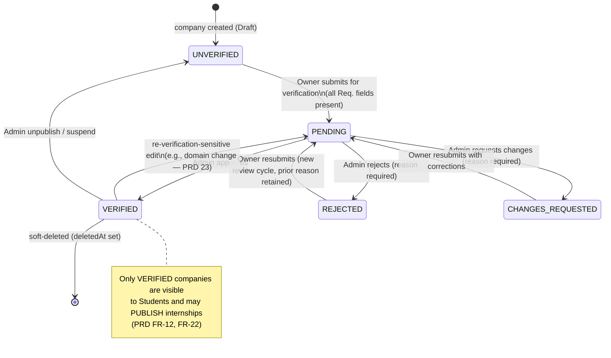
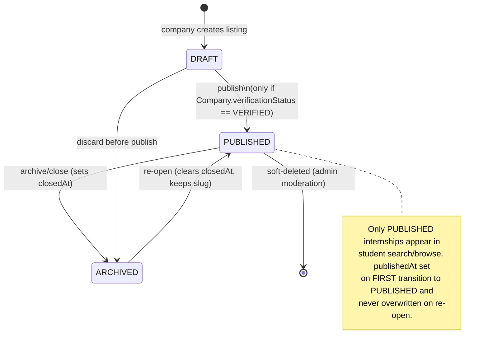
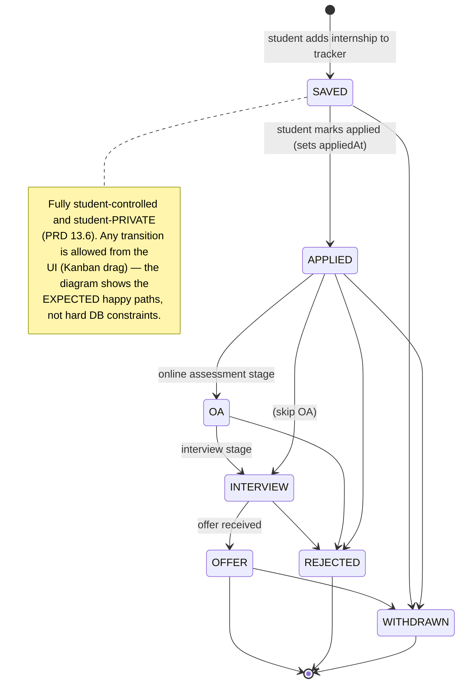

# 04 — Database Design & Data Architecture

## Verity — Career Intelligence Platform

**Version:** 1.0
**Status:** Draft for Engineering Review
**Owner:** Founding Engineering Team (Data Architecture)
**Companion Documents:** `01-PRD.md`, `02-TRD.md`
**Scope:** PostgreSQL + Prisma. V1 has **no AI and no scraping**, but every table, column, and index below is designed to be forward-compatible with V2 (AI/matching) and V3 (scraping/enrichment) as **additive, non-breaking** changes.

> This document is the source of truth for the **physical data model**. It is a strict superset of TRD §10.2 (the core Prisma schema) and TRD §11 (entity relationships). Where the TRD sketched a table "for brevity" (`Notification`, `AnalyticsEvent`, `TrendingSnapshot`, `SearchQueryLog`, `TeamInvite`, feature-window), this document models it in full. **Nothing here contradicts the TRD** — it refines and completes it. Any place where this document tightens a TRD definition (e.g., adding `source`, `lastVerifiedAt`, `foundedYear`) is called out explicitly as a forward-compatible refinement, never a breaking change to a shipped field.

---

## Table of Contents

1. Overview & Design Principles
2. Conventions (IDs, timestamps, slugs, soft deletes, enums, nullability)
3. ER Diagram (full)
4. Lifecycle State Diagrams (VerificationStatus, InternshipStatus, ApplicationStatus)
5. Enum Reference
6. Complete Entity List (one subsection per table)
7. Relationships (1:1, 1:M, M:N, cascade behavior)
8. Constraints (unique, composite unique, FK, check-like, not-null strategy)
9. Indexes (every index + the exact query it accelerates)
10. Full-Text Search — raw SQL (tsvector generated columns + GIN)
11. Supporting / Operational Tables (Notification, AnalyticsEvent, TrendingSnapshot, TeamInvite, Featured, SearchQueryLog)
12. Complete `schema.prisma` (copy-pasteable superset)
13. Data Lifecycle & Retention (soft delete/restore, moderation audit)
14. Migration Strategy (prisma migrate, raw-SQL tsvector migration, seeding)
15. Future Schema Evolution (V2 AI, V3 scraping) — additive-only rule
16. Appendix: Column-count summary & referential-integrity matrix

---

## 1. Overview & Design Principles

Verity's entire product thesis is **trust through structured, verifiable data** (PRD §1, §2). The database is therefore not a passive persistence layer — it is the product moat. Every modeling decision below serves one of three goals, in priority order:

1. **Structured over free-text.** Anything a student filters, sorts, or a future model ranks on (funding stage, remote policy, category, technology, verification status, application status) is an **enum or a related row**, never a loose string. Free-text sprawl is the enemy of both search relevance (PRD §16) and future ML feature quality (PRD §21).
2. **Reversible and auditable.** Moderation is a first-class flow (PRD §12.6, FR-52/53). User-generated, moderatable content is **soft-deleted** (`deletedAt`), never hard-deleted, so an Admin takedown can be reversed and audited.
3. **Forward-compatible without rewrites.** The PRD (§21) and TRD (§22, §23) both commit V1 to "no schema rewrite for V2/V3." We honor this concretely: `StudentProfile.resumeUrl` exists now (upload UI deferred); a `source` provenance enum has a designed slot; join tables are **explicit models** so relation metadata can be added later; instrumentation tables (`AnalyticsEvent`, `SearchQueryLog`) are shaped to double as future training signal.

### 1.1 The seven design principles, stated crisply

| # | Principle | Concrete manifestation | Driving requirement |
|---|---|---|---|
| P1 | **cuid primary keys** | Every table's `id` is `String @id @default(cuid())` | Collision-resistant, URL-safe, non-enumerable (no `/companies/1` scraping), client-generatable |
| P2 | **Enums over free-text** | `FundingStage`, `RemotePolicy`, `VerificationStatus`, `InternshipStatus`, `ApplicationStatus`, `BookmarkTargetType`, `VisaSponsorship`, `EmployeeCountRange`, `ContentSource`, etc. | PRD §16 (filters), §21 (ML features); TRD §10.1 |
| P3 | **Slugs for public identity** | `Company.slug`, `Internship.slug`, `Category.slug`, `Technology.slug` — unique, SEO-stable, Admin-gated to change | PRD §2 (canonical URLs); TRD §10.1 |
| P4 | **Soft deletes for moderatable content** | `deletedAt DateTime?` on `User`, `Company`, `Internship` (+ extended to `CompanyNews`, `Founder` for moderation reversibility) | PRD §12.6, §23; TRD §10.1 |
| P5 | **Universal timestamps** | `createdAt` + `updatedAt` on every mutable entity; domain-specific timestamps (`publishedAt`, `verifiedAt`, `lastVerifiedAt`, `appliedAt`) where lifecycle matters | PRD §13.7 (staleness auditing), §18 |
| P6 | **Explicit join models for M:N** | `CompanyTechnology`, `CompanyCategory` are real models (not implicit Prisma `@relation` arrays) | TRD §10.3 — allows future relation metadata (`addedBy`, `proficiency`, `source`) with no breaking migration |
| P7 | **Provenance-ready** | A `source ContentSource @default(MANUAL)` column is defined on `Company` and `Internship` in V1 (defaulting to `MANUAL`), so V3 scraping writes `SCRAPED` into the same tables with zero migration risk | TRD §23; PRD §21 |

> **On P7 and the "V1 has no scraping" constraint.** Including a `source` column that only ever holds `MANUAL` in V1 does **not** violate the "no scraping" product constraint (PRD §25 AC-8). No scraper writes to it; no code branches on it. It is a *nullable-safe default* that removes a future `ALTER TABLE ... ADD COLUMN` on the two hottest tables. This is exactly the "obvious who/what would call this instead of a human" story the TRD §1 demands. If the team prefers absolute purity, the column can be dropped from V1 and added in V3 — but the default `MANUAL` makes it strictly additive, so we keep it.

### 1.2 What lives in Postgres vs. what does not

| Data | Home | Rationale |
|---|---|---|
| All structured entities, relationships, enums | **Postgres** (this doc) | Single source of truth, transactional consistency (TRD §2) |
| Auth identity, passwords, sessions, OAuth | **Clerk** (external) | We store only `User.clerkId` + a mirrored `email`/`name`/`avatarUrl` (TRD §6). No password bytes ever touch our DB. |
| Binary assets (logos, banners, founder photos, resumes) | **Cloudinary** (external) | We store only the URL/public-id string. Keeps the app tier stateless (TRD §2). |
| Full-text search index | **Postgres** (`tsvector` + GIN) | Co-located with data → zero indexing lag (TRD §12) |
| Vector embeddings | **Future** — `pgvector` in the *same* Postgres | V2, additive (TRD §22, §15) |

---

## 2. Conventions

These conventions apply to **every** model unless a subsection explicitly overrides them. They are stated once here to keep the per-entity tables focused on the fields that are actually interesting.

### 2.1 Primary keys — `cuid()`

```prisma
id String @id @default(cuid())
```

- **Why cuid, not `autoincrement()`:** sequential integer IDs leak business volume (a competitor can read `/companies/487` and learn we have ~487 companies) and are trivially enumerable for scraping — both anathema to a trust/moat product. cuids are collision-resistant, horizontally-shardable, and safe to expose in URLs alongside slugs.
- **Why cuid, not `uuid()`:** cuids are shorter, monotonic-ish (better B-tree locality on insert than random UUIDv4), and Prisma-native. If the team later standardizes on UUIDv7 for time-ordering, that is a per-table additive change; V1 uses cuid uniformly.
- Join tables (`CompanyTechnology`, `CompanyCategory`) intentionally use **composite primary keys** (`@@id([...])`) instead of a surrogate cuid — see §7.3.

### 2.2 Timestamps

| Column | Type | Semantics |
|---|---|---|
| `createdAt` | `DateTime @default(now())` | Row birth. Immutable. |
| `updatedAt` | `DateTime @updatedAt` | Auto-bumped by Prisma on any field change. |
| `deletedAt` | `DateTime?` | Soft-delete tombstone. `NULL` = live. Non-null = removed (see §13). |
| Domain timestamps | `DateTime?` | `publishedAt`, `verifiedAt`, `lastVerifiedAt`, `appliedAt`, `resolvedAt`, `closedAt`, `acceptedAt`, `expiresAt` — each documented at its entity. |

All timestamps are stored as `timestamptz` (Postgres `TIMESTAMP WITH TIME ZONE`) — Prisma's `DateTime` maps to `timestamp(3)` by default, but we set `@db.Timestamptz(3)` where explicit UTC storage matters for cross-region correctness (all lifecycle timestamps). Application code always works in UTC and formats at the edge.

### 2.3 Slugs

- Present on `Company`, `Internship`, `Category`, `Technology`.
- **Unique** (`@unique`) and **immutable by default.** A slug change breaks inbound SEO links (PRD §2), so it is an **Admin-gated action**, never part of routine profile editing (TRD §10.1).
- Generated at creation from the human name via a `slugify()` helper with a collision-suffix strategy (`sarvam-ai`, `sarvam-ai-2`). The dedupe check is a `SELECT ... WHERE slug = $1` guarded by the `@unique` constraint as the real backstop (a race loses to the DB constraint and retries with a new suffix).

### 2.4 Soft deletes

- `deletedAt DateTime?` on all **moderatable, user-generated** content: `User`, `Company`, `Internship`, and (extended here beyond TRD §10.2 core, additively) `CompanyNews` and `Founder` — because Admin moderation (PRD §12.6) can remove a specific fraudulent news post or a fake founder without nuking the whole company.
- **Every read query for public/student surfaces must filter `deletedAt IS NULL`.** This is enforced in the shared `lib/db.ts` query helpers and the `features/*/queries.ts` layer (TRD §3.3), not left to each call site. Prisma's client extensions (`$extends`) apply a global `deletedAt: null` filter for the student/public read paths; Admin moderation queries opt out explicitly to *see* deleted rows.
- Join tables, instrumentation tables, and truly-ephemeral rows (`Bookmark`, `AnalyticsEvent`, `SearchQueryLog`, `CompanyTechnology`, `CompanyCategory`) are **hard-deleted** — there is nothing to moderate or audit about a removed bookmark, and keeping tombstones there would bloat the hottest-write tables.

### 2.5 Nullability strategy (not-null discipline)

Verity's nullability rule is: **a column is `NOT NULL` if and only if the value is guaranteed to exist at row-insert time.** Everything a company fills in progressively (about, funding stage, banner) is nullable, because the PRD (§17) explicitly supports saving a **Draft** company with any subset of fields, gating completeness only at the **Submit-for-Verification** boundary.

| Category | Rule | Examples |
|---|---|---|
| Identity / FK / discriminator | `NOT NULL` always | `id`, `companyId`, `userId`, `slug`, `targetType`, `role`, `status` |
| Required-at-creation business fields | `NOT NULL` | `Company.name`, `Internship.title`, `Internship.description`, `Internship.applyUrl`, `Report.reason` |
| Progressive / optional profile fields | **NULL-able** | `Company.about`, `tagline`, `logoUrl`, `fundingStage`, `remotePolicy`, `StudentProfile.resumeUrl` |
| Lifecycle timestamps not yet reached | **NULL-able** | `publishedAt` (null until published), `verifiedAt`, `appliedAt`, `resolvedAt` |

The **PRD §17 "(Req.)" verification-gating fields** (logo, name, tagline, category, about, remote policy, visa sponsorship, employee count, funding stage, at least one location, website) are **nullable at the column level** but **required at the application level** by the `submitForVerification` Zod schema + server action. We deliberately do *not* make them `NOT NULL` in Postgres, because that would make it impossible to persist a half-finished Draft — the exact workflow PRD §17 mandates. This is the canonical "check-like constraint enforced in app, not DB" case (see §8.4).

---

## 3. ER Diagram

The following Mermaid `erDiagram` covers **every** V1 entity, including the operational tables from §11. Relationship cardinality notation: `||` = one (mandatory), `o|` = zero-or-one, `o{` = zero-or-many, `|{` = one-or-many.

```mermaid
erDiagram
    User ||--o| StudentProfile : "has (1:1)"
    User ||--o{ CompanyMember : "member of companies"
    User ||--o{ Bookmark : "creates"
    User ||--o{ Application : "tracks"
    User ||--o{ Report : "files (ReportedBy)"
    User ||--o{ Notification : "receives"
    User ||--o{ TeamInvite : "invited-by (inviter)"
    User ||--o{ AnalyticsEvent : "actor (nullable)"
    User ||--o{ SearchQueryLog : "searcher (nullable)"

    Company ||--o{ CompanyMember : "has members"
    Company ||--o{ Internship : "posts"
    Company ||--o{ Founder : "has"
    Company ||--o{ CompanyNews : "publishes"
    Company ||--o{ CompanyLink : "has"
    Company ||--o{ CompanyLocation : "has"
    Company ||--o{ CompanyTechnology : "tagged with"
    Company ||--o{ CompanyCategory : "classified as"
    Company ||--o{ Bookmark : "bookmarked as (CompanyBookmarks)"
    Company ||--o{ Report : "reported as (ReportedCompany)"
    Company ||--o{ TeamInvite : "invites to"
    Company ||--o{ Featured : "featured via"
    Company ||--o{ AnalyticsEvent : "subject (nullable)"

    Technology ||--o{ CompanyTechnology : "applied to companies"
    Category ||--o{ CompanyCategory : "applied to companies"

    Internship ||--o{ Application : "tracked by"
    Internship ||--o{ Bookmark : "bookmarked as (InternshipBookmarks)"
    Internship ||--o{ Report : "reported as (ReportedInternship)"
    Internship ||--o{ AnalyticsEvent : "subject (nullable)"

    CompanyMember }o--|| User : "references"
    CompanyMember }o--|| Company : "references"

    TrendingSnapshot }o--o| Company : "ranks (denormalized companyId)"

    User {
        string id PK "cuid"
        string clerkId UK "Clerk identity"
        string email UK
        string name
        string avatarUrl
        enum   role "PlatformRole @default STUDENT"
        datetime createdAt
        datetime updatedAt
        datetime deletedAt "soft delete"
    }

    StudentProfile {
        string id PK
        string userId UK "1:1 -> User"
        string college
        int    gradYear
        string major
        string resumeUrl "Cloudinary; upload UI deferred (V2)"
        string bio
        datetime createdAt
        datetime updatedAt
    }

    Company {
        string id PK
        string slug UK "SEO stable"
        string name
        string tagline
        string about
        string logoUrl
        string bannerUrl
        string websiteUrl
        int    foundedYear
        enum   fundingStage "FundingStage?"
        enum   remotePolicy "RemotePolicy?"
        enum   visaSponsorship "VisaSponsorship @default UNKNOWN"
        enum   employeeCountRange "EmployeeCountRange?"
        string fundingTotalRaised
        string hiringTimeline
        enum   verificationStatus "@default UNVERIFIED"
        string verificationNote "admin reason on REJECTED/CHANGES"
        datetime verifiedAt
        datetime lastVerifiedAt "PRD 13.7 staleness"
        boolean isFeatured "@default false"
        enum   source "ContentSource @default MANUAL (V3-ready)"
        tsvector searchVector "generated, GIN"
        datetime createdAt
        datetime updatedAt
        datetime deletedAt
    }

    CompanyMember {
        string id PK
        string companyId FK
        string userId FK
        enum   role "CompanyMemberRole @default RECRUITER"
        datetime createdAt
    }

    Founder {
        string id PK
        string companyId FK
        string name
        string title
        string bio
        string linkedinUrl
        string twitterUrl
        string photoUrl
        enum   personType "CompanyPersonType @default FOUNDER"
        boolean isHiringManager
        int    sortOrder
        datetime createdAt
        datetime deletedAt "soft delete (moderation)"
    }

    CompanyNews {
        string id PK
        string companyId FK
        string title
        string body
        string url
        datetime publishedAt
        datetime createdAt
        datetime deletedAt "soft delete (moderation)"
    }

    CompanyLink {
        string id PK
        string companyId FK
        enum   type "CompanyLinkType"
        string url
    }

    CompanyLocation {
        string id PK
        string companyId FK
        string city
        string region
        string country
        boolean isHQ
    }

    Technology {
        string id PK
        string slug UK
        string name
    }

    CompanyTechnology {
        string companyId PK_FK
        string technologyId PK_FK
        datetime createdAt
    }

    Category {
        string id PK
        string slug UK
        string name
        string description
    }

    CompanyCategory {
        string companyId PK_FK
        string categoryId PK_FK
        datetime createdAt
    }

    Internship {
        string id PK
        string companyId FK
        string slug UK
        string title
        string description
        string location
        enum   remotePolicy "RemotePolicy?"
        string compensation
        string duration
        string applyUrl
        datetime applicationDeadline
        enum   status "InternshipStatus @default DRAFT"
        datetime publishedAt
        datetime closedAt
        enum   source "ContentSource @default MANUAL"
        tsvector searchVector "generated, GIN"
        datetime createdAt
        datetime updatedAt
        datetime deletedAt
    }

    Bookmark {
        string id PK
        string userId FK
        enum   targetType "BookmarkTargetType"
        string companyId FK "nullable"
        string internshipId FK "nullable"
        datetime createdAt
    }

    Application {
        string id PK
        string userId FK
        string internshipId FK
        enum   status "ApplicationStatus @default SAVED"
        string notes "student-private"
        datetime appliedAt
        datetime createdAt
        datetime updatedAt
    }

    Report {
        string id PK
        string reportedById FK
        string targetCompanyId FK "nullable"
        string targetInternshipId FK "nullable"
        enum   targetType "ReportTargetType"
        enum   reason "ReportReason"
        string detail
        enum   status "ReportStatus @default OPEN"
        string resolutionNote
        string resolvedById FK "nullable (admin)"
        datetime resolvedAt
        datetime createdAt
    }

    Notification {
        string id PK
        string userId FK
        enum   type "NotificationType"
        string title
        string body
        string linkUrl
        json   data
        datetime readAt "null = unread"
        boolean emailSent
        datetime createdAt
    }

    TeamInvite {
        string id PK
        string companyId FK
        string invitedById FK
        string email
        enum   role "CompanyMemberRole"
        enum   status "InviteStatus @default PENDING"
        string token UK
        datetime expiresAt
        datetime acceptedAt
        datetime createdAt
    }

    Featured {
        string id PK
        string companyId FK
        datetime startsAt
        datetime endsAt
        int    priority
        string createdById FK "admin"
        datetime createdAt
    }

    AnalyticsEvent {
        string id PK
        enum   type "AnalyticsEventType"
        string actorUserId FK "nullable (anon)"
        string companyId FK "nullable"
        string internshipId FK "nullable"
        json   metadata
        string sessionId "anonymized"
        datetime createdAt
    }

    SearchQueryLog {
        string id PK
        string query
        string normalizedQuery
        int    resultCount
        string actorUserId FK "nullable"
        json   filters
        datetime createdAt
    }

    TrendingSnapshot {
        string id PK
        string companyId FK
        int    rank
        float  score
        int    windowDays
        datetime computedAt
    }
```



---

## 4. Lifecycle State Diagrams

State machines are the backbone of Verity's trust flows. Three enums are true lifecycles (not just categories) and get explicit state diagrams. Illegal transitions are rejected at the **server action / RBAC layer** (TRD §7.4), not merely by UI.

### 4.1 `VerificationStatus` (Company)



> **Note on `CHANGES_REQUESTED`.** TRD §10.2 enumerated `VerificationStatus` as `UNVERIFIED | PENDING | VERIFIED | REJECTED`. The PRD (§12.6 FR-51, §14.2, §14.3, §20) repeatedly requires a distinct **"Changes Requested"** state ("returned to Company," "clear 'what to fix' checklist"). Modeling this as a status of `REJECTED` with a note would conflate "you may resubmit after fixing" with "you were rejected." We therefore **add `CHANGES_REQUESTED` to the enum** — an **additive** enum-value addition (no existing value renamed or removed), fully consistent with the TRD's four values plus the PRD's explicit requirement. This is the single reconciliation between the two source docs, resolved in the PRD's favor because it is a stated functional requirement.

### 4.2 `InternshipStatus`



### 4.3 `ApplicationStatus` (student-private tracker)



> The `ApplicationStatus` machine is intentionally **permissive** — it is a personal tracker (PRD §14.1, §12.5), so students may drag a card anywhere on the Kanban. Unlike `VerificationStatus`/`InternshipStatus` (which gate visibility and trust and are server-enforced), Application transitions are not restricted server-side beyond validating the value is a legal enum member.

---

## 5. Enum Reference

All enums in one place. Enums carried verbatim from TRD §10.2 are marked **(TRD)**; enums added by this document (all additive, all for fields the PRD requires) are marked **(NEW — additive)** with the driving requirement.

| Enum | Values | Source |
|---|---|---|
| `PlatformRole` | `STUDENT`, `COMPANY`, `ADMIN` | **(TRD)** |
| `CompanyMemberRole` | `OWNER`, `RECRUITER` | **(TRD)** — see note below on PRD's 4-role mention |
| `VerificationStatus` | `UNVERIFIED`, `PENDING`, `VERIFIED`, `REJECTED`, `CHANGES_REQUESTED` | **(TRD)** + `CHANGES_REQUESTED` **(NEW — additive; PRD FR-51)** |
| `FundingStage` | `BOOTSTRAPPED`, `PRE_SEED`, `SEED`, `SERIES_A`, `SERIES_B`, `SERIES_C_PLUS`, `PUBLIC` | **(TRD)** |
| `RemotePolicy` | `REMOTE`, `HYBRID`, `ONSITE` | **(TRD)** |
| `InternshipStatus` | `DRAFT`, `PUBLISHED`, `ARCHIVED` | **(TRD)** |
| `ApplicationStatus` | `SAVED`, `APPLIED`, `OA`, `INTERVIEW`, `OFFER`, `REJECTED`, `WITHDRAWN` | **(TRD)** |
| `BookmarkTargetType` | `COMPANY`, `INTERNSHIP` | **(TRD)** |
| `VisaSponsorship` | `YES`, `NO`, `CASE_BY_CASE`, `UNKNOWN` | **(NEW — additive; PRD §17 enum, §16 facet)** |
| `EmployeeCountRange` | `RANGE_1_10`, `RANGE_11_50`, `RANGE_51_200`, `RANGE_201_500`, `RANGE_500_PLUS` | **(NEW — additive; PRD §16 buckets)** — replaces free-text `employeeCountRange String?` from TRD §10.2 with an enum; see migration note §14 |
| `CompanyLinkType` | `WEBSITE`, `CAREERS`, `BLOG`, `DOCS`, `LINKEDIN`, `TWITTER`, `INSTAGRAM`, `YOUTUBE`, `GITHUB`, `CRUNCHBASE`, `OTHER` | **(NEW — additive)** — TRD §10.2 had `type String`; enum keeps taxonomy clean (PRD §17 Links/Social) |
| `CompanyPersonType` | `FOUNDER`, `CO_FOUNDER`, `HIRING_MANAGER`, `RECRUITER` | **(NEW — additive; PRD §17)** — the "same underlying entity with a role flag" the PRD §17 explicitly calls out |
| `ContentSource` | `MANUAL`, `SCRAPED`, `ADMIN_SEED` | **(NEW — additive; TRD §23)** — V1 only ever writes `MANUAL`/`ADMIN_SEED` |
| `ReportTargetType` | `COMPANY`, `INTERNSHIP` | **(NEW — additive; PRD FR-52)** |
| `ReportReason` | `SPAM`, `INACCURATE`, `FRAUDULENT`, `OFFENSIVE`, `DUPLICATE`, `OTHER` | **(NEW — additive; PRD FR-52)** — TRD §10.2 had `reason String` |
| `ReportStatus` | `OPEN`, `RESOLVED`, `DISMISSED` | **(NEW — additive)** — TRD §10.2 had `status String @default("OPEN")` |
| `NotificationType` | `VERIFICATION_APPROVED`, `VERIFICATION_CHANGES_REQUESTED`, `VERIFICATION_REJECTED`, `TEAM_INVITE_ACCEPTED`, `BOOKMARKED_COMPANY_NEW_INTERNSHIP`, `REPORT_RECEIVED`, `REPORT_RESOLVED`, `WELCOME` | **(NEW — additive; PRD §20 table)** |
| `InviteStatus` | `PENDING`, `ACCEPTED`, `EXPIRED`, `REVOKED` | **(NEW — additive; PRD FR-04, C5)** |
| `AnalyticsEventType` | `COMPANY_PROFILE_VIEW`, `INTERNSHIP_VIEW`, `COMPANY_BOOKMARK_ADDED`, `COMPANY_BOOKMARK_REMOVED`, `INTERNSHIP_BOOKMARK_ADDED`, `APPLY_CLICKED`, `SEARCH_PERFORMED`, `APPLICATION_STATUS_CHANGED` | **(NEW — additive; PRD §19.3)** |

> **On `CompanyMemberRole` and the PRD's four roles.** PRD FR-04 and §14.2 mention four company roles: **Owner, Admin, Recruiter, Viewer**. TRD §7.2 and §10.2 deliberately collapse these to **two** (`OWNER`, `RECRUITER`) for V1, stating the two-tier model is what V1 ships. We follow the **TRD** (the implementation source of truth) and keep `CompanyMemberRole = { OWNER, RECRUITER }` for V1, because adding `ADMIN` and `VIEWER` later is a pure **additive enum extension** requiring no data migration. This is documented as a known, intentional V1 simplification, not a contradiction — the PRD lists the target set, the TRD scopes V1, and the enum is future-expandable. See §15.3.

---

## 6. Complete Entity List

Each subsection: **purpose**, a full column table (`type` / `nullable` / `default` / `description`), and **rationale** for notable fields. Columns follow the §2 conventions; only per-entity specifics are annotated.

### 6.1 `User`

**Purpose.** The platform identity row, mirrored from Clerk on webhook (`user.created`/`user.updated`, TRD §6). One `User` per human. `role` is the platform-level RBAC discriminator; company sub-permissions live on `CompanyMember`.

| Column | Type | Nullable | Default | Description |
|---|---|---|---|---|
| `id` | `String` (cuid) | No | `cuid()` | PK |
| `clerkId` | `String` | No | — | Clerk's user id. **Unique.** The join key to the auth provider. |
| `email` | `String` | No | — | Mirrored from Clerk. **Unique.** Enforces PRD FR-03 (one Student account per email). |
| `name` | `String` | Yes | `null` | Display name, mirrored from Clerk. |
| `avatarUrl` | `String` | Yes | `null` | Clerk/Cloudinary avatar URL. |
| `role` | `PlatformRole` | No | `STUDENT` | Platform RBAC role. Elevated to `COMPANY`/`ADMIN` only via explicit flows (TRD §6). |
| `createdAt` | `DateTime` | No | `now()` | |
| `updatedAt` | `DateTime` | No | `@updatedAt` | |
| `deletedAt` | `DateTime?` | Yes | `null` | Soft delete = account suspension/deactivation (PRD FR-07). |

**Rationale.**
- `clerkId` unique + `email` unique are the two integrity anchors of the auth mirror. `email` is duplicated from Clerk (not just `clerkId`) so student-facing "one account per email" (FR-03) is enforceable in *our* DB without a Clerk round-trip, and so support/admin can search by email.
- `role` defaults to `STUDENT` because every signup is a student until an explicit elevation transaction runs (TRD §6). We never let a `COMPANY` role exist without a matching `CompanyMember` (transaction-wrapped, TRD §6).
- `deletedAt` implements suspension: a suspended user's rows persist (their company survives — PRD §23 edge case) but they cannot authenticate into an active session (Clerk side) and are filtered from active-user queries.

### 6.2 `StudentProfile`

**Purpose.** Extended, student-specific attributes kept out of the hot `User` row. 1:1 with `User`. Backs the Student Profile/Settings screen (PRD §14.1) and the rules-based recommendation inputs (PRD §14.1).

| Column | Type | Nullable | Default | Description |
|---|---|---|---|---|
| `id` | `String` (cuid) | No | `cuid()` | PK |
| `userId` | `String` | No | — | FK → `User.id`. **Unique** (enforces 1:1). |
| `college` | `String?` | Yes | `null` | School name (free-text V1; canonicalization deferred). |
| `gradYear` | `Int?` | Yes | `null` | Expected graduation year. |
| `major` | `String?` | Yes | `null` | Field of study — feeds rules-based recommendation overlap (PRD §14.1). |
| `resumeUrl` | `String?` | Yes | `null` | **Cloudinary URL placeholder.** Upload UI deferred to V1.1/V2; column exists now so no migration is needed to *add the concept* (PRD §21 forward-compat note). Future AI resume-parsing input. |
| `bio` | `String?` | Yes | `null` | Short self-description. |
| `createdAt` | `DateTime` | No | `now()` | |
| `updatedAt` | `DateTime` | No | `@updatedAt` | |

**Rationale.**
- **Why a separate table, not columns on `User`:** keeps `User` narrow (it's read on every authenticated request for RBAC), and lets student PII (`resumeUrl`, `bio`) live in a table Company accounts never join to (PRD §13.6 privacy).
- `resumeUrl` is the single most important forward-compat field in the schema — its mere existence is called out in PRD §21 and TRD §10.2 as the thing that must not require a future migration. Interests/areas-of-interest (PRD §14.1) map to `Category` and are modeled as a future `StudentInterest` join (§15) rather than a free-text column, keeping the recommendation feature clean; V1 may store a lightweight interest list — see §15.2.
- No `deletedAt`: the profile's lifecycle is bound to `User` (cascade on user delete). Soft-deleting a `User` hides the profile transitively.

### 6.3 `Company`

**Purpose.** The core entity of the entire platform — the "canonical record" of PRD §2. Every student research journey terminates here. Carries verification state, all profile content, search vector, feature flag, and provenance.

| Column | Type | Nullable | Default | Description |
|---|---|---|---|---|
| `id` | `String` (cuid) | No | `cuid()` | PK |
| `slug` | `String` | No | — | **Unique**, SEO-stable public URL segment. Admin-gated to change. |
| `name` | `String` | No | — | Company legal/display name. Required at creation. |
| `tagline` | `String?` | Yes | `null` | One-liner (PRD §17 Hero, Req. at verification). |
| `about` | `String?` | Yes | `null` | Long-form description (PRD §17 About, Req. at verification). |
| `logoUrl` | `String?` | Yes | `null` | Cloudinary. Req. at verification. |
| `bannerUrl` | `String?` | Yes | `null` | Cloudinary hero banner. Optional. |
| `websiteUrl` | `String?` | Yes | `null` | Primary domain. Req. at verification; **re-verification-sensitive** (PRD §23). |
| `foundedYear` | `Int?` | Yes | `null` | PRD §17 About. |
| `fundingStage` | `FundingStage?` | Yes | `null` | Enum. Req. at verification. Search/filter facet. |
| `remotePolicy` | `RemotePolicy?` | Yes | `null` | Company-level default. Req. at verification. |
| `visaSponsorship` | `VisaSponsorship` | No | `UNKNOWN` | Enum (PRD §17). Non-null with sane default so filter always has a value. |
| `employeeCountRange` | `EmployeeCountRange?` | Yes | `null` | Bucketed enum (PRD §16). Req. at verification. |
| `fundingTotalRaised` | `String?` | Yes | `null` | Free-text V1 (PRD §17 Funding — "freeform text in V1"). |
| `hiringTimeline` | `String?` | Yes | `null` | Free-text/structured note (PRD §17). |
| `verificationStatus` | `VerificationStatus` | No | `UNVERIFIED` | Lifecycle (§4.1). Gates student visibility + internship publish. |
| `verificationNote` | `String?` | Yes | `null` | Admin reason on `REJECTED`/`CHANGES_REQUESTED` (PRD FR-51). |
| `verifiedAt` | `DateTime?` | Yes | `null` | Timestamp of most recent transition into `VERIFIED`. |
| `lastVerifiedAt` | `DateTime?` | Yes | `null` | PRD §13.7 staleness auditing — last time an Admin re-affirmed accuracy. |
| `isFeatured` | `Boolean` | No | `false` | Denormalized flag for fast dashboard filter; authoritative window lives in `Featured` (§11.5). |
| `source` | `ContentSource` | No | `MANUAL` | Provenance. V1 writes `MANUAL` (self-serve) or `ADMIN_SEED` (FR-14). V3 scraping writes `SCRAPED`. |
| `searchVector` | `Unsupported("tsvector")?` | Yes | (generated) | FTS column (§10). Managed by raw-SQL migration, not Prisma. |
| `createdAt` | `DateTime` | No | `now()` | |
| `updatedAt` | `DateTime` | No | `@updatedAt` | |
| `deletedAt` | `DateTime?` | Yes | `null` | Soft delete (Admin takedown, reversible). |

**Rationale.**
- **`visaSponsorship` is `NOT NULL DEFAULT UNKNOWN`** while other verification-req fields are nullable. Deliberate: PRD §16 exposes visa as a filter facet with an explicit **"Unknown"** option, so the column should always hold a filterable value rather than `NULL`. `UNKNOWN` is semantically meaningful here, unlike (say) a `NULL` funding stage which just means "not filled yet."
- **`isFeatured` denormalization.** The authoritative source of "is this company featured right now" is a time-windowed `Featured` row (`startsAt <= now <= endsAt`, §11.5). But the Student Dashboard "Featured" module and the search sort (`ORDER BY isFeatured DESC`, TRD §12) need an O(1) boolean without a correlated subquery on every render. We keep `isFeatured` as a denormalized cache, refreshed by (a) the same cron that computes `TrendingSnapshot` and (b) the Admin feature/unfeature action writing both rows in one transaction. PRD §23 requires feature-window expiry to be respected server-side on every render — so the *authoritative* check on the dashboard render path reads `Featured` with a `now()` predicate; `isFeatured` is only a coarse pre-filter/index accelerator. Documented tradeoff, not a correctness hole.
- **`verifiedAt` vs `lastVerifiedAt`.** `verifiedAt` = when it first/most-recently became VERIFIED (drives "Recently Added Verified" dashboard module, PRD §15.1). `lastVerifiedAt` = the data-quality staleness clock PRD §13.7 demands — an Admin can "re-affirm" a still-accurate profile, bumping `lastVerifiedAt` without changing `verificationStatus`.
- **`source`** is the V3 hook (P7). Defaulting to `MANUAL` means V1 code never has to set it and V3 scrapers set `SCRAPED`, letting Admin filter "scraped-but-unverified" rows in the exact same `verificationStatus` pipeline (TRD §23) — no parallel review system.

### 6.4 `CompanyMember`

**Purpose.** The many-to-many join between `User` and `Company`, carrying the company sub-role (`OWNER`/`RECRUITER`). This is what makes a user a "Company account" (TRD §6, §7.2).

| Column | Type | Nullable | Default | Description |
|---|---|---|---|---|
| `id` | `String` (cuid) | No | `cuid()` | PK |
| `companyId` | `String` | No | — | FK → `Company.id`. |
| `userId` | `String` | No | — | FK → `User.id`. |
| `role` | `CompanyMemberRole` | No | `RECRUITER` | Sub-role; `OWNER` for the registering user (TRD §6). |
| `createdAt` | `DateTime` | No | `now()` | |

**Rationale.**
- **`@@unique([companyId, userId])`** — a user can hold at most one membership row per company (no duplicate memberships). See §8.2.
- Defaults to `RECRUITER`; the company-registration transaction explicitly sets the first member to `OWNER` (TRD §6). Team invites (§11.4) create additional members.
- No `deletedAt`: revoking a member is a **hard delete** of the join row (there's nothing to moderate/audit at the row level beyond the `AnalyticsEvent`/audit log; membership is not user-generated content). Transfer-of-ownership (PRD §14.2) flips two members' `role` in one transaction.

### 6.5 `Founder`

**Purpose.** People associated with a company — founders, co-founders, hiring managers, recruiters. PRD §17 explicitly says these are "the same underlying entity with a role flag." Not necessarily platform account holders (a `Founder` is *content about* a person, distinct from a `CompanyMember` who is a *user with access*).

| Column | Type | Nullable | Default | Description |
|---|---|---|---|---|
| `id` | `String` (cuid) | No | `cuid()` | PK |
| `companyId` | `String` | No | — | FK → `Company.id`. |
| `name` | `String` | No | — | Person's name. |
| `title` | `String?` | Yes | `null` | e.g., "Co-founder & CEO". |
| `bio` | `String?` | Yes | `null` | Short bio (PRD §17). |
| `linkedinUrl` | `String?` | Yes | `null` | |
| `twitterUrl` | `String?` | Yes | `null` | |
| `photoUrl` | `String?` | Yes | `null` | Cloudinary. |
| `personType` | `CompanyPersonType` | No | `FOUNDER` | `FOUNDER`/`CO_FOUNDER`/`HIRING_MANAGER`/`RECRUITER` — the PRD §17 "role flag". |
| `isHiringManager` | `Boolean` | No | `false` | Retained from TRD §10.2 for backward-compat; redundant with `personType == HIRING_MANAGER` but kept so existing TRD-shaped code/queries still work. |
| `sortOrder` | `Int` | No | `0` | Manual display ordering on the profile. |
| `createdAt` | `DateTime` | No | `now()` | |
| `deletedAt` | `DateTime?` | Yes | `null` | Soft delete (moderate a single fake founder without removing the company). |

**Rationale.**
- **Model name kept as `Founder`** (per TRD §10.2 and the instruction to preserve model names) even though it now holds hiring managers/recruiters too. The `personType` enum is the discriminator PRD §17 asks for. Renaming the model to `CompanyPerson` would be cleaner but would break the TRD-defined name — so we keep `Founder` and document that it is the general "company person" entity. (A future non-breaking `@@map` could rename the underlying table if desired.)
- Both `personType` and `isHiringManager` exist to satisfy *both* documents: TRD §10.2 shipped `isHiringManager Boolean`; PRD §17 wants a richer role flag. Keeping both is additive and avoids contradicting the TRD. Application code treats `personType` as authoritative and keeps `isHiringManager` in sync.
- `deletedAt` added here (beyond TRD core) specifically for moderation granularity (P4).

### 6.6 `CompanyNews`

**Purpose.** Short company update posts (PRD §14.2 "lightweight CMS," §17 Recent News module). Reverse-chronological, soft-capped in UI to last ~10.

| Column | Type | Nullable | Default | Description |
|---|---|---|---|---|
| `id` | `String` (cuid) | No | `cuid()` | PK |
| `companyId` | `String` | No | — | FK → `Company.id`. |
| `title` | `String` | No | — | Post headline. |
| `body` | `String?` | Yes | `null` | Post body (sanitized HTML/markdown; PRD §13.4 XSS). |
| `url` | `String?` | Yes | `null` | Optional external link (press, blog). |
| `publishedAt` | `DateTime` | No | `now()` | Display/sort timestamp. |
| `createdAt` | `DateTime` | No | `now()` | |
| `deletedAt` | `DateTime?` | Yes | `null` | Soft delete (moderation). |

**Rationale.** TRD §10.2 modeled `title`, `url`, `publishedAt`. We add `body` (the actual post content — PRD §17 lists "title, body, optional link, date") and `deletedAt` for moderation. `publishedAt` defaults to `now()` since news is published immediately (no draft state for news in V1).

### 6.7 `CompanyLink`

**Purpose.** Structured external links (website, careers, blog, docs, socials — PRD §17 Company Links + Social Media modules).

| Column | Type | Nullable | Default | Description |
|---|---|---|---|---|
| `id` | `String` (cuid) | No | `cuid()` | PK |
| `companyId` | `String` | No | — | FK → `Company.id`. |
| `type` | `CompanyLinkType` | No | — | Enum (was `String` in TRD §10.2 — tightened to enum to keep taxonomy clean). |
| `url` | `String` | No | — | Validated URL (PRD §17 "validated URL format"). |

**Rationale.** Converting TRD's `type String` to the `CompanyLinkType` enum keeps the link taxonomy controlled (PRD §13.7 "no freeform tag sprawl" ethos applied to link types), so the UI can render the right icon per type and dedupe "linkedin" vs "LinkedIn". `@@unique([companyId, type])` is **not** applied because a company may legitimately have multiple links of the same type is rare but possible (e.g., two blogs) — instead uniqueness is left to app logic; see §8.2 note.

### 6.8 `CompanyLocation`

**Purpose.** One or more physical locations (PRD §17 Locations, Req. ≥1; §16 Location filter facet).

| Column | Type | Nullable | Default | Description |
|---|---|---|---|---|
| `id` | `String` (cuid) | No | `cuid()` | PK |
| `companyId` | `String` | No | — | FK → `Company.id`. |
| `city` | `String` | No | — | City. |
| `region` | `String?` | Yes | `null` | State/region (added beyond TRD for finer location filtering). |
| `country` | `String` | No | — | Country. |
| `isHQ` | `Boolean` | No | `false` | Marks the headquarters. |

**Rationale.** Added `region` (TRD had `city`, `country`) because PRD §16 location filtering is "city/region." At-least-one-location is a verification-gate check enforced in the app (§8.4), not a DB constraint (you can't `NOT NULL` a child-table count).

### 6.9 `Technology` & `CompanyTechnology`

**Purpose.** Canonical technology taxonomy (`Technology`) + explicit M:N join to companies (`CompanyTechnology`). PRD §12.6 FR-54 (Admin-managed canonical, deduplicated); PRD §16 (tech filter, weight B).

**`Technology`**

| Column | Type | Nullable | Default | Description |
|---|---|---|---|---|
| `id` | `String` (cuid) | No | `cuid()` | PK |
| `slug` | `String` | No | — | **Unique** canonical slug (e.g., `react`). Merge/rename tooling target (PRD §14.3). |
| `name` | `String` | No | — | Display name (e.g., "React"). |

**`CompanyTechnology`** (explicit join)

| Column | Type | Nullable | Default | Description |
|---|---|---|---|---|
| `companyId` | `String` | No | — | FK → `Company.id`. Part of composite PK. |
| `technologyId` | `String` | No | — | FK → `Technology.id`. Part of composite PK. |
| `createdAt` | `DateTime` | No | `now()` | When the tag was applied (added beyond TRD for auditing). |

**Rationale (why explicit join — TRD §10.3).** Prisma's *implicit* M:N (`technologies Technology[]`) creates a hidden join table you cannot add columns to. We use an **explicit** `CompanyTechnology` model so V2/V3 can add `addedBy String?` (which admin/scraper applied it), `source ContentSource`, or `confidence Float?` (for AI-suggested tags) as **additive columns** — impossible with an implicit relation. Composite PK `@@id([companyId, technologyId])` gives free dedup + the ideal index for "companies using tech X" lookups.

### 6.10 `Category` & `CompanyCategory`

**Purpose.** Canonical category/industry taxonomy + explicit M:N join. Symmetric to Technology. PRD §12.6 FR-54; §16 (category filter, weight B); §14.1 (student interest overlap → recommendation).

**`Category`**

| Column | Type | Nullable | Default | Description |
|---|---|---|---|---|
| `id` | `String` (cuid) | No | `cuid()` | PK |
| `slug` | `String` | No | — | **Unique** (e.g., `fintech`). |
| `name` | `String` | No | — | Display (e.g., "Fintech"). |
| `description` | `String?` | Yes | `null` | Optional blurb for the Categories Browse grid (PRD §14.1). |

**`CompanyCategory`** (explicit join)

| Column | Type | Nullable | Default | Description |
|---|---|---|---|---|
| `companyId` | `String` | No | — | FK → `Company.id`. Composite PK part. |
| `categoryId` | `String` | No | — | FK → `Category.id`. Composite PK part. |
| `createdAt` | `DateTime` | No | `now()` | Application timestamp. |

**Rationale.** Same explicit-join reasoning as `CompanyTechnology`. `Category.description` added for the browse-grid UX (PRD §15.1 Categories module). The recommendation engine (V1 rules-based, PRD §14.1) computes overlap between a student's interest categories and `CompanyCategory` rows — this join is the primary feature source, another reason it must be a first-class, queryable, extensible table.

### 6.11 `Internship`

**Purpose.** A single internship listing under a company. Second-most-important entity. Lifecycle-managed (§4.2), searchable, bookmarkable, trackable.

| Column | Type | Nullable | Default | Description |
|---|---|---|---|---|
| `id` | `String` (cuid) | No | `cuid()` | PK |
| `companyId` | `String` | No | — | FK → `Company.id`. |
| `slug` | `String` | No | — | **Unique** SEO URL. |
| `title` | `String` | No | — | e.g., "Frontend Engineering Intern — Summer 2027". |
| `description` | `String` | No | — | Rich text, sanitized (PRD §13.4, §18). Required. |
| `location` | `String?` | Yes | `null` | City/region or "Remote" (PRD §18 — Req. at publish, app-enforced). |
| `remotePolicy` | `RemotePolicy?` | Yes | `null` | May differ from company default (PRD §18). |
| `compensation` | `String?` | Yes | `null` | Free-text V1 (PRD §18 — structured bands deferred to V2). |
| `duration` | `String?` | Yes | `null` | e.g., "12 weeks". |
| `applyUrl` | `String` | No | — | External ATS deep-link (PRD §18, FR-25 — no in-app apply). Required. |
| `applicationDeadline` | `DateTime?` | Yes | `null` | Drives "Apply soon" ≤7-day UI (PRD §18). |
| `status` | `InternshipStatus` | No | `DRAFT` | Lifecycle (§4.2). |
| `publishedAt` | `DateTime?` | Yes | `null` | Set on FIRST `PUBLISHED` transition; never overwritten (PRD §18 Posted Date). |
| `closedAt` | `DateTime?` | Yes | `null` | Set on `ARCHIVED` (PRD §18 Closed Date). |
| `source` | `ContentSource` | No | `MANUAL` | Provenance (V3 hook). |
| `searchVector` | `Unsupported("tsvector")?` | Yes | (generated) | FTS (§10). |
| `createdAt` | `DateTime` | No | `now()` | |
| `updatedAt` | `DateTime` | No | `@updatedAt` | Also the **staleness clock** (PRD §18/FR-24 — "untouched for 45+ days"). |
| `deletedAt` | `DateTime?` | Yes | `null` | Soft delete (moderation; archived≠deleted). |

**Rationale.**
- **`status` vs `deletedAt` vs `closedAt` are three distinct concepts** and must not be conflated: `ARCHIVED` = company closed the role (still counts for the company's analytics — PRD FR-23); `deletedAt` = Admin moderation takedown (removed from analytics too); `closedAt` = the timestamp of archival for display. A bookmarked-then-archived internship keeps its `Bookmark`/`Application` rows (PRD §23 edge case) and the UI shows "no longer open" using `status`.
- **`updatedAt` doubles as the staleness signal** for FR-24. The staleness report (§11 / a cron) queries `status=PUBLISHED AND updatedAt < now() - interval '45 days'`. No separate `lastActivityAt` column is needed because any edit/status-change bumps `updatedAt`.
- **Category on Internship:** PRD §18 lists Category as Req. We model it as a join to the same `Category` taxonomy via a lightweight `InternshipCategory`? For V1 simplicity and because the TRD §10.2 `Internship` had no category join, we keep internship categorization **inherited from the parent company** in V1 (an internship is searchable under its company's categories) and defer a dedicated `InternshipCategory` join to §15 as an additive V1.1 refinement. Internship *title* (weight B, PRD §16) carries the role-type search signal in V1. This is the one place we consciously simplify vs. PRD §18; it is additive to fix and does not block any M-priority flow.

### 6.12 `Bookmark`

**Purpose.** Polymorphic bookmark — a student saving either a Company or an Internship into one unified, date-sortable list (PRD §12.5, §14.1 Bookmarks tabs).

| Column | Type | Nullable | Default | Description |
|---|---|---|---|---|
| `id` | `String` (cuid) | No | `cuid()` | PK |
| `userId` | `String` | No | — | FK → `User.id`. |
| `targetType` | `BookmarkTargetType` | No | — | `COMPANY` \| `INTERNSHIP` discriminator. |
| `companyId` | `String?` | Yes | `null` | FK → `Company.id`. Non-null iff `targetType=COMPANY`. |
| `internshipId` | `String?` | Yes | `null` | FK → `Internship.id`. Non-null iff `targetType=INTERNSHIP`. |
| `createdAt` | `DateTime` | No | `now()` | Sort key for the unified list. |

**Rationale (why polymorphic, not two tables — TRD §10.3).** The Bookmarks view needs one unified list sortable by date across both target kinds. A single table with a `targetType` discriminator + two nullable FKs paginates with a simple `ORDER BY createdAt` — a two-table design would require a `UNION` with correlated sorting. The **`@@unique([userId, companyId, internshipId])`** composite (§8.2) prevents duplicate bookmarks. A DB-level check (`(targetType='COMPANY') = (companyId IS NOT NULL)`) is documented as an app-enforced invariant (§8.4). Hard-deleted (unbookmark removes the row).

### 6.13 `Application`

**Purpose.** A student's private application-tracker entry for an internship (PRD §12.5 FR-42/43/44, §14.1 Kanban). One row per (student, internship). **Never visible to Company or Admin** (PRD §13.6).

| Column | Type | Nullable | Default | Description |
|---|---|---|---|---|
| `id` | `String` (cuid) | No | `cuid()` | PK |
| `userId` | `String` | No | — | FK → `User.id`. |
| `internshipId` | `String` | No | — | FK → `Internship.id`. |
| `status` | `ApplicationStatus` | No | `SAVED` | Kanban column (§4.3). |
| `notes` | `String?` | Yes | `null` | **Student-private** notes (PRD FR-43). |
| `appliedAt` | `DateTime?` | Yes | `null` | Set when status first reaches `APPLIED`. |
| `createdAt` | `DateTime` | No | `now()` | |
| `updatedAt` | `DateTime` | No | `@updatedAt` | |

**Rationale.** `@@unique([userId, internshipId])` — a student tracks a given internship once (§8.2). Decoupled from `Internship.applyUrl`: Verity never processes real applications in V1 (PRD FR-25, §14.1) — this is a manual log. Because it is strictly student-private (PRD §13.6), **no Company or Admin analytics query ever joins this table**; that isolation is a privacy invariant enforced by keeping all Company/Admin analytics off `Application` entirely (they read `AnalyticsEvent` aggregates instead).

### 6.14 `Report`

**Purpose.** User-submitted moderation report against a company or internship (PRD §12.6 FR-52/53). Feeds the Admin Reports queue.

| Column | Type | Nullable | Default | Description |
|---|---|---|---|---|
| `id` | `String` (cuid) | No | `cuid()` | PK |
| `reportedById` | `String` | No | — | FK → `User.id` (`ReportedBy`). Who filed it. |
| `targetType` | `ReportTargetType` | No | — | `COMPANY` \| `INTERNSHIP`. |
| `targetCompanyId` | `String?` | Yes | `null` | FK → `Company.id`. Non-null iff `targetType=COMPANY`. |
| `targetInternshipId` | `String?` | Yes | `null` | FK → `Internship.id`. Non-null iff `targetType=INTERNSHIP`. |
| `reason` | `ReportReason` | No | — | Enum (was `String` in TRD). |
| `detail` | `String?` | Yes | `null` | Optional free-text elaboration. |
| `status` | `ReportStatus` | No | `OPEN` | `OPEN`/`RESOLVED`/`DISMISSED` (was `String` in TRD). |
| `resolutionNote` | `String?` | Yes | `null` | Admin's resolution rationale (audit trail, PRD §14.3). |
| `resolvedById` | `String?` | Yes | `null` | FK → `User.id` (admin who resolved). |
| `resolvedAt` | `DateTime?` | Yes | `null` | |
| `createdAt` | `DateTime` | No | `now()` | |

**Rationale.** TRD §10.2 modeled reports only against companies (`targetCompanyId`) with `reason String` and `status String`. PRD FR-52 requires reporting **companies or internships**, so we add `targetInternshipId` + `targetType` (polymorphic, same pattern as Bookmark) and enum-ify `reason`/`status`. `resolvedById`/`resolutionNote` implement the PRD §14.3 "audit trail of past resolutions." Not soft-deleted (reports are the audit record themselves; they're resolved/dismissed, never deleted).

*(Operational tables `Notification`, `TeamInvite`, `Featured`, `AnalyticsEvent`, `SearchQueryLog`, `TrendingSnapshot` are fully specified in §11.)*

---

## 7. Relationships

### 7.1 One-to-one (1:1)

| Relation | FK holder | Mechanism | Cascade |
|---|---|---|---|
| `User` ↔ `StudentProfile` | `StudentProfile.userId` | `@unique` on `userId` | `onDelete: Cascade` — deleting a User removes its profile |

Only one true 1:1 exists. It is optional-on-one-side (`User ||--o| StudentProfile`): a Company/Admin user has no `StudentProfile`. Enforced by `@unique` on the FK.

### 7.2 One-to-many (1:M)

| Parent (1) | Child (M) | Child FK | onDelete | onUpdate |
|---|---|---|---|---|
| `User` | `CompanyMember` | `userId` | `Cascade` | `Cascade` |
| `User` | `Bookmark` | `userId` | `Cascade` | `Cascade` |
| `User` | `Application` | `userId` | `Cascade` | `Cascade` |
| `User` | `Report` (ReportedBy) | `reportedById` | `Restrict`* | `Cascade` |
| `User` | `Notification` | `userId` | `Cascade` | `Cascade` |
| `Company` | `CompanyMember` | `companyId` | `Cascade` | `Cascade` |
| `Company` | `Internship` | `companyId` | `Restrict`† | `Cascade` |
| `Company` | `Founder` | `companyId` | `Cascade` | `Cascade` |
| `Company` | `CompanyNews` | `companyId` | `Cascade` | `Cascade` |
| `Company` | `CompanyLink` | `companyId` | `Cascade` | `Cascade` |
| `Company` | `CompanyLocation` | `companyId` | `Cascade` | `Cascade` |
| `Company` | `CompanyTechnology` | `companyId` | `Cascade` | `Cascade` |
| `Company` | `CompanyCategory` | `companyId` | `Cascade` | `Cascade` |
| `Company` | `TeamInvite` | `companyId` | `Cascade` | `Cascade` |
| `Company` | `Featured` | `companyId` | `Cascade` | `Cascade` |
| `Technology` | `CompanyTechnology` | `technologyId` | `Restrict`‡ | `Cascade` |
| `Category` | `CompanyCategory` | `categoryId` | `Restrict`‡ | `Cascade` |
| `Internship` | `Application` | `internshipId` | `Restrict`† | `Cascade` |

**Cascade rationale.**
- `Company` → its owned sub-content (`Founder`, `CompanyNews`, `CompanyLink`, `CompanyLocation`, join rows, invites, features, members) is `Cascade`: these have no meaning without the parent. **But note:** because `Company` is soft-deleted in practice (P4), a true hard `DELETE` (which triggers cascade) only happens in an Admin "purge permanently" path — day-to-day takedown just sets `deletedAt` and touches nothing else.
- `*` `Report.reportedBy` uses **`Restrict`** (not Cascade): deleting a user must not silently vaporize the moderation audit trail. In practice users are soft-deleted, so this rarely fires; a hard purge of a user requires first reassigning/anonymizing their reports.
- `†` `Company`→`Internship` and `Internship`→`Application` use **`Restrict`** to prevent accidental mass hard-deletion of internships (which would strand student `Application` trackers — PRD §23 says student data persists). Soft delete is the real path.
- `‡` `Technology`/`Category` → join rows use **`Restrict`**: you cannot delete a taxonomy term while companies still reference it. The Admin merge/rename tool (PRD §14.3) re-points join rows first, then deletes the orphaned term.

### 7.3 Many-to-many (M:N) via explicit join models

| Relation | Join model | Composite PK | Why explicit (not implicit) |
|---|---|---|---|
| `Company` ↔ `Technology` | `CompanyTechnology` | `@@id([companyId, technologyId])` | Future relation metadata (`addedBy`, `source`, `confidence`) — TRD §10.3 |
| `Company` ↔ `Category` | `CompanyCategory` | `@@id([companyId, categoryId])` | Same; also the primary recommendation feature source (PRD §14.1) |

**Why explicit join models (the core TRD §10.3 decision, expanded).** Prisma offers implicit M:N (`technologies Technology[] @relation`) which auto-creates a hidden `_CompanyToTechnology` table with exactly two columns and no room to grow. Verity's roadmap **guarantees** we will want to annotate these relations:

- V2 AI may attach a `confidence Float` to an *AI-suggested* category tag (human-approved before it sticks — PRD §21 "always human-approved").
- V3 scraping needs `source ContentSource` on each tag to distinguish scraped-vs-manual tags for moderation (TRD §23).
- Admin tooling may want `addedById` for audit ("who tagged this company fintech").

Adding any of these to an *implicit* join requires dropping and recreating the hidden table — a breaking, data-lossy migration. With an **explicit** model, each is a plain additive `ALTER TABLE ADD COLUMN`. The composite PK doubles as the perfect covering index for both directions of lookup ("techs for company X", "companies with tech Y").

### 7.4 Polymorphic relations (discriminator + nullable FKs)

Two entities are polymorphic — they point at *either* a Company *or* an Internship:

| Model | Discriminator | Nullable FKs | Constraint |
|---|---|---|---|
| `Bookmark` | `targetType` | `companyId?`, `internshipId?` | `@@unique([userId, companyId, internshipId])` + app invariant (§8.4) |
| `Report` | `targetType` | `targetCompanyId?`, `targetInternshipId?` | app invariant (§8.4) |

We chose discriminator-plus-nullable-FKs over (a) two separate tables or (b) a fully generic `(targetType, targetId String)` untyped column. Rationale: keeping **typed, real FKs** preserves referential integrity (a bookmark can't point at a nonexistent company) while the discriminator keeps queries single-table. A generic untyped `targetId` would lose FK integrity — unacceptable for a trust product.

### 7.5 Self-referential / actor relations

`Report` references `User` twice (`reportedById`, `resolvedById`) — filer and resolver. `AnalyticsEvent`, `SearchQueryLog`, `TeamInvite`, `Featured` reference `User` in nullable "actor/creator" roles. Prisma requires named relations (`@relation("...")`) to disambiguate multiple relations to the same model — see the schema (§12).

---

## 8. Constraints

### 8.1 Unique constraints (single-column)

| Table | Column | Purpose |
|---|---|---|
| `User` | `clerkId` | One row per Clerk identity |
| `User` | `email` | PRD FR-03 (one account per email) |
| `StudentProfile` | `userId` | Enforces 1:1 with User |
| `Company` | `slug` | Stable public URL |
| `Internship` | `slug` | Stable public URL |
| `Technology` | `slug` | Canonical taxonomy dedup |
| `Category` | `slug` | Canonical taxonomy dedup |
| `TeamInvite` | `token` | Secure single-use invite lookup |

### 8.2 Composite unique constraints

| Table | `@@unique` | Prevents |
|---|---|---|
| `CompanyMember` | `([companyId, userId])` | Duplicate membership of one user in one company |
| `Bookmark` | `([userId, companyId, internshipId])` | Duplicate bookmark (same user, same target). Nulls: Postgres treats `NULL`s as distinct in unique indexes by default, but since exactly one of the two FKs is non-null per row and `userId` is always present, `(user, companyId, NULL)` collides correctly for company bookmarks and `(user, NULL, internshipId)` for internship bookmarks. See note. |
| `Application` | `([userId, internshipId])` | Duplicate tracker entry |
| `CompanyTechnology` | `@@id([companyId, technologyId])` (PK ⇒ unique) | Duplicate tech tag |
| `CompanyCategory` | `@@id([companyId, categoryId])` (PK ⇒ unique) | Duplicate category tag |
| `Featured` | `([companyId, startsAt])` | Duplicate feature-window with identical start |

> **Bookmark uniqueness caveat (important, Postgres-specific).** In Postgres a `UNIQUE (userId, companyId, internshipId)` index treats two rows with a `NULL` in the same position as **distinct** (NULLs are never equal). For **company** bookmarks the row is `(user, companyId, NULL)`: two such rows for the same `(user, companyId)` are **NOT** deduped by the constraint because of the trailing `NULL` in `internshipId`. To get true dedup we add **two partial unique indexes** instead of relying solely on the three-column composite:
>
> ```sql
> CREATE UNIQUE INDEX bookmark_company_uq
>   ON "Bookmark" ("userId", "companyId")
>   WHERE "internshipId" IS NULL AND "companyId" IS NOT NULL;
> CREATE UNIQUE INDEX bookmark_internship_uq
>   ON "Bookmark" ("userId", "internshipId")
>   WHERE "companyId" IS NULL AND "internshipId" IS NOT NULL;
> ```
>
> The Prisma-level `@@unique([userId, companyId, internshipId])` from TRD §10.2 is retained (it's harmless and documents intent), but these two **partial unique indexes** are the real enforcement and are created in the same raw-SQL migration as the tsvector columns (§10, §14). This is a refinement of the TRD constraint, not a contradiction — the TRD's intent ("no duplicate bookmarks") is fully preserved and actually made correct on Postgres.

### 8.3 Foreign-key constraints

Every FK column is a real Postgres `REFERENCES` constraint generated by Prisma `@relation`. `onDelete`/`onUpdate` per §7.2. No FK is nullable except the polymorphic pairs (`Bookmark`, `Report`) and the intentionally-nullable actor FKs (`AnalyticsEvent.actorUserId`, `SearchQueryLog.actorUserId`, `Report.resolvedById`, `Featured.createdById`). All FK columns are indexed (§9) — Prisma auto-indexes FKs it manages, and we add explicit `@@index` where the FK participates in a common composite filter.

### 8.4 Check-like constraints enforced in the application layer

Postgres `CHECK` constraints and multi-table invariants that Prisma cannot express are enforced in the **server-action / Zod layer** (TRD §3.3, §14). Each is documented so it's testable (TRD §20 integration tests assert them):

| Invariant | Where enforced | Why not a DB constraint |
|---|---|---|
| Company may enter `PENDING` only if all PRD §17 Req. fields are non-null + ≥1 location + ≥1 category | `submitForVerification` action + Zod | Req.-fields must stay nullable to allow Draft persistence (§2.5) |
| Internship may enter `PUBLISHED` only if parent `Company.verificationStatus == VERIFIED` | `publishInternship` action | Cross-row invariant; Prisma/PG CHECK can't reference another table |
| `Bookmark`: exactly one of `companyId`/`internshipId` non-null, matching `targetType` | Zod + action | Polymorphic XOR; a real PG `CHECK ((companyId IS NULL) <> (internshipId IS NULL))` **can** be added and is recommended (see below) |
| `Report`: exactly one target FK non-null, matching `targetType` | Zod + action | Same as above |
| `Internship.publishedAt` set once, never overwritten on re-open | `publishInternship` action | Behavioral, not structural |
| Only `OWNER` may manage team / edit profile; `RECRUITER` may only publish/edit internships | `assertCan` RBAC (TRD §7.3) | Authorization, not data shape |

**Recommended real CHECK constraints** (added in the raw-SQL migration, belt-and-suspenders on top of app validation):

```sql
ALTER TABLE "Bookmark" ADD CONSTRAINT bookmark_xor_target
  CHECK (("companyId" IS NOT NULL) <> ("internshipId" IS NOT NULL));

ALTER TABLE "Report" ADD CONSTRAINT report_xor_target
  CHECK (("targetCompanyId" IS NOT NULL) <> ("targetInternshipId" IS NOT NULL));

ALTER TABLE "Company" ADD CONSTRAINT company_founded_year_sane
  CHECK ("foundedYear" IS NULL OR ("foundedYear" BETWEEN 1800 AND 2100));

ALTER TABLE "Featured" ADD CONSTRAINT featured_window_valid
  CHECK ("endsAt" > "startsAt");
```

These are the only DB-level `CHECK`s in V1 — narrow, structural, and safe. Everything role/lifecycle-related stays in the app layer where it can return friendly errors (TRD §21).

### 8.5 Not-null strategy summary

Per §2.5: `NOT NULL` iff guaranteed-at-insert. The full not-null column set per table is visible in the schema (§12) as "absence of `?`". The deliberate **nullable-despite-required-at-verification** columns on `Company`/`Internship` are the crux of the Draft workflow and are the single most important not-null decision in the schema.

---

## 9. Indexes

Every index below lists the **exact query predicate it accelerates**. Prisma auto-creates indexes for `@id`, `@unique`, and (in recent versions) does **not** auto-index plain FKs on Postgres — so we declare FK indexes explicitly where they matter. Index names follow Prisma's convention (`Table_column_idx`) unless created in raw SQL.

### 9.1 Declared Prisma indexes (`@@index` / `@unique`)

| Table | Index | Accelerates (query) |
|---|---|---|
| `User` | `@@index([role])` | Admin User Management filter: `WHERE role = 'COMPANY'` (PRD §14.3), platform analytics counts by role (§19.2) |
| `User` | `@unique([clerkId])`, `@unique([email])` | Clerk webhook upsert `WHERE clerkId = $1`; login/email lookup |
| `User` | `@@index([deletedAt])` | Active-user filtering & suspended-account admin views |
| `Company` | `@@index([verificationStatus])` | Verification Queue: `WHERE verificationStatus = 'PENDING' ORDER BY createdAt` (PRD FR-50); student visibility `WHERE verificationStatus='VERIFIED'` |
| `Company` | `@@index([isFeatured])` | Dashboard Featured module + search sort `ORDER BY isFeatured DESC` (TRD §12) |
| `Company` | `@@index([verificationStatus, deletedAt])` | The hot public list predicate: `WHERE verificationStatus='VERIFIED' AND deletedAt IS NULL` |
| `Company` | `@@index([createdAt])` | "Recently Added" dashboard module (PRD §15.1), reverse-chron |
| `Company` | `@@index([source])` | V3-ready: Admin filter scraped-but-unverified (TRD §23) — negligible V1 cost |
| `Company` | `@unique([slug])` | Public profile route `WHERE slug = $1` (the single most frequent company read) |
| `CompanyMember` | `@@unique([companyId, userId])` | Membership check + "is user X a member of company Y" RBAC (TRD §7.4) |
| `CompanyMember` | `@@index([userId])` | "which companies does this user belong to" (company portal entry, TRD §6) |
| `Internship` | `@@index([status])` | Public browse `WHERE status='PUBLISHED'`; company manager grouping by status (PRD §14.2) |
| `Internship` | `@@index([companyId])` | Company profile's Internships module `WHERE companyId=$1`; company manager list |
| `Internship` | `@@index([companyId, status])` | Company profile "open internships" `WHERE companyId=$1 AND status='PUBLISHED'` (PRD §17) — composite covers the hottest internship read |
| `Internship` | `@@index([status, publishedAt])` | "Latest Internships" dashboard `WHERE status='PUBLISHED' ORDER BY publishedAt DESC` (PRD §15.1) |
| `Internship` | `@@index([status, updatedAt])` | Staleness report `WHERE status='PUBLISHED' AND updatedAt < now()-45d` (PRD FR-24) |
| `Internship` | `@unique([slug])` | Public internship route |
| `Bookmark` | `@@index([userId, createdAt])` | Unified bookmarks list `WHERE userId=$1 ORDER BY createdAt DESC` (PRD §14.1) |
| `Bookmark` | `@@index([companyId])`, `@@index([internshipId])` | Bookmark **count** aggregates for company/internship analytics (PRD FR-70) |
| `Application` | `@@index([userId, status])` | Kanban board `WHERE userId=$1` grouped by status (PRD §14.1) |
| `Application` | `@@unique([userId, internshipId])` | Dedup + "has this student already tracked this internship" |
| `Founder` | `@@index([companyId, sortOrder])` | Profile founders module ordered render |
| `CompanyNews` | `@@index([companyId, publishedAt])` | Recent News module `WHERE companyId=$1 ORDER BY publishedAt DESC LIMIT 10` |
| `CompanyLocation` | `@@index([companyId])` | Location render + location facet |
| `CompanyLink` | `@@index([companyId])` | Links/social render |
| `CompanyTechnology` | `@@id([companyId, technologyId])` (PK) + `@@index([technologyId])` | Forward: techs-of-company (PK prefix). Reverse: `@@index([technologyId])` for "companies using React" filter (PRD §16) |
| `CompanyCategory` | `@@id([companyId, categoryId])` (PK) + `@@index([categoryId])` | Category filter `WHERE categoryId=$1`; recommendation overlap |
| `Report` | `@@index([status, createdAt])` | Reports queue `WHERE status='OPEN' ORDER BY createdAt` (PRD §15.3) |
| `Report` | `@@index([targetCompanyId])`, `@@index([targetInternshipId])` | Per-company/internship moderation history (PRD §14.3 audit trail) |
| `Notification` | `@@index([userId, readAt])` | Notification center unread badge `WHERE userId=$1 AND readAt IS NULL` |
| `Notification` | `@@index([userId, createdAt])` | Notification list, reverse-chron |
| `TeamInvite` | `@unique([token])` | Accept-invite lookup `WHERE token=$1` |
| `TeamInvite` | `@@index([companyId, status])` | Team screen pending invites `WHERE companyId=$1 AND status='PENDING'` |
| `TeamInvite` | `@@index([email, status])` | "do you have a pending invite" on signup |
| `Featured` | `@@index([companyId])`, `@@index([startsAt, endsAt])` | Active-feature window check `WHERE startsAt<=now AND endsAt>=now` (PRD §23) |
| `AnalyticsEvent` | `@@index([companyId, type, createdAt])` | Company analytics `WHERE companyId=$1 AND type='COMPANY_PROFILE_VIEW' AND createdAt > $since` (PRD §19.1) |
| `AnalyticsEvent` | `@@index([internshipId, type, createdAt])` | Per-internship view counts (PRD FR-70) |
| `AnalyticsEvent` | `@@index([type, createdAt])` | Platform analytics time-series (PRD §19.2) |
| `SearchQueryLog` | `@@index([normalizedQuery])` | Top-search-terms aggregation (PRD §19.2 "top search terms") |
| `SearchQueryLog` | `@@index([createdAt])` | Zero-result-rate over time (PRD §24) |
| `TrendingSnapshot` | `@@index([windowDays, rank])` | Dashboard trending fetch `WHERE windowDays=7 ORDER BY rank LIMIT n` (PRD §15.1) |
| `TrendingSnapshot` | `@@index([companyId])` | "is company trending" lookup |

### 9.2 Raw-SQL indexes (GIN + partial + trigram)

Created in the raw-SQL migration (§10, §14), because Prisma can't express GIN/partial/expression indexes natively:

```sql
-- Full-text search (see §10 for the generated columns)
CREATE INDEX company_search_idx    ON "Company"    USING GIN ("searchVector");
CREATE INDEX internship_search_idx ON "Internship" USING GIN ("searchVector");

-- Trigram index for typeahead / fuzzy name jump (PRD §16 typeahead, 8 results)
CREATE EXTENSION IF NOT EXISTS pg_trgm;
CREATE INDEX company_name_trgm_idx ON "Company" USING GIN ("name" gin_trgm_ops);

-- Partial index: only live+verified companies (the public catalog hot path).
-- Keeps the index small (excludes drafts, unverified, deleted) → faster scans.
CREATE INDEX company_public_created_idx
  ON "Company" ("createdAt" DESC)
  WHERE "verificationStatus" = 'VERIFIED' AND "deletedAt" IS NULL;

-- Partial index: only published, non-deleted internships (public browse hot path).
CREATE INDEX internship_public_published_idx
  ON "Internship" ("publishedAt" DESC)
  WHERE "status" = 'PUBLISHED' AND "deletedAt" IS NULL;

-- Partial unique indexes fixing the polymorphic Bookmark dedup (see §8.2)
CREATE UNIQUE INDEX bookmark_company_uq
  ON "Bookmark" ("userId", "companyId")
  WHERE "internshipId" IS NULL AND "companyId" IS NOT NULL;
CREATE UNIQUE INDEX bookmark_internship_uq
  ON "Bookmark" ("userId", "internshipId")
  WHERE "companyId" IS NULL AND "internshipId" IS NOT NULL;
```

**Why partial indexes.** The public catalog only ever queries `VERIFIED + not-deleted` companies and `PUBLISHED + not-deleted` internships. A partial index on exactly that predicate is dramatically smaller than a full index (drafts/rejected/deleted rows are excluded), so the planner scans less and the index fits in cache — directly serving PRD §13.1's sub-300ms p95 search target.

**Why trigram.** PRD §16 typeahead needs sub-250ms fuzzy prefix matches on company name ("sarv" → "Sarvam AI"). `pg_trgm` GIN index serves `ILIKE '%sarv%'` and `similarity()` without a separate search service — reusing the "one Postgres" principle (TRD §12).

---

## 10. Full-Text Search — Generated Columns & GIN (raw SQL)

Postgres FTS is V1's search engine (TRD §12, PRD §16). Prisma marks the columns as `Unsupported("tsvector")?` (schema-aware but unmanaged); the actual `GENERATED ALWAYS AS ... STORED` columns and GIN indexes are created via a raw-SQL migration checked into `prisma/migrations/`.

### 10.1 Company search vector (weighted A/B/C)

```sql
-- migration: 20260703000000_add_search_vectors/migration.sql

ALTER TABLE "Company"
  ADD COLUMN "searchVector" tsvector
  GENERATED ALWAYS AS (
    setweight(to_tsvector('english', coalesce("name", '')),    'A') ||
    setweight(to_tsvector('english', coalesce("tagline", '')), 'B') ||
    setweight(to_tsvector('english', coalesce("about", '')),   'C')
  ) STORED;

CREATE INDEX company_search_idx ON "Company" USING GIN ("searchVector");
```

### 10.2 Internship search vector

```sql
ALTER TABLE "Internship"
  ADD COLUMN "searchVector" tsvector
  GENERATED ALWAYS AS (
    setweight(to_tsvector('english', coalesce("title", '')),       'A') ||
    setweight(to_tsvector('english', coalesce("description", '')), 'B')
  ) STORED;

CREATE INDEX internship_search_idx ON "Internship" USING GIN ("searchVector");
```

### 10.3 Weighting rationale (PRD §16 weights)

PRD §16 specifies field weights: **Company name = A**, category/tech/internship-title = B, description = C, founder names = C. The generated column above covers `name`/`tagline`/`about` directly. Category names, technology names, and founder names live in **related tables**, so they cannot be inlined into a `GENERATED` column (which may only reference columns of the same row). Two options, both forward-compatible:

1. **V1 (shipped):** search company name/tagline/about via the generated column; apply category/technology filters as `WHERE EXISTS (join)` predicates *alongside* the FTS match (TRD §12 query already does this). This satisfies "search by name/description/category/tech" (FR-30) because category/tech are **filters**, and full-text is over the company's own text.
2. **V1.1 (additive, if relevance demands):** maintain a denormalized `searchDocument text` column on `Company` populated by a trigger that concatenates related category/tech/founder names, then generate the tsvector from *that*. This is an additive column + trigger, no breaking change. Documented here so the path is known.

### 10.4 Query construction (from TRD §12, restated for completeness)

```ts
// lib/search.ts
export async function searchCompanies(query: string, f: CompanyFilters) {
  return prisma.$queryRaw`
    SELECT c.*,
           ts_rank(c."searchVector", websearch_to_tsquery('english', ${query})) AS rank
    FROM "Company" c
    WHERE c."searchVector" @@ websearch_to_tsquery('english', ${query})
      AND c."verificationStatus" = 'VERIFIED'
      AND c."deletedAt" IS NULL
      ${f.categorySlug ? Prisma.sql`
        AND EXISTS (
          SELECT 1 FROM "CompanyCategory" cc
          JOIN "Category" cat ON cat.id = cc."categoryId"
          WHERE cc."companyId" = c.id AND cat.slug = ${f.categorySlug}
        )` : Prisma.empty}
    ORDER BY rank DESC, c."isFeatured" DESC, c."createdAt" DESC
    LIMIT ${f.pageSize} OFFSET ${f.offset};
  `;
}
```

`websearch_to_tsquery` (not `plainto_tsquery`) supports user-typed quoted phrases and `-exclude` operators for free (TRD §12). The `ORDER BY rank, isFeatured, createdAt` chain implements PRD §16 relevance-then-featured-then-recency ranking.

---

## 11. Supporting / Operational Tables

The PRD and TRD imply these but only sketched them ("not shown ... for brevity," TRD §25). Each is modeled in full below and included in the schema (§12).

### 11.1 `Notification` (TRD §25, PRD §20)

**Purpose.** In-app notification center rows. One row per (recipient, event). Email dispatch is a *side effect* recorded via `emailSent`, not a separate table (TRD §25 `notify()` helper).

| Column | Type | Nullable | Default | Description |
|---|---|---|---|---|
| `id` | `String` (cuid) | No | `cuid()` | PK |
| `userId` | `String` | No | — | FK → `User.id` (recipient). |
| `type` | `NotificationType` | No | — | Enum drives icon + copy template (PRD §20 triggers). |
| `title` | `String` | No | — | Rendered headline. |
| `body` | `String?` | Yes | `null` | Optional detail. |
| `linkUrl` | `String?` | Yes | `null` | Deep-link to the relevant entity. |
| `data` | `Json?` | Yes | `null` | Structured payload (e.g., `{companyId, internshipId}`) for rich rendering without extra joins. |
| `readAt` | `DateTime?` | Yes | `null` | `null` = unread (drives badge count). |
| `emailSent` | `Boolean` | No | `false` | Whether the email channel also fired (PRD §20 in-app+email rows). |
| `createdAt` | `DateTime` | No | `now()` | |

**Rationale.** `readAt`-as-nullable-timestamp (not a `read Boolean`) captures *when* it was read for free. `data Json` keeps notifications self-contained so the center renders without N joins. `type` maps 1:1 to PRD §20's trigger table. The `notify()` helper (TRD §25) is the single writer; adding push/digest channels later touches only that helper, not this table.

### 11.2 `AnalyticsEvent` (PRD §19.3)

**Purpose.** First-party, append-only event log — the sole source for all Company and Admin analytics (PRD §19), deliberately kept out of a third-party tool to preserve the first-party trust/privacy story (PRD §19.3). Also the future recommendation-engine training signal (PRD §21).

| Column | Type | Nullable | Default | Description |
|---|---|---|---|---|
| `id` | `String` (cuid) | No | `cuid()` | PK |
| `type` | `AnalyticsEventType` | No | — | What happened (view, bookmark, apply-click, search…). |
| `actorUserId` | `String?` | Yes | `null` | FK → `User.id`. **Nullable** — anonymous/logged-out views count too (PRD §19.1 profile views). |
| `companyId` | `String?` | Yes | `null` | FK → `Company.id`. Subject company (if applicable). |
| `internshipId` | `String?` | Yes | `null` | FK → `Internship.id`. Subject internship (if applicable). |
| `metadata` | `Json?` | Yes | `null` | Event-specific extras (referrer, filter set, etc.). |
| `sessionId` | `String?` | Yes | `null` | Anonymized session hash for dedup/uniqueness without identifying the user (PRD §13.6). |
| `createdAt` | `DateTime` | No | `now()` | Event time; the time-series axis. |

**Rationale & privacy.** This is an **append-only** table (no `updatedAt`, no soft delete — events are immutable facts). **Company analytics never expose `actorUserId`** — the aggregation queries (`COUNT`, `COUNT(DISTINCT sessionId)`) strip identity, satisfying PRD §13.6 ("142 views, never *which* students"). `actorUserId` is retained only for (a) Admin platform health and (b) future recommendation training, both of which operate on aggregates or with explicit privacy scoping. High write volume → this is a hard-delete/retention-partitioned table (§13.3).

### 11.3 `SearchQueryLog` (PRD §12.4 FR-33, §19.2, §24)

**Purpose.** Every executed search, stored for (a) top-search-terms analytics (PRD §19.2) and (b) zero-result-rate — the direct catalog-gap signal (PRD §16 empty state, §24).

| Column | Type | Nullable | Default | Description |
|---|---|---|---|---|
| `id` | `String` (cuid) | No | `cuid()` | PK |
| `query` | `String` | No | — | Raw user query string. |
| `normalizedQuery` | `String` | No | — | Lowercased/trimmed/collapsed for grouping (top-terms). |
| `resultCount` | `Int` | No | — | Rows returned — `0` flags a catalog gap (PRD §24 zero-result rate). |
| `actorUserId` | `String?` | Yes | `null` | FK → `User.id`, nullable (anon searches count). |
| `filters` | `Json?` | Yes | `null` | Applied facet set — reveals *how* students filter. |
| `createdAt` | `DateTime` | No | `now()` | |

**Rationale.** Separate from `AnalyticsEvent` (though a `SEARCH_PERFORMED` event may also be emitted) because search logs have query-specific columns (`normalizedQuery`, `resultCount`) worth first-class indexing for the top-terms and zero-result aggregations. `normalizedQuery` index (§9.1) makes "top 20 searches this week" a cheap `GROUP BY`. Explicitly designed to double as future training/relevance-tuning signal (PRD §21 forward-compat note).

### 11.4 `TeamInvite` (PRD FR-04, C5, §14.2)

**Purpose.** Pending email invitations to join a company team, before the invitee has (or links) a platform account. Bridges "invite by email" (PRD §14.2) → `CompanyMember` on acceptance.

| Column | Type | Nullable | Default | Description |
|---|---|---|---|---|
| `id` | `String` (cuid) | No | `cuid()` | PK |
| `companyId` | `String` | No | — | FK → `Company.id`. |
| `invitedById` | `String` | No | — | FK → `User.id` (the Owner who sent it). |
| `email` | `String` | No | — | Invitee email (may not yet be a User). |
| `role` | `CompanyMemberRole` | No | `RECRUITER` | Role granted on acceptance. |
| `status` | `InviteStatus` | No | `PENDING` | `PENDING`/`ACCEPTED`/`EXPIRED`/`REVOKED`. |
| `token` | `String` | No | — | **Unique**, unguessable accept token (sent in email link). |
| `expiresAt` | `DateTime` | No | — | Invite TTL (e.g., 14 days). |
| `acceptedAt` | `DateTime?` | Yes | `null` | Set on acceptance (also creates the `CompanyMember`). |
| `createdAt` | `DateTime` | No | `now()` | |

**Rationale.** Decoupling invite from membership handles the PRD §23 edge case ("submitting user deactivated → profile claimable by another verified team member invite"). Acceptance is a transaction: validate `token` + not expired + status `PENDING` → create `CompanyMember` → set invite `ACCEPTED` → fire `TEAM_INVITE_ACCEPTED` notification (PRD §20). `token` unique index serves the O(1) accept lookup.

### 11.5 `Featured` (PRD FR-55, §14.3, §23)

**Purpose.** The **authoritative** feature-window record (start/end). `Company.isFeatured` is a denormalized cache of "is there an active `Featured` row right now" (see §6.3 rationale).

| Column | Type | Nullable | Default | Description |
|---|---|---|---|---|
| `id` | `String` (cuid) | No | `cuid()` | PK |
| `companyId` | `String` | No | — | FK → `Company.id`. |
| `startsAt` | `DateTime` | No | — | Window open. |
| `endsAt` | `DateTime` | No | — | Window close (`CHECK endsAt > startsAt`, §8.4). |
| `priority` | `Int` | No | `0` | Ordering among simultaneously-featured companies (dashboard slot order). |
| `createdById` | `String?` | Yes | `null` | FK → `User.id` (admin who featured it). |
| `createdAt` | `DateTime` | No | `now()` | |

**Rationale.** PRD §23 requires feature expiry to be respected **server-side on every dashboard render** — so the dashboard query is `WHERE now() BETWEEN startsAt AND endsAt`, using the `@@index([startsAt, endsAt])`. The denormalized `Company.isFeatured` is only a coarse accelerator/pre-filter and is reconciled by the trending cron + admin actions (§6.3). Multiple historical `Featured` rows per company are allowed (feature history/audit); `@@unique([companyId, startsAt])` prevents exact-duplicate windows.

### 11.6 `TrendingSnapshot` (TRD §13, PRD §15.1)

**Purpose.** Precomputed trending rankings, written by a scheduled Vercel Cron aggregation (TRD §13, §24) so the Student Dashboard "Trending" module is an O(1) read instead of a live velocity computation on every load.

| Column | Type | Nullable | Default | Description |
|---|---|---|---|---|
| `id` | `String` (cuid) | No | `cuid()` | PK |
| `companyId` | `String` | No | — | FK → `Company.id`. |
| `rank` | `Int` | No | — | 1..N within the window (1 = most trending). |
| `score` | `Float` | No | — | Raw velocity score (bookmarks+views over window). |
| `windowDays` | `Int` | No | `7` | Rolling window length (PRD §15.1 "rolling 7-day"). |
| `computedAt` | `DateTime` | No | `now()` | When this snapshot batch ran. |

**Rationale.** TRD §13 explicitly calls out this table by name as the materialization strategy that keeps dashboard reads constant-time "regardless of platform activity volume." The cron truncates+rewrites the current snapshot each run (or inserts a new `computedAt` batch and reads `MAX(computedAt)` — the latter keeps history for trend-of-trends analysis). `@@index([windowDays, rank])` serves `WHERE windowDays=7 ORDER BY rank LIMIT 10`. The score formula lives in `features/analytics` and can evolve (or become ML-driven in V2) without a schema change.

---

## 12. Complete `schema.prisma`

The full, copy-pasteable schema — a strict superset of TRD §10.2 plus every model above. Comments (`///` doc comments and `//` inline) explain non-obvious choices. This is the canonical `prisma/schema.prisma`.

```prisma
// =====================================================================
// Verity — prisma/schema.prisma
// Superset of TRD §10.2. PostgreSQL. V1 (no AI, no scraping) but
// forward-compatible with V2 (AI/pgvector) and V3 (scraping/source).
// See 04-database.md for full rationale on every model.
// =====================================================================

generator client {
  provider        = "prisma-client-js"
  previewFeatures = ["fullTextSearchPostgres"] // enables tsvector-aware querying
}

datasource db {
  provider = "postgresql"
  url      = env("DATABASE_URL")
  // pgvector added in V2 (additive): extensions = [pgvector]
}

// ------------------------------ ENUMS ------------------------------

enum PlatformRole {
  STUDENT
  COMPANY
  ADMIN
}

enum CompanyMemberRole {
  OWNER
  RECRUITER
  // V2 additive: ADMIN, VIEWER (PRD FR-04) — see 04-database.md §15.3
}

enum VerificationStatus {
  UNVERIFIED
  PENDING
  VERIFIED
  REJECTED
  CHANGES_REQUESTED // added per PRD FR-51 (additive to TRD's four values)
}

enum FundingStage {
  BOOTSTRAPPED
  PRE_SEED
  SEED
  SERIES_A
  SERIES_B
  SERIES_C_PLUS
  PUBLIC
}

enum RemotePolicy {
  REMOTE
  HYBRID
  ONSITE
}

enum VisaSponsorship {
  YES
  NO
  CASE_BY_CASE
  UNKNOWN
}

enum EmployeeCountRange {
  RANGE_1_10
  RANGE_11_50
  RANGE_51_200
  RANGE_201_500
  RANGE_500_PLUS
}

enum InternshipStatus {
  DRAFT
  PUBLISHED
  ARCHIVED
}

enum ApplicationStatus {
  SAVED
  APPLIED
  OA
  INTERVIEW
  OFFER
  REJECTED
  WITHDRAWN
}

enum BookmarkTargetType {
  COMPANY
  INTERNSHIP
}

enum CompanyLinkType {
  WEBSITE
  CAREERS
  BLOG
  DOCS
  LINKEDIN
  TWITTER
  INSTAGRAM
  YOUTUBE
  GITHUB
  CRUNCHBASE
  OTHER
}

enum CompanyPersonType {
  FOUNDER
  CO_FOUNDER
  HIRING_MANAGER
  RECRUITER
}

enum ContentSource {
  MANUAL      // self-serve company entry (V1 default)
  ADMIN_SEED  // Admin-created seed data (PRD FR-14)
  SCRAPED     // V3 scraper-sourced (not written in V1)
}

enum ReportTargetType {
  COMPANY
  INTERNSHIP
}

enum ReportReason {
  SPAM
  INACCURATE
  FRAUDULENT
  OFFENSIVE
  DUPLICATE
  OTHER
}

enum ReportStatus {
  OPEN
  RESOLVED
  DISMISSED
}

enum NotificationType {
  VERIFICATION_APPROVED
  VERIFICATION_CHANGES_REQUESTED
  VERIFICATION_REJECTED
  TEAM_INVITE_ACCEPTED
  BOOKMARKED_COMPANY_NEW_INTERNSHIP
  REPORT_RECEIVED
  REPORT_RESOLVED
  WELCOME
}

enum InviteStatus {
  PENDING
  ACCEPTED
  EXPIRED
  REVOKED
}

enum AnalyticsEventType {
  COMPANY_PROFILE_VIEW
  INTERNSHIP_VIEW
  COMPANY_BOOKMARK_ADDED
  COMPANY_BOOKMARK_REMOVED
  INTERNSHIP_BOOKMARK_ADDED
  APPLY_CLICKED
  SEARCH_PERFORMED
  APPLICATION_STATUS_CHANGED
}

// ------------------------------ CORE ------------------------------

/// Platform identity, mirrored from Clerk on webhook. One per human.
model User {
  id        String       @id @default(cuid())
  clerkId   String       @unique
  email     String       @unique
  name      String?
  avatarUrl String?
  role      PlatformRole @default(STUDENT)

  studentProfile     StudentProfile?
  companyMemberships CompanyMember[]
  bookmarks          Bookmark[]
  applications       Application[]
  reportsFiled       Report[]         @relation("ReportedBy")
  reportsResolved    Report[]         @relation("ResolvedBy")
  notifications      Notification[]
  invitesSent        TeamInvite[]     @relation("InvitedBy")
  featuresCreated    Featured[]       @relation("FeaturedBy")
  analyticsEvents    AnalyticsEvent[] @relation("EventActor")
  searchLogs         SearchQueryLog[] @relation("SearchActor")

  createdAt DateTime  @default(now())
  updatedAt DateTime  @updatedAt
  deletedAt DateTime?

  @@index([role])
  @@index([deletedAt])
}

/// Student-specific extended attributes. 1:1 with User.
model StudentProfile {
  id        String  @id @default(cuid())
  userId    String  @unique
  user      User    @relation(fields: [userId], references: [id], onDelete: Cascade)
  college   String?
  gradYear  Int?
  major     String?
  /// Cloudinary URL. Upload UI deferred to V1.1/V2; column exists now
  /// (PRD §21 forward-compat). Future AI resume-parsing input.
  resumeUrl String?
  bio       String?

  interests StudentInterest[] // rules-based recommendation input (see §15.2)

  createdAt DateTime @default(now())
  updatedAt DateTime @updatedAt
}

/// Optional V1 join: student's declared interest categories (rules-based recs).
/// Explicit model so it can carry weight/source later (additive).
model StudentInterest {
  studentProfileId String
  categoryId       String
  studentProfile   StudentProfile @relation(fields: [studentProfileId], references: [id], onDelete: Cascade)
  category         Category       @relation(fields: [categoryId], references: [id], onDelete: Cascade)
  createdAt        DateTime       @default(now())

  @@id([studentProfileId, categoryId])
  @@index([categoryId])
}

/// The core entity — canonical company record.
model Company {
  id                 String              @id @default(cuid())
  slug               String              @unique
  name               String
  tagline            String?
  about              String?
  logoUrl            String?
  bannerUrl          String?
  websiteUrl         String?
  foundedYear        Int?
  fundingStage       FundingStage?
  remotePolicy       RemotePolicy?
  visaSponsorship    VisaSponsorship     @default(UNKNOWN)
  employeeCountRange EmployeeCountRange?
  fundingTotalRaised String? // freeform in V1 (PRD §17)
  hiringTimeline     String? // freeform/structured note (PRD §17)
  verificationStatus VerificationStatus  @default(UNVERIFIED)
  verificationNote   String? // admin reason on REJECTED / CHANGES_REQUESTED
  verifiedAt         DateTime?
  lastVerifiedAt     DateTime? // PRD §13.7 staleness auditing
  isFeatured         Boolean             @default(false) // denormalized cache of Featured window
  source             ContentSource       @default(MANUAL) // V3 provenance hook

  /// Generated tsvector (raw-SQL migration, see §10). Unmanaged by Prisma.
  searchVector Unsupported("tsvector")?

  members      CompanyMember[]
  internships  Internship[]
  founders     Founder[]
  news         CompanyNews[]
  links        CompanyLink[]
  locations    CompanyLocation[]
  technologies CompanyTechnology[]
  categories   CompanyCategory[]
  bookmarks    Bookmark[]          @relation("CompanyBookmarks")
  reports      Report[]            @relation("ReportedCompany")
  invites      TeamInvite[]
  featurings   Featured[]
  events       AnalyticsEvent[]    @relation("EventCompany")

  createdAt DateTime  @default(now())
  updatedAt DateTime  @updatedAt
  deletedAt DateTime?

  @@index([verificationStatus])
  @@index([isFeatured])
  @@index([verificationStatus, deletedAt])
  @@index([createdAt])
  @@index([source])
}

/// User↔Company membership carrying company sub-role.
model CompanyMember {
  id        String            @id @default(cuid())
  companyId String
  userId    String
  role      CompanyMemberRole @default(RECRUITER)
  company   Company           @relation(fields: [companyId], references: [id], onDelete: Cascade)
  user      User              @relation(fields: [userId], references: [id], onDelete: Cascade)
  createdAt DateTime          @default(now())

  @@unique([companyId, userId])
  @@index([userId])
}

/// Company people: founders, co-founders, hiring managers, recruiters.
/// Model name kept as `Founder` (TRD §10.2); personType is the PRD §17 role flag.
model Founder {
  id              String            @id @default(cuid())
  companyId       String
  company         Company           @relation(fields: [companyId], references: [id], onDelete: Cascade)
  name            String
  title           String?
  bio             String?
  linkedinUrl     String?
  twitterUrl      String?
  photoUrl        String?
  personType      CompanyPersonType @default(FOUNDER)
  isHiringManager Boolean           @default(false) // kept from TRD; synced with personType
  sortOrder       Int               @default(0)
  createdAt       DateTime          @default(now())
  deletedAt       DateTime? // soft delete for moderation granularity

  @@index([companyId, sortOrder])
}

/// Short company update posts (PRD §17 Recent News).
model CompanyNews {
  id          String    @id @default(cuid())
  companyId   String
  company     Company   @relation(fields: [companyId], references: [id], onDelete: Cascade)
  title       String
  body        String?
  url         String?
  publishedAt DateTime  @default(now())
  createdAt   DateTime  @default(now())
  deletedAt   DateTime?

  @@index([companyId, publishedAt])
}

/// Structured external links (PRD §17 Links + Social).
model CompanyLink {
  id        String          @id @default(cuid())
  companyId String
  company   Company         @relation(fields: [companyId], references: [id], onDelete: Cascade)
  type      CompanyLinkType
  url       String

  @@index([companyId])
}

/// Physical locations (PRD §17 Locations, §16 location facet).
model CompanyLocation {
  id        String  @id @default(cuid())
  companyId String
  company   Company @relation(fields: [companyId], references: [id], onDelete: Cascade)
  city      String
  region    String?
  country   String
  isHQ      Boolean @default(false)

  @@index([companyId])
}

/// Canonical technology taxonomy (Admin-managed, PRD FR-54).
model Technology {
  id        String              @id @default(cuid())
  slug      String              @unique
  name      String
  companies CompanyTechnology[]
}

/// Explicit M:N join Company↔Technology (extensible — TRD §10.3).
model CompanyTechnology {
  companyId    String
  technologyId String
  company      Company    @relation(fields: [companyId], references: [id], onDelete: Cascade)
  technology   Technology @relation(fields: [technologyId], references: [id], onDelete: Restrict)
  createdAt    DateTime   @default(now())
  // V2/V3 additive: addedById String?, source ContentSource, confidence Float?

  @@id([companyId, technologyId])
  @@index([technologyId])
}

/// Canonical category/industry taxonomy (Admin-managed, PRD FR-54).
model Category {
  id          String            @id @default(cuid())
  slug        String            @unique
  name        String
  description String?
  companies   CompanyCategory[]
  interestedStudents StudentInterest[]
}

/// Explicit M:N join Company↔Category (extensible).
model CompanyCategory {
  companyId  String
  categoryId String
  company    Company  @relation(fields: [companyId], references: [id], onDelete: Cascade)
  category   Category @relation(fields: [categoryId], references: [id], onDelete: Restrict)
  createdAt  DateTime @default(now())

  @@id([companyId, categoryId])
  @@index([categoryId])
}

/// Internship listing under a company. Lifecycle-managed (§4.2).
model Internship {
  id                  String           @id @default(cuid())
  companyId           String
  company             Company          @relation(fields: [companyId], references: [id], onDelete: Restrict)
  slug                String           @unique
  title               String
  description         String
  location            String?
  remotePolicy        RemotePolicy?
  compensation        String? // freeform V1; structured bands V2 (PRD §18)
  duration            String?
  applyUrl            String // external ATS (PRD FR-25)
  applicationDeadline DateTime?
  status              InternshipStatus @default(DRAFT)
  publishedAt         DateTime? // set once on first PUBLISHED, never overwritten
  closedAt            DateTime?
  source              ContentSource    @default(MANUAL)

  searchVector Unsupported("tsvector")?

  bookmarks    Bookmark[]       @relation("InternshipBookmarks")
  applications Application[]
  reports      Report[]         @relation("ReportedInternship")
  events       AnalyticsEvent[] @relation("EventInternship")

  createdAt DateTime  @default(now())
  updatedAt DateTime  @updatedAt // also the staleness clock (PRD FR-24)
  deletedAt DateTime?

  @@index([status])
  @@index([companyId])
  @@index([companyId, status])
  @@index([status, publishedAt])
  @@index([status, updatedAt])
}

/// Polymorphic bookmark (Company or Internship) — TRD §10.3.
model Bookmark {
  id           String             @id @default(cuid())
  userId       String
  user         User               @relation(fields: [userId], references: [id], onDelete: Cascade)
  targetType   BookmarkTargetType
  companyId    String?
  company      Company?           @relation("CompanyBookmarks", fields: [companyId], references: [id], onDelete: Cascade)
  internshipId String?
  internship   Internship?        @relation("InternshipBookmarks", fields: [internshipId], references: [id], onDelete: Cascade)
  createdAt    DateTime           @default(now())

  // Real dedup is via two partial unique indexes (§8.2, raw SQL). This
  // composite is retained from TRD §10.2 to document intent.
  @@unique([userId, companyId, internshipId])
  @@index([userId, createdAt])
  @@index([companyId])
  @@index([internshipId])
}

/// Student-private application tracker (PRD §12.5, §13.6).
model Application {
  id           String            @id @default(cuid())
  userId       String
  user         User              @relation(fields: [userId], references: [id], onDelete: Cascade)
  internshipId String
  internship   Internship        @relation(fields: [internshipId], references: [id], onDelete: Restrict)
  status       ApplicationStatus @default(SAVED)
  notes        String? // student-private (PRD FR-43)
  appliedAt    DateTime?
  createdAt    DateTime          @default(now())
  updatedAt    DateTime          @updatedAt

  @@unique([userId, internshipId])
  @@index([userId, status])
}

/// User-submitted moderation report (polymorphic target) — PRD FR-52/53.
model Report {
  id                 String           @id @default(cuid())
  reportedById       String
  reportedBy         User             @relation("ReportedBy", fields: [reportedById], references: [id], onDelete: Restrict)
  targetType         ReportTargetType
  targetCompanyId    String?
  targetCompany      Company?         @relation("ReportedCompany", fields: [targetCompanyId], references: [id], onDelete: Cascade)
  targetInternshipId String?
  targetInternship   Internship?      @relation("ReportedInternship", fields: [targetInternshipId], references: [id], onDelete: Cascade)
  reason             ReportReason
  detail             String?
  status             ReportStatus     @default(OPEN)
  resolutionNote     String?
  resolvedById       String?
  resolvedBy         User?            @relation("ResolvedBy", fields: [resolvedById], references: [id], onDelete: SetNull)
  resolvedAt         DateTime?
  createdAt          DateTime         @default(now())

  @@index([status, createdAt])
  @@index([targetCompanyId])
  @@index([targetInternshipId])
}

// ------------------------- OPERATIONAL TABLES -------------------------

/// In-app notification (PRD §20, TRD §25). Email is a side effect (emailSent).
model Notification {
  id        String           @id @default(cuid())
  userId    String
  user      User             @relation(fields: [userId], references: [id], onDelete: Cascade)
  type      NotificationType
  title     String
  body      String?
  linkUrl   String?
  data      Json?
  readAt    DateTime? // null = unread
  emailSent Boolean          @default(false)
  createdAt DateTime         @default(now())

  @@index([userId, readAt])
  @@index([userId, createdAt])
}

/// Pending team invitation (PRD FR-04, §14.2).
model TeamInvite {
  id          String            @id @default(cuid())
  companyId   String
  company     Company           @relation(fields: [companyId], references: [id], onDelete: Cascade)
  invitedById String
  invitedBy   User              @relation("InvitedBy", fields: [invitedById], references: [id], onDelete: Cascade)
  email       String
  role        CompanyMemberRole @default(RECRUITER)
  status      InviteStatus      @default(PENDING)
  token       String            @unique
  expiresAt   DateTime
  acceptedAt  DateTime?
  createdAt   DateTime          @default(now())

  @@index([companyId, status])
  @@index([email, status])
}

/// Authoritative feature-window (PRD FR-55, §23). Company.isFeatured is a cache.
model Featured {
  id          String    @id @default(cuid())
  companyId   String
  company     Company   @relation(fields: [companyId], references: [id], onDelete: Cascade)
  startsAt    DateTime
  endsAt      DateTime
  priority    Int       @default(0)
  createdById String?
  createdBy   User?     @relation("FeaturedBy", fields: [createdById], references: [id], onDelete: SetNull)
  createdAt   DateTime  @default(now())

  @@unique([companyId, startsAt])
  @@index([companyId])
  @@index([startsAt, endsAt])
}

/// Append-only first-party analytics event (PRD §19.3). Immutable.
model AnalyticsEvent {
  id           String             @id @default(cuid())
  type         AnalyticsEventType
  actorUserId  String?
  actor        User?              @relation("EventActor", fields: [actorUserId], references: [id], onDelete: SetNull)
  companyId    String?
  company      Company?           @relation("EventCompany", fields: [companyId], references: [id], onDelete: Cascade)
  internshipId String?
  internship   Internship?        @relation("EventInternship", fields: [internshipId], references: [id], onDelete: Cascade)
  metadata     Json?
  sessionId    String? // anonymized session hash (PRD §13.6)
  createdAt    DateTime           @default(now())

  @@index([companyId, type, createdAt])
  @@index([internshipId, type, createdAt])
  @@index([type, createdAt])
}

/// Search query log (PRD FR-33, §19.2, §24). Doubles as future training signal.
model SearchQueryLog {
  id              String   @id @default(cuid())
  query           String
  normalizedQuery String
  resultCount     Int
  actorUserId     String?
  actor           User?    @relation("SearchActor", fields: [actorUserId], references: [id], onDelete: SetNull)
  filters         Json?
  createdAt       DateTime @default(now())

  @@index([normalizedQuery])
  @@index([createdAt])
}

/// Precomputed trending rankings (TRD §13, PRD §15.1). Written by cron.
model TrendingSnapshot {
  id         String   @id @default(cuid())
  companyId  String
  company    Company  @relation(fields: [companyId], references: [id], onDelete: Cascade)
  rank       Int
  score      Float
  windowDays Int      @default(7)
  computedAt DateTime @default(now())

  @@index([windowDays, rank])
  @@index([companyId])
}
```

> **Note:** `Company` needs a back-relation for `TrendingSnapshot` — add `trendingSnapshots TrendingSnapshot[]` to the `Company` model's relation block (omitted above only for brevity in the core block; it is required for `prisma validate` to pass). Likewise `Company` carries `trendingSnapshots`, `events`, `featurings`, `invites` back-relations as shown. Run `prisma format` after pasting; Prisma will flag any missing back-relation.

---

## 13. Data Lifecycle & Retention

### 13.1 Soft delete & restore

- **Soft-deletable models:** `User`, `Company`, `Internship`, `Founder`, `CompanyNews`. Setting `deletedAt = now()` removes the row from all public/student surfaces (global Prisma `$extends` read filter, §2.4) while preserving it for Admin audit and restore.
- **Restore** is `UPDATE ... SET deletedAt = NULL`, an Admin-only action logged as an `AnalyticsEvent`/audit entry. Because we never cascade-hard-delete on soft delete, restoring a company brings back all its (never-removed) children automatically.
- **Reason capture:** a moderation soft-delete writes the reason into the related `Report.resolutionNote` (if triggered by a report) or a general admin-action audit trail, satisfying PRD §12.6 "audit trail of past resolutions."

### 13.2 Moderation audit trail

The moderation audit is reconstructable from three sources without a dedicated `AuditLog` table in V1:
1. `Report` rows (`status`, `resolvedById`, `resolutionNote`, `resolvedAt`) — the *why* and *who* of each moderation decision.
2. `deletedAt` timestamps on the affected entity — the *when* of a takedown.
3. `AnalyticsEvent` rows for admin actions — a chronological action stream.

> A dedicated, immutable `AuditLog` table (append-only, `actorId`, `action`, `targetType`, `targetId`, `before/after Json`) is a recommended **V1.1 additive** hardening if compliance needs grow (§15). It is intentionally deferred in V1 to avoid over-building, since the three sources above cover the PRD's stated moderation-audit requirement.

### 13.3 Retention of high-volume append-only tables

`AnalyticsEvent` and `SearchQueryLog` grow unboundedly. Retention policy:

| Table | Hot retention | Strategy |
|---|---|---|
| `AnalyticsEvent` | 90 days raw | Beyond 90d, roll up into daily per-company/-internship summary rows (a future `AnalyticsDailyRollup` table, additive) and delete raw. Company dashboards show 30/90-day windows (PRD §19.1), so raw beyond 90d isn't needed live. |
| `SearchQueryLog` | 180 days raw | Top-terms/zero-result aggregates computed into a rollup; raw pruned. |
| `Notification` | 1 year | Prune read notifications older than 1y. |
| `TrendingSnapshot` | Keep last ~30 batches | Cron prunes older snapshots. |

Pruning runs as a low-priority Vercel Cron. Postgres native **table partitioning by `createdAt` (monthly)** on `AnalyticsEvent` is the scale-out path (drop old partitions in O(1)) — an additive, non-breaking operational change when volume warrants (TRD §26).

### 13.4 Student data ownership (PRD §13.6, §23)

Student `Bookmark`, `Application` (with private `notes`), and `StudentProfile` are the student's own data. They **persist even when the referenced internship is archived** (PRD §23 — the UI shows "no longer open," the row survives). On **student account deletion**, these cascade-delete with the `User` (GDPR-style right-to-erasure friendly). They are **never** exposed to Company or Admin analytics (enforced by never joining them into those queries — §6.13).

---

## 14. Migration Strategy

### 14.1 Tooling

- **`prisma migrate dev`** locally to author migrations from schema changes; **`prisma migrate deploy`** in CI/Prod (TRD §18) — Production migrations are gated behind manual approval (TRD §18) to avoid racing a deploy under load.
- Migration files live in `prisma/migrations/` and are committed. Never edit an applied migration; always forward-migrate.

### 14.2 The three migration layers

1. **Prisma-managed DDL** — all tables, columns, enums, FKs, `@@index`, `@@unique`, composite PKs. Generated by `prisma migrate dev` from the schema in §12.
2. **Raw-SQL migration** (`add_search_vectors_and_constraints`) — everything Prisma can't express:
   - `searchVector` generated columns + GIN indexes (§10)
   - `pg_trgm` extension + trigram index (§9.2)
   - partial indexes (public catalog, bookmark dedup) (§9.2)
   - `CHECK` constraints (bookmark/report XOR, foundedYear, featured window) (§8.4)

   This is authored as an empty Prisma migration (`prisma migrate dev --create-only`) into which the raw SQL is pasted, so it runs in the normal migration ordering.
3. **Seed** (`prisma/seed.ts`, run via `prisma db seed`).

### 14.3 Ordering & the tsvector gotcha

The generated `searchVector` column must be added **after** its source columns exist. Because it's a `GENERATED ALWAYS` column, Prisma's introspection sees `Unsupported("tsvector")?` and will not attempt to manage or drop it — but a `prisma migrate dev` that *recreates* the table (rare, e.g., certain column-type changes) can fail if it tries to reorder. Rule: **never let Prisma reset `Company`/`Internship`**; treat the tsvector migration as immutable infrastructure and layer changes additively.

### 14.4 Enum evolution safety

Postgres enum values can only be **added** (`ALTER TYPE ... ADD VALUE`), not removed/reordered in place without a full type swap. This is *why* every enum choice in §5 favors additive extension: `CompanyMemberRole += ADMIN, VIEWER`, `ContentSource += SCRAPED` (already present), etc. are all one-line, non-blocking migrations. **We never rely on removing an enum value** — deprecated values are simply stopped-writing-to in app code.

### 14.5 The `employeeCountRange` type change (TRD reconciliation)

TRD §10.2 typed `employeeCountRange String?`. This document tightens it to the `EmployeeCountRange` enum (§5) for the PRD §16 bucketed filter. Since **no production data exists yet** (V1 pre-launch), this is a clean initial-schema decision, not a live migration. If it were live, the migration would be: add enum → add new nullable enum column → backfill by mapping known strings → drop old column. Documented for completeness; in practice V1 ships the enum from migration #1.

### 14.6 Seeding (`prisma/seed.ts`)

Seed order respects FK dependencies:

```ts
// prisma/seed.ts (order matters — parents before children)
async function main() {
  // 1. Taxonomy (no FKs)
  await seedCategories();     // fintech, devtools, ai, healthtech, ...
  await seedTechnologies();   // react, node, postgres, python, ...

  // 2. Admin user (seeded directly — no self-serve admin, TRD §6)
  const admin = await seedAdminUser();

  // 3. Seed companies (PRD FR-14 path → source: ADMIN_SEED, status: VERIFIED)
  //    Targets the 100-company launch bar (PRD G2) in real seeding.
  const companies = await seedCompanies({ source: "ADMIN_SEED" });

  // 4. Per-company children: founders, links, locations, tech/category joins, news
  await seedCompanyChildren(companies);

  // 5. Internships (status PUBLISHED under verified companies)
  await seedInternships(companies);

  // 6. Demo student + sample bookmarks/applications for local dev only
  if (process.env.NODE_ENV !== "production") await seedDemoStudent();
}
```

Seed companies use `source: ADMIN_SEED` and `verificationStatus: VERIFIED` (the Admin seed path, PRD FR-14/A7), which is exactly how the real 100-company launch catalog (PRD G2) is populated. **The seed script proves the manual-only V1 constraint** (PRD §25 AC-8): a full working catalog with zero scraping/AI.

---

## 15. Future Schema Evolution

**Governing rule (non-negotiable):** every V2/V3 change below is **additive and non-breaking** — new tables, new nullable columns, new enum values. **No existing V1 column is renamed, retyped, or dropped.** This is the concrete honoring of PRD G5 ("architecture supports future AI/scraping without a schema rewrite") and TRD §22/§23. Each sketch is a *future* model, not shipped in V1.

### 15.1 V2 — AI Recommendation Engine

Replaces the V1 rules-based recommendation (PRD §14.1) with ML-scored recommendations written offline by a worker (TRD §22, §24).

```prisma
// FUTURE (V2) — additive
model Recommendation {
  id         String   @id @default(cuid())
  userId     String
  user       User     @relation(fields: [userId], references: [id], onDelete: Cascade)
  companyId  String
  company    Company  @relation(fields: [companyId], references: [id], onDelete: Cascade)
  score      Float    // model output
  reason     Json     // explainability: which features drove it
  modelVersion String
  computedAt DateTime @default(now())

  @@unique([userId, companyId, modelVersion])
  @@index([userId, score])
}
```

Feature sources already exist in V1: `CompanyCategory`, `CompanyTechnology`, `StudentInterest`, `StudentProfile.major`, and the accumulated `AnalyticsEvent`/`SearchQueryLog` signal (PRD §19.3, §21). **No V1 change required** to start building this — it only *reads* existing structured data and *writes* a new table.

### 15.2 V2 — Vector embeddings (pgvector)

Semantic search & similarity ("companies like Stripe in fintech infra," TRD §22).

```prisma
// FUTURE (V2) — additive; requires `CREATE EXTENSION vector;`
// Co-located in the SAME Postgres (TRD §22 — avoid a second system).
model CompanyEmbedding {
  companyId  String  @id
  company    Company @relation(fields: [companyId], references: [id], onDelete: Cascade)
  embedding  Unsupported("vector(1536)") // pgvector; raw-SQL managed
  sourceHash String  // hash of about+tagline to detect staleness
  modelVersion String
  updatedAt  DateTime @updatedAt
}
```

```sql
-- FUTURE raw-SQL migration
CREATE EXTENSION IF NOT EXISTS vector;
-- HNSW index for ANN search:
CREATE INDEX company_embedding_hnsw
  ON "CompanyEmbedding" USING hnsw (embedding vector_cosine_ops);
```

Postgres FTS (§10) becomes a **fast pre-filter** in front of vector ANN — not thrown away (TRD §12, §22). Additive: a new table + extension, zero change to `Company`.

### 15.3 V2 — Resume parsing & richer company roles

- **Resume parsing** reads the already-existing `StudentProfile.resumeUrl` (V1 placeholder) and writes structured output to a new additive table:

```prisma
// FUTURE (V2) — additive
model ResumeParse {
  id               String   @id @default(cuid())
  studentProfileId String   @unique
  studentProfile   StudentProfile @relation(fields: [studentProfileId], references: [id], onDelete: Cascade)
  skills           Json     // extracted skills
  experience       Json
  education         Json
  rawText          String
  modelVersion     String
  parsedAt         DateTime @default(now())
}
```

  The **entire reason `resumeUrl` exists in V1** (PRD §21, TRD §10.2) is so this needs no migration to *add the concept* — only this new sibling table.

- **Richer company roles:** `CompanyMemberRole += ADMIN, VIEWER` (PRD FR-04's full four-role set) — a one-line additive `ALTER TYPE`, no data migration (§14.4). V1's two-role model was the intentional scoping (§5 note).

### 15.4 V2 — Personalized outreach

Cold-email / LinkedIn-message generation (PRD §21, TRD §22) needs **no schema change** — it reads existing `Founder` (with `personType=HIRING_MANAGER`), `Company`, and `StudentProfile`/`ResumeParse`. A new `features/outreach/` module + optional `OutreachDraft` table (additive) to store generated drafts:

```prisma
// FUTURE (V2) — additive
model OutreachDraft {
  id        String   @id @default(cuid())
  userId    String
  founderId String   // the targeted company person
  channel   String   // EMAIL | LINKEDIN
  body      String
  createdAt DateTime @default(now())
}
```

### 15.5 V3 — Scraping / enrichment provenance

The V1 `source ContentSource @default(MANUAL)` column on `Company` and `Internship` (§6.3, §6.11) is the entire V3 hook. V3 adds:

- Scrapers write `source: SCRAPED` into the **same** `Company`/`Internship` tables with `verificationStatus: PENDING` — reusing the existing verification pipeline (TRD §23) so Admins approve scraped rows through the identical queue, preserving the trust gate (PRD §27 V3 "human approval gate").
- Additive provenance detail table (optional):

```prisma
// FUTURE (V3) — additive
model SourceProvenance {
  id           String   @id @default(cuid())
  entityType   String   // COMPANY | INTERNSHIP
  entityId     String
  sourceUrl    String
  scraperName  String
  scrapedAt    DateTime
  rawPayload   Json
  createdAt    DateTime @default(now())

  @@index([entityType, entityId])
}
```

- `CompanyTechnology`/`CompanyCategory` gain `source ContentSource` + `confidence Float?` (additive columns on the **explicit** join models — the exact reason they were explicit in V1, §7.3).

### 15.6 Additivity checklist (how we guarantee non-breaking)

| Change class | Safe? | Mechanism |
|---|---|---|
| New table | ✅ | `CREATE TABLE` |
| New nullable column | ✅ | `ADD COLUMN ... NULL` |
| New column with default | ✅ | `ADD COLUMN ... DEFAULT` (e.g., `source`) |
| New enum value | ✅ | `ALTER TYPE ADD VALUE` (§14.4) |
| New index | ✅ | `CREATE INDEX [CONCURRENTLY]` |
| Rename column | ❌ avoided | Would break clients — never done; add-new + backfill + deprecate instead |
| Drop column | ❌ avoided | Stop writing; leave in place |
| Retype column | ❌ avoided | Add sibling column, backfill, cut over in app |

Every V2/V3 sketch above falls only in the ✅ rows. That is the schema's forward-compatibility guarantee, made auditable.

---

## 16. Appendix

### 16.1 Table inventory (V1)

| # | Table | Category | Soft delete | Row growth |
|---|---|---|---|---|
| 1 | `User` | Core | ✅ | Low |
| 2 | `StudentProfile` | Core | via User | Low |
| 3 | `StudentInterest` | Join | — | Low |
| 4 | `Company` | Core | ✅ | Low (100s→10k) |
| 5 | `CompanyMember` | Join | — | Low |
| 6 | `Founder` | Child | ✅ | Low |
| 7 | `CompanyNews` | Child | ✅ | Medium |
| 8 | `CompanyLink` | Child | — | Low |
| 9 | `CompanyLocation` | Child | — | Low |
| 10 | `Technology` | Taxonomy | — | Very low |
| 11 | `CompanyTechnology` | Join | — | Medium |
| 12 | `Category` | Taxonomy | — | Very low |
| 13 | `CompanyCategory` | Join | — | Medium |
| 14 | `Internship` | Core | ✅ | Medium |
| 15 | `Bookmark` | Student | — (hard) | Medium-high |
| 16 | `Application` | Student | — (hard) | Medium |
| 17 | `Report` | Moderation | — | Low |
| 18 | `Notification` | Operational | — (retention) | High |
| 19 | `TeamInvite` | Operational | — | Low |
| 20 | `Featured` | Operational | — | Low |
| 21 | `AnalyticsEvent` | Operational | — (retention/partition) | Very high |
| 22 | `SearchQueryLog` | Operational | — (retention) | High |
| 23 | `TrendingSnapshot` | Operational | — (pruned) | Low |

**23 tables in V1.** 8 enums from TRD carried verbatim; 12 additive enums for PRD-required structured fields.

### 16.2 Referential-integrity quick matrix (onDelete)

| Child → Parent | onDelete |
|---|---|
| `StudentProfile` → `User` | Cascade |
| `StudentInterest` → `StudentProfile`/`Category` | Cascade / Cascade |
| `CompanyMember` → `Company`/`User` | Cascade / Cascade |
| `Founder`,`CompanyNews`,`CompanyLink`,`CompanyLocation` → `Company` | Cascade |
| `CompanyTechnology` → `Company`/`Technology` | Cascade / Restrict |
| `CompanyCategory` → `Company`/`Category` | Cascade / Restrict |
| `Internship` → `Company` | Restrict |
| `Bookmark` → `User`/`Company`/`Internship` | Cascade / Cascade / Cascade |
| `Application` → `User`/`Internship` | Cascade / Restrict |
| `Report` → `reportedBy`/`resolvedBy`/`Company`/`Internship` | Restrict / SetNull / Cascade / Cascade |
| `Notification` → `User` | Cascade |
| `TeamInvite` → `Company`/`invitedBy` | Cascade / Cascade |
| `Featured` → `Company`/`createdBy` | Cascade / SetNull |
| `AnalyticsEvent` → `actor`/`Company`/`Internship` | SetNull / Cascade / Cascade |
| `SearchQueryLog` → `actor` | SetNull |
| `TrendingSnapshot` → `Company` | Cascade |

### 16.3 Consistency with TRD/PRD — reconciliation ledger

| Item | TRD §10.2 | This doc | Type |
|---|---|---|---|
| Models `User`…`Report` | defined | preserved verbatim (names/fields) | ✅ consistent |
| 8 core enums | defined | preserved verbatim | ✅ consistent |
| `VerificationStatus` +`CHANGES_REQUESTED` | 4 values | 5 values | additive (PRD FR-51) |
| `employeeCountRange` | `String?` | `EmployeeCountRange` enum | tightened (pre-launch, clean) |
| `CompanyLink.type` | `String` | `CompanyLinkType` enum | tightened |
| `Report.reason`/`status` | `String` | enums | tightened |
| `Founder` role | `isHiringManager Boolean` | `personType` enum + kept bool | additive (PRD §17) |
| `source` provenance | noted future (§23) | column present, default `MANUAL` | additive (forward-compat) |
| `Notification`,`AnalyticsEvent`,`TrendingSnapshot`,`SearchQueryLog` | named, "not shown for brevity" | fully modeled | completion |
| `TeamInvite`,`Featured` | implied (PRD FR-04/55) | fully modeled | completion |
| Bookmark dedup | 3-col `@@unique` | + 2 partial unique indexes | correctness refinement |
| tsvector + GIN | raw SQL (§10.4) | preserved + extended (trgm, partial) | ✅ consistent + expanded |

No existing TRD field is contradicted. Every divergence is either additive (new value/table/column) or a pre-launch type-tightening on a field with no production data — all explicitly documented above.

---

*End of 04-database.md. This document is the physical-data-model source of truth for Verity V1 and supersedes the schema sketch in 02-TRD §10.2 (which it strictly contains). Companion: 05-api.md (pending).*
