# 06 — User Flow Documentation
## Verity — Career Intelligence Platform

**Document:** 06-user-flows.md
**Version:** 1.0 (V1 Scope)
**Status:** Implementation-ready
**Owner:** Product Engineering
**Companion Documents:** 01-PRD.md (journeys §10, IA §11, features §14, edge cases §23), 02-TRD.md (folder/routes §4, RBAC §7, middleware §8, API §9, schema §10)
**Last Updated:** 2026-07-03

---

## 0. How to Read This Document

Every flow in this document is specified with six artifacts so it is implementable without cross-referencing:

1. **A Mermaid diagram** — `flowchart`, `sequenceDiagram`, or `stateDiagram-v2` as appropriate to the flow shape.
2. **Numbered step-by-step description** — the actual click-path.
3. **Routes touched** — using the Next.js route groups `(marketing)` / `(student)` / `(company)` / `(admin)` from TRD §4.
4. **Server Action / API called** — from the feature module `actions.ts` or the Route Handlers in TRD §9.
5. **RBAC check** — the exact permission string from `config/roles.ts` (TRD §7.3) plus the middleware gate (TRD §8) and the Prisma `WHERE`-scope (Layer 3, TRD §7.4).
6. **DB writes + empty/error/edge branches** — Prisma model mutations against the schema in TRD §10.2, including the PRD §23 edge cases where relevant.

### 0.1 Route convention adopted (consistency reconciliation)

The TRD folder tree (§4) and the middleware table (§8) are reconciled as follows, and this document uses these canonical URLs throughout:

| Route group | Canonical URL prefix | Required role (middleware, TRD §8) |
|---|---|---|
| `(marketing)` | `/`, `/companies`, `/companies/[slug]`, `/internships`, `/internships/[slug]` | Public (allowlisted) |
| auth (root) | `/sign-in`, `/sign-up`, `/unauthorized` | Public |
| `(student)` | `/dashboard`, `/bookmarks`, `/applications`, `/profile`, `/settings` | Authenticated (STUDENT default) |
| `(company)` | `/company/dashboard`, `/company/internships`, `/company/internships/new`, `/company/internships/[id]/edit`, `/company/news`, `/company/team`, `/company/analytics`, `/company/settings`, `/company/verification` | `COMPANY` + active `CompanyMember` |
| `(admin)` | `/admin/dashboard`, `/admin/verification-queue`, `/admin/users`, `/admin/companies`, `/admin/categories`, `/admin/technologies`, `/admin/reports`, `/admin/featured` | `ADMIN` |

> **Note:** The public company/internship profile pages live in `(marketing)` (`/companies/[slug]`) and are the same rows a student sees when authenticated — there is no separate "student company page." Student-specific affordances (Bookmark, Add to Tracker) are conditionally rendered on the public page when a session exists.

### 0.2 Enum canon (from TRD §10.2 — authoritative over PRD prose)

- `PlatformRole`: `STUDENT | COMPANY | ADMIN`
- `CompanyMemberRole`: `OWNER | RECRUITER` (the PRD §14.2 mention of Admin/Viewer sub-roles is **not** in the V1 schema; only OWNER and RECRUITER exist — see §Consistency Notes).
- `VerificationStatus`: `UNVERIFIED | PENDING | VERIFIED | REJECTED` (there is **no** `CHANGES_REQUESTED` enum value — "Changes Requested" is modeled as `UNVERIFIED` + a populated `changesRequestedReason` + prior submission history; see §29 and §38).
- `InternshipStatus`: `DRAFT | PUBLISHED | ARCHIVED` (PRD "Open" ≙ `PUBLISHED`, PRD "Closed/Archived" ≙ `ARCHIVED`).
- `ApplicationStatus`: `SAVED | APPLIED | OA | INTERVIEW | OFFER | REJECTED | WITHDRAWN`.
- `BookmarkTargetType`: `COMPANY | INTERNSHIP`.
- `Report.status`: string `OPEN | RESOLVED | DISMISSED`.

### 0.3 Additive schema fields referenced (flagged, beyond TRD §10.2 core)

The TRD §10.2 schema is explicitly labeled "core" and states some tables (e.g. `Notification`) are omitted "for brevity." This document references the following additive fields/models, each flagged inline as **[additive]** where used:

- `Company.changesRequestedReason String?`, `Company.rejectionReason String?`, `Company.verificationSubmittedAt DateTime?`, `Company.lastVerifiedAt DateTime?`, `Company.featuredFrom DateTime?`, `Company.featuredUntil DateTime?`, `Company.domain String?` (normalized from `websiteUrl` for duplicate detection, FR-15).
- `VerificationReview` model (audit trail of each review cycle: `companyId`, `decision`, `reason`, `reviewedById`, `createdAt`) — backs PRD §23 "resubmission references prior rejection reason."
- `Notification` model (TRD §25: `userId`, `type`, `payload`, `readAt`, `emailedAt`, `createdAt`).
- `AnalyticsEvent` model (PRD §19.3: `type`, `actorUserId?`, `companyId?`, `internshipId?`, `createdAt`).
- `TrendingSnapshot` model (TRD §13: precomputed trending/recommended lists).
- `TeamInvite` model (`companyId`, `email`, `role`, `token`, `status`, `expiresAt`) — backs the invite/accept flow (§25).
- `CompanySuggestion` model (search zero-result lead capture, PRD §16).

---

## 1. Flow Index

| # | Flow | Primary Actor | Entry Route | Server Action / API | Outcome |
|---|------|---------------|-------------|---------------------|---------|
| 2 | Sign-up (default STUDENT) | Visitor | `/sign-up` | Clerk hosted UI → `POST /api/webhooks/clerk` | `User{role:STUDENT}` row created |
| 3 | Sign-in | Returning user | `/sign-in` | Clerk hosted UI | Session cookie; role-routed |
| 4 | OAuth (Google) | Visitor | `/sign-up` | Clerk OAuth → webhook | `User` upserted from OAuth identity |
| 5 | Clerk webhook user sync | System | `POST /api/webhooks/clerk` | `syncUserFromClerk()` | `User` upsert; JWT `publicMetadata.role` synced |
| 6 | Role elevation → COMPANY | Student | `/company/register` | `registerCompany()` | `Company` + `CompanyMember(OWNER)`, `User.role→COMPANY` |
| 7 | Admin-seeded / promoted ADMIN | Admin / seed | `prisma/seed.ts` or `/admin/users` | `setUserRole()` / `POST /api/admin/users/:id/role` | `User.role→ADMIN` |
| 8 | Password reset | User | `/sign-in` → Clerk | Clerk-managed | Password updated in Clerk |
| 9 | Student onboarding / profile build | Student | `/profile` | `updateStudentProfile()` | `StudentProfile` upserted |
| 10 | Search | Student | `/companies` | `GET /api/companies` / `searchCompanies()` | Ranked results |
| 11 | Filter | Student | `/companies?filters` | `GET /api/companies` | Faceted results |
| 12 | Browse categories | Student | `/dashboard` → `/companies?category=` | `getCompaniesByCategory()` | Category-scoped list |
| 13 | View company profile | Student | `/companies/[slug]` | `getCompanyBySlug()` + `AnalyticsEvent` | Profile render + view logged |
| 14 | View internship | Student | `/internships/[slug]` | `getInternshipBySlug()` + `AnalyticsEvent` | Detail render + view logged |
| 15 | Bookmark company | Student | `/companies/[slug]` | `toggleBookmark()` / `POST /api/bookmarks` | `Bookmark{COMPANY}` |
| 16 | Bookmark internship | Student | `/internships/[slug]` | `toggleBookmark()` | `Bookmark{INTERNSHIP}` |
| 17 | Add to application tracker | Student | `/internships/[slug]` | `addApplication()` / `POST /api/applications` | `Application{SAVED}` |
| 18 | Update tracker status (Kanban) | Student | `/applications` | `updateApplicationStatus()` | `Application.status` transition |
| 19 | Recent activity | Student | `/dashboard` | `getRecentActivity()` | Self-referential feed |
| 20 | Create company account | Founder | `/company/register` | `registerCompany()` | See #6 |
| 21 | Complete verification submission | Company Owner | `/company/verification` | `submitForVerification()` | `Company.verificationStatus→PENDING` |
| 22 | Edit company profile | Company Owner | `/company/dashboard` editor | `updateCompany()` | Profile fields updated |
| 23 | Publish internship (verified-gated) | Company member | `/company/internships/new` | `createInternship()` + `publishInternship()` | `Internship.status→PUBLISHED` |
| 24 | Manage / archive internships | Company member | `/company/internships` | `archiveInternship()` | `Internship.status→ARCHIVED` |
| 25 | Publish company news | Company Owner | `/company/news` | `createCompanyNews()` | `CompanyNews` row |
| 26 | Invite team member + accept | Owner / invitee | `/company/team` | `inviteTeamMember()` / `acceptInvite()` | `TeamInvite` → `CompanyMember` |
| 27 | Transfer ownership | Company Owner | `/company/team` | `transferOwnership()` | Two `CompanyMember.role` swaps |
| 28 | View analytics | Company member | `/company/analytics` | `getCompanyAnalytics()` | Aggregate, anonymized metrics |
| 29 | Read verification status / changes-requested | Company Owner | `/company/verification` | `getVerificationState()` | Status banner + checklist |
| 30 | Verification queue triage | Admin | `/admin/verification-queue` | `approveCompany()` / `requestChanges()` / `rejectCompany()` | Verification decision |
| 31 | Resubmission cycle | Company + Admin | `/company/verification` ↔ queue | `submitForVerification()` (re) | New `VerificationReview` cycle |
| 32 | Seed-create company (CRUD) | Admin | `/admin/companies` | `adminCreateCompany()` etc. | Seeded `Company` |
| 33 | Moderate company / internship | Admin | `/admin/companies`, `/admin/internships` | `suspendCompany()` / `unpublishInternship()` | Content taken down (soft) |
| 34 | Manage categories | Admin | `/admin/categories` | `createCategory()` / `mergeCategory()` | Canonical taxonomy edit |
| 35 | Manage technologies | Admin | `/admin/technologies` | `createTechnology()` / `mergeTechnology()` | Canonical taxonomy edit |
| 36 | Feature a company (windowed) | Admin | `/admin/featured` | `featureCompany()` | `featuredFrom/Until` window set |
| 37 | Handle a report end-to-end | Reporter + Admin | report modal → `/admin/reports` | `submitReport()` / `resolveReport()` | `Report.status→RESOLVED/DISMISSED` |
| 38 | Manage / suspend users | Admin | `/admin/users` | `suspendUser()` / `setUserRole()` | `User.deletedAt` / role change |
| 39 | Verification lifecycle (state) | System | — | — | State machine reference |
| 40 | Internship lifecycle (state) | System | — | — | State machine reference |
| 41 | Reporting / moderation lifecycle | System | — | — | State machine reference |
| 42 | Notifications dispatch | System | — | `notify()` | In-app + email |
| 43 | Settings (student + company) | Student / Company | `/settings`, `/company/settings` | `updateSettings()` / `deactivateAccount()` | Prefs / danger-zone actions |

---

# PART A — AUTHENTICATION & IDENTITY

Auth is delegated entirely to Clerk (TRD §6). Verity's Postgres `User` table is a **projection** of Clerk identity, kept in sync by the `user.created` / `user.updated` webhooks. The `User.role` column is the source of truth for authorization; it is mirrored into the Clerk JWT as `publicMetadata.role` so middleware (TRD §8) can gate routes without a DB round-trip.

## 2. Flow — Sign-up (Default STUDENT)

Every public sign-up produces a `STUDENT`. There is no role picker at sign-up; COMPANY and ADMIN are elevations (see §6, §7).

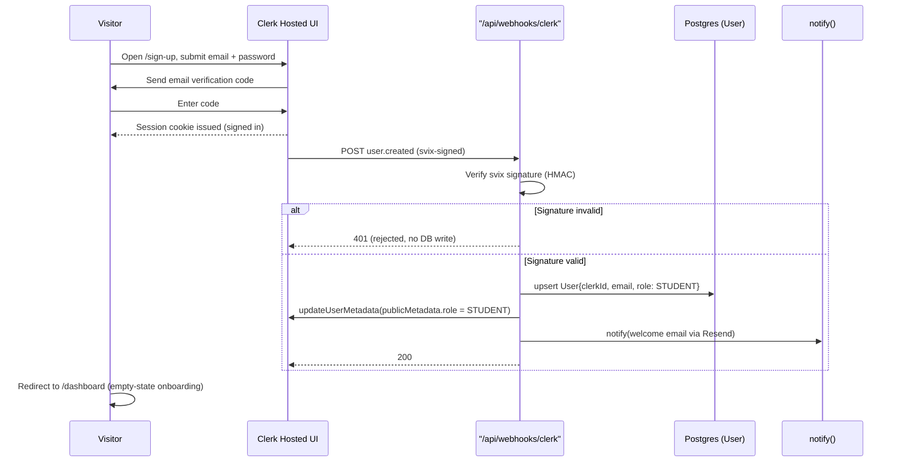

**Steps**
1. Visitor opens `/sign-up` (`app/sign-up/[[...sign-up]]/page.tsx`), a Clerk `<SignUp/>` component.
2. Submits email + password; Clerk sends and verifies an email code (email/password path).
3. Clerk issues a session cookie and fires the `user.created` webhook to `POST /api/webhooks/clerk`.
4. The handler verifies the `svix` signature, then upserts the `User`.
5. Handler calls Clerk `updateUserMetadata` to write `publicMetadata.role = STUDENT` into the JWT.
6. `notify()` sends the welcome email (TRD §25 email-worthy account event).
7. Middleware sees a valid session + `STUDENT` role and admits the user to `/dashboard`.

**Routes:** `/sign-up` → redirect `/dashboard`. **API:** `POST /api/webhooks/clerk`.
**RBAC:** None at sign-up (public). Webhook uses signature verification, not session (TRD §8, §14).
**DB writes:** `User` upsert (`clerkId` unique, `email` unique, `role=STUDENT` default per schema).

**Empty / error / edge branches**
- **Duplicate email (FR-03):** `email @unique` — Clerk blocks a second account on the same email at the UI; if a race slips through, the `upsert` on `clerkId` keeps one canonical row. One email = one Student account.
- **Webhook arrives before redirect completes:** The `/dashboard` RSC calls `getCurrentUser()` (TRD `lib/auth.ts`); if the `User` row isn't present yet (webhook lag), it performs a **just-in-time upsert** from the Clerk session claims, so the dashboard never renders against a missing user.
- **Signature invalid / replayed:** 401, no DB mutation (TRD §14).
- **Email never verified:** Clerk holds the account in an unverified state and does not issue a full session; no webhook `user.created` completes → no `User` row until verification.

## 3. Flow — Sign-in

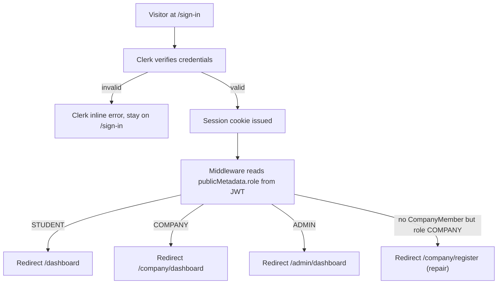

**Steps**
1. Visitor opens `/sign-in`; Clerk verifies email/password or OAuth.
2. On success, middleware reads `publicMetadata.role` off the verified JWT and route-routes by role.
3. A `COMPANY`-role user with no active `CompanyMember` (edge: membership revoked) is routed to a repair path.

**Routes:** `/sign-in` → role-based landing. **API:** none (Clerk-managed).
**RBAC:** Middleware Layer-1 role gate (TRD §8). No permission check yet — landing pages self-scope reads by `userId`.
**DB writes:** none.

**Edge branches**
- **Role claim stale** (role changed by Admin since last token refresh): middleware trusts the JWT for routing; the destination page re-checks against the DB via `getCurrentUser()` and, on mismatch, redirects to `/unauthorized` and forces a Clerk token refresh.
- **Suspended user** (`User.deletedAt != null`, §38): landing-page guard detects the soft-delete and signs the user out with a "account suspended" message.

## 4. Flow — OAuth (Google)

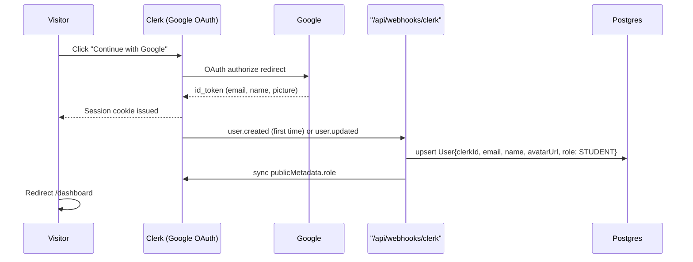

**Steps**
1. Visitor clicks "Continue with Google" on `/sign-up` or `/sign-in`.
2. Clerk runs the OAuth handshake; on return, issues a session.
3. First-time login → `user.created`; returning → `user.updated`. Either upserts the `User`, hydrating `name` and `avatarUrl` from the OAuth profile.

**RBAC:** none (public). **DB writes:** `User` upsert (same as §2).

**Edge branches**
- **OAuth email collides with an existing email/password account:** Clerk's account-linking policy governs; Verity's webhook keys on `clerkId`, so a linked identity resolves to the same `User` row. An unlinked collision surfaces Clerk's "account exists" UI.
- **OAuth denied / cancelled:** returns to `/sign-in` with no session and no webhook.

## 5. Flow — Clerk Webhook User Sync

This is the single reconciliation point between Clerk identity and the `User` table. It handles `user.created`, `user.updated`, and `user.deleted`.

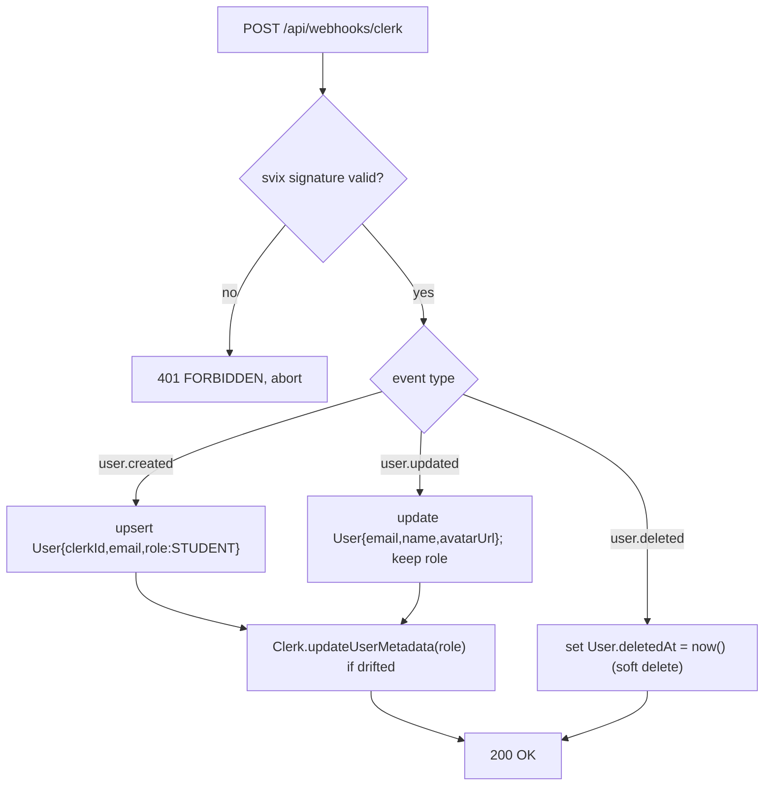

**Steps**
1. Verify `svix` HMAC signature (TRD §14) — reject unsigned/replayed payloads with 401.
2. Branch on event type:
   - `user.created` → upsert with `role: STUDENT` default.
   - `user.updated` → update mutable identity fields (`email`, `name`, `avatarUrl`); **do not** overwrite `role` from Clerk (DB is source of truth for role; Clerk claim is the mirror).
   - `user.deleted` → soft-delete (`deletedAt`), never hard-delete (TRD §10.1 soft-delete policy).
3. Re-sync `publicMetadata.role` back to Clerk only if the DB role and the claim have drifted.

**RBAC:** signature-based (no session). **DB writes:** `User` upsert/update/soft-delete.

**Edge branches**
- **Out-of-order delivery** (`user.updated` before `user.created`): the `upsert` semantics make both idempotent and order-independent.
- **Role authority direction:** role elevation (§6, §7) writes to the DB first, then pushes to Clerk — so `user.updated` echoes must not clobber a freshly elevated `COMPANY`/`ADMIN` role. Handler explicitly excludes `role` from the `user.updated` update set.

## 6. Flow — Role Elevation to COMPANY ("Register Your Company")

A `STUDENT` becomes a `COMPANY` by registering a company. Entity creation and role change are **one Prisma transaction** so we never have a `COMPANY`-role user with no `Company` (TRD §6).

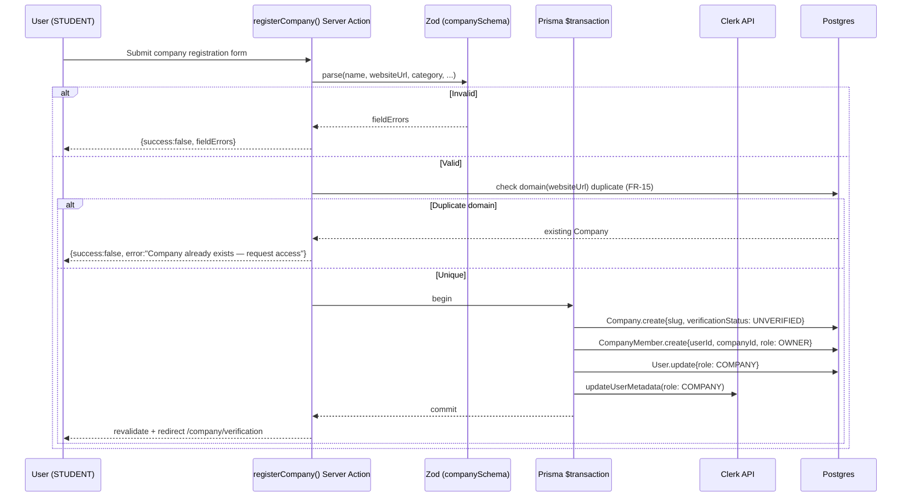

**Steps**
1. Student opens `/company/register` (accessible to any authenticated user).
2. Submits required company fields (name, website/domain, category, logo — FR-10).
3. `registerCompany()` validates via Zod, then normalizes the domain from `websiteUrl` and checks for a duplicate (FR-15).
4. On success, one transaction creates `Company` (`UNVERIFIED`), `CompanyMember(OWNER)`, sets `User.role = COMPANY`, and pushes the role to Clerk.
5. Redirect to `/company/verification` to complete required fields and submit (§21).

**Routes:** `/company/register` → `/company/verification`. **API:** `POST /api/companies` (or the `registerCompany` action).
**RBAC:** Any authenticated user may register (this is the elevation gate itself). Post-elevation, this user holds `COMPANY_OWNER` permissions.
**DB writes:** `Company` (insert), `CompanyMember` (insert, `OWNER`), `User.role` (update). Clerk metadata push.

**Edge branches**
- **Duplicate domain (FR-15, PRD §23 near-identical name):** hard-block with a "request access to the existing profile" CTA rather than creating a second `Company`. Near-identical *names* (not domains) are **not** blocked — they proceed but are flagged for Admin manual review at verification time (PRD §23).
- **Transaction partial failure:** the `$transaction` rolls back atomically — no orphan `COMPANY` role, no orphan `Company`.
- **Clerk metadata push fails after DB commit:** DB is source of truth; middleware falls back to a DB role check when the JWT claim is missing/stale, and a background reconcile re-pushes the claim. User is still correctly `COMPANY`.

## 7. Flow — Admin-Seeded / Promoted ADMIN

There is **no public Admin sign-up** (FR-05). Admins are seeded or promoted by an existing Admin.

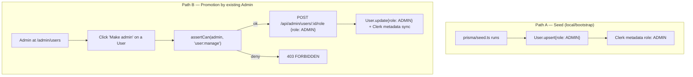

**Steps (Path B)**
1. An existing Admin opens `/admin/users`, finds the target user.
2. Clicks "Make admin"; `setUserRole()` runs `assertCan(actor, "user:manage")`.
3. On pass, updates `User.role = ADMIN` and syncs Clerk `publicMetadata.role`.

**Routes:** `/admin/users`. **API:** `POST /api/admin/users/:id/role`.
**RBAC:** `user:manage` (ADMIN only). Middleware `/admin/*` gate + Layer-2 `assertCan`.
**DB writes:** `User.role` update; Clerk metadata sync; append an audit `AnalyticsEvent{type:"role.changed"}` **[additive]**.

**Edge branches**
- **Self-demotion guard:** an Admin cannot demote the last remaining Admin (query guard: `count(role=ADMIN, deletedAt=null) > 1` before demotion).
- **Promoting a COMPANY user:** allowed; the `CompanyMember` rows remain but the user now also has platform `ADMIN` scope. (Rare; flagged in audit log.)

## 8. Flow — Password Reset

Fully Clerk-managed (FR-06); Verity holds no password material.

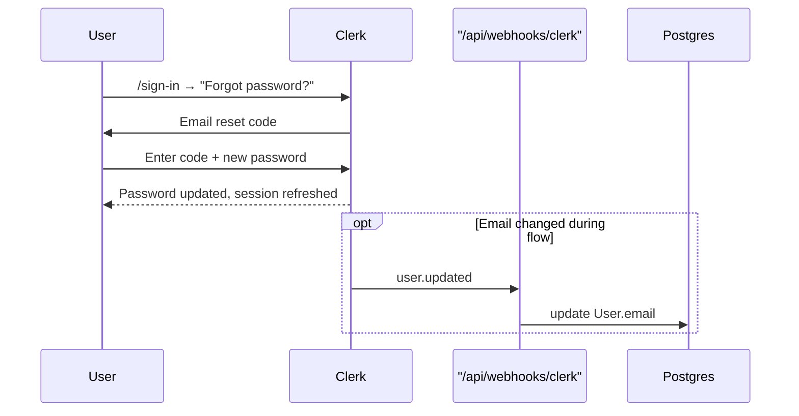

**Steps**
1. From `/sign-in`, user selects "Forgot password?"; Clerk emails a reset code.
2. User sets a new password; Clerk updates and re-issues the session.
3. Password change alone fires no domain event. If the user also changes their email, `user.updated` syncs `User.email` (§5).

**RBAC:** none (Clerk-managed, identity-owner scoped). **DB writes:** only on email change.

---

# PART B — STUDENT FLOWS

Student is the default role. All student mutations are scoped by the `STUDENT` permission set (`bookmark:*`, `application:*`, `profile:update:own`) and every read/write is Prisma-scoped to `userId` (Layer 3).

## 9. Flow — Student Onboarding / Profile Build

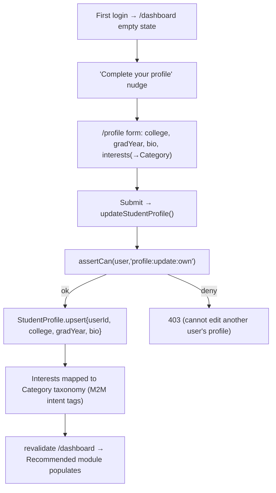

**Steps**
1. On first `/dashboard` load, an empty-state nudge invites profile completion.
2. `/profile` collects `college`, `gradYear`, `bio`, and areas of interest mapped to the `Category` taxonomy (PRD §14.1).
3. `updateStudentProfile()` upserts `StudentProfile` (1:1 with `User`).
4. Interests seed the rules-based "Recommended Companies" module (PRD §14.1) on the dashboard.

**Routes:** `/profile`. **API:** `updateStudentProfile()` Server Action.
**RBAC:** `profile:update:own`. Prisma `WHERE userId = ctx.userId`.
**DB writes:** `StudentProfile` upsert (`userId @unique`). `resumeUrl` remains a schema placeholder (upload UI deferred, PRD §21).

**Edge branches**
- **Interests map to no existing Category (PRD §23):** the profile still saves; the Recommended module falls back to Recently Added / Trending rather than rendering empty.
- **Skip onboarding:** profile is optional; dashboard renders with recommendations degraded to Trending/Recently Added. No hard block.

## 10. Flow — Search

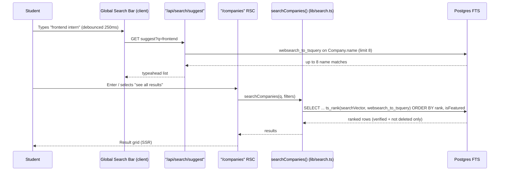

**Steps**
1. The persistent nav search bar debounces (250ms) and calls `GET /api/search/suggest` for up to 8 company-name matches (PRD §16 typeahead).
2. On submit, `/companies` server-renders results via `searchCompanies()` using `websearch_to_tsquery` (TRD §12), enabling quoted phrases and `-exclude` operators for free.
3. Ranking: `ts_rank` on the weighted `searchVector` (name=A, tagline=B, about=C — TRD §10.4), tie-broken by `isFeatured DESC`.
4. Only `VERIFIED`, non-soft-deleted companies appear to students (FR-12, FR-22).

**Routes:** `/companies` (marketing). **API:** `GET /api/search` / `GET /api/companies`, `GET /api/search/suggest`.
**RBAC:** public + rate-limited (60 req/min/IP, TRD §9.4). Student session optional; results identical.
**DB writes:** none for the search itself; a `search_query` `AnalyticsEvent` **[additive]** is logged for the top-search-terms KPI (PRD §19.2, FR-33).

**Edge / empty branches**
- **Zero results (PRD §16):** never a dead end — render "Browse by category instead" plus a "Suggest a company" affordance that writes a `CompanySuggestion` **[additive]** row for Admin outreach follow-up. A `search_zero_result` `AnalyticsEvent` feeds the Search Zero-Result Rate KPI (PRD §24).
- **Query latency:** p95 target < 300ms at ≤10k companies via GIN index (TRD §12).

## 11. Flow — Filter

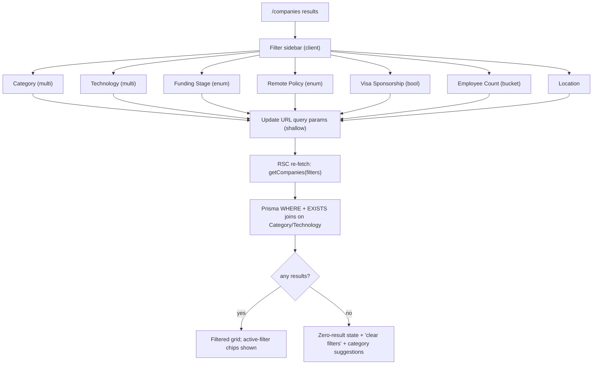

**Steps**
1. Filters are URL-encoded query params (`?category=&technology=&fundingStage=&remotePolicy=&visaSponsorship=&page=`) so results are shareable/back-button-safe (TRD §9.2).
2. Each change re-runs the server query. Category/Technology filters compile to `EXISTS` subqueries against `CompanyCategory` / `CompanyTechnology` join tables.
3. Sort defaults: **Relevance** when a query is present, **Recently Added** when only filters are applied (PRD §16).

**Routes:** `/companies?…`. **API:** `GET /api/companies` with the query-param contract (TRD §9.2).
**RBAC:** public, rate-limited. **DB writes:** none (aside from analytics).

**Edge branches**
- **Over-constrained filters → zero results:** same non-dead-end treatment as §10, plus a "clear filters" reset.
- **Funding stage enum mismatch:** unknown enum values are rejected by Zod at the API boundary (400 `VALIDATION_ERROR`) rather than silently ignored.

## 12. Flow — Browse Categories

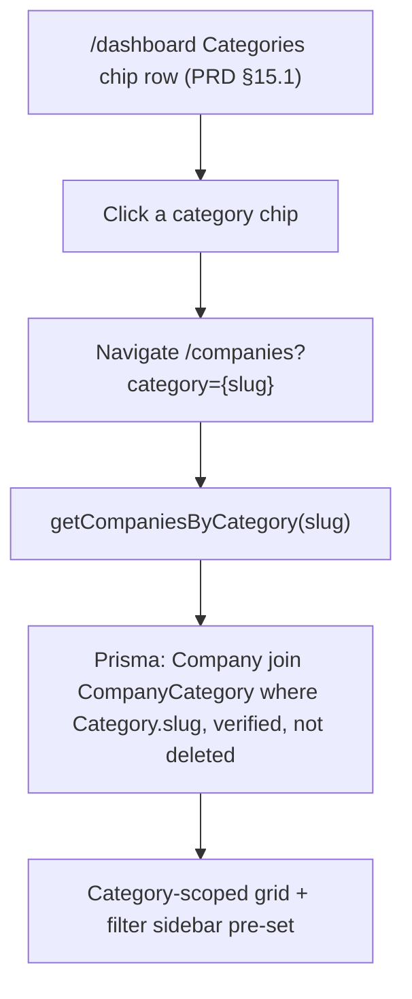

**Steps**
1. The Student Dashboard renders a horizontal scroll of category chips (PRD §15.1 module 2).
2. Selecting a chip deep-links into `/companies` with the category pre-applied as a filter.
3. The results page is the same surface as Search/Filter, just pre-seeded.

**Routes:** `/dashboard` → `/companies?category=`. **API:** `GET /api/companies?category=`.
**RBAC:** public. **DB writes:** none.

**Edge branches**
- **Empty category** (no verified companies yet): renders the zero-result affordance (browse other categories / suggest a company), never an empty grid.

## 13. Flow — View Company Profile

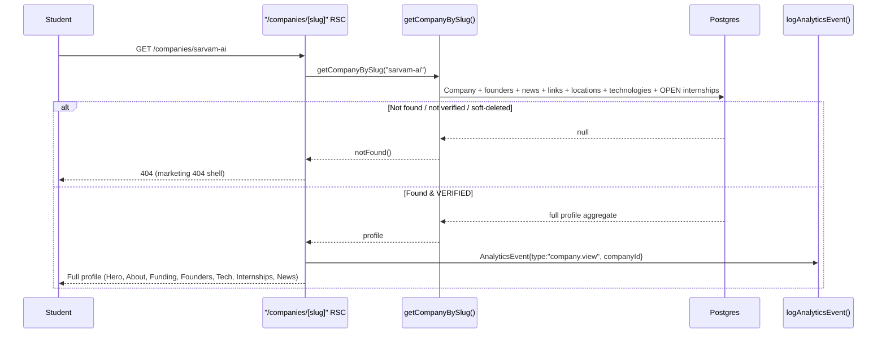

**Steps**
1. Server component fetches the full profile aggregate by slug, including the live list of `PUBLISHED` internships (PRD §17 Internships module).
2. A `company.view` `AnalyticsEvent` is written (feeds the company's Profile Views metric, PRD §19.1). Writes are fire-and-forget so they never block render.
3. Primary CTAs render: **Bookmark** (if authenticated), **View Open Internships** (anchor-scroll), **Report** (§37).

**Routes:** `/companies/[slug]` (marketing, public + crawlable). **API:** `GET /api/companies/:slug`.
**RBAC:** public read. Bookmark/Report CTAs conditionally shown for authenticated students.
**DB writes:** `AnalyticsEvent{company.view}` **[additive]**.

**Edge branches**
- **Company not VERIFIED or soft-deleted:** `notFound()` → 404. Unverified companies are invisible to students (FR-12).
- **Company suspended after being verified (§33):** `deletedAt`/status guard → 404 with no stale cache (profile pages are tag-revalidated on any status change, TRD §13).
- **View-count privacy (PRD §13.6):** the event records `companyId` and an anonymized/aggregate actor; companies never see *which* student viewed.

## 14. Flow — View Internship

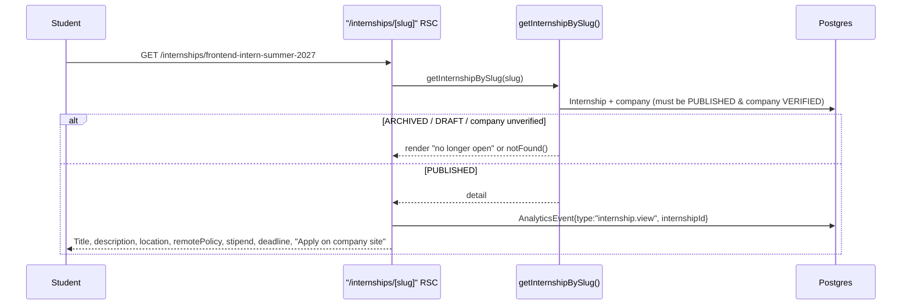

**Steps**
1. Fetch internship by slug; require `status = PUBLISHED` and parent company `VERIFIED`.
2. Log `internship.view` `AnalyticsEvent` (per-internship view counts, PRD §19.1, FR-70).
3. Render the external **"Apply on [Company]'s site"** CTA deep-linking `applyUrl` (FR-25 — no in-app application form in V1). Secondary CTAs: **Bookmark**, **Add to Tracker**.
4. Deadline within 7 days triggers an "Apply soon" UI treatment (PRD §18).

**Routes:** `/internships/[slug]`. **API:** `GET /api/internships/:id`.
**RBAC:** public read. **DB writes:** `AnalyticsEvent{internship.view}` **[additive]**.

**Edge branches**
- **Internship archived while student is viewing / arriving from a stale bookmark (PRD §23):** render an explicit "This internship is no longer open" state (not a broken link or silent 404), preserving any bookmark/tracker link back (see §16, §17).
- **Apply CTA:** clicking it does **not** create an `Application` — it redirects off-platform; the student must manually add it to the tracker (§17). This matches the "no automation" constraint.

## 15. Flow — Bookmark a Company

```mermaid
sequenceDiagram
    participant U as Student
    participant Btn as Bookmark Button (client)
    participant SA as toggleBookmark() Server Action
    participant RBAC as assertCan
    participant DB as Postgres

    U->>Btn: Click bookmark on /companies/[slug]
    Btn->>SA: toggleBookmark{targetType: COMPANY, companyId}
    SA->>RBAC: assertCan(user, "bookmark:create")
    RBAC-->>SA: ok
    SA->>DB: find Bookmark{userId, companyId}
    alt Exists
        SA->>DB: delete Bookmark (unbookmark)
    else Not exists
        SA->>DB: create Bookmark{userId, targetType: COMPANY, companyId}
    end
    SA-->>Btn: revalidate; optimistic toggle confirmed
```

**Steps**
1. Authenticated student toggles the bookmark on a company profile.
2. `toggleBookmark()` checks `bookmark:create` (create) / `bookmark:delete` (remove) and flips the row.
3. Optimistic UI updates immediately; server confirms via `revalidatePath`.

**Routes:** `/companies/[slug]` (action), surfaced in `/bookmarks` (Companies tab).
**API:** `POST /api/bookmarks` `{targetType:"COMPANY", targetId}` / `DELETE /api/bookmarks/:id`.
**RBAC:** `bookmark:create` / `bookmark:delete`. Prisma `WHERE userId = ctx.userId`.
**DB writes:** `Bookmark` insert/delete. Unique constraint `@@unique([userId, companyId, internshipId])` prevents duplicates.

**Edge branches**
- **Unauthenticated click:** button routes to `/sign-in` with a return URL (bookmarking requires a session).
- **Double-click / race:** the unique constraint + toggle read makes repeated toggles idempotent to a single row.
- **Bookmark drives Trending:** bookmark velocity over a rolling 7-day window feeds the Trending module (PRD §15.1) via `TrendingSnapshot` **[additive]**.

## 16. Flow — Bookmark an Internship

Structurally identical to §15 with `targetType = INTERNSHIP`.

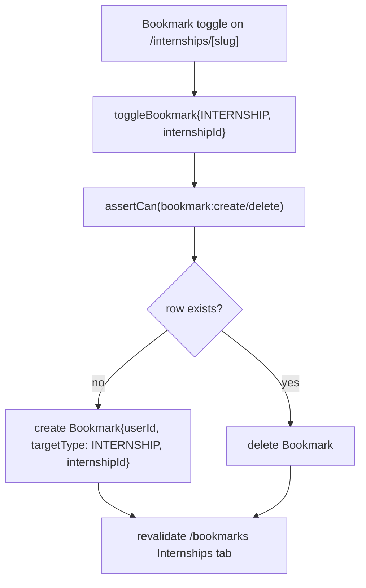

**RBAC / DB:** same as §15, keyed on `internshipId`.

**Edge branches (PRD §23)**
- **Internship later archived:** the `Bookmark` row **persists** (student data is theirs to keep, PRD §13.6). The `/bookmarks` Internships tab and the detail page render a "no longer open" badge instead of breaking the link.
- **Notification tie-in:** if the bookmarked *company* later publishes a new internship, the student receives a batched daily digest (FR-61, §42).

## 17. Flow — Add to Application Tracker

```mermaid
sequenceDiagram
    participant U as Student
    participant SA as addApplication() Server Action
    participant RBAC as assertCan
    participant DB as Postgres

    U->>SA: "Add to Tracker" on /internships/[slug]
    SA->>RBAC: assertCan(user, "application:create")
    RBAC-->>SA: ok
    SA->>DB: upsert Application{userId, internshipId, status: SAVED}
    alt Already tracked (unique userId+internshipId)
        DB-->>SA: existing row
        SA-->>U: "Already in your tracker" (no dup)
    else New
        DB-->>SA: new Application
        SA-->>U: revalidate /applications; toast "Added to Saved"
    end
```

**Steps**
1. Student clicks "Add to Tracker"; `addApplication()` creates an `Application` in the `SAVED` column (PRD §14.1 Kanban start state).
2. `@@unique([userId, internshipId])` guarantees one tracker entry per internship per student.

**Routes:** `/internships/[slug]` → visible in `/applications`. **API:** `POST /api/applications`.
**RBAC:** `application:create`. Prisma scoped to `userId`.
**DB writes:** `Application` insert (`status = SAVED` default). Private to the student (FR-44, PRD §13.6) — never visible to Company or Admin.

**Edge branches**
- **Add-from-"Apply":** clicking the external Apply CTA can pre-offer "Mark as Applied?" — but the student explicitly confirms; the tracker is a manual log (TRD §10.3).
- **Internship archived:** an existing `Application` persists and displays the "no longer open" badge; the student can still advance its status (they may have applied before archival).

## 18. Flow — Update Tracker Status (Kanban)

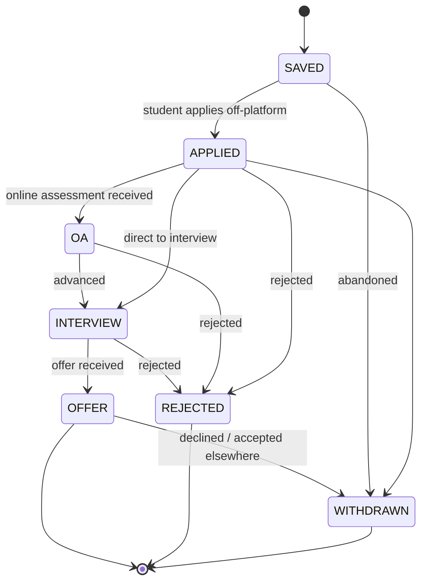

```mermaid
sequenceDiagram
    participant U as Student
    participant K as Kanban Board (client, drag)
    participant SA as updateApplicationStatus()
    participant RBAC as assertCan
    participant DB as Postgres

    U->>K: Drag card SAVED → APPLIED (or list-view select)
    K->>SA: {applicationId, status: APPLIED, notes?}
    SA->>RBAC: assertCan(user, "application:update:own", applicationId)
    RBAC->>DB: load Application, assert userId == ctx.userId
    alt Not owner
        RBAC-->>SA: ForbiddenError
        SA-->>K: revert card; toast "Forbidden"
    else Owner
        SA->>DB: update Application{status, appliedAt if →APPLIED, notes}
        DB-->>SA: updated
        SA-->>K: confirm; revalidate /applications
    end
```

**Steps**
1. Student drags a card between columns (or uses the accessible list-view toggle, PRD §14.1).
2. `updateApplicationStatus()` asserts `application:update:own` — the guard loads the row and confirms `Application.userId == ctx.userId` (Layer 2 + Layer 3).
3. Transition side effects: moving to `APPLIED` stamps `appliedAt`; per-entry private `notes` can be edited inline.

**Routes:** `/applications`. **API:** `PATCH /api/applications/:id`.
**RBAC:** `application:update:own`. Prisma `WHERE id = :id AND userId = ctx.userId`.
**DB writes:** `Application.status`, `Application.notes`, `Application.appliedAt`.

**Edge branches**
- **Direct-URL/API tamper on another student's application:** Layer-3 `WHERE userId` returns zero rows affected → the mutation no-ops and the API returns 404 (not 403, to avoid leaking existence).
- **Invalid transition:** all transitions are permitted in V1 (a manual tracker — students may correct mistakes); the enum is validated but the graph above is advisory, not enforced. Notes and status are free to edit.
- **Withdrawn/Rejected cards:** remain on the board (terminal columns) until the student removes the entry.

## 19. Flow — Recent Activity

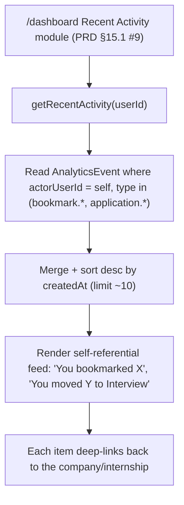

**Steps**
1. The dashboard Recent Activity module reads the student's own activity events (bookmarks created, tracker status changes) and renders a **self-referential, non-social** feed (PRD §15.1).
2. Items deep-link back to the relevant company/internship.

**Routes:** `/dashboard`. **API:** `getRecentActivity()` query.
**RBAC:** implicit `self` scope (reads only `actorUserId = ctx.userId`). No cross-user visibility (PRD §13.6).
**DB writes:** none (read-only projection of `AnalyticsEvent` **[additive]** / `Bookmark` / `Application`).

**Edge branches**
- **No activity yet:** module renders an empty-state prompting a first search/bookmark, never a blank card.

---

# PART C — COMPANY FLOWS

Company members hold platform role `COMPANY` plus a `CompanyMember.role` of `OWNER` or `RECRUITER`. Per the permission matrix (TRD §7.3): **profile edit, team management, news, and verification submission are OWNER-only**; **internship create/update/archive and analytics are available to both OWNER and RECRUITER**. Every company mutation is Prisma-scoped by `companyId` derived from the acting user's `CompanyMember` (Layer 3).

## 20. Flow — Create Company Account

See **§6 (Role Elevation to COMPANY)** — company account creation *is* the elevation flow. The onboarding is a multi-step guided form (PRD §14.2):

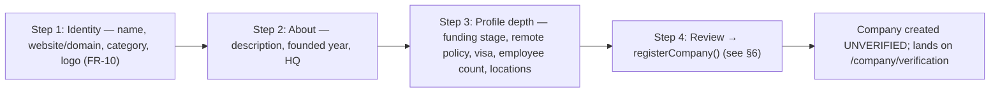

Autosave with a "last saved" indicator persists the in-progress `Company` as a Draft (all fields optional until submit); required `(Req.)` fields (PRD §17) gate the "Submit for Verification" action (§21).

## 21. Flow — Complete Verification Submission

```mermaid
sequenceDiagram
    participant O as Owner
    participant Page as "/company/verification"
    participant SA as submitForVerification()
    participant Zod as Zod (required-fields schema)
    participant RBAC as assertCan
    participant DB as Postgres
    participant N as notify()

    O->>Page: Fills all (Req.) fields, clicks "Submit for Verification"
    Page->>SA: submitForVerification(companyId)
    SA->>RBAC: assertCan(user, "company:update:own", companyId) + require OWNER
    RBAC-->>SA: ok
    SA->>Zod: assert all (Req.) fields present (server re-validation, NFR 13.4)
    alt Missing required fields
        Zod-->>SA: fieldErrors
        SA-->>Page: {success:false, fieldErrors} (button was client-gated too)
    else Complete
        SA->>DB: check duplicate domain + near-name collision → flag for Admin
        SA->>DB: Company.update{verificationStatus: PENDING, verificationSubmittedAt: now()}
        SA->>DB: VerificationReview.create{companyId, decision: null, cycle: n}
        SA->>N: notify Admins "new company pending"
        SA-->>Page: banner → "Pending Verification"
    end
```

**Steps**
1. Owner completes all `(Req.)` fields (PRD §17) on `/company/verification` and submits.
2. `submitForVerification()` requires `OWNER` (`company:update:own`), re-validates required fields **server-side** (the gate; client-side is UX only, NFR 13.4), and checks duplicate domain / near-identical name.
3. Transition `UNVERIFIED → PENDING`, stamp `verificationSubmittedAt` **[additive]**, open a `VerificationReview` cycle **[additive]**.
4. Notify Admins of a new queue item.

**Routes:** `/company/verification`. **API:** `submitForVerification()` action.
**RBAC:** `company:update:own` + `CompanyMember.role == OWNER`. Prisma `WHERE id = companyId AND EXISTS(member OWNER)`.
**DB writes:** `Company.verificationStatus → PENDING`, `verificationSubmittedAt`, `VerificationReview` insert.

**Edge branches (PRD §23)**
- **Near-identical name collision:** does not block — sets an Admin `reviewFlag` so the queue shows a manual-review warning.
- **Submitting user deactivated before Admin review:** the `Company` persists in `PENDING`; Admin can still review/approve; the profile becomes claimable by another verified team member via invite once approved.
- **RECRUITER attempts submit:** `assertCan` denies (submission is OWNER-only) → 403.

## 22. Flow — Edit Company Profile

```mermaid
sequenceDiagram
    participant O as Owner
    participant Ed as Profile Editor (autosave)
    participant SA as updateCompany()
    participant RBAC as assertCan
    participant DB as Postgres

    O->>Ed: Edits About / Funding / Tech / Founders / Links
    Ed->>SA: updateCompany(companyId, patch) [autosave / explicit "Publish changes"]
    SA->>RBAC: assertCan(user, "company:update:own", companyId) + OWNER
    RBAC-->>SA: ok
    SA->>DB: Company.update(patch) + related rows (Founder/Link/Location/Tech)
    alt Re-verification-sensitive field changed (domain)
        SA->>DB: Company.verificationStatus → PENDING (re-queue, PRD §23)
        SA->>DB: VerificationReview.create{cycle: n+1}
    else Non-sensitive field
        SA->>DB: revalidateTag('company:{slug}') (fresh public page)
    end
    SA-->>Ed: "last saved" indicator updates
```

**Steps**
1. The editor mirrors the public profile structure (Hero, About, Products, Funding, Hiring Timeline, Tech Stack, Founders/Team, Links — PRD §14.2). Autosave writes patches with a visible "last saved" state.
2. `updateCompany()` requires `OWNER`. Verified companies can edit freely **without** re-verification (FR-13) — **except** re-verification-sensitive fields.
3. Editing the registered **domain** reverts `VERIFIED → PENDING` and re-queues (PRD §23, §14.2).
4. Any change fires `revalidateTag('company:{slug}')` so the cached public page refreshes (TRD §13).

**Routes:** `/company/dashboard` editor / deep-links per section. **API:** `PATCH /api/companies/:id`.
**RBAC:** `company:update:own` + `OWNER`. Prisma `WHERE id = companyId`.
**DB writes:** `Company` + child rows; conditionally `verificationStatus`, `VerificationReview`.

**Edge branches**
- **RECRUITER edits profile:** denied (matrix: recruiters have no `company:update:own`) → 403; the editor UI is hidden for recruiters but the server is the real gate.
- **Slug change:** slugs are immutable-by-default (TRD §10.1); changing a slug is an Admin-gated action, not part of normal editing (would break inbound links).
- **Concurrent edits by two OWNERs:** last-write-wins per field via autosave patches; `updatedAt` surfaces recency.

## 23. Flow — Publish Internship (Verified-Gating)

```mermaid
sequenceDiagram
    participant M as Company Member (OWNER or RECRUITER)
    participant Form as "/company/internships/new"
    participant SA as createInternship() → publishInternship()
    participant RBAC as assertCan
    participant DB as Postgres

    M->>Form: Fill title, description, category, location, remotePolicy, applyUrl
    Form->>SA: createInternship(companyId, data)
    SA->>RBAC: assertCan(user, "internship:create", companyId)
    RBAC-->>SA: ok
    SA->>DB: Internship.create{status: DRAFT, slug}
    M->>Form: Click "Publish"
    Form->>SA: publishInternship(internshipId)
    SA->>RBAC: assertCan(user, "internship:update:own", internshipId)
    SA->>DB: load parent Company.verificationStatus
    alt Company NOT VERIFIED (FR-22)
        SA-->>Form: {error:"Company must be verified to publish"} (stays DRAFT)
    else Company VERIFIED
        SA->>DB: Internship.update{status: PUBLISHED, publishedAt: now()}
        SA->>DB: enqueue notify → students bookmarking this company (FR-61 digest)
        SA-->>Form: redirect /company/internships (Open)
    end
```

**Steps**
1. Any company member (OWNER or RECRUITER) creates an internship — it starts as `DRAFT` (TRD §9.2, FR-21).
2. Publishing runs the **verified-gate**: `publishInternship()` loads the parent company and refuses `DRAFT → PUBLISHED` unless `Company.verificationStatus == VERIFIED` (FR-22) — enforced server-side.
3. On publish, stamp `publishedAt` and enqueue the "bookmarked company posted a new internship" digest notification (FR-61).

**Routes:** `/company/internships/new`, `/company/internships/[id]/edit`. **API:** `POST /api/internships`, `POST /api/internships/:id/publish`.
**RBAC:** `internship:create`, `internship:update:own` (OWNER **or** RECRUITER). Prisma `WHERE companyId = ctx.companyId`.
**DB writes:** `Internship` insert (`DRAFT`) → update (`PUBLISHED`, `publishedAt`). Regenerates `searchVector` (generated column) so it's searchable immediately (TRD §12).

**Edge branches (PRD §23 / §18)**
- **Unverified publish attempt:** blocked at the server gate; the listing stays `DRAFT` with a "verify your company to publish" banner.
- **Staleness (FR-24, PRD §18):** an `Open` (PUBLISHED) internship untouched 45+ days is flagged in the Company Dashboard ("Still open?"); if unaddressed a further 15 days, it surfaces in the Admin staleness report — **never auto-closed**.
- **RECRUITER publishes:** allowed (matrix grants recruiters `internship:*`).

## 24. Flow — Manage / Archive Internships

```mermaid
stateDiagram-v2
    [*] --> DRAFT : create
    DRAFT --> PUBLISHED : publish (requires Company VERIFIED)
    DRAFT --> ARCHIVED : discard draft
    PUBLISHED --> ARCHIVED : archive / close
    ARCHIVED --> PUBLISHED : re-open (requires still VERIFIED)
    ARCHIVED --> [*] : soft-delete (deletedAt) via moderation
```

```mermaid
flowchart TD
    A["/company/internships table (Draft/Open/Closed)"] --> B["Row action: Archive"]
    B --> C["archiveInternship(id)"]
    C --> D["assertCan(internship:archive:own, id)"]
    D -->|ok| E["Internship.update{status: ARCHIVED, closedAt}"]
    E --> F["Removed from student search/browse; retained for analytics (FR-23)"]
    E --> G["revalidate company public page (internship drops off list)"]
    D -->|deny| Z["403"]
```

**Steps**
1. The Internship Manager lists all internships grouped by status with inline toggles (PRD §14.2).
2. `archiveInternship()` transitions `PUBLISHED → ARCHIVED`, stamping a close timestamp. Archived listings vanish from student-facing search/browse but are **retained for analytics** (FR-23).
3. Re-opening `ARCHIVED → PUBLISHED` re-runs the verified-gate.

**Routes:** `/company/internships`. **API:** `POST /api/internships/:id/archive`.
**RBAC:** `internship:archive:own` (OWNER or RECRUITER). Prisma `WHERE companyId = ctx.companyId`.
**DB writes:** `Internship.status → ARCHIVED`, close timestamp.

**Edge branches (PRD §23)**
- **Students with a bookmark/tracker entry:** those rows persist; their views show "no longer open" (§16, §17).
- **Archive vs delete:** company archive is a status change (reversible); Admin moderation uses `deletedAt` (soft delete, §33).

## 25. Flow — Publish Company News

```mermaid
sequenceDiagram
    participant O as Owner
    participant CMS as "/company/news" (lightweight CMS)
    participant SA as createCompanyNews()
    participant RBAC as assertCan
    participant DB as Postgres

    O->>CMS: Title + body + optional link, click Publish
    CMS->>SA: createCompanyNews(companyId, data)
    SA->>RBAC: assertCan(user, "company:update:own", companyId) + OWNER
    RBAC-->>SA: ok
    SA->>DB: CompanyNews.create{title, url?, publishedAt: now()}
    SA->>DB: revalidateTag('company:{slug}')
    SA-->>CMS: appears in "Recent News" (reverse-chron, last 10 shown)
```

**Steps**
1. Owner posts a short update (title, body, optional link) via the News Manager (PRD §14.2).
2. `createCompanyNews()` inserts a `CompanyNews` row with `publishedAt`.
3. The public profile's Recent News module shows the latest posts (reverse-chronological, soft cap ~10, PRD §17).

**Routes:** `/company/news`. **API:** `createCompanyNews()` action.
**RBAC:** modeled under `company:update:own` (OWNER-only — news is company content; recruiters are internship-scoped). **[consistency note: no dedicated news permission exists in TRD §7.3; grouped under `company:update:own`.]**
**DB writes:** `CompanyNews` insert/update/delete.

**Edge branches**
- **XSS in body:** all user-submitted content is sanitized before render (NFR 13.4).
- **RECRUITER attempts to post news:** denied → 403 (news is grouped under profile editing).

## 26. Flow — Invite Team Member + Accept Invite

```mermaid
sequenceDiagram
    participant O as Owner
    participant SA as inviteTeamMember()
    participant DB as Postgres
    participant N as notify()/Resend
    participant I as Invitee
    participant SA2 as acceptInvite()

    O->>SA: inviteTeamMember(companyId, email, role: RECRUITER)
    SA->>SA: assertCan(user, "company:team:manage", companyId) + OWNER
    SA->>DB: TeamInvite.create{companyId, email, role, token, status: PENDING, expiresAt}
    SA->>N: Email invite link (token) via Resend
    I->>I: Clicks invite link (must sign in / sign up first)
    I->>SA2: acceptInvite(token)
    SA2->>DB: validate token (unexpired, PENDING, email match)
    alt Invalid/expired
        SA2-->>I: "Invite expired or invalid"
    else Valid
        SA2->>DB: $transaction: CompanyMember.create{userId, companyId, role}; TeamInvite.status = ACCEPTED; User.role = COMPANY (if STUDENT)
        SA2->>N: notify Owner "invite accepted" (FR-62)
        SA2-->>I: redirect /company/dashboard
    end
```

**Steps**
1. Owner invites by email and assigns a role (`OWNER` or `RECRUITER`; TRD §7.2). `inviteTeamMember()` requires `company:team:manage` (OWNER-only) and creates a tokenized `TeamInvite` **[additive]**.
2. Resend emails the invite link.
3. The invitee signs in/up (Clerk), then `acceptInvite()` validates the token and, in one transaction, creates the `CompanyMember`, marks the invite accepted, and elevates the invitee's `User.role` to `COMPANY` if they were a Student.
4. Owner is notified on acceptance (FR-62, §42).

**Routes:** `/company/team`, invite-accept landing (e.g. `/company/invite/[token]`). **API:** `inviteTeamMember()` / `acceptInvite()` actions.
**RBAC:** `company:team:manage` (OWNER) to invite; token possession + email match to accept. Prisma `WHERE companyId = ctx.companyId`.
**DB writes:** `TeamInvite` insert → `CompanyMember` insert + `TeamInvite.status` + possibly `User.role`.

**Edge branches**
- **Invite email ≠ signed-in email:** rejected (token is email-bound) to prevent invite hijacking.
- **Already a member:** `@@unique([companyId, userId])` on `CompanyMember` prevents duplicates; accept no-ops with "already on this team."
- **Expired token:** owner can re-send; expired invites cannot be accepted.
- **RECRUITER tries to invite:** denied (team management is OWNER-only) → 403.

## 27. Flow — Transfer Ownership

```mermaid
sequenceDiagram
    participant O as Current Owner
    participant SA as transferOwnership()
    participant RBAC as assertCan
    participant DB as Postgres

    O->>SA: transferOwnership(companyId, targetMemberId) + confirmation
    SA->>RBAC: assertCan(user, "company:team:manage", companyId) + require caller is OWNER
    RBAC-->>SA: ok
    SA->>DB: $transaction
    DB->>DB: CompanyMember(target).role = OWNER
    DB->>DB: CompanyMember(caller).role = RECRUITER
    DB-->>SA: commit
    SA->>DB: notify both parties
    SA-->>O: "Ownership transferred" (caller now RECRUITER)
```

**Steps**
1. Owner selects a target member and confirms (Owner-only, requires confirmation — PRD §14.2).
2. `transferOwnership()` runs a transaction: promote target to `OWNER`, demote caller to `RECRUITER`.

**Routes:** `/company/team`. **API:** `transferOwnership()` action.
**RBAC:** `company:team:manage` + caller must be `OWNER`. Prisma scoped `companyId`.
**DB writes:** two `CompanyMember.role` updates (atomic).

**Edge branches**
- **Target must be an existing active member** (cannot transfer to a non-member; invite first).
- **Single-owner invariant:** the transaction guarantees exactly one `OWNER` at commit (promote + demote together); a crash mid-way rolls back, never leaving zero or two owners.
- **Sole member cannot transfer to themselves:** no-op guard.

## 28. Flow — View Analytics

```mermaid
flowchart TD
    A["/company/analytics"] --> B["getCompanyAnalytics(companyId)"]
    B --> C["assertCan(analytics:view:own, companyId) — OWNER or RECRUITER"]
    C -->|ok| D["Aggregate AnalyticsEvent: profile views (30/90d trend)"]
    C --> E["Bookmark count (COUNT Bookmark where companyId)"]
    C --> F["Per-internship view counts"]
    C --> G["Profile completeness score (% of fields filled)"]
    D & E & F & G --> H["Render aggregate, anonymized cards (PRD §13.6)"]
    C -->|deny| Z["403"]
```

**Steps**
1. `getCompanyAnalytics()` aggregates profile views (trend over 30/90 days), bookmark count, per-internship views, and the profile completeness score (PRD §19.1).
2. All metrics are **aggregate and anonymized** — companies see "142 profile views," never which students (PRD §13.6, NFR).

**Routes:** `/company/analytics`. **API:** `getCompanyAnalytics()` query.
**RBAC:** `analytics:view:own` (OWNER **and** RECRUITER). Prisma `WHERE companyId = ctx.companyId`.
**DB writes:** none (read-only aggregation over `AnalyticsEvent` **[additive]** + `Bookmark`).

**Edge branches**
- **No data yet (new company):** cards render zero-states, not errors.
- **Application Tracker data excluded:** never aggregated into company analytics (FR-44, PRD §13.6) — companies have zero visibility into who applied.

## 29. Flow — Read Verification Status / Changes-Requested

```mermaid
flowchart TD
    A["/company/verification banner (persistent when not VERIFIED)"] --> B["getVerificationState(companyId)"]
    B --> C{"verificationStatus"}
    C -->|UNVERIFIED + no submission| D["Draft: 'Complete required fields to submit'"]
    C -->|UNVERIFIED + changesRequestedReason set| E["'Changes Requested' banner + fix-checklist + Resubmit CTA"]
    C -->|PENDING| F["'Pending review' + estimated time"]
    C -->|VERIFIED| G["Verified badge; banner hidden"]
    C -->|REJECTED + rejectionReason| H["'Rejected: <reason>' + Resubmit CTA (§31)"]
```

**Steps**
1. The persistent status banner (PRD §14.2) reflects the `Company.verificationStatus`.
2. **"Changes Requested" is derived state:** `verificationStatus == UNVERIFIED` **AND** `changesRequestedReason != null` **AND** `verificationSubmittedAt != null` (previously submitted). The banner shows the Admin's reason and a "what to fix" checklist (PRD §14.2).
3. `REJECTED` shows the rejection reason with a resubmit path (§31).

**Routes:** `/company/verification`, and a banner on `/company/dashboard`. **API:** `getVerificationState()` query.
**RBAC:** `company:update:own` scope to read own status (any member can read; only OWNER acts). Prisma `WHERE companyId = ctx.companyId`.
**DB writes:** none.

**Edge branches**
- **Domain re-verification (§22):** while a verified company sits back in `PENDING` after a domain change, the banner explains the internship-publishing gate remains satisfied for already-published listings but new publishes wait for re-approval (business rule: existing `PUBLISHED` internships are not retro-hidden; new publishes gated).

---

# PART D — ADMIN FLOWS

Admins hold platform role `ADMIN` and the full permission set (`user:manage`, `company:verify`, `company:moderate`, `internship:moderate`, `category:manage`, `technology:manage`, `featured:manage`, `report:handle`, `analytics:view:all`). Every admin route is gated by the `/admin/*` middleware role check plus a Layer-2 `assertCan`.

## 30. Flow — Verification Queue Triage → Approve / Request-Changes / Reject

```mermaid
sequenceDiagram
    participant A as Admin
    participant Q as "/admin/verification-queue"
    participant SA as approveCompany()/requestChanges()/rejectCompany()
    participant DB as Postgres
    participant N as notify()/Resend

    A->>Q: Open queue (PENDING, oldest-first)
    Q->>DB: list Company where status=PENDING (+ manual-review flags)
    A->>Q: Open review panel — fields side-by-side, quick links (domain, LinkedIn)
    alt Approve
        A->>SA: approveCompany(companyId)
        SA->>DB: assertCan("company:verify")
        SA->>DB: Company.update{status: VERIFIED, lastVerifiedAt: now()}
        SA->>DB: VerificationReview.update{decision: APPROVED, reviewedById}
        SA->>N: notify Owner+members "Verified" (in-app + email, FR-60)
    else Request Changes (reason required)
        A->>SA: requestChanges(companyId, reason)
        SA->>DB: Company.update{status: UNVERIFIED, changesRequestedReason: reason}
        SA->>DB: VerificationReview.update{decision: CHANGES_REQUESTED, reason}
        SA->>N: notify Owner+members "Changes requested: <reason>"
    else Reject (reason required)
        A->>SA: rejectCompany(companyId, reason)
        SA->>DB: Company.update{status: REJECTED, rejectionReason: reason}
        SA->>DB: VerificationReview.update{decision: REJECTED, reason}
        SA->>N: notify Owner+members "Rejected: <reason>"
    end
```

**Steps**
1. Admin opens `/admin/verification-queue` (PENDING companies, sorted oldest-first, count badge on dashboard — PRD §15.3).
2. The review panel shows all submitted fields with quick-access external links (company domain, LinkedIn) opened in new tabs for manual cross-check (PRD §14.3, FR-50).
3. Admin chooses one of three outcomes (FR-51):
   - **Approve:** `VERIFIED` + `lastVerifiedAt`; company becomes student-visible.
   - **Request Changes** (reason required): back to `UNVERIFIED` with `changesRequestedReason` (the derived "Changes Requested" state, §29).
   - **Reject** (reason required): `REJECTED` with `rejectionReason`.
4. Every decision closes the current `VerificationReview` cycle and fires notifications (FR-60).

**Routes:** `/admin/verification-queue`. **API:** `POST /api/companies/:id/verify` (approve), `requestChanges()` / `rejectCompany()` actions.
**RBAC:** `company:verify`. **DB writes:** `Company.verificationStatus` + reason/timestamp fields; `VerificationReview` decision.

**Edge branches (PRD §23)**
- **Manual-review flags:** near-identical name or duplicate-domain flags are surfaced in the panel; Admin adjudicates (merge tooling as fallback).
- **Submitting user deactivated:** review proceeds normally; approval makes the profile claimable via team invite.
- **Thin-but-complete profile:** Admin may Request Changes even when required fields are technically filled (discretion to protect catalog quality, PRD §22).
- **Time-to-decision KPI:** each decision timestamp feeds the median-time-to-decision metric (target <10 min, PRD §24).

## 31. Flow — Resubmission Cycle

```mermaid
stateDiagram-v2
    [*] --> PENDING : first submit (cycle 1)
    PENDING --> UNVERIFIED : request changes (reason stored)
    PENDING --> REJECTED : reject (reason stored)
    PENDING --> VERIFIED : approve
    UNVERIFIED --> PENDING : resubmit (cycle n+1, references prior reason)
    REJECTED --> PENDING : resubmit with corrections (cycle n+1, references prior rejection)
    VERIFIED --> PENDING : re-verification-sensitive edit (domain change)
```

**Steps**
1. After Request Changes or Reject, the Owner edits the profile and clicks **Resubmit** (`submitForVerification()` again, §21).
2. Resubmission opens a **new** `VerificationReview` cycle (`cycle = n+1`) that **references the prior decision's reason** so the Admin has context, rather than treating it as a fresh submission (PRD §23).
3. Status returns to `PENDING`; the queue shows "Resubmission (was: Rejected — <reason>)".

**Routes:** `/company/verification` ↔ `/admin/verification-queue`. **API:** `submitForVerification()`.
**RBAC:** OWNER to resubmit; ADMIN `company:verify` to re-triage.
**DB writes:** `Company.verificationStatus → PENDING`; new `VerificationReview{cycle:n+1, priorReviewId}`; clear `changesRequestedReason`/`rejectionReason` on the fresh submission.

**Edge branches**
- **Repeated rejections:** each cycle is auditable via the `VerificationReview` chain; Admin sees the full history.
- **Domain-change re-verification** is a distinct entry into `PENDING` (from `VERIFIED`), not tied to a prior rejection reason.

## 32. Flow — Seed-Create a Company (Admin CRUD)

The seed path (FR-14) lets Admins reach the 100-company launch bar before self-serve volume ramps.

```mermaid
flowchart TD
    A["/admin/companies → 'Create company'"] --> B["adminCreateCompany(data)"]
    B --> C["assertCan(company:moderate / company:verify)"]
    C -->|ok| D["Company.create{slug, ...}"]
    D --> E{"Admin sets status directly"}
    E -->|VERIFIED (trusted seed)| F["Immediately student-visible"]
    E -->|UNVERIFIED| G["Held until later review"]
    D --> H["Admin may attach founders, tech, categories, locations, internships"]
    A2["Edit / Delete existing"] --> I["adminUpdateCompany() / soft-delete (deletedAt)"]
```

**Steps**
1. Admin creates a company directly on behalf of a company that hasn't self-served (PRD §14.3, FR-14, FR-07 seed path).
2. Full CRUD over any field; the Admin can set `verificationStatus` directly (including seeding straight to `VERIFIED` for trusted manual entries).
3. Admin can attach founders, tech stack, categories, locations, and even internships (subject to the same verified-gate for publishing).

**Routes:** `/admin/companies`. **API:** `adminCreateCompany()`, `adminUpdateCompany()`, soft-delete action.
**RBAC:** `company:moderate` (+ `company:verify` to set VERIFIED). ADMIN only.
**DB writes:** `Company` insert/update; child rows; `deletedAt` for removal (soft delete, TRD §10.1).

**Edge branches**
- **Later self-serve claim:** when the real company registers the same domain, duplicate detection (FR-15) routes them to "claim" the seeded profile via invite rather than creating a duplicate.
- **Seed uses same tables as future scraper (TRD §23):** the `source` field (V2 addition) will distinguish `MANUAL` vs `SCRAPED`; V1 seeds are all manual.

## 33. Flow — Moderate Company / Internship

```mermaid
flowchart TD
    subgraph Company
      A["/admin/companies → Suspend/Unpublish"] --> B["suspendCompany(id)"]
      B --> C["assertCan(company:moderate)"]
      C -->|ok| D["Company.update{verificationStatus: REJECTED or deletedAt}"]
      D --> E["Removed from student search/browse; retained for audit (soft delete)"]
    end
    subgraph Internship
      F["/admin/internships → Unpublish / flag stale"] --> G["unpublishInternship(id)"]
      G --> H["assertCan(internship:moderate)"]
      H -->|ok| I["Internship.update{status: ARCHIVED or deletedAt}"]
    end
```

**Steps**
1. Admin can suspend/unpublish a previously-Verified company (PRD §14.3) — a soft action (`deletedAt` or status downgrade), reversible and audited.
2. Admin can unpublish or flag-as-stale any internship across companies (cross-company table, PRD §14.3).

**Routes:** `/admin/companies`, `/admin/internships` (Internship Management). **API:** `suspendCompany()`, `unpublishInternship()`.
**RBAC:** `company:moderate`, `internship:moderate`. ADMIN only.
**DB writes:** soft delete (`deletedAt`) or status downgrade. Revalidate affected public pages.

**Edge branches**
- **Reversibility:** soft delete means a takedown can be undone; `deletedAt` audits what was removed and when (TRD §10.1).
- **Student data intact:** bookmarks/tracker entries pointing at a moderated entity persist and render "no longer available."

## 34. Flow — Manage Categories

```mermaid
flowchart TD
    A["/admin/categories"] --> B{"action"}
    B -->|Create| C["createCategory{slug, name} — assertCan(category:manage)"]
    B -->|Rename| D["updateCategory{name}"]
    B -->|Merge| E["mergeCategory(sourceId → targetId)"]
    E --> F["Re-point CompanyCategory rows source→target; delete source"]
    C & D & F --> G["Taxonomy stays deduplicated (FR-54)"]
```

**Steps**
1. Admin CRUDs the canonical `Category` taxonomy (FR-54, PRD §14.3).
2. **Merge tooling** re-points all `CompanyCategory` join rows from a duplicate into the canonical category, then deletes the duplicate (e.g., merging "Fintech" duplicates) — keeps filters meaningful at scale (NFR 13.7).

**Routes:** `/admin/categories`. **API:** `createCategory()`, `updateCategory()`, `mergeCategory()`.
**RBAC:** `category:manage`. ADMIN only.
**DB writes:** `Category` insert/update/delete; `CompanyCategory` re-point on merge.

**Edge branches**
- **Merge integrity:** join re-point is transactional; the `@@id([companyId, categoryId])` prevents duplicate join rows when a company already belongs to both source and target (dedupe on merge).
- **Delete a category still in use:** blocked unless merged first (referential safety).

## 35. Flow — Manage Technologies

Structurally identical to §34, over the `Technology` / `CompanyTechnology` tables.

```mermaid
flowchart TD
    A["/admin/technologies"] --> B{"action"}
    B -->|Create| C["createTechnology{slug, name}"]
    B -->|Rename| D["updateTechnology{name}"]
    B -->|Merge| E["mergeTechnology(source→target)"]
    E --> F["Re-point CompanyTechnology rows; delete source (e.g. 'React.js' → 'React')"]
```

**Routes:** `/admin/technologies`. **API:** `createTechnology()` / `mergeTechnology()`.
**RBAC:** `technology:manage`. ADMIN only.
**DB writes:** `Technology` + `CompanyTechnology` re-point on merge.

**Edge branches:** same referential/dedup safeguards as §34. Company Tech Stack (PRD §17) is constrained to this canonical taxonomy (no freeform sprawl, NFR 13.7).

## 36. Flow — Feature a Company (Windowed)

```mermaid
sequenceDiagram
    participant A as Admin
    participant SA as featureCompany()
    participant DB as Postgres
    participant D as Student Dashboard render

    A->>SA: featureCompany(companyId, from, until)
    SA->>SA: assertCan(user, "featured:manage")
    SA->>DB: Company.update{isFeatured: true, featuredFrom, featuredUntil}
    Note over DB: featuredFrom/featuredUntil are [additive] window fields
    D->>DB: On EVERY dashboard render: WHERE isFeatured AND now() BETWEEN featuredFrom AND featuredUntil
    alt Window expired mid-session (PRD §23)
        DB-->>D: excluded (checked server-side, not cached client-side)
    end
```

**Steps**
1. Admin selects a Verified company and sets a placement window (`featuredFrom`/`featuredUntil` **[additive]**; PRD §14.3, FR-55).
2. `featureCompany()` sets `isFeatured = true` plus the window bounds.
3. The Student Dashboard "Featured" module filters on `isFeatured AND now() ∈ [featuredFrom, featuredUntil]` **on every server render** — window expiry is respected immediately, never cached client-side (PRD §23).

**Routes:** `/admin/featured`. **API:** `featureCompany()` / `unfeatureCompany()`.
**RBAC:** `featured:manage`. ADMIN only. Only `VERIFIED` companies are eligible.
**DB writes:** `Company.isFeatured`, `featuredFrom`, `featuredUntil`.

**Edge branches (PRD §23)**
- **Window expires mid-display:** server-side window check on each render drops the company from the module the moment the window closes.
- **Featured also tie-breaks search** (`ORDER BY rank, isFeatured DESC`, TRD §12) — but only while the window is active (query joins the window predicate).

> **[consistency note]** TRD §10.2 core schema models featuring as a single `isFeatured Boolean`; the PRD requires a *windowed* placement. This document adds `featuredFrom`/`featuredUntil` **[additive]** and treats `isFeatured` as a denormalized convenience flag kept in sync with the window.

## 37. Flow — Handle a Report End-to-End

```mermaid
sequenceDiagram
    participant R as Reporter (Student/Company)
    participant M as Report modal (on profile/internship)
    participant SA as submitReport()
    participant DB as Postgres
    participant A as Admin
    participant SA2 as resolveReport()
    participant N as notify()

    R->>M: "Report" → reason (spam/inaccurate/fraudulent/offensive)
    M->>SA: submitReport{targetCompanyId?/targetInternshipId?, reason}
    SA->>DB: Report.create{reportedById, target, reason, status: OPEN}
    SA->>N: notify company Owner "reported" (FR: report against your company)
    A->>DB: /admin/reports queue (OPEN, newest preview on dashboard)
    A->>SA2: resolveReport(id, action)
    SA2->>SA2: assertCan(user, "report:handle")
    alt Dismiss
        SA2->>DB: Report.update{status: DISMISSED, resolvedAt}
    else Warn / Suspend / Remove
        SA2->>DB: Report.update{status: RESOLVED, resolvedAt}
        SA2->>DB: (Suspend) Company.deletedAt / (Remove) Internship soft-delete
    end
    SA2->>N: notify reporter "report resolved" (FR)
```

**Steps**
1. Any Student or Company user submits a Report against a company or internship with a reason (spam, inaccurate, fraudulent, offensive — FR-52). `submitReport()` inserts a `Report{status: OPEN}` and notifies the target company's Owner (PRD §20).
2. Admin works the Reports queue (`/admin/reports`, count badge + newest-5 preview on the Admin Dashboard, PRD §15.3, FR-53).
3. `resolveReport()` applies an action: **dismiss** (`DISMISSED`), or **warn / suspend / remove** (`RESOLVED`, with the corresponding moderation side effect from §33). Reporter is notified on resolution (PRD §20).

**Routes:** report modal on `/companies/[slug]` & `/internships/[slug]` → `/admin/reports`.
**API:** `submitReport()` / `GET /api/admin/reports` / `PATCH /api/admin/reports/:id`.
**RBAC:** any authenticated user to file; `report:handle` (ADMIN) to resolve.
**DB writes:** `Report` insert; `Report.status`/`resolvedAt` on resolution; conditional soft-delete on the target.

**Edge branches**
- **Duplicate reports on the same target:** all recorded (volume is a signal); Admin resolves them together with an audit trail per company (PRD §14.3).
- **Report against a soft-deleted target:** still resolvable; the audit trail persists.
- **Self-report / abuse:** recorded; Admin discretion; repeated bad-faith reporting can trigger user suspension (§38).

## 38. Flow — Manage / Suspend Users

```mermaid
flowchart TD
    A["/admin/users search"] --> B{"action"}
    B -->|Suspend| C["suspendUser(id) — assertCan(user:manage)"]
    C --> D["User.update{deletedAt: now()} (soft)"]
    D --> E["Sessions invalidated; next request signs them out"]
    B -->|Reinstate| F["User.update{deletedAt: null}"]
    B -->|Change role| G["setUserRole(id, role) → §7 + Clerk metadata sync"]
    B -->|View metadata| H["Read-only account info (no password/auth data — lives in Clerk)"]
```

**Steps**
1. Admin searches and manages Student/Company accounts (FR-05, FR-07, PRD §14.3).
2. **Suspend** = soft delete (`deletedAt`); the account's next request is signed out by the landing-page guard (§3). **Reinstate** clears `deletedAt`.
3. **Change role** delegates to §7 (with the last-Admin guard). Metadata (no raw auth data — that lives in Clerk) is read-only for support.

**Routes:** `/admin/users`. **API:** `suspendUser()`, `POST /api/admin/users/:id/role`.
**RBAC:** `user:manage`. ADMIN only.
**DB writes:** `User.deletedAt` set/clear; `User.role` on role change.

**Edge branches (PRD §23)**
- **Suspending a Company Owner:** the `Company` persists; other members retain access; if no active member remains, the profile is claimable via invite (mirrors the deactivated-submitter edge, §21/§30).
- **Suspended user's content:** their reports/bookmarks persist; company profiles they owned remain (owned by the `Company`, not the user).
- **Cannot suspend self / last Admin:** guarded.

---

# PART E — CROSS-CUTTING LIFECYCLES

## 39. Verification Lifecycle (State Machine)

The canonical state machine over `Company.verificationStatus` (enum: `UNVERIFIED | PENDING | VERIFIED | REJECTED`), with "Changes Requested" modeled as `UNVERIFIED + changesRequestedReason`.

```mermaid
stateDiagram-v2
    [*] --> UNVERIFIED : company registered (§6)
    UNVERIFIED --> PENDING : submit all (Req.) fields (§21)
    PENDING --> VERIFIED : admin approve (§30)
    PENDING --> UNVERIFIED : admin request changes (reason set) (§30)
    PENDING --> REJECTED : admin reject (reason set) (§30)
    UNVERIFIED --> PENDING : resubmit after changes (cycle n+1) (§31)
    REJECTED --> PENDING : resubmit with corrections (cycle n+1) (§31)
    VERIFIED --> PENDING : domain / re-verification-sensitive edit (§22)
    VERIFIED --> REJECTED : admin suspend (moderation §33)
    VERIFIED --> UNVERIFIED : admin unpublish (moderation §33)
    REJECTED --> [*] : soft-delete (deletedAt)

    note right of UNVERIFIED
      "Changes Requested" =
      UNVERIFIED + changesRequestedReason != null
      + verificationSubmittedAt != null
    end note
    note right of VERIFIED
      Only VERIFIED companies are visible
      to students (FR-12) and may publish
      internships as PUBLISHED (FR-22)
    end note
```

**Invariants**
- A student-visible company is always `VERIFIED` and `deletedAt == null`.
- Only `PENDING` companies appear in the Admin verification queue.
- Every state transition writes a `VerificationReview` row (audit trail), enabling the resubmission-context requirement (PRD §23) and the time-to-decision KPI (PRD §24).
- Publishing gate: `Internship.status = PUBLISHED` requires the parent `Company.verificationStatus = VERIFIED` at publish time (FR-22).

## 40. Internship Lifecycle (State Machine)

Over `Internship.status` (`DRAFT | PUBLISHED | ARCHIVED`), with soft-delete for moderation.

```mermaid
stateDiagram-v2
    [*] --> DRAFT : createInternship (§23)
    DRAFT --> PUBLISHED : publish — requires Company VERIFIED (§23, FR-22)
    DRAFT --> ARCHIVED : discard draft
    PUBLISHED --> ARCHIVED : company archive/close (§24, FR-23)
    ARCHIVED --> PUBLISHED : re-open — re-checks Company VERIFIED
    PUBLISHED --> PUBLISHED : edit (stays open; regenerates searchVector)
    PUBLISHED --> ARCHIVED : admin unpublish (moderation §33)
    ARCHIVED --> [*] : soft-delete (deletedAt) via moderation

    note right of PUBLISHED
      Staleness (FR-24, PRD §18):
      untouched 45d → "Still open?" prompt;
      +15d unaddressed → Admin staleness report;
      NEVER auto-closed.
    end note
    note right of ARCHIVED
      Student bookmarks/tracker entries persist
      and render "no longer open" (PRD §23).
      Retained for analytics (FR-23).
    end note
```

**Invariants**
- Only `PUBLISHED` internships appear in student search/browse and on the public company profile's Internships module (PRD §17).
- `publishedAt` is stamped on first `DRAFT → PUBLISHED`; a close timestamp on `→ ARCHIVED`.
- The external `applyUrl` is required to publish (FR-25); there is no in-app application in V1.

## 41. Reporting / Moderation Lifecycle (State Machine)

Over `Report.status` (`OPEN | RESOLVED | DISMISSED`).

```mermaid
stateDiagram-v2
    [*] --> OPEN : user submits report (§37, FR-52)
    OPEN --> DISMISSED : admin dismiss (no violation)
    OPEN --> RESOLVED : admin action taken (warn / suspend / remove)
    RESOLVED --> [*]
    DISMISSED --> [*]

    note right of RESOLVED
      Side effects (§33):
      warn → notify only;
      suspend → Company.deletedAt;
      remove → Internship soft-delete.
      Reporter notified on resolution (PRD §20).
    end note
```

**Invariants**
- Every resolution stamps `resolvedAt` and preserves the report for the per-company audit trail (PRD §14.3).
- Moderation side effects are soft (reversible) per TRD §10.1.

## 42. Notifications Dispatch

The single `notify()` call-site (TRD §25) fans out to in-app (`Notification` table **[additive]**) and, for email-worthy events, Resend.

```mermaid
flowchart LR
    subgraph Triggers["Domain events"]
      T1["Verification approved / changes requested / rejected (FR-60)"]
      T2["Team invite accepted (FR-62)"]
      T3["Bookmarked company posts internship (FR-61)"]
      T4["Report submitted against your company"]
      T5["Report resolved"]
    end
    T1 & T2 & T3 & T4 & T5 --> N["notify(userIds, type, payload)"]
    N --> IA["Insert Notification row (in-app center)"]
    N --> E{"email-worthy?"}
    E -->|verification / welcome| R["Send via Resend (transactional)"]
    E -->|bookmarked-company internship| B["Batch into daily digest (FR-61)"]
    E -->|invite accepted / report events| S["In-app only"]
```

**Dispatch matrix (PRD §20)**

| Trigger | Recipient | Channel (V1) |
|---|---|---|
| Verification approved / changes requested / rejected | Company Owner + members | In-app + Email |
| Team invite accepted | Company Owner | In-app |
| Bookmarked company publishes new internship | Student | In-app + Email (**daily digest**, not real-time) |
| Report submitted against your company | Company Owner | In-app |
| Report resolved | Reporting user | In-app |

**Routes / API:** none direct — `notify()` is called from within Server Actions (verification, invite-accept, publish-internship, report). Delivery is in-app + email only; **no push/SMS in V1** (FR-63). Real-time delivery is not required — polling / on-navigation refresh suffices (PRD §20).

**Edge branches**
- **Notification fatigue:** the bookmarked-company-internship trigger is explicitly batched into a daily digest (FR-61) rather than firing per-event.
- **Recipient suspended:** in-app rows are written but not surfaced; email is skipped for soft-deleted users.
- **Channel extensibility:** the single `notify()` call-site means adding a V2 channel (push) touches one file, not every module (TRD §25).

## 43. Settings (Student + Company)

```mermaid
flowchart TD
    subgraph Student["/settings (student)"]
      S1["Notification preferences (digest on/off)"] --> S2["updateSettings() → StudentProfile / prefs"]
      S3["Account: change email/password"] --> S4["Delegated to Clerk (§8) → user.updated webhook syncs email"]
      S5["Danger zone: Deactivate account (FR-07)"] --> S6["deactivateAccount() → User.deletedAt (self-serve)"]
    end
    subgraph Company["/company/settings"]
      C1["Notification preferences"] --> C2["updateSettings()"]
      C3["Billing placeholder (no billing in V1, B5)"] --> C4["Static section, data model non-blocking"]
      C5["Danger zone: Deactivate company / leave team"] --> C6["OWNER-gated; soft actions"]
    end
```

**Steps (Student, `/settings`)**
1. Notification preferences (e.g. toggle the daily digest) persist via `updateSettings()`.
2. Email/password changes are delegated to Clerk (§8); an email change round-trips through the `user.updated` webhook (§5).
3. **Danger zone — Deactivate account (self-serve, FR-07):** `deactivateAccount()` soft-deletes (`User.deletedAt`); the user is signed out and can be reinstated by an Admin (§38).

**Steps (Company, `/company/settings`)**
1. Notification preferences and account-level settings (PRD §15.2 module 7).
2. **Billing placeholder** — no billing implementation in V1, but the data model must not block future monetization (B5).
3. **Danger zone** — deactivate the company / leave team; OWNER-gated, soft actions.

**Routes:** `/settings`, `/company/settings`. **API:** `updateSettings()`, `deactivateAccount()`.
**RBAC:** `profile:update:own` (student); OWNER for company-level danger-zone; Clerk-owner scope for identity changes.
**DB writes:** preference fields; `User.deletedAt` / `Company.deletedAt` on deactivation.

**Edge branches (PRD §23)**
- **Deactivate with a pending company submission:** the `Company` persists in `PENDING`; Admin can still approve; profile becomes claimable via invite (§21).
- **Sole Owner deactivating:** warns that the company will have no active owner; recommends transferring ownership (§27) first.

---

# Consistency Notes & Reconciliations

These are the points where PRD prose and the TRD schema/RBAC diverged, and the ruling this document applied (TRD §10.2 enums and §7.3 RBAC treated as authoritative for implementation, per the task brief):

1. **Company sub-roles.** PRD §14.2 mentions four sub-roles (Owner, Admin, Recruiter, Viewer). The TRD schema (`CompanyMemberRole`) and RBAC matrix (§7.2/§7.3) implement **only `OWNER` and `RECRUITER`**. This document uses OWNER/RECRUITER exclusively: OWNER = full company control (profile, team, news, verification, transfer); RECRUITER = internships + analytics only. FR-04's four-role text is a V1 scope reduction.

2. **"Changes Requested" has no enum value.** `VerificationStatus` is `UNVERIFIED | PENDING | VERIFIED | REJECTED`. This document models "Changes Requested" as a **derived state** — `UNVERIFIED` + `changesRequestedReason != null` + prior `verificationSubmittedAt` — rather than inventing an enum value (§29, §39). Request-Changes and Reject differ only by which reason field is populated and the UI severity; both are resubmittable.

3. **Internship status vocabulary.** PRD says "Draft / Open / Closed-Archived"; the schema enum is `DRAFT / PUBLISHED / ARCHIVED`. Mapping used throughout: **Open ≙ PUBLISHED**, **Closed/Archived ≙ ARCHIVED** (§40).

4. **Application status vocabulary.** The schema enum adds `OA` and uses `INTERVIEW` (not PRD's "Interviewing"). This document follows the enum: `SAVED | APPLIED | OA | INTERVIEW | OFFER | REJECTED | WITHDRAWN` (§18).

5. **Route prefixes.** The TRD folder tree places `(student)` pages at bare paths (`/dashboard`, `/bookmarks`, `/applications`, `/profile`) while `(company)`/`(admin)` group pages are addressed under `/company/*` and `/admin/*` per the middleware table (§8). Because `(student)` and `(company)` both contain a `dashboard/page.tsx`, this document resolves the collision by using **`/company/dashboard`** and **`/admin/dashboard`** for those portals and bare `/dashboard` for students — consistent with the middleware role table (TRD §8) and IA §11.

6. **Featured is windowed, schema is boolean.** TRD §10.2 has `Company.isFeatured Boolean`; PRD §14.3/§23 requires a start/end window checked server-side. Reconciled with additive `featuredFrom`/`featuredUntil` fields, `isFeatured` kept as a denormalized flag (§36).

7. **Tables referenced but omitted from TRD "core" schema.** `Notification` (TRD §25), `AnalyticsEvent` (PRD §19.3), `TrendingSnapshot` (TRD §13), plus this document's `VerificationReview`, `TeamInvite`, and `CompanySuggestion`, are all flagged **[additive]** at each use. They follow the same patterns the TRD establishes (e.g., `Report`) and require no change to existing core models.

8. **Company news permission.** No dedicated news permission exists in `config/roles.ts`; this document groups News under `company:update:own` (OWNER-only), consistent with news being company profile content (§25).

9. **Duplicate detection on domain.** FR-15 references "domain"; the schema stores `websiteUrl`. This document assumes a normalized `Company.domain` **[additive]** derived from `websiteUrl` for the FR-15 uniqueness/duplicate check (§6, §21).

*End of 06-user-flows.md.*
