# 07 — System Architecture

## Verity — Career Intelligence Platform

**Version:** 1.0
**Status:** Draft for Engineering Review
**Owner:** Solutions Architecture / Founding Engineering Team
**Companion Documents:** `01-PRD.md` (product source of truth), `02-TRD.md` (implementation source of truth), `10-deployment.md` (operational runbook)

---

## Table of Contents

0. How to Read This Document
1. Architectural Philosophy & Governing Constraints
2. System Architecture
   - 2.1 The Five Layers
   - 2.2 Full Component Diagram
   - 2.3 Server-First RSC: The Central Rendering Decision
   - 2.4 Request Lifecycles (four canonical paths)
   - 2.5 Trust Boundaries
3. Deployment Topology
   - 3.1 Vercel Regions & Placement
   - 3.2 Edge Middleware vs. Serverless Functions
   - 3.3 Cold Starts & Mitigations
   - 3.4 Environment Topology (Dev / Preview / Prod)
4. Microservice Evolution Plan
   - 4.1 Why NOT Microservices in V1
   - 4.2 The Splittability Invariants We Maintain Today
   - 4.3 Trigger-Signal → Smallest-Resolving-Change Table
   - 4.4 The Four Extraction Candidates
   - 4.5 Evolution Timeline
5. Infrastructure — Managed Services Inventory
6. CDN & Edge Caching
7. Search Architecture
8. Caching Strategy
9. Storage Architecture
10. Message Queues & Background Work
11. AI Integration (Forward-Compatible Design)
12. Future Scraper Architecture
13. Scaling Strategy
14. Reliability & Disaster Recovery
15. Cost Posture at Scale
16. Appendix A — Decision Log ("Why Not the Alternative")
17. Appendix B — Environment Variable Topology
18. Appendix C — Glossary

---

## 0. How to Read This Document

This is the **architecture** document. Its job is to describe the shape of the running system, the boundaries between its parts, and — most importantly — the *rationale* and the *evolution path* for every significant decision. It sits downstream of the PRD (what we build) and alongside the TRD (how the code is organized), and it never contradicts either.

Three reading modes:

- **For an investor / technical-diligence reviewer:** read §1, §2, and §4. They establish that Verity is a deliberately lean system with a credible, signal-driven path to scale — not a toy that will need a rewrite, and not an over-engineered platform burning runway on infrastructure it doesn't need.
- **For an engineer joining the team:** read §2 through §10. They map directly onto the folders in `02-TRD.md §4` and tell you where any given concern lives.
- **For a future-you deciding whether it's time to extract a service or add a queue:** read §4.3 and §13. Those tables are the contract that prevents premature complexity — you don't act on a hunch, you act when a named signal crosses a named threshold.

**The single sentence that governs everything below:** *Ship V1 as one Next.js monolith on Vercel; keep every seam that a future service would need already drawn in code; and split only when a measured signal — never a hypothetical — demands it.*

---

## 1. Architectural Philosophy & Governing Constraints

Every decision in this document is subordinate to the same three constraints stated in `02-TRD.md §1`, in the same priority order. They are repeated here because they are the tie-breakers for every trade-off that follows.

| # | Constraint | What it forbids | What it demands |
|---|---|---|---|
| C1 | **Ship V1 fast on a single Next.js monolith** | Premature service extraction, distributed transactions, cross-service RPC, an event bus nobody needs yet | One deploy unit, one Prisma schema, one database |
| C2 | **Never block future automation** | Any table or flow that only a human could ever populate; freeform text where structured enums enable future ML | Every write path must have an obvious "what non-human caller would hit this instead" story |
| C3 | **Vercel-native, low-ops** | Self-hosted Redis, self-managed Postgres, a Kubernetes cluster, a bespoke CI runner fleet | Managed Postgres, managed auth, managed storage, managed queues — minimize operational surface area for a small team |

### 1.1 The four architectural principles (restated and expanded)

These come directly from `02-TRD.md §2` and are the load-bearing beams of the whole system:

1. **Server-first rendering.** Primary content (company profiles, search results, directory pages, dashboards) renders as React Server Components fetching directly through Prisma. There is no client-side data-fetching waterfall for content that matters for SEO or first paint. Expanded rationale in §2.3.
2. **Server Actions for mutations, Route Handlers for anything external.** In-app forms use Server Actions for progressive enhancement and minimal client JS. Route Handlers exist *only* for (a) non-browser callers (future browser extension, future mobile, the public REST surface) and (b) webhooks. This split is not stylistic — it is the seam along which the API surface can later be versioned, rate-limited independently, or extracted.
3. **One Postgres, one Prisma schema.** All three portals read and write the same rows through role-scoped queries. Verity's core value is that student-facing and company-facing data are *the same rows viewed differently*; separate databases would destroy that at the source.
4. **Cloudinary owns all binary assets.** No file bytes ever touch our compute tier. Prisma stores only URLs and public IDs. This is what makes the app tier *stateless* — a precondition for horizontal scaling that Vercel gives us by default, but that we protect deliberately (§9).

### 1.2 The throughline: "scale the specific bottleneck"

The scalability plan in `02-TRD.md §26` has one throughline that this document elevates to a first principle: **scale the specific bottleneck with the smallest architectural change that resolves it.** Every section below that discusses growth (§4, §7, §8, §13) is an application of this rule. We do not adopt an architecture for the scale we imagine; we adopt the smallest change that clears the bottleneck actually in front of us, and we know in advance (from the trigger tables) what that change will be.

```mermaid
mindmap
  root((Verity<br/>Architecture))
    C1 Monolith-first
      One deploy unit
      One Prisma schema
      One database
    C2 Automation-ready
      Structured enums
      source field ready
      notify() single call-site
      Route Handler API surface
    C3 Low-ops
      Managed Postgres
      Clerk
      Cloudinary
      Resend
      Managed queue later
    Throughline
      Scale the specific bottleneck
      Smallest resolving change
      Signal-driven not hype-driven
```

---

## 2. System Architecture

### 2.1 The Five Layers

Verity is organized into five conceptual layers. Four of them (Client, Edge, Application, Data) live inside or in front of the single Vercel deployment; the fifth (External) is the set of managed SaaS dependencies. A sixth, **Future**, is drawn as a ghosted layer to show exactly where V2+ components attach without disturbing the first five.

| Layer | Runs where | Responsibility | Statefulness |
|---|---|---|---|
| **Client** | User's browser | React (RSC-hydrated islands), progressive-enhancement forms, typeahead | Session cookie only |
| **Edge** | Vercel Edge Network (global PoPs) | Clerk session verification, RBAC route gating, rate limiting, static/cached asset serving | Stateless |
| **Application** | Vercel Serverless/Node functions (regional) | RSC data fetching, Server Actions, Route Handlers, business logic, RBAC enforcement | **Stateless** (by design — §9) |
| **Data** | Managed Postgres + Prisma | Persistence, transactions, full-text search, aggregation | The *only* stateful tier |
| **External** | Third-party SaaS | Identity (Clerk), media (Cloudinary), email (Resend) | Owned by vendor |
| **Future (ghost)** | Managed queue + workers + pgvector | AI scoring, scraping, bulk email, semantic search | Attaches to Data tier |

The critical property: **only the Data layer holds state.** Everything above it can be spun up, torn down, and horizontally replicated at will. This is what makes Vercel's serverless model a fit rather than a fight.

### 2.2 Full Component Diagram

This expands `02-TRD.md §2`'s high-level diagram to full component granularity, including the internal structure of each layer and the exact edges (data flow) between them.

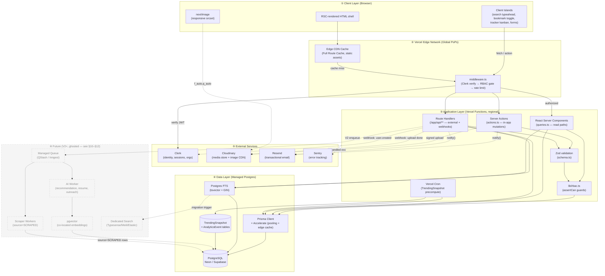

**Reading the edges:**

- **Solid arrows** are live V1 data paths.
- **Dotted arrows to External** are calls to managed SaaS (webhooks, uploads, email).
- **Dotted arrows to Future** are the *attachment points* — every one of them lands on a seam that already exists in V1 code (a Route Handler, the `notify()` helper, the Prisma layer, or the FTS layer), which is precisely why V2 is additive rather than a rewrite.

### 2.3 Server-First RSC: The Central Rendering Decision

The single most consequential architectural choice in Verity is that **primary content renders on the server as React Server Components, fetching directly through Prisma**, rather than as a client-side SPA calling a JSON API.

**Why this is correct for Verity specifically:**

Verity is a *content and discovery* product. Its Vision (`01-PRD.md §2`) is to be "the default first stop for every student who types 'internships at [company]' into a search engine." That sentence is a rendering-architecture requirement in disguise:

1. **Crawlability.** A company profile that a search engine can index is worth orders of magnitude more inbound traffic than one hidden behind client-side JavaScript hydration. RSC emits fully-rendered HTML on first byte.
2. **First-paint speed on mid-tier mobile.** The PRD's NFR 13.1 sets LCP < 2.0s on Fast 3G / mid-tier mobile. A client-side SPA would ship a large JS bundle, parse it, then *begin* fetching data — a waterfall that mid-tier mobile CPUs are exactly worst at. RSC ships HTML with data already inlined; the only JS shipped is for the interactive islands (search typeahead, bookmark toggle, tracker kanban).
3. **No API round-trip tax for reads.** A company profile RSC calls `prisma.company.findUnique(...)` directly in the same function invocation that renders the page. There is no serialize → HTTP → deserialize hop that an SPA-plus-API architecture pays on every read.

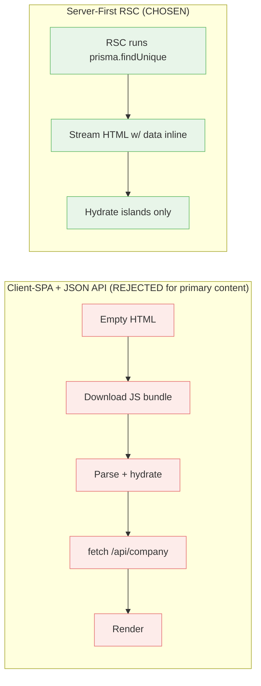

**Where we deliberately do NOT use RSC:** anything genuinely interactive and per-user — the bookmark toggle button, the search-as-you-type box, the drag-to-update tracker kanban, and all form inputs — are Client Components. The rule from `02-TRD.md §15` holds: *Server Components by default, Client Components only where interactivity is required.*

**Why not the alternatives:**

- **Why not a full SPA (e.g., Vite + React Router + a REST/GraphQL API)?** It optimizes for app-like interactivity Verity mostly doesn't have, at the cost of the SEO and first-paint properties Verity's entire growth model depends on. Verity is 90% readable content, 10% interactive workflow — the inverse of what an SPA is good at.
- **Why not the Pages Router with `getServerSideProps`?** The App Router's RSC model gives finer-grained caching (per-component Data Cache, §8), streaming, and the Server Actions mutation model, all of which we use. The Pages Router would force an all-or-nothing SSR boundary per page and no Server Actions.
- **Why not static-export everything?** Company profiles change (edits, verification status, new internships) and dashboards are per-user. Pure static export can't express "revalidate this one company's page when its owner edits it" — which is exactly what tag-based revalidation (§8) gives us on top of RSC.

### 2.4 Request Lifecycles (four canonical paths)

Four request shapes cover essentially all traffic. Two are reproduced from `02-TRD.md §3` for completeness; two are new to this document (the public cacheable read and the webhook path), because they are where the edge/CDN and external-integration architecture is most visible.

#### 2.4.1 Authenticated dashboard read (RSC path)

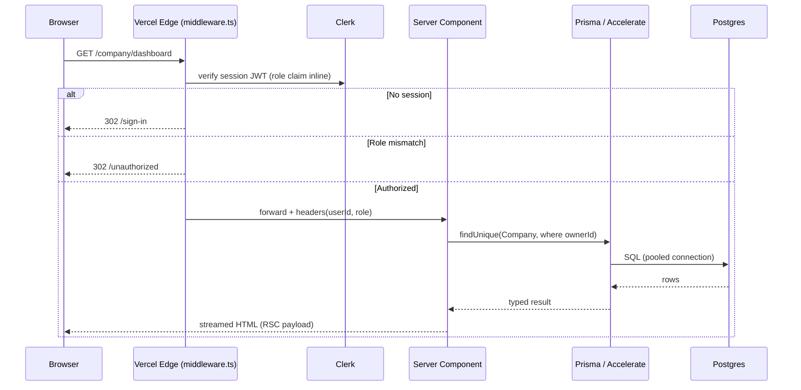

Key architectural note: the RBAC decision at the edge is made **without a database round-trip**, because the role claim is synced onto the Clerk JWT (`publicMetadata.role`) on every webhook update (`02-TRD.md §6`). The database remains the source of truth; the JWT is a performance cache of it.

#### 2.4.2 In-app mutation (Server Action path)

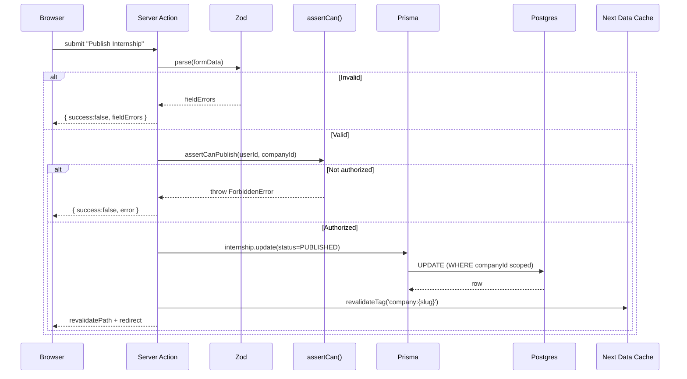

This path shows all three defense-in-depth layers (`02-TRD.md §7.4`) and the cache-invalidation seam (`revalidateTag`) that keeps public reads correct after a write (§8).

#### 2.4.3 Public cacheable read (edge-served, the SEO path)

This is the highest-volume path at scale — an anonymous student or a search-engine crawler hitting a public company profile — and the one where the edge/CDN architecture earns its keep.

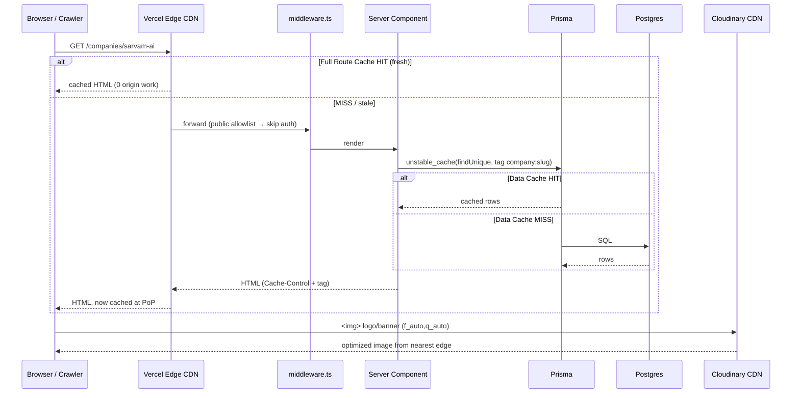

Two independent cache layers are visible here: the **Full Route Cache** at the Vercel edge (whole-HTML), and the **Next.js Data Cache** around the Prisma read (`unstable_cache`). Both are tag-invalidated by the same `revalidateTag('company:{slug}')` fired from the mutation path in 2.4.2, so a company edit propagates to both layers atomically from the code's point of view. Images never touch our origin at all — they resolve against Cloudinary's own CDN.

#### 2.4.4 Webhook ingress (external → us)

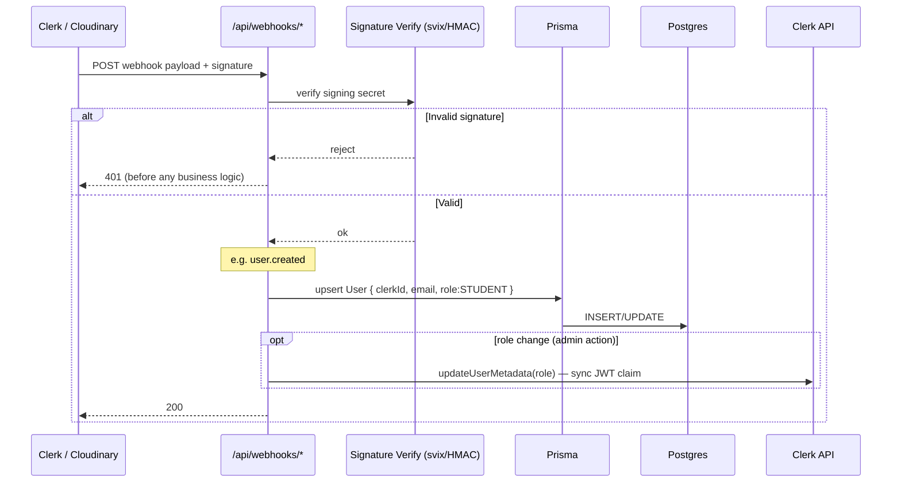

Webhooks are the *only* inbound path that authenticates by signature rather than session (`02-TRD.md §8`, §14). They are also the template for how *any* future external system (a scraper reporting results, a payment provider, an AI worker callback) will hand data back to the monolith — signature-verified Route Handlers that write through the same Prisma layer. This is a deliberate reuse of an existing seam (C2).

### 2.5 Trust Boundaries

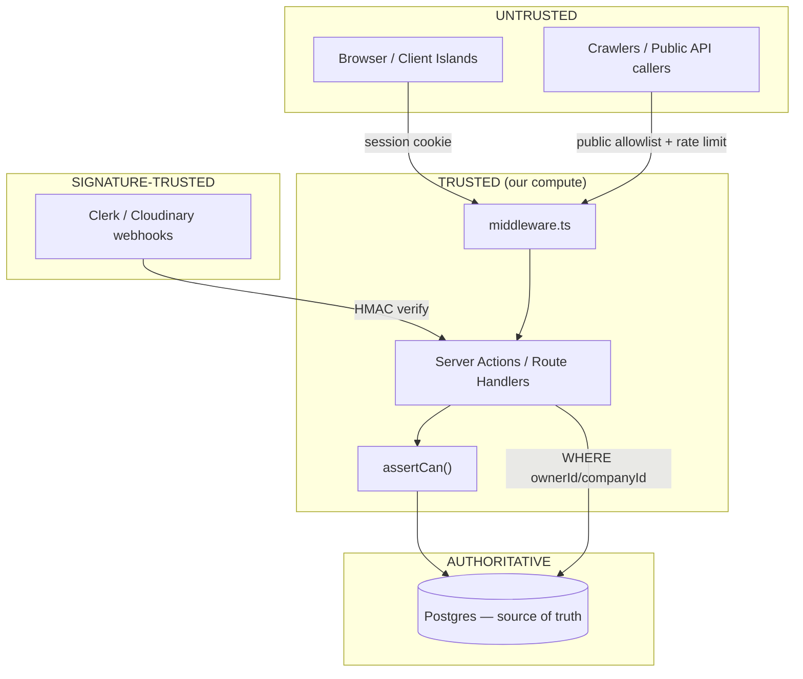

The boundary that matters most is between the browser and our compute. Client-side role checks are **UX only, never a security boundary** (`01-PRD.md §13.4`). Authorization is enforced three times server-side (middleware → `assertCan` → Prisma `WHERE`), because the class of bug that leaks writes across tenants lives precisely at "the route is protected but the specific row being mutated belongs to someone else" (`02-TRD.md §7.4`, Layer 3).

---

## 3. Deployment Topology

### 3.1 Vercel Regions & Placement

V1 is a **single primary region** deployment (`01-PRD.md §13.3` explicitly accepts single-region for the 99.5% uptime target). The choice of primary region is dictated by one thing: **co-location with the database**, because the database is the only stateful tier and every dynamic request touches it.

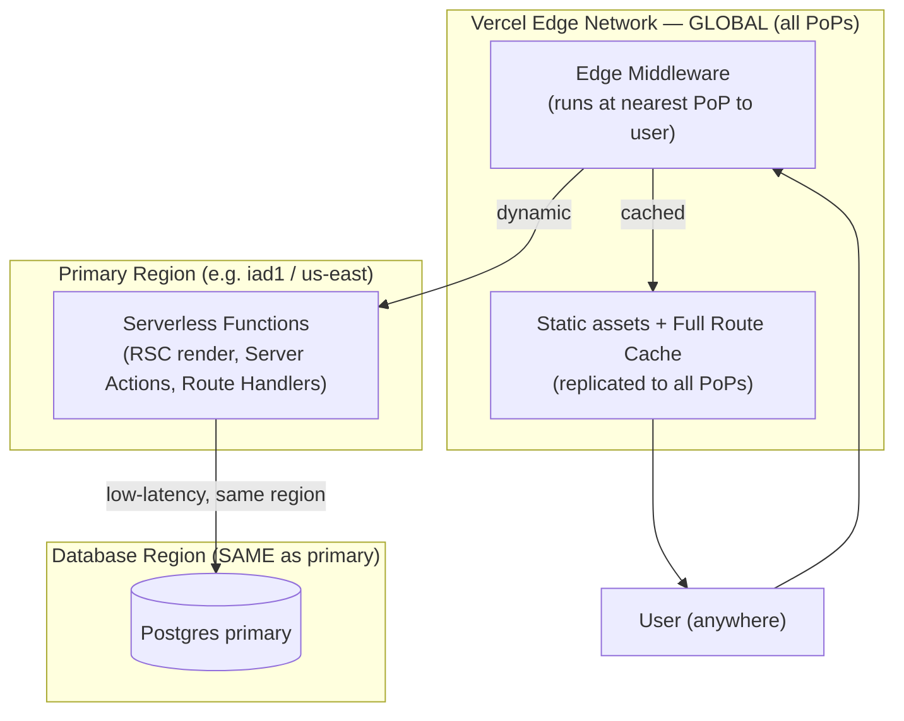

**The placement rule:** serverless functions and the Postgres primary live in the **same region** so the per-query network latency is single-digit milliseconds. Edge middleware and cached static content are global by default — they run at whichever PoP is nearest the user with no configuration. This gives Verity global fast *reads* for cached/static content and low-latency *dynamic* work near the data, without paying for multi-region write complexity we don't need (the multi-region path is §13.5).

**Why not deploy functions to the edge globally (Edge Runtime everywhere)?** Because a globally-distributed function that has to reach back to a single-region Postgres primary would add cross-continent latency to *every* query — the opposite of the intended effect. The Edge Runtime is right for middleware (stateless, no DB) and wrong for the data-heavy application tier. We keep the application tier regional and co-located with the database. This is the standard, correct pattern for a Postgres-backed Next.js app and is why `middleware.ts` is intentionally the *only* thing forced onto the Edge Runtime.

### 3.2 Edge Middleware vs. Serverless Functions

Two distinct runtimes are in play, and the assignment of work to each is deliberate:

| Runtime | Runs | Does | Must NOT do |
|---|---|---|---|
| **Edge Runtime** (`middleware.ts`) | Globally, at nearest PoP, before every matched request | Clerk JWT verification, RBAC route gating (reads role off JWT — no DB), rate-limit counter check, public-route allowlist | Touch Prisma/Postgres directly (no TCP DB connections from edge); run heavy CPU; import Node-only APIs |
| **Node/Serverless Runtime** (functions) | In the primary region | All Prisma access, RSC data fetching, Server Actions, Route Handlers, Cloudinary signing, Resend calls | Hold in-memory state across invocations (stateless mandate, §9) |

The reason middleware can gate every request cheaply is the JWT role-claim sync (§2.4.1): the edge decision needs no database, so it stays fast and global. The moment a request needs *data*, it drops into a regional function next to Postgres.

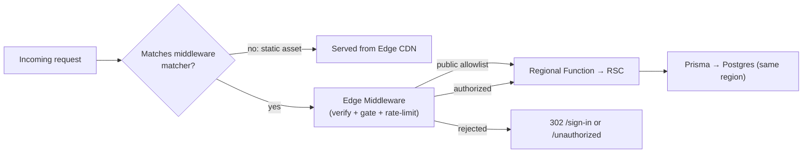

### 3.3 Cold Starts & Mitigations

Serverless functions cold-start. For Verity this is a bounded, well-understood concern, and the mitigations are chosen to stay inside the low-ops constraint (C3) rather than reaching for always-on servers.

**Where cold starts bite and where they don't:**

| Surface | Cold-start sensitivity | Why |
|---|---|---|
| Public company/internship profiles | **Low** | Full Route Cache + Data Cache mean most hits are served from the edge with zero function invocation (§8) |
| Search endpoint | **Medium** | Dynamic, per-query; not cached; hits a function + DB every time |
| Dashboards (Student/Company/Admin) | **Medium** | Never cached (staleness = correctness bug, §8); every load is a function invocation |
| Webhooks | **Low (tolerant)** | Clerk/Cloudinary retry on failure; a cold start just adds latency, not data loss |

**Mitigations, in order of preference (least-ops first):**

1. **Maximize cache hit rate** so the common public path rarely invokes a function at all (§8). This is the biggest lever and costs nothing operationally.
2. **The Prisma singleton pattern** (`lib/db.ts`, `02-TRD.md §4`) ensures a warm function reuses one `PrismaClient` across invocations rather than instantiating per request.
3. **Prisma Accelerate connection pooling** (below and §13.2) means a cold function does *not* pay a fresh Postgres TCP handshake — it borrows a pooled connection, which is the expensive part of a cold DB path.
4. **Keep function bundles lean.** Server Components import `queries.ts` (read-only, thin); heavy dependencies are avoided in hot paths. Smaller bundle = faster cold start.
5. **Only if measured p95 latency demands it:** Vercel Fluid Compute / provisioned concurrency for the specific hot function. This is a paid, opt-in lever pulled per-function when a signal justifies it — never blanket-enabled speculatively.

**Why Prisma Accelerate specifically for the serverless cold-connection problem:** Serverless functions are the classic antagonist of a connection-limited Postgres — each concurrent invocation wants its own connection and can exhaust the database's connection cap under a traffic spike. Accelerate sits in front as a connection pooler (PgBouncer-equivalent, managed) *and* provides an optional edge query cache. It resolves the single most common failure mode of Prisma-on-serverless (connection exhaustion) with zero infrastructure for us to run — directly satisfying C3. The alternative (self-hosting PgBouncer) reintroduces an ops surface we explicitly refuse in V1.

### 3.4 Environment Topology

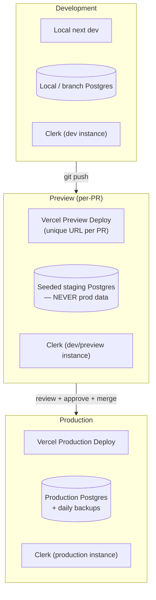

Three environments, mirroring `02-TRD.md §18`:

- **Development** — local `next dev`, pointing at a local or per-developer branch database (Neon's branching makes an ephemeral per-branch DB trivial and cheap — see §5).
- **Preview** — a unique per-PR Vercel deployment pointing at a **separate seeded staging database**, never production data. E2E smoke tests (`02-TRD.md §19`, §20) run against the live Preview URL so what's tested is exactly what a reviewer clicks.
- **Production** — the single-region live deployment. Migrations run via `prisma migrate deploy` **gated behind manual approval** to avoid an in-flight migration racing a deploy under load (`02-TRD.md §18`).

Environment variables (`DATABASE_URL`, `CLERK_SECRET_KEY`, `CLOUDINARY_URL`, `RESEND_API_KEY`, etc.) are scoped per-environment in the Vercel dashboard and never committed (full inventory in Appendix B).

---

## 4. Microservice Evolution Plan

This is the section a technical-diligence reviewer will scrutinize most, because it is where "we chose a monolith" has to be shown as a *reversible, staged decision* rather than a corner we've painted ourselves into. The claim is precise: **Verity's monolith is not a monolith that resists being split — it is a monolith with all the seams of the eventual services already drawn, so each extraction is a lift-and-shift of an existing module, not a rewrite.**

### 4.1 Why NOT Microservices in V1

Restating and expanding `02-TRD.md §2` and §1's C1:

A three-role platform (Student / Company / Admin) over shared entities (`Company`, `Internship`, `User`) is the textbook *worst* candidate for early microservices, for four concrete reasons:

1. **The core value is shared rows, not isolated domains.** Verity exists because student-facing and company-facing views are the *same* `Company` and `Internship` rows seen through different RBAC lenses (`01-PRD.md §1`). Splitting "student service" from "company service" would mean either duplicating those rows (consistency nightmare) or having both services hit one shared database (a distributed monolith — the worst of both worlds).
2. **Mutations are naturally transactional across "would-be" service lines.** "Publish an internship" touches `Internship`, `Company` (verification gate), `Notification`, and the search index in one logical operation. In a monolith this is a single Prisma transaction. Split into services, it becomes a distributed transaction or a saga with compensating actions — enormous complexity for an operation that is fundamentally one ACID write today.
3. **No independent scaling need yet.** Microservices pay off when different components have *divergent* scaling profiles (e.g., a read-heavy search tier vs. a write-heavy ingest tier). At V1 scale (`01-PRD.md §4 G2`: 100 verified companies as the launch bar), every component scales together and trivially. There is no bottleneck to isolate.
4. **No independent teams yet.** Conway's Law runs both ways: microservices align to team boundaries. A founding team of a few engineers has one boundary. Splitting the system into services it doesn't have the headcount to own independently manufactures coordination cost with no offsetting autonomy benefit.

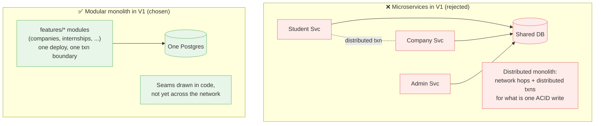

### 4.2 The Splittability Invariants We Maintain Today

The monolith stays splittable because V1 code already obeys four invariants (from `02-TRD.md §3.3` and §5). These are the "pre-drawn seams":

| Invariant | Where enforced today | Why it enables a future split |
|---|---|---|
| **Layered module structure** (`schema.ts` / `queries.ts` / `actions.ts` / `components/`) | Convention + a CI structural test | A module's mutation surface (`actions.ts`) is already its de-facto API; extracting it means promoting those functions to network endpoints, not restructuring logic |
| **Modules call each other's mutations only through exported functions**, never by reaching into internals | Code review + module contract (`02-TRD.md §5`) | The call sites that would become RPC boundaries are already explicit and few |
| **Route Handlers exist for all external/programmatic access** | `/app/api/**` (`02-TRD.md §9`) | The public API contract a future service must honor already exists and is stable/versioned |
| **`notify()` is the single notification call-site** | `features/notifications` (`02-TRD.md §25`) | A future notification *service* replaces one function body; no feature module changes |

The structural CI test (`02-TRD.md §20`) that fails the build if `features/*/actions.ts` imports Prisma without importing `lib/rbac` is not just a security guard — it also keeps the mutation boundary clean and therefore extractable.

### 4.3 Trigger-Signal → Smallest-Resolving-Change Table

This is the operational heart of the evolution plan. We do not extract services on a schedule or a hunch. Each row is a **named, measurable signal** and the **smallest change that resolves it** — never a bigger one. This table extends `02-TRD.md §26` with explicit thresholds and the smallest-change discipline.

| # | Trigger signal (measured) | Threshold that trips it | Smallest change that resolves it | What we explicitly do NOT do |
|---|---|---|---|---|
| T1 | Postgres connection saturation on serverless bursts | Pool wait time > 50ms p95, or connection-limit errors in logs | Ensure Prisma Accelerate pooling is on; raise pool size | Do not shard the DB; do not extract services |
| T2 | Postgres CPU saturation from read traffic | DB CPU > 70% sustained, dominated by public GET reads | Add a **read replica**; route public/anon reads to it via a read-only Prisma datasource | Do not split the app; writes stay on primary |
| T3 | Search latency degrades as catalog grows | Search p95 > 300ms (PRD NFR 13.1) at ~10k+ companies | Extract **Search Service** (Typesense/Meilisearch first) fed by a sync job; keep Postgres FTS as fallback/pre-filter | Do not jump to Elasticsearch; do not rewrite search UX |
| T4 | Dashboard analytics queries slow down | Company/Admin dashboard load > 1.5s (PRD NFR 13.1) from live aggregation | Move to scheduled **summary tables / materialized views** (same pattern as TrendingSnapshot) | Do not build an analytics warehouse yet |
| T5 | AI scoring needs long-running / GPU compute | First AI feature ships (V2) and inference exceeds serverless function limits | Extract **AI Worker** behind a managed **queue**; monolith enqueues, worker writes back via webhook Route Handler | Do not run inference inside request/response |
| T6 | Scraping/enrichment pipeline introduced | V3 catalog-growth automation begins | Isolated **Scraper Workers** writing `source=SCRAPED` rows into the *same* tables, gated by existing `VerificationStatus` | Do not create a parallel schema or review pipeline |
| T7 | Bulk/batched email volume grows | Daily digest (`01-PRD.md §20`) fan-out exceeds what a cron function can send inline | Extract **Notification Service** behind the queue; `notify()` body swaps to enqueue | Do not change any feature module's call site |
| T8 | Webhook/ingest volume spikes | Webhook processing backs up or times out | Enqueue webhook payloads for async processing behind the queue | Do not add a message broker for synchronous paths |
| T9 | True multi-region user base | Sustained cross-continent read latency complaints; global DAU | Multi-region read replicas + edge-cached reads; writes still single-primary | Do not adopt multi-master writes (last resort, §13.5) |
| T10 | Independent teams form around domains | Org grows to multiple teams owning distinct domains | Extract the domain a team owns along its existing module seam | Do not pre-split ahead of the team boundary |

**The discipline this table encodes:** every row's "smallest change" is intentionally *smaller* than "extract a microservice." Most rows (T1, T2, T4) are resolved *without any service extraction at all* — they're scaling moves inside the monolith. Only T3, T5, T6, and T7 extract a service, and each extracts *exactly one*, along a seam that already exists (§4.2). This is C1 and the "scale the specific bottleneck" throughline made concrete.

### 4.4 The Four Extraction Candidates

Only four components are ever candidates for extraction, and each has a single, specific trigger. Here is what each looks like before and after, and why the seam is already in place.

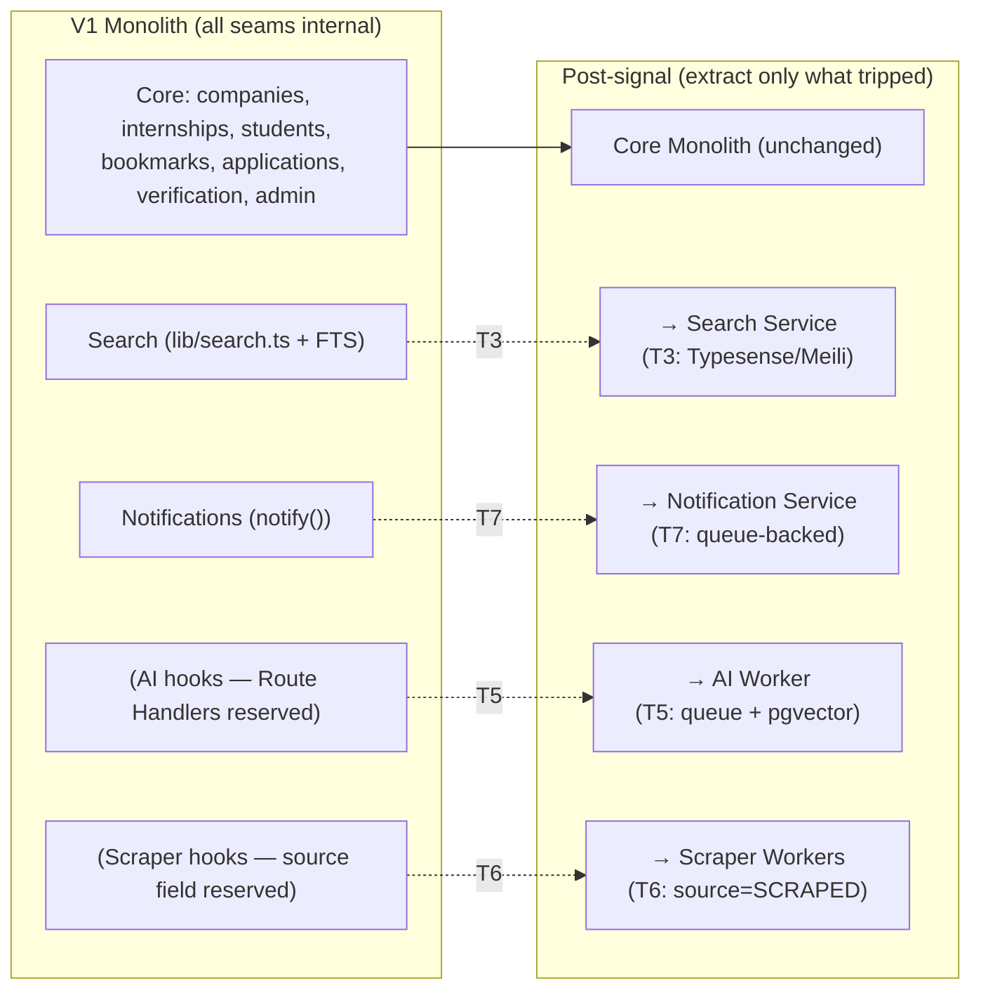

**① Search Service (trigger T3).** Today search is `lib/search.ts` issuing `$queryRaw` against Postgres FTS (§7). Extraction means: stand up Typesense/Meilisearch, add a sync job that indexes `Company`/`Internship` on write, and swap `lib/search.ts`'s implementation to query the new engine while keeping its function signature identical. Because every caller goes through `lib/search.ts`, *no caller changes*. Postgres FTS remains as a fallback and as the pre-filter for semantic search (§7, §11).

**② Notification Service (trigger T7).** Today `notify()` (`02-TRD.md §25`) synchronously inserts a `Notification` row and optionally calls Resend. Extraction means: `notify()`'s body changes to enqueue a message; a worker consumes it and does the insert + Resend/fan-out. Every feature module still calls `notify()` — the single call-site invariant (§4.2) means the blast radius is one function.

**③ AI Worker (trigger T5).** Today there are *reserved* Route Handler paths (`/api/ai/*`, `02-TRD.md §22`) and enum-typed structured data (§11). Extraction means: the monolith enqueues a scoring job; a separate worker (with GPU/long-timeout compute outside Vercel's function limits) reads structured features + embeddings, and writes results back to a `Recommendation` table via a signature-verified Route Handler (the same webhook pattern as §2.4.4). No schema rewrite — the tables and enums already exist.

**④ Scraper Workers (trigger T6).** Today the schema is designed to accept a `source: MANUAL | SCRAPED` field (`02-TRD.md §23`) — not present in V1 per the PRD's no-scraping constraint, but a one-column addition. Extraction means: isolated workers write `source=SCRAPED` rows into the *same* `Company`/`Internship` tables at `VerificationStatus.PENDING`, and the *existing* Admin verification queue is the human gate. No parallel schema, no parallel review pipeline (§12).

### 4.5 Evolution Timeline

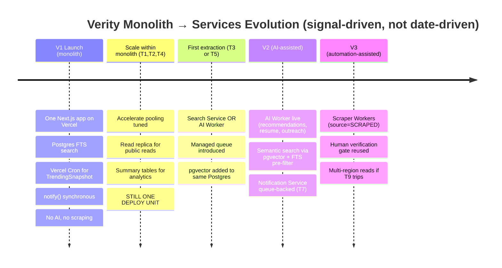

The timeline is intentionally labeled by **signal, not date.** We cannot know *when* T3 trips — that depends on catalog growth we don't control. We know exactly *what* we'll do when it does, and that certainty is the whole point.

---

## 5. Infrastructure — Managed Services Inventory

Every piece of infrastructure is a *managed* service, chosen to minimize the operational surface area a small team must own (C3). Here is the complete inventory with the rationale and the rejected alternative for each.

| Concern | Chosen | Why this one | Why not the alternative |
|---|---|---|---|
| **Compute + hosting** | Vercel | Native Next.js host; zero-config Preview deploys; global edge; git-integrated CI/CD; the App Router features (RSC, Server Actions, tag revalidation) are first-class | Self-host on AWS/ECS/K8s → reintroduces the entire ops surface (load balancers, autoscaling, deploy pipelines) C3 forbids; Netlify/Cloudflare → weaker RSC/Server Actions support at time of writing |
| **Database** | Managed Postgres (Neon or Supabase) | Serverless-friendly Postgres; **Neon** gives instant DB branching (a per-PR/per-dev database for free), scale-to-zero, and read replicas as a config flag; native FTS + `pgvector` extension available in-place (§11) | Self-managed RDS → we operate backups, failover, upgrades; a NoSQL store → loses relational integrity, transactions, and FTS that Verity's shared-rows model depends on; PlanetScale (MySQL) → no `pgvector`, weaker FTS, forecloses the semantic-search path |
| **Connection pooling + edge cache** | Prisma Accelerate | Managed PgBouncer-equivalent that solves serverless connection exhaustion (§3.3) plus optional edge query caching, with zero infra to run | Self-hosted PgBouncer → an ops surface C3 refuses; no pooling → connection exhaustion under serverless bursts (T1) |
| **Auth / identity** | Clerk | Hosted UI (`<SignIn/>`, `<UserButton/>`), org support (future company teams), webhook user-sync, JWT custom claims (the RBAC-at-edge mechanism, §2.4.1) | NextAuth/Auth.js → we build/secure more of the surface ourselves; roll-our-own → never, for auth (`01-PRD.md §13.4`) |
| **Media storage + image CDN** | Cloudinary | Sole binary store; signed uploads; on-the-fly `f_auto,q_auto` transforms; its own global CDN so images never hit our origin (§9) | S3 + CloudFront → we build the transform/optimize pipeline and upload signing ourselves; storing bytes ourselves → breaks the stateless-app-tier mandate (§9) |
| **Transactional email** | Resend | Simple API, good deliverability, React-email templating; fits the single `notify()` call-site | Self-hosted SMTP → deliverability + ops nightmare; SES → more setup, weaker DX for a small team |
| **Search (V1)** | Postgres FTS | In-database, transaction-consistent, zero extra infra, sub-50ms at V1 scale (§7) | Elasticsearch/Algolia/Typesense in V1 → a second system to run, sync, and pay for before catalog size justifies it (§7) |
| **Background scheduling (V1)** | Vercel Cron | Built into the platform; runs the TrendingSnapshot precompute (§8, §10); no queue infra | Self-hosted cron/worker → ops surface; a full queue in V1 → nothing to put in it yet (§10) |
| **Error tracking** | Sentry (Next.js SDK) | Server + client capture with source maps; alert integration to email/Slack (`02-TRD.md §17`) | Self-hosted error stack → ops surface; console-only → no aggregation/alerting |
| **Uptime / perf monitoring** | Vercel Analytics + Monitoring | Built-in, zero-setup, sufficient for V1 traffic | Datadog/New Relic → over-tooled and over-priced for V1 scale |

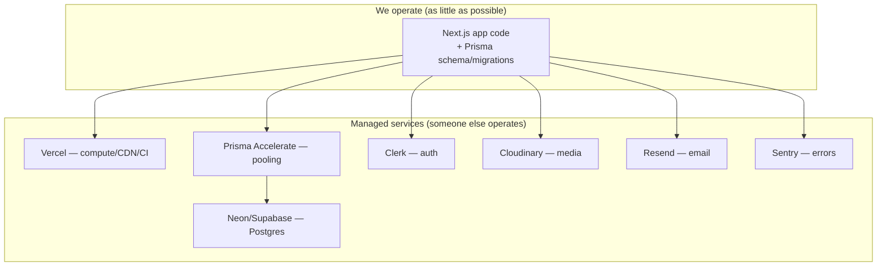

**The infrastructure thesis in one line:** the founding team operates *application code and a database schema* — nothing else. Every other concern is delegated to a managed service. That is the entire content of the low-ops constraint (C3), and it is what lets a handful of engineers ship a three-portal platform.

---

## 6. CDN & Edge Caching

Verity has **two distinct CDNs**, each owning a different asset class, and it is worth being precise about which caches what.

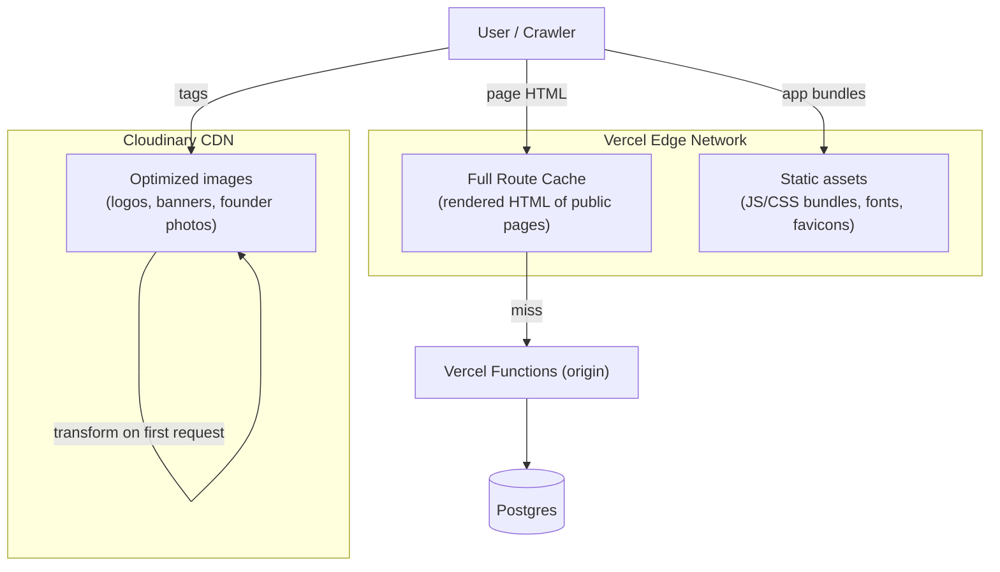

### 6.1 What is cached where

| Asset class | Cached at | Mechanism | Invalidation |
|---|---|---|---|
| Public page HTML (company/internship profiles, marketing, directory shell) | Vercel Edge (Full Route Cache) | RSC output cached at PoPs | `revalidateTag` / `revalidatePath` on the relevant mutation (§8) |
| JS/CSS bundles, fonts, static files | Vercel Edge | Content-hashed, immutable, long-TTL | New deploy = new hashes (automatic) |
| Images (logos, banners, photos) | Cloudinary CDN | `f_auto,q_auto` transforms cached at Cloudinary edge | New `publicId` on re-upload; URL changes |
| Data reads inside RSC | Not a CDN — Next.js Data Cache (§8) | `unstable_cache` with tags | Same `revalidateTag` |

### 6.2 Cache invalidation is tag-driven, not time-driven, for correctness-sensitive content

The key design decision: **public content invalidation is event-driven via tags, not TTL-driven.** When a company owner edits their profile or publishes an internship, the Server Action fires `revalidateTag('company:{slug}')` (`02-TRD.md §13`). This invalidates *both* the Full Route Cache entry and the Data Cache entry for that specific company, everywhere, immediately.

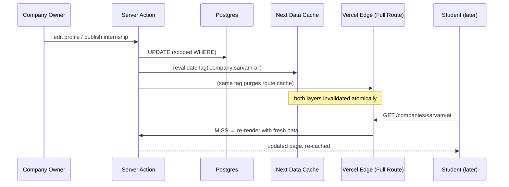

**Why tag-based over pure time-based TTL:** a company that just got verified, or an internship that just closed, must reflect that *now* — stale-for-60-seconds is a trust bug for a product whose entire thesis is trust (`01-PRD.md §1`). Tags give us "cache aggressively, invalidate precisely." Time-based TTL (60s) is retained only for content where staleness is harmless and mutation is rare — the marketing pages and the directory *shell* (`02-TRD.md §13`).

### 6.3 What is never edge-cached

Dashboards (Student/Company/Admin) and search results are **never** cached at the CDN (§8). They are per-user or per-query and their staleness is a correctness bug (a stale bookmark count, a stale verification queue, a stale featured-window that should have expired — `01-PRD.md §23` explicitly requires featured-window expiry to be checked server-side on every render, not cached). These always hit a fresh function invocation.

---

## 7. Search Architecture

### 7.1 V1 — Postgres Full-Text Search

V1 search is **PostgreSQL native FTS** — `tsvector` generated columns with `GIN` indexes — and this is a deliberate cost-and-complexity decision, not a placeholder (`02-TRD.md §12`, `01-PRD.md §16`).

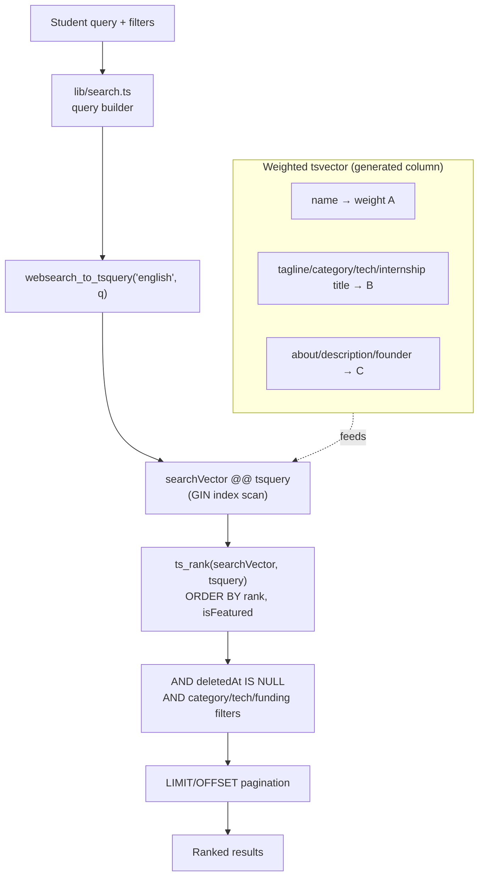

**Why Postgres FTS over a dedicated engine in V1:**

- **Sub-50ms at V1 scale.** The PRD's quality bar is 100 verified companies (`§4 G2`), and NFR 13.1 targets search p95 < 300ms even at a 10k-company catalog. Postgres FTS with proper `GIN` indexing clears that comfortably.
- **Zero indexing lag.** Search lives in the same transaction-consistent database as writes. A newly-published internship is searchable *immediately* — no sync job, no eventual-consistency window. For a trust product this matters: a company that just published shouldn't wonder why they can't find themselves.
- **Zero extra infrastructure.** No second system to run, sync, secure, or pay for (C3).
- **Weighted relevance for free.** The `setweight(A/B/C)` scheme (`02-TRD.md §10.4`) ranks a name match above a buried `about` match, satisfying "exact/near-exact name matches must rank first" (`01-PRD.md §16`).
- **`websearch_to_tsquery` gives advanced-search syntax for free** — quoted phrases, `-exclude` terms — without us writing a query parser (`02-TRD.md §12`).

The generated `tsvector` columns and `GIN` indexes are defined in `02-TRD.md §10.4` and are not repeated here; this document owns the *evolution* of search, below.

### 7.2 Migration trigger → dedicated search service

Search extraction is trigger **T3** (§4.3): when search p95 exceeds 300ms at ~10k+ companies, *or* relevance/typo-tolerance/faceting needs outgrow what FTS expresses cleanly.

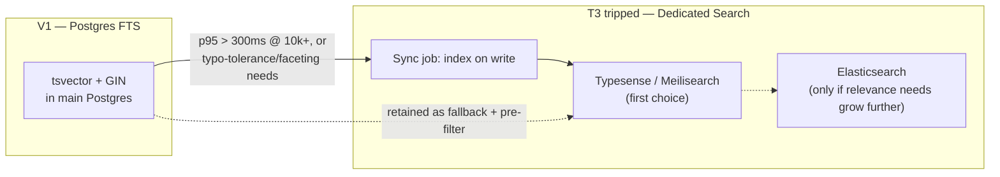

**The migration is deliberately staged (smallest change first):**

1. **Typesense or Meilisearch first**, not Elasticsearch. They are dramatically lower-ops (single binary / managed cloud), give typo-tolerance and faceting out of the box, and are the right size for "10k–100k companies with good relevance." Elasticsearch is reserved for *only if* relevance requirements grow beyond what those provide — a later, separate decision.
2. **`lib/search.ts` is the seam.** Every search caller goes through it (§4.4 ①). The engine swap changes that file's *implementation*, not its signature — no caller changes.
3. **Postgres FTS is not thrown away.** It becomes (a) a fast fallback if the search service is unavailable, and (b) the **pre-filter** for semantic search in V2 (§11) — narrowing candidates with a cheap FTS pass before an expensive vector rank.

### 7.3 V2 — Semantic search via pgvector

The recommendation/AI phase (V2) adds *semantic* search — "find companies like Stripe but in fintech infra" — which lexical FTS cannot express. This is done with **`pgvector` co-located in the same Postgres**, not a separate vector database (`02-TRD.md §22`).

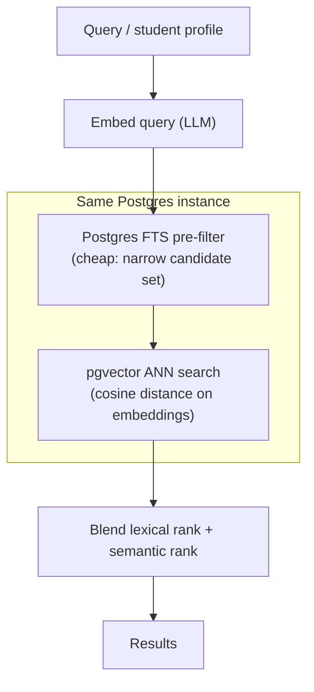

**Why `pgvector` in the same Postgres, not a dedicated vector DB (Pinecone/Weaviate):** co-location avoids a second stateful system (C3), keeps embeddings transactionally consistent with the rows they describe (no sync drift between "the company" and "the company's embedding"), and lets us `JOIN` structured filters (funding stage, remote policy) against vector similarity in one query. A dedicated vector DB would force a cross-system join and a second consistency problem for a workload that fits comfortably in Postgres at Verity's scale. FTS *augments* rather than is *replaced by* vectors — lexical for exact/name intent, semantic for discovery intent.

---

## 8. Caching Strategy

Caching in Verity is a layered system with one governing rule: **cache aggressively where staleness is harmless; never cache where staleness is a correctness bug.**

```mermaid
graph TB
    Req["Request"] --> L1{"Full Route Cache<br/>(edge HTML)"}
    L1 -->|hit| Serve1["Serve cached HTML"]
    L1 -->|miss| L2{"Next.js Data Cache<br/>(unstable_cache per read)"}
    L2 -->|hit| Render["Render with cached data"]
    L2 -->|miss| DB[("Postgres query")]
    DB --> Render
    Render --> L1

    subgraph Precompute["Precompute (Vercel Cron)"]
        Snap[("TrendingSnapshot table")]
    end
    Dashboard["Student Dashboard<br/>Trending module"] --> Snap
```

### 8.1 The four cache layers and their rules

| Layer | What it caches | Invalidation | Rule |
|---|---|---|---|
| **Full Route Cache** (Vercel Edge) | Rendered HTML of public pages | Tag (`revalidateTag`) on mutation; 60s TTL for low-mutation marketing/directory shell | Public, crawlable, read-heavy content |
| **Next.js Data Cache** (`unstable_cache`) | Prisma read results inside RSC | Same tags as above | Wraps the specific reads behind public pages |
| **CDN (Cloudinary)** | Optimized images | New `publicId` on re-upload | Binary assets only (§6, §9) |
| **TrendingSnapshot precompute** | Trending/Recommended company lists | Recomputed on a Vercel Cron schedule | Expensive aggregations that would otherwise run per dashboard load |

### 8.2 TrendingSnapshot precompute — the O(1) dashboard read

The Student Dashboard's "Trending Companies" module (`01-PRD.md §15.1`) is defined as "highest bookmark/view velocity over a rolling 7-day window." Computing that live, on every dashboard load, would be an expensive aggregation over bookmark/analytics events that grows with platform activity.

Instead, a **Vercel Cron job** (§10) computes the trending ranking on a schedule and writes it to a small `TrendingSnapshot` table. The dashboard reads that precomputed table — an O(1) lookup regardless of platform activity volume (`02-TRD.md §13`).

```mermaid
sequenceDiagram
    participant Cron as Vercel Cron
    participant Agg as Aggregation query
    participant Snap as TrendingSnapshot table
    participant Dash as Student Dashboard (many loads)

    Cron->>Agg: compute 7-day bookmark/view velocity
    Agg->>Snap: upsert ranked snapshot
    Note over Snap: written once per schedule tick
    loop every dashboard load
        Dash->>Snap: SELECT precomputed ranking (O(1))
        Snap-->>Dash: trending list
    end
```

This is the same materialized-summary pattern that trigger **T4** (§4.3) later applies to Company/Admin analytics dashboards when live aggregation slows down — "the technique already used for Trending" (`02-TRD.md §26`). One pattern, reused, rather than a bespoke solution per surface.

### 8.3 Consistency rules — what is NEVER cached

The correctness boundary is explicit (`02-TRD.md §13`):

| Surface | Cached? | Why |
|---|---|---|
| Public company/internship profiles | ✅ (tag-invalidated) | Read-heavy, crawlable, staleness bounded by event-driven invalidation |
| Marketing pages, directory shell | ✅ (60s TTL) | Low mutation, harmless staleness |
| **Student/Company/Admin dashboards** | ❌ **never** | Staleness = correctness bug (stale bookmark count, stale verification queue) |
| **Search results** | ❌ **never** | Must reflect the live catalog; a newly-verified company must appear immediately |
| **Featured-company windows** | ❌ **never** (checked server-side per render) | `01-PRD.md §23`: an expired feature window must not display, so expiry is checked on every render, not cached |
| **Application Tracker** | ❌ **never** | Per-student private data (`01-PRD.md §13.6`); always live |

The mental model: **content is cached; state is not.** A company profile is content (cache it, invalidate on edit). A dashboard is a live view of state (never cache it). This single distinction resolves every caching question in the system.

---

## 9. Storage Architecture

### 9.1 Cloudinary is the sole binary store

**No file bytes ever touch Verity's compute or database.** Prisma stores only Cloudinary URLs and public IDs (`Company.logoUrl`, `Company.bannerUrl`, `Founder.photoUrl`, `StudentProfile.resumeUrl` — see `02-TRD.md §10.2`). This is the concrete mechanism behind the "stateless app tier" principle (§1.1, principle 4).

```mermaid
graph LR
    subgraph AppTier["App Tier (STATELESS)"]
        SA["Server Action"]
        DB[("Postgres:<br/>stores URL + publicId only")]
    end
    subgraph Cloudinary["Cloudinary (owns all bytes)"]
        Store["Binary store"]
        CDN2["Image CDN + transforms"]
    end
    Browser["Browser"]

    Browser -->|"1. request signed params"| SA
    SA -->|"2. sign upload preset"| SA
    SA -->|"3. return signature"| Browser
    Browser -->|"4. upload bytes DIRECTLY"| Store
    Store -->|"5. webhook: upload done"| RH["/api/webhooks/cloudinary"]
    RH -->|"6. persist URL+publicId"| DB
    Browser -->|"7. later:  f_auto,q_auto"| CDN2
```

### 9.2 Signed direct uploads — bytes bypass our origin

The upload flow (`02-TRD.md §14`) is a **signed direct upload**: the client requests upload parameters from a Server Action, which signs them against a Cloudinary upload preset (constraining max size and allowed MIME types — `image/png`, `image/jpeg`, `image/webp`, `application/pdf` for resumes). The client then uploads bytes *directly to Cloudinary*, never through our functions. A webhook notifies us when the upload completes, and we persist the resulting URL/publicId.

**Why direct-to-Cloudinary rather than proxying uploads through our functions:**

1. **Serverless functions have request-size and duration limits** ill-suited to receiving large file bodies. Proxying a resume or a banner through a function wastes function time and risks timeouts.
2. **It keeps the app tier stateless** — no function ever holds file bytes, even transiently.
3. **The upload preset enforces size/type at Cloudinary's edge**, so a tampered client cannot upload a disallowed type even by skipping our client-side check (defense in depth, matching the RBAC philosophy — client checks are UX, server/preset checks are the boundary).

### 9.3 Why this makes horizontal scaling free

Because the app tier holds no state — no sessions (Clerk owns those), no files (Cloudinary owns those), no in-memory caches that must be coherent across instances (the Data Cache is tag-invalidated, not instance-local state) — **any function instance can serve any request.** Vercel spins up as many as needed and tears them down with zero coordination. Statelessness isn't an accident of the platform; it's a property we protect deliberately (`02-TRD.md §2`), and Cloudinary-as-sole-binary-store is a load-bearing part of it.

### 9.4 The `resumeUrl` forward-compatibility hook

`StudentProfile.resumeUrl` exists in the V1 schema even though the resume-upload UI is deferred (`01-PRD.md §21`, §14.1). This is a direct application of C2: the *field* (a Cloudinary reference) exists now so that V2's AI Resume Analysis (§11) needs no migration to *add the concept* — only to turn on the upload UI and point the AI worker at the stored file. The storage architecture is already resume-ready; only the feature is deferred.

---

## 10. Message Queues & Background Work

### 10.1 V1 — no queue except Vercel Cron

V1 has **no background job system beyond Vercel Cron** (`02-TRD.md §24`). There is exactly one scheduled job: the TrendingSnapshot precompute (§8.2). Everything else happens synchronously in the request/response cycle, because at V1 scale everything else *fits* in the request/response cycle.

```mermaid
graph LR
    subgraph V1BG["V1 Background Work"]
        Cron["Vercel Cron"] --> Snap["TrendingSnapshot precompute"]
    end
    Note["Everything else is synchronous:<br/>notify() sends inline,<br/>no AI, no scraping, no bulk email fan-out yet"]
```

**Why no queue in V1:** a queue is infrastructure with nothing to put in it. The three future queue workloads — AI scoring, scraping, bulk-email fan-out — are all explicitly out of V1 scope (`01-PRD.md §21`, §27). Standing up a queue now would be operational surface (C3 violation) serving zero jobs. The single genuinely-scheduled need (Trending) is met by Cron, which is built into Vercel.

### 10.2 Future — managed queue (QStash / Inngest), never self-hosted

When AI scoring, scraping, or bulk notification fan-out outgrow synchronous request/response, the plan is a **managed queue** — Vercel Queue / QStash / Inngest — *not* self-hosted Redis + BullMQ (`02-TRD.md §24`). This keeps the low-ops principle intact: a managed queue is a config + an SDK, not a Redis cluster to run, monitor, and fail over.

The queue is introduced by the *first* trigger that needs it (T5 AI, T6 scraping, or T7 bulk email — whichever trips first), and then shared by the others.

### 10.3 Eventual event-flow architecture

```mermaid
graph TB
    subgraph Monolith["Verity Monolith (enqueue side)"]
        SA["Server Action / Route Handler"]
        Notify["notify() helper"]
        Cron2["Vercel Cron"]
    end
    subgraph Queue["Managed Queue (QStash / Inngest)"]
        Q1["ai.score jobs"]
        Q2["scrape.enrich jobs"]
        Q3["email.digest jobs"]
        Q4["webhook.process jobs"]
    end
    subgraph Workers["Isolated Workers"]
        AIW["AI Worker<br/>(GPU / long timeout)"]
        ScrapeW["Scraper Workers"]
        EmailW["Notification Worker<br/>(Resend fan-out)"]
    end
    subgraph Data["Shared Data Tier"]
        PG[("Postgres<br/>same tables + pgvector")]
    end

    SA -->|"enqueue"| Q1
    Cron2 -->|"enqueue"| Q2
    Notify -->|"enqueue (T7)"| Q3
    SA -->|"enqueue (T8)"| Q4

    Q1 --> AIW
    Q2 --> ScrapeW
    Q3 --> EmailW

    AIW -->|"write Recommendation +<br/>embeddings via webhook RH"| PG
    ScrapeW -->|"write source=SCRAPED rows"| PG
    EmailW -->|"batched sends"| Resend["Resend"]
    EmailW --> PG
```

**The critical property:** every worker writes back to the *same Postgres* through the *same patterns* the monolith already uses — a signature-verified Route Handler (the webhook pattern from §2.4.4) or a direct scoped write. There is no separate data store, no event-sourcing rewrite, no CQRS split. The queue decouples *timing* (async vs. sync), not *data ownership* (Postgres remains the single source of truth). That is what makes adding the queue additive rather than architectural upheaval.

---

## 11. AI Integration (Forward-Compatible Design)

AI is entirely out of V1 scope (`01-PRD.md §21`), but the schema and module boundaries are designed so the V2 AI features *slot in without a rewrite* (`02-TRD.md §22`). This section makes the attachment points explicit.

### 11.1 The three AI features and where each attaches

```mermaid
graph TB
    subgraph Inputs["V1 data (already structured)"]
        Resume["StudentProfile.resumeUrl<br/>(Cloudinary ref)"]
        Struct["Enum-typed fields:<br/>FundingStage, RemotePolicy,<br/>Category, Technology"]
        FounderData["Founder + Company context"]
    end
    subgraph AI["V2 AI Worker (behind queue, T5)"]
        Rec["Recommendation Engine"]
        RA["Resume Analysis + Matching"]
        Out["Outreach Generation<br/>(cold email / LinkedIn)"]
    end
    subgraph Outputs["New tables/routes (additive)"]
        RecTbl[("Recommendation table")]
        Embed["pgvector embeddings<br/>(same Postgres)"]
        OutRoute["/api/ai/outreach<br/>(reserved Route Handler)"]
    end

    Struct --> Rec --> RecTbl
    Struct --> Embed
    Resume --> RA
    FounderData --> Out --> OutRoute
    Rec --> Embed
```

| AI feature | Reads (already exists in V1) | Writes (additive, no rewrite) | Compute model |
|---|---|---|---|
| **Recommendation Engine** | `Internship`/`Company` enum-typed structured fields + engagement signals (`AnalyticsEvent`, `Bookmark`) | New `Recommendation` table; scored offline | Queue → AI Worker (T5) |
| **Resume Analysis / Matching** | `StudentProfile.resumeUrl` (the reserved Cloudinary field, §9.4) + internship requirements | Parsed skills → new columns/table; match scores | Queue → AI Worker |
| **Outreach Generation** | `Founder` + `Company` context (already modeled, `02-TRD.md §10.2`) | New `features/outreach/` module; `/api/ai/outreach` | Route Handler → LLM call |

### 11.2 Why the AI slots in without a rewrite — three enabling decisions made in V1

1. **Structured enums from day one** (`02-TRD.md §10.1`). `FundingStage`, `RemotePolicy`, `ApplicationStatus` etc. are enums, not freeform text, *specifically because* "these are exactly the fields the future recommendation/AI-matching engine will filter and rank on, so they must be structured data from day one." A future matching model gets clean features with no NLP pass over freeform strings first (`01-PRD.md §21` forward-compat note).
2. **First-party signal capture** (`AnalyticsEvent`, search-query logging — `01-PRD.md §19.3`). Designed to double as a future training/signal source for the Recommendation Engine. V1's rules-based "Recommended Companies" (`01-PRD.md §14.1`) is the human-legible baseline the ML version later replaces, using the same structured inputs.
3. **The `resumeUrl` field already exists** (§9.4) so V2 needs no migration to add the concept.

### 11.3 Vector DB co-located in Postgres (not a separate system)

As in §7.3: embeddings live in **`pgvector` in the same Postgres**, not Pinecone/Weaviate. Co-location keeps embeddings transactionally consistent with the rows they describe, enables `JOIN`ing structured filters against vector similarity, and avoids a second stateful system (C3). The AI worker computes embeddings and writes them back via the webhook Route Handler pattern; reads happen in-query alongside FTS pre-filtering (§7.3).

### 11.4 The human-in-the-loop invariant

Consistent with the PRD's trust thesis and roadmap (`01-PRD.md §27`, V2/V3): AI **suggests, never auto-publishes.** AI-assisted verification triage flags likely-duplicate/fraudulent submissions for human review but never approves them. This is not just product policy — it is why the AI worker writes to *staging/pending* states (`Recommendation`, `PENDING` verification) that the existing Admin queue gates, rather than to live public rows. The AI attaches to the same human-gated pipeline that already exists.

---

## 12. Future Scraper Architecture

Scraping is a V3 concern (`01-PRD.md §27`) and explicitly forbidden in V1 by product decision, not technical limitation — "trust cannot be scraped" (`01-PRD.md §1`). The architecture nonetheless reserves the exact seam scrapers will use (`02-TRD.md §23`).

```mermaid
graph TB
    subgraph Scrapers["Isolated Scraper Workers (V3)"]
        W1["Source A scraper"]
        W2["Source B scraper"]
        W3["Enrichment worker"]
    end
    Queue["Managed Queue"]
    subgraph SameDB["Same Company/Internship tables"]
        Rows[("rows with source=SCRAPED,<br/>VerificationStatus=PENDING")]
    end
    subgraph HumanGate["EXISTING human verification gate"]
        AdminQ["Admin Verification Queue"]
    end
    Public["Public catalog (Students)"]

    Cron3["Vercel Cron"] --> Queue --> W1 & W2 & W3
    W1 & W2 & W3 -->|"write"| Rows
    Rows -->|"never public until approved"| AdminQ
    AdminQ -->|"Approve → VERIFIED"| Public
    AdminQ -->|"Reject"| Discard["Discarded / hidden"]
```

### 12.1 The design in one paragraph

Scrapers run as **isolated worker processes** (Vercel Cron + serverless functions, or a small dedicated worker service if volume demands) that write into the **same `Company`/`Internship` tables** as manual entry, distinguished by a `source: MANUAL | SCRAPED` field (a one-column schema addition, not present in V1). Scraped rows land at `VerificationStatus.PENDING` and are **invisible to students** until a human approves them through the *existing* Admin Verification Queue.

### 12.2 Why this specific design

- **Same tables, not a parallel schema.** A scraped company *is* a company — it should live in the same table, be searchable by the same FTS, and render through the same profile page once verified. A parallel "scraped_companies" table would double every query and every code path. The `source` discriminator gives us provenance without duplication.
- **Reuse `VerificationStatus`, not a new review pipeline.** The Admin verification queue already exists, already has Approve/Reject/Request-Changes actions (`01-PRD.md §12.6`), and already gates public visibility. Scraped rows are just more rows in that queue. We invent nothing new for review — the human gate is reused wholesale (`02-TRD.md §23`).
- **The human approval gate is preserved by design** (`01-PRD.md §27` V3: "suggest (not auto-publish) candidate company profiles ... for human verification — preserving the trust thesis by keeping a human approval gate even as sourcing automates"). Isolation of the workers (separate compute, behind the queue) also means a misbehaving scraper cannot degrade the interactive app tier.

This is the cleanest possible example of C2 in the whole architecture: the "what non-human caller would write this row instead of a person" story is *already answered* by a reserved enum value and a reused review queue.

---

## 13. Scaling Strategy

The scaling strategy is the "scale the specific bottleneck" throughline (§1.2) applied component by component. It extends `02-TRD.md §26` with the mechanics of each move. The ordering principle: **exhaust the cheap, in-monolith moves before extracting anything.**

```mermaid
graph TB
    Start["Bottleneck observed"] --> Which{"Which resource?"}
    Which -->|"Connections"| Pool["Prisma Accelerate pooling (T1)"]
    Which -->|"Read CPU"| Replica["Read replica for public reads (T2)"]
    Which -->|"Search latency"| SearchSvc["Extract Search Service (T3)"]
    Which -->|"Analytics queries"| Summary["Summary tables / matviews (T4)"]
    Which -->|"AI compute"| AIWorker["Extract AI Worker + queue (T5)"]
    Which -->|"Global latency"| MultiRegion["Multi-region reads (T9)"]

    Pool --> Cheap["In-monolith, no split"]
    Replica --> Cheap
    Summary --> Cheap
    SearchSvc --> Split["Extract one service"]
    AIWorker --> Split
    MultiRegion --> Last["Last resort"]
```

### 13.1 Connection pooling (T1) — first line of defense

Serverless + connection-limited Postgres is the classic failure mode. **Prisma Accelerate** provides managed pooling so bursts of function invocations share a bounded connection pool rather than exhausting the database's connection cap (§3.3, §5). This is on from day one; tuning pool size is the T1 response.

### 13.2 Read replicas (T2) — scale reads without touching writes

When DB CPU is dominated by public GET traffic (anonymous company/internship reads, the crawler path), add a **read replica** and route read-only queries to it via a read-only Prisma datasource. Writes stay on the primary; consistency is eventual-only for the replica-served public reads, which is acceptable because those same reads are *already* edge-cached with bounded staleness (§8) — the replica just backs cache misses.

```mermaid
graph LR
    Writes["Server Actions (writes)"] --> Primary[("Postgres Primary")]
    subgraph Reads["Public/anon reads (cache-miss backing)"]
        RSC["RSC read queries"]
    end
    RSC --> Replica[("Read Replica")]
    Primary -->|"streaming replication"| Replica
```

Crucially, `01-PRD.md §13.2` states the schema and query patterns "must support horizontal read scaling (read replicas) without application-layer changes." The stateless app tier (§9) and the queries-through-`queries.ts` discipline make replica routing a datasource-config change, not a code rewrite.

### 13.3 Partitioning thoughts (deferred, but noted)

At V1 and V2 scale, no table needs partitioning — Postgres handles millions of rows in `Company`/`Internship`/`Bookmark`/`Application` on a single node with proper indexing. The tables that would *eventually* justify partitioning are the append-heavy ones: `AnalyticsEvent` (and, later, scraped-row staging). The natural partition key is **time** (monthly range partitions on `createdAt`), which keeps hot recent data small and lets old partitions be archived or dropped wholesale. This is noted as a future option, not a V1 or V2 action — there is no signal for it yet, and inventing a partition scheme before the data volume exists is exactly the premature-optimization the whole document argues against.

### 13.4 Horizontal app scaling — already free

The app tier is stateless (§9), so horizontal scaling is *automatic* on Vercel — more concurrent requests spin up more function instances with zero coordination. There is no "scale the app tier" project; there is only "keep the app tier stateless," which §9 does. The only shared constraint is database connections, addressed by T1/T2 above.

### 13.5 Multi-region path (T9) — last resort, reads first

`01-PRD.md §13.3` explicitly accepts single-region for V1. When (if) a genuinely global user base makes cross-continent latency a real complaint:

```mermaid
graph TB
    subgraph EdgeGlobal["Edge (already global)"]
        Cache["Cached reads served at every PoP — no change needed"]
    end
    subgraph Step1["Step 1: Multi-region READ replicas"]
        R1[("Replica: US")]
        R2[("Replica: EU")]
        R3[("Replica: APAC")]
    end
    subgraph Primary["Single write primary (unchanged)"]
        P[("Primary")]
    end
    P --> R1 & R2 & R3
    Cache -.backs misses.-> R1 & R2 & R3
```

The staged answer (`02-TRD.md §26`): (1) Vercel Edge already serves static/cached content globally with no work — most of the perceived-latency problem is *already solved* for the public content that dominates global traffic. (2) Only the database is a real regional bottleneck, addressed by regional **read replicas** (an extension of T2). (3) A full multi-region *write* architecture (multi-master, conflict resolution) is the genuine last resort, adopted only if write latency in remote regions becomes intolerable — a problem Verity is unlikely to have, because writes are concentrated among companies/admins (a small population) while reads (the global, latency-sensitive traffic) are handled by cache + replicas.

### 13.6 The scaling throughline, restated

Every move above is the *smallest* change that clears the specific bottleneck: pooling before replicas, replicas before service extraction, summary tables before a warehouse, regional replicas before multi-master. We never adopt an architecture for imagined scale; we adopt the minimal change for the measured bottleneck, and the trigger table (§4.3) tells us in advance which change that will be.

---

## 14. Reliability & Disaster Recovery

Full operational detail lives in `10-deployment.md`; this is the architectural pointer.

### 14.1 Availability posture

`01-PRD.md §13.3` targets **99.5% uptime** for V1, and explicitly accepts **single-region** — no multi-region requirement. This is honest for a small team: the biggest availability lever is not multi-region redundancy but (a) leaning on managed services with their own SLAs (Vercel, Neon/Supabase, Clerk, Cloudinary each carry their own uptime guarantees), and (b) the stateless app tier, which means any function instance failing is transparently replaced.

```mermaid
graph TB
    subgraph Failure["Failure mode → mitigation"]
        F1["Function instance dies"] --> M1["Stateless: Vercel routes to another instance"]
        F2["DB primary unavailable"] --> M2["Provider failover (managed); cached reads still served at edge"]
        F3["Clerk down"] --> M3["Existing sessions valid; new sign-ins degraded (accepted)"]
        F4["Cloudinary down"] --> M4["Images fail to load; text content + data intact (graceful degradation)"]
        F5["Bad deploy"] --> M5["Vercel instant rollback to previous immutable deployment"]
    end
```

### 14.2 Backups & restore

`01-PRD.md §13.3` requires **automated daily database backups with a documented restore procedure.** The managed Postgres provider (Neon/Supabase) supplies point-in-time recovery and automated backups as a platform feature (C3 — we don't build a backup pipeline). Neon's branching additionally means a restore can be validated on a branch before promotion. The restore *procedure* (RTO/RPO targets, who runs it, verification steps) is owned by `10-deployment.md`.

### 14.3 Failure isolation as an architecture property

Two design choices double as reliability properties:

- **Cloudinary-as-sole-binary-store (§9)** means an app-tier or database incident never risks *file* data — bytes live in a separate system with its own durability.
- **Future workers behind a queue (§10)** are isolated from the interactive tier: a scraper or AI worker crashing (or being slow) cannot degrade the student-facing app, because they communicate only through the queue and the database, never in the request path.

### 14.4 Deploy safety

Migrations run via `prisma migrate deploy` **gated behind manual approval for Production** (`02-TRD.md §18`) to avoid an in-flight migration racing a deploy under load. Immutable deployments mean rollback is instant (repoint to the previous deployment) rather than a re-deploy. Preview environments (§3.4) catch issues against a seeded staging DB before they reach production data.

---

## 15. Cost Posture at Scale

The cost model follows directly from the architecture: **pay for managed services proportional to usage, and let the cache absorb the cheap-to-serve majority of traffic so origin/DB cost grows sub-linearly with pageviews.**

### 15.1 Where cost lives, and how it scales

| Cost center | Scales with | Controlled by |
|---|---|---|
| Vercel functions | Cache-*miss* dynamic requests | Aggressive caching (§8) means most public traffic is edge-served at near-zero marginal cost; only dashboards/search/writes invoke functions |
| Postgres (Neon/Supabase) | Data volume + write throughput + replica count | Read replicas (T2) add cost only when read CPU demands; scale-to-zero on non-prod branches keeps dev/preview cheap |
| Prisma Accelerate | Query volume through the pool | Cache hits (Accelerate edge cache + Next Data Cache) reduce billable queries |
| Clerk | Monthly Active Users (MAU) | The acknowledged per-MAU trade-off (`02-TRD.md §6`); accepted for V1's team-size/time constraints |
| Cloudinary | Storage + transform bandwidth | `f_auto,q_auto` minimizes bytes served; CDN caching means transforms compute once |
| Resend | Emails sent | Batched daily digests (`01-PRD.md §20`) rather than per-event blasts keep volume down |

```mermaid
graph LR
    Traffic["Growing pageviews"] --> Cache{"Cacheable?"}
    Cache -->|"yes (most public traffic)"| Edge["Edge-served<br/>~flat marginal cost"]
    Cache -->|"no (dashboards/search/writes)"| Fn["Function + DB<br/>scales with real work, not pageviews"]
```

### 15.2 The cost thesis

The single most important cost property is that **pageview growth is decoupled from origin cost** by the cache layers (§6, §8). A viral company profile served a million times is served (almost) entirely from the edge at flat cost; only its handful of edits invoke origin work. Verity's cost scales with *genuine dynamic work* (dashboards, searches, writes) and *data volume*, not with raw traffic — which is exactly the right shape for a content/SEO-driven product whose growth model is inbound search traffic (`01-PRD.md §2`).

At larger scale, the per-MAU costs (Clerk especially) become the item most worth revisiting — the acknowledged trade-off of buying auth rather than building it (`02-TRD.md §6`). That revisit is itself a signal-driven decision (when per-MAU auth cost exceeds the cost of owning it), consistent with every other evolution in this document: measure the specific cost, make the smallest change that resolves it.

---

## 16. Appendix A — Decision Log ("Why Not the Alternative")

A consolidated index of the load-bearing decisions and their rejected alternatives, for fast diligence review.

| # | Decision | Chosen | Rejected alternative | Core reason |
|---|---|---|---|---|
| D1 | Overall shape | Modular monolith | Microservices | No independent scaling/teams; shared rows; transactional mutations (§4.1) |
| D2 | Rendering | Server-first RSC | Client SPA + API | SEO + first-paint are the growth model (§2.3) |
| D3 | Router | App Router | Pages Router | RSC, Server Actions, tag revalidation (§2.3) |
| D4 | Mutations | Server Actions | Client → REST for in-app forms | Progressive enhancement, less client JS (§1.1) |
| D5 | API surface | Route Handlers for external only | REST for everything | Keeps the extraction seam clean (§4.2) |
| D6 | Database | One managed Postgres | Multiple DBs / NoSQL | Shared-rows value; transactions; FTS; pgvector path (§5) |
| D7 | Pooling | Prisma Accelerate | Self-hosted PgBouncer | Low-ops; solves serverless connections (§3.3) |
| D8 | Auth | Clerk | NextAuth / roll-own | Hosted UI, orgs, JWT claims, webhook sync (§5) |
| D9 | Media | Cloudinary sole store | S3+CloudFront / self-store | Stateless app tier; transforms + CDN free (§9) |
| D10 | Search V1 | Postgres FTS | Elastic/Algolia/Typesense | Zero infra, zero index lag at V1 scale (§7.1) |
| D11 | Search later | Typesense/Meili first | Elasticsearch first | Smaller-change; Elastic only if relevance demands (§7.2) |
| D12 | Vectors | pgvector co-located | Pinecone/Weaviate | Consistency + joinability; no 2nd system (§7.3, §11.3) |
| D13 | Queue V1 | None (Vercel Cron only) | Redis+BullMQ / early queue | Nothing to enqueue yet (§10.1) |
| D14 | Queue later | Managed (QStash/Inngest) | Self-hosted Redis | Low-ops (§10.2) |
| D15 | Caching | Tag-based invalidation | Pure TTL | Trust product needs precise, immediate invalidation (§6.2) |
| D16 | Trending | Cron precompute → snapshot | Live aggregation per load | O(1) dashboard reads (§8.2) |
| D17 | Region V1 | Single region, DB-colocated | Multi-region | Accepted by PRD; edge already global for cached content (§3.1) |
| D18 | Scale reads | Read replicas | Sharding / service split | Smallest change for read-CPU bottleneck (§13.2) |
| D19 | Scrapers later | Same tables, source=SCRAPED, reuse verify queue | Parallel schema/pipeline | Provenance without duplication; reuse human gate (§12) |
| D20 | AI later | Worker behind queue, writes to staging states | Inline inference / auto-publish | Function limits; human-in-the-loop trust (§11) |

---

## 17. Appendix B — Environment Variable Topology

Scoped per-environment in the Vercel dashboard (`02-TRD.md §18`); never committed. Preview points at a seeded staging DB, never production data.

| Variable | Owner service | Dev | Preview | Prod |
|---|---|---|---|---|
| `DATABASE_URL` | Postgres (via Accelerate) | local/branch DB | staging DB | prod DB |
| `DIRECT_DATABASE_URL` | Postgres (migrations) | local/branch | staging | prod |
| `PRISMA_ACCELERATE_URL` | Prisma Accelerate | dev pool | preview pool | prod pool |
| `CLERK_SECRET_KEY` / `NEXT_PUBLIC_CLERK_*` | Clerk | dev instance | dev/preview instance | prod instance |
| `CLERK_WEBHOOK_SECRET` | Clerk (svix) | dev | preview | prod |
| `CLOUDINARY_URL` / `CLOUDINARY_API_SECRET` | Cloudinary | dev folder | preview folder | prod folder |
| `CLOUDINARY_WEBHOOK_SECRET` | Cloudinary | dev | preview | prod |
| `RESEND_API_KEY` | Resend | dev (sandbox) | preview (sandbox) | prod |
| `SENTRY_DSN` / `SENTRY_AUTH_TOKEN` | Sentry | dev project | preview | prod project |
| `NEXT_PUBLIC_APP_URL` | app | localhost | preview URL | prod domain |
| *(future)* `QUEUE_TOKEN` | QStash/Inngest | — | — | added at T5/T6/T7 |
| *(future)* `SEARCH_API_KEY` | Typesense/Meili | — | — | added at T3 |

---

## 18. Appendix C — Glossary

| Term | Meaning in this document |
|---|---|
| **RSC** | React Server Component — renders on the server, fetches via Prisma directly, ships HTML (§2.3) |
| **Server Action** | Server-side mutation invoked from an in-app form; progressive-enhancement (§2.4.2) |
| **Route Handler** | `/app/api/**` endpoint for external callers + webhooks (§2.4.4) |
| **Full Route Cache** | Vercel edge cache of rendered public-page HTML (§6, §8) |
| **Data Cache** | Next.js cache of Prisma read results (`unstable_cache`), tag-invalidated (§8) |
| **Accelerate** | Prisma Accelerate — managed connection pool + edge query cache (§3.3, §5) |
| **TrendingSnapshot** | Precomputed table backing the O(1) Trending dashboard module (§8.2) |
| **Trigger signal (Tn)** | A named, measured threshold that authorizes a specific scaling/extraction change (§4.3) |
| **source=SCRAPED** | Reserved provenance discriminator for future scraped rows in shared tables (§12) |
| **pgvector** | Postgres extension for embedding storage / ANN search, co-located in the main DB (§7.3, §11.3) |
| **Splittability invariant** | A V1 code property that keeps the monolith extractable along pre-drawn seams (§4.2) |

---

## Closing Statement

Verity's architecture is a single bet expressed consistently across every layer: **build the leanest thing that ships the product, but pre-draw every seam the future will need, and split only on a measured signal.**

- The **monolith** ships V1 fast (C1) and stays splittable because its module boundaries, its `notify()` call-site, its Route Handler API surface, and its `source`/enum-typed schema are already the seams of the eventual services (§4).
- The **managed-services** posture (C3) means a founding team operates application code and a database schema — nothing else (§5).
- The **automation-ready** schema (C2) means AI (§11) and scraping (§12) attach to reserved hooks — a Cloudinary `resumeUrl` field, a `source` enum, structured taxonomy, a co-located `pgvector` — rather than requiring a rewrite.
- The **scaling plan** (§13) is a sequence of smallest-possible changes, each authorized by a named trigger (§4.3), never by hype.

Nothing in this document contradicts the monolith-first, Vercel-native, low-ops posture of `02-TRD.md`; it expands each of that document's forward-looking sections (§22 AI, §23 Scraper, §24 Queue, §26 Scalability) into a concrete, diagrammed, signal-driven architecture that scales to millions of users while shipping V1 as a lean Next.js app.

*End of 07-architecture.md. Companion to 01-PRD.md and 02-TRD.md. Awaiting review before generating 08 onward.*
