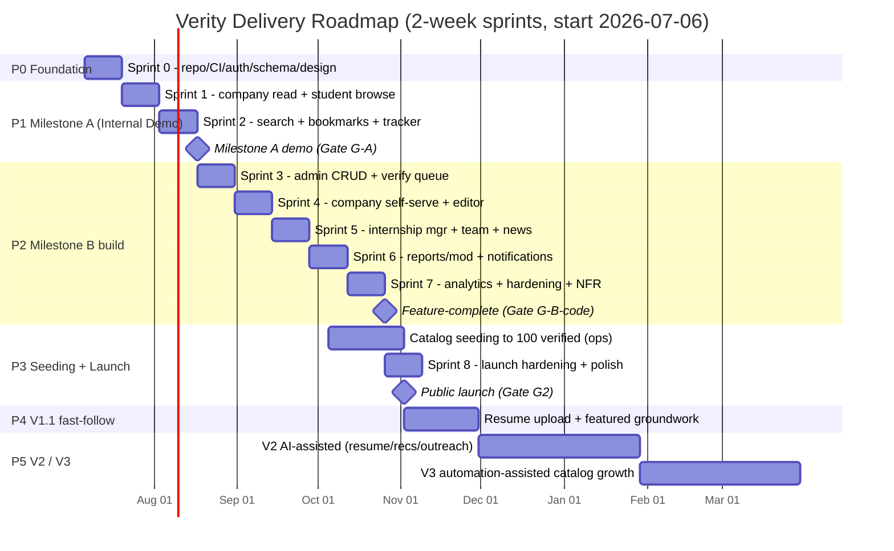
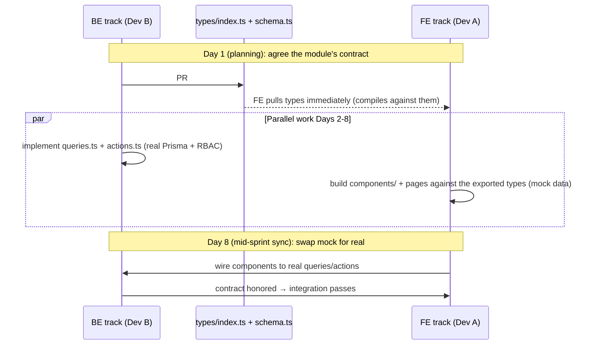
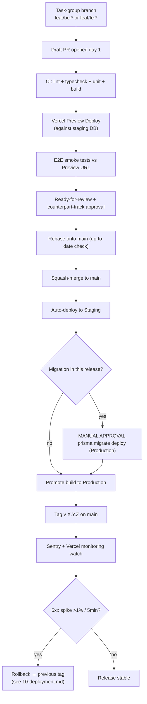

# 08 — Delivery Roadmap & Engineering Process

## Verity — Career Intelligence Platform

**Document:** 08-roadmap.md
**Version:** 1.0
**Status:** Draft for Engineering Sign-off
**Owner:** CTO / Head of Product
**Companion Documents:** 01-PRD.md (product truth), 02-TRD.md (implementation truth), 10-deployment.md (release ops)
**Last Updated:** 2026-07-03

**Tagline:** Discover. Research. Apply. — *and ship it with two people.*

---

## Table of Contents

1. Purpose & How to Read This Document
2. Team Model & the Two-Track Operating System
3. Product Timeline (phased) + Gantt
4. Milestones (scope, exit criteria, the G2 launch gate)
5. Sprint Planning (2-week sprints to Milestone B)
6. Git Workflow (trunk-based-ish, contract-first)
7. Branch Strategy (the .ts / .tsx fault line)
8. Feature Roadmap (every feature → milestone + FR + track)
9. Technical Debt Register (living)
10. Versioning (app semver + API /v1)
11. Release Plan (preview → staging → production) + release-flow diagram
12. Definition of Ready / Definition of Done
13. Risks to the Timeline + Mitigations
14. Appendix: Cadence, Ceremonies, and Estimation Reference

---

## 1. Purpose & How to Read This Document

This is the **delivery contract** for Verity V1. Where `01-PRD.md` says *what* to build and `02-TRD.md` says *how* it's architected, this document says **in what order, by whom, on which branch, behind which gate, and by when.**

It is written for a specific, unusual constraint that shapes every decision below: **Verity V1 is built by two engineers vibe-coding in parallel** — one owning the **frontend track** (`.tsx` pages and components) and one owning the **backend track** (`.ts` schema, queries, actions, API, lib). That is not a footnote; it is the organizing principle. Every process choice here — the branch naming, the contract-first rule, the file-ownership fault line, the sprint sync ritual — exists to let two people move fast in parallel *without stepping on each other*.

Three non-negotiable anchors this document is 100% consistent with:

- **Milestone A** (PRD §26) — the internal demo / hackathon-ready MVP: the student research loop on seeded data.
- **Milestone B** (PRD §26 + Acceptance Criteria §25) — the full V1 public launch: all three portals self-serve, all `M` FRs implemented.
- **The G2 launch gate** (PRD §4, §24) — **100+ verified companies before public/marketing launch.** Feature-completeness (Milestone B *code*) and launch (Milestone B *go-live*) are two distinct events separated by the catalog seeding effort. This document treats them separately on purpose.

The forward roadmap (V1.1 → V2 → V3) follows PRD §27 exactly and is included so V1 decisions never paint us into a corner (PRD G5).

---

## 2. Team Model & the Two-Track Operating System

### 2.1 The two tracks

| Track | Engineer | Owns (file globs) | Mental model |
|---|---|---|---|
| **BE — Backend** | Dev B | `prisma/**`, `features/*/schema.ts`, `features/*/queries.ts`, `features/*/actions.ts`, `app/api/**`, `lib/**`, `middleware.ts`, `config/roles.ts` | The contract & the data. "Nothing renders until I've shipped the types and the query signature." |
| **FE — Frontend** | Dev A | `app/**/*.tsx` (pages, layouts), `features/*/components/**`, `components/ui/**`, `components/shared/**`, `app/globals.css` | The surface & the interaction. "I consume BE's exported types and call BE's exported functions; I never invent a query." |

This maps 1:1 onto the TRD's four-layer feature-module structure (TRD §3.3):

```
features/<module>/
├── schema.ts       ← BE track   (Zod schemas = the shared contract)
├── queries.ts      ← BE track   (read-only Prisma, consumed by RSC)
├── actions.ts      ← BE track   (Server Actions: RBAC + Zod + Prisma)
└── components/     ← FE track   (the .tsx that renders it)
```

And onto the route tree (TRD §4): every `page.tsx` / `layout.tsx` under `app/(marketing|student|company|admin)/` is **FE-owned**; every `route.ts` under `app/api/` is **BE-owned**.

### 2.2 Why this fault line works

The seam between the two tracks is a **file-extension boundary that is also a language boundary in intent**: `.ts` (data/logic) vs `.tsx` (view). Two people editing disjoint file sets produce **near-zero merge conflicts** by construction. The only files both tracks legitimately touch are `types/index.ts` and `package.json` — §7 defines exactly how conflicts on those two are avoided.

### 2.3 Capacity assumptions (used for all sprint math in §5)

- **Sprint length:** 2 weeks = 10 working days per engineer.
- **Realistic productive capacity:** **7 "focus days" per engineer per sprint** (the other 3 absorbed by review, planning, demo, integration debugging, and life). So **14 focus-days of team capacity per sprint.**
- **Split:** ~7 FE focus-days + ~7 BE focus-days per sprint. Tracks are *not* fungible — an FE-heavy sprint cannot borrow BE capacity, so we balance scope per-track, not just in total.
- **No dedicated QA, PM, or designer.** The CTO/Head of Product (author of this doc) plays PM/designer part-time; design system decisions are pre-made in `03-design.md`. Both engineers own their own tests.
- **The 100-company seeding (G2)** is **operator work, not engineering work** (PRD §22 mitigation, FR-14 Admin CRUD path). It runs *in parallel* with late sprints and is not counted against the 14 focus-days.

---

## 3. Product Timeline (phased)

Six phases, foundation through V3. Dates below assume a start of **Mon 2026-07-06** and are planning targets, not commitments — the milestones and gates are the commitments; the dates are derived from the sprint math in §5.

| Phase | Window (planning) | Outcome | Gate to exit |
|---|---|---|---|
| **P0 — Foundation** | Sprint 0 (Wk 1–2) | Repo, CI, auth, schema, design primitives, middleware live | CI green on `main`; a seeded company renders on a hard-coded page |
| **P1 — Milestone A (Internal Demo)** | Sprints 1–2 (Wk 3–6) | Student research loop on seeded data | **Gate G-A** (§4.2) |
| **P2 — Milestone B build (Full V1)** | Sprints 3–7 (Wk 7–16) | All three portals self-serve, all `M` FRs done | **Gate G-B-code** (§4.3) |
| **P3 — Catalog seeding + launch** | Sprints 6–8, overlapping (Wk 12–18) | 100+ verified companies; NFR sign-off | **Gate G2 (public launch)** (§4.4) |
| **P4 — V1.1 fast-follow** | ~Wk 19–24 | Resume upload, featured groundwork, deadline nudges | §4.5 |
| **P5 — V2 / V3** | Q4 2026+ | AI-assisted, then automation-assisted | §4.6 / §4.7 |

### 3.1 Gantt



**Reading the Gantt:** note that **catalog seeding runs in parallel** with Sprints 6–8 (it starts once the Admin FR-14 CRUD path lands in Sprint 3 and the verification workflow lands in Sprint 4). This is the single most important scheduling decision in the whole plan: **the 100-company gate is the long pole, and it is operator-bound, not engineer-bound**, so it must start the moment the tooling exists — not after code-complete.

---

## 4. Milestones

Each milestone below lists **scope**, **exit criteria** (tied to concrete PRD FRs and Acceptance Criteria §25), and **which track carries it**.

### 4.1 Milestone 0 — Foundation (end of Sprint 0)

**Scope:** the skeleton both tracks build on. Not user-visible.

- BE: Prisma schema (TRD §10.2) committed and migrated; Clerk auth + `user.created` webhook (TRD §6); `lib/db.ts`, `lib/auth.ts`, `lib/rbac.ts`, `lib/logger.ts` stubs; `middleware.ts` role-gating (TRD §8); `config/roles.ts` permission matrix (TRD §7.3); `types/index.ts` seeded with core exported types; `prisma/seed.ts` with 3–5 fake companies + 1 admin.
- FE: design system primitives wired (`components/ui/**` from shadcn per TRD §4); the four route-group `layout.tsx` shells (marketing/student/company/admin); a sign-in/sign-up page mounting Clerk components; one hard-coded company profile page proving RSC → Prisma render works end-to-end.

**Exit criteria:**
- CI pipeline (TRD §19) green on `main`: lint + typecheck + unit + `next build` + Preview deploy.
- The custom structural ESLint rule (TRD §20) is active and passing.
- A seeded company from `seed.ts` renders on a Preview URL through the real RSC → Prisma path.
- Both engineers can run the app locally against a shared dev database.

### 4.2 Milestone A — Internal Demo / Hackathon-Ready MVP (end of Sprint 2) — **Gate G-A**

**Scope (verbatim to PRD §26 Milestone A):**
- **Student:** search, browse, view Company Profile (all modules read-only, per PRD §17), bookmark, basic Application Tracker (status changes only, **no notes**).
- **Company:** *manual seed only via Admin* — self-serve onboarding is **stubbed**; the demo catalog comes entirely from Admin FR-14 CRUD.
- **Admin:** Company Management CRUD (seed path, FR-14), Categories/Technologies management (FR-54), basic Verification Queue (a simple status toggle is acceptable if the full review UI isn't ready).

**FR coverage at Gate G-A:** FR-01, FR-02, FR-05 (auth basics) · FR-14 (admin seed CRUD) · FR-30, FR-31, FR-32, FR-34 (search/browse/dashboard modules) · FR-40, FR-41 (bookmarks) · FR-42 status-only (tracker, notes deferred) · FR-54 (taxonomy).

**Exit criteria (Gate G-A):**
1. On seeded data, a demo-driver can: land → sign up as Student → browse dashboard modules (Trending/Recommended/Recently-Added, rules-based per PRD §14.1) → search + filter → open a full Company Profile → bookmark → open an Internship detail → add it to the tracker → change its status. *(This is PRD §25 acceptance item #3, minus notes.)*
2. Admin can create/edit a company and its internships via FR-14 CRUD and manage the canonical taxonomy (FR-54).
3. Search returns relevant results via Postgres FTS (TRD §12) — **no** Elasticsearch/Algolia.
4. Rules-based Recommended module renders (or gracefully falls back to Recently-Added per PRD §23 edge case) — **no ML**.
5. Deployed to a stable Preview/staging URL, demoable without a local machine.

**Explicitly NOT required at Gate G-A:** self-serve company onboarding, full verification review UI, reports/moderation, notifications, company/admin analytics dashboards, tracker notes. These are Milestone B.

### 4.3 Milestone B — Full V1, Feature-Complete (end of Sprint 7) — **Gate G-B-code**

**Scope:** everything in PRD §25 Acceptance Criteria — all three portals fully self-serve; every `M` (Must) FR from PRD §12 implemented and testable.

**Exit criteria (Gate G-B-code) — maps directly to PRD §25's eight acceptance items:**

| PRD §25 item | Verity exit criterion | Owning track(s) |
|---|---|---|
| 1. Three portals, server-side role routing | Middleware RBAC (TRD §8) enforced; all four route groups live | BE (gate) + FE (shells) |
| 2. Company full lifecycle unassisted | signup → required fields → submit → (admin approve) → edit → publish internship → invite member → view analytics | FE + BE |
| 3. Student full lifecycle unassisted | signup → profile → search/filter/browse → profile view → bookmark → internship detail → tracker add → status update (**+ notes**, FR-43) | FE + BE |
| 4. Admin full lifecycle unassisted | verification queue → approve/reject/request-changes → taxonomy → resolve report → feature company → platform analytics | FE + BE |
| 5. All `M` FRs implemented + testable (per 09-testing) | FR checklist in §8 all ✅; Vitest + Playwright green | BE (logic) + FE (flows) |
| 6. All NFRs have a documented verification method | Load test (search p95<300ms), a11y audit (WCAG 2.1 AA), security review checklist attached | BE + FE |
| 7. 100+ verified companies before *public* launch | **Deferred to Gate G2** — code can be complete first | Ops (not eng) |
| 8. Zero dependence on scraping/AI | Full manual walkthrough passes with no external automation | BE (verified in review) |

**Critical distinction:** Gate G-B-code is **feature-complete**, not **launched**. Item #7 (the 100-company catalog) is intentionally *not* an exit criterion here — per PRD §25 item 7, "the platform itself may be technically feature-complete earlier." Launch is gated separately by G2 below.

### 4.4 Gate G2 — Public Launch Gate (catalog seeding complete)

**This is the single most important business gate in the document** (PRD G2, B4, §22 top risk, §24 headline metric).

**Gate G2 criteria — ALL must be true to flip public/marketing launch:**
1. **100+ companies at `verificationStatus = VERIFIED`** (PRD §24 headline target; the anti-thin-catalog mitigation from PRD §22).
2. Every verified company meets a minimum quality bar: all PRD §17 `(Req.)` fields populated, ≥1 founder, ≥1 location, ≥1 category — Admin discretion may hold thin-but-technically-complete profiles (PRD §22 mitigation).
3. Gate G-B-code already passed (feature-complete).
4. NFR sign-off complete (performance, a11y, security — PRD §25 item 6 / §13).
5. Rollback rehearsed once against staging (pointer: `10-deployment.md`).
6. Verification queue time-to-decision tooling live and instrumented (PRD §24, G4 — median <10 min target, measured post-seed).

**Why the gate is operator-bound:** the 100 companies are seeded via the FR-14 Admin CRUD path (available from Sprint 3) and pushed to VERIFIED via the verification workflow (available from Sprint 4). Seeding ~100 quality profiles at G4's <10-min-each target is **~17 operator-hours of data entry** — spread across Sprints 5–8 running in parallel with engineering. **Do not launch until this bar is met** (PRD §22, explicit).

### 4.5 V1.1 — Fast-Follow (still manual data) — PRD §27

**Scope (verbatim to PRD §27 V1.1):**
- In-app **resume upload** (storage only, no analysis) — the `StudentProfile.resumeUrl` field already exists (TRD §10.2), so this is UI + Cloudinary signed-upload wiring, **no migration** (PRD §21 forward-compat note).
- **Featured/sponsored placement groundwork** for future monetization (`Company.isFeatured` already exists; add a time-windowed `FeaturePlacement` concept — the schema seam is already there per PRD §23 feature-expiry edge case).
- **Expanded notification triggers** — deadline-approaching nudges (FR-61 family extended; `Internship.applicationDeadline` "Apply soon" treatment from PRD §18).

**Exit criteria:** resume file round-trips to Cloudinary and back; featured placement respects a start/end window server-side (PRD §23); deadline nudge fires via the existing `notify()` single call-site (TRD §25).

### 4.6 V2 — AI-Assisted, Human-in-the-Loop — PRD §27 / §21

**Scope:** AI Resume Analysis + Resume Matching; Personalized Cold Email / LinkedIn drafting; **true ML Company Recommendation Engine** (replacing V1's rules-based approximation, trained on V1's first-party `AnalyticsEvent` + search logs per PRD §19.3); Admin-side AI verification triage (auto-flag duplicates/fraud for human approval — never auto-publish).

**Architecture already reserved (TRD §22, §24):** worker queue for offline scoring, `pgvector` on the same Postgres, new `features/outreach/` + `features/recommendations/` modules, new `Recommendation` table — all additive, no rewrite (PRD G5).

### 4.7 V3 — Automation-Assisted Catalog Growth — PRD §27 / §23

**Scope:** permissioned scraping/enrichment that *suggests* (never auto-publishes) candidate companies/internships for human verification (preserving the trust thesis via a retained human gate); Browser Extension; Recruiter Dashboard (contingent on introducing in-app applications — a scope change from V1's external-ATS-only model).

**Architecture already reserved (TRD §23):** scraped rows write to the same `Company`/`Internship` tables with a `source: MANUAL | SCRAPED` field and reuse the existing `VerificationStatus` pipeline — no parallel review system.

---

## 5. Sprint Planning

### 5.1 Cadence & ceremonies (kept deliberately light for a 2-person team)

| Ceremony | When | Duration | Purpose |
|---|---|---|---|
| **Sprint planning** | Mon, Wk 1 | 60 min | Pull scope from §8 roadmap into the sprint; split into `be-*`/`fe-*` task groups; agree the **contract handshake** (which `types/index.ts` exports + query signatures BE ships first). |
| **Mid-sprint sync** | Mon, Wk 2 | 30 min | Integration checkpoint: does FE's consumption match BE's contract? Unblock. |
| **Async daily** | Every day | Written | One message each: yesterday / today / blockers. No standing meeting — two people vibe-coding don't need a daily call, they need a written trail. |
| **Sprint review + demo** | Fri, Wk 2 | 45 min | Demo against the sprint's exit criteria; record what shipped vs slipped. |
| **Retro** | Fri, Wk 2 | 15 min | One thing to keep, one to change. |

### 5.2 The per-sprint FE/BE sync ritual (the heart of the two-track model)

Every sprint runs on a **contract-first handshake** that lets the two tracks work in parallel without blocking:



**The rule that makes this safe:** BE **always ships the contract first** — the exported TypeScript types in `types/index.ts` and the function *signatures* in `queries.ts`/`actions.ts` (with stubbed bodies returning typed placeholders) land in a PR on **day 1–2 of the sprint**. FE compiles against those types from that moment, building UI with mock data, and swaps to the real implementation at the mid-sprint sync once BE's bodies are real. This is formalized as the **contract-first rule** in §6.4.

### 5.3 Sprint-by-sprint breakdown to Milestone B

Estimates are in **focus-days per track** (capacity: ~7 FE + ~7 BE per sprint, §2.3). "Contract" column = the `types/index.ts` exports + signatures BE ships day-1 for FE to consume.

---

#### **Sprint 0 — Foundation** (Wk 1–2) → Milestone 0

*Goal: skeleton both tracks build on. Nothing user-facing; everything else depends on this.*

| Track | Task group (branch) | Deliverables | Days |
|---|---|---|---|
| BE | `feat/be-foundation` | Prisma schema (TRD §10.2) + first migration; `add_search_vectors.sql` (TRD §10.4); `lib/db.ts`, `lib/auth.ts`, `lib/rbac.ts` (`can`/`assertCan`), `lib/logger.ts`; `middleware.ts` role gate; `config/roles.ts`; Clerk `user.created` webhook; `prisma/seed.ts` (admin + 5 companies + taxonomy) | 7 |
| FE | `feat/fe-foundation` | shadcn `components/ui/**`; 4 route-group `layout.tsx` shells; Clerk `<SignIn/>`/`<SignUp/>` pages; `unauthorized/page.tsx`; one hard-coded company profile page; `EmptyState`, `Navbar`, `Sidebar` in `components/shared` | 7 |
| Both | `chore/ci-bootstrap` | GitHub Actions (lint/typecheck/unit/build); the structural ESLint rule (TRD §20); Vercel project + Preview/staging DB; branch protection on `main` | shared |

**Contract handshake:** BE seeds `types/index.ts` with `CompanyCardDTO`, `CompanyProfileDTO`, `PlatformRole`, `CompanyMemberRole` (re-exported from Prisma enums). FE builds shells against these.
**Exit = Milestone 0 criteria (§4.1).**

---

#### **Sprint 1 — Company Read + Student Browse** (Wk 3–4)

*Goal: the read side of the student research loop on seeded data.*

| Track | Task group (branch) | Deliverables | FR | Days |
|---|---|---|---|---|
| BE | `feat/be-companies-read` | `features/companies/queries.ts` (list, by-slug, with founders/links/locations/tech/categories eager-load); `app/api/companies/route.ts` + `[slug]/route.ts` (public, paginated per TRD §9.2); DTO shaping in `types/index.ts` | FR-11 | 4 |
| BE | `feat/be-taxonomy` | `features/admin` category/technology `queries.ts`; canonical taxonomy read helpers | FR-54 (read) | 3 |
| FE | `feat/fe-company-profile` | Company Profile page (all PRD §17 modules read-only): Hero, About, Products, News, Funding, Hiring Timeline, Tech Stack, Founders/Team, Links, Locations | FR-11 | 4 |
| FE | `feat/fe-student-dashboard` | Student Dashboard modules (PRD §15.1): Categories chips, Recently Added, Latest Internships; module shells for Trending/Recommended | FR-34 | 3 |

**Contract handshake (day 1):** BE exports `CompanyProfileDTO`, `CompanyCardDTO`, `InternshipCardDTO`, `getCompanyBySlug()`/`listCompanies()` signatures. FE renders against mocks, swaps day 8.
**Exit:** a seeded company profile renders fully; student dashboard read-modules populate from real queries.

---

#### **Sprint 2 — Search + Bookmarks + Tracker** (Wk 5–6) → **Gate G-A (Milestone A demo)**

*Goal: complete the student research loop → internal demo ready.*

| Track | Task group (branch) | Deliverables | FR | Days |
|---|---|---|---|---|
| BE | `feat/be-search` | `lib/search.ts` Postgres FTS (`websearch_to_tsquery`, TRD §12); `app/api/search/route.ts` + `/suggest` typeahead; filter builder (category/tech/funding/remote/visa/location) | FR-30, FR-31, FR-32 | 4 |
| BE | `feat/be-bookmarks-tracker` | `features/bookmarks/{schema,queries,actions}.ts`; `features/applications/{schema,queries,actions}.ts` (status-only for Milestone A); RBAC-scoped to `userId` | FR-40, FR-41, FR-42 | 3 |
| FE | `feat/fe-search` | Search page: search bar + typeahead, filter sidebar, results grid, zero-result "browse by category" + "suggest a company" state (PRD §16) | FR-30–33 | 4 |
| FE | `feat/fe-bookmarks-tracker` | Bookmarks page (Companies/Internships tabs); Application Tracker Kanban + list toggle, drag-to-status; bookmark toggle buttons | FR-40–42 | 3 |

**Contract handshake:** BE exports `SearchParams`, `SearchResultDTO`, `BookmarkTargetType`, `ApplicationStatus`, and `toggleBookmark()`/`upsertApplication()` action signatures (returning the TRD §21 discriminated-union result).
**Exit = Gate G-A (§4.2).** Internal demo delivered end of Sprint 2.

---

#### **Sprint 3 — Admin CRUD + Verification Queue + Taxonomy Mgmt** (Wk 7–8)

*Goal: the seed path (FR-14) goes live so catalog seeding can START in parallel — the long pole begins here.*

| Track | Task group (branch) | Deliverables | FR | Days |
|---|---|---|---|---|
| BE | `feat/be-admin-companies` | Admin company CRUD `actions.ts` (create/edit on behalf, FR-14); suspend/unpublish; slug generation + duplicate-domain detection (FR-15) | FR-14, FR-15 | 4 |
| BE | `feat/be-verification` | `features/verification/{schema,queries,actions}.ts`: queue query, approve/request-changes/reject transitions on `VerificationStatus`; `/api/admin/verification-queue` | FR-50, FR-51 | 3 |
| FE | `feat/fe-admin-companies` | Admin Company Management screen: table + create/edit form (mirrors PRD §17 fields); Categories & Technologies management UI (CRUD + merge/rename) | FR-14, FR-54 | 4 |
| FE | `feat/fe-verification-queue` | Verification Queue UI (oldest-first, side-by-side review panel, external quick-links); Approve / Request-Changes / Reject with reason | FR-50, FR-51 | 3 |

**Contract handshake:** BE exports `VerificationStatus` transitions, `CompanyUpsertInput` (shared Zod), `verifyCompany()`/`requestChanges()`/`rejectCompany()` signatures.
**Exit:** an operator can seed a company and push it to VERIFIED. **→ Catalog seeding (P3) begins now, in parallel.**

---

#### **Sprint 4 — Company Self-Serve Onboarding + Profile Editor** (Wk 9–10)

*Goal: companies self-serve (PRD §25 item 2 begins); verification workflow closes the loop.*

| Track | Task group (branch) | Deliverables | FR | Days |
|---|---|---|---|---|
| BE | `feat/be-company-onboarding` | Company registration `actions.ts` (creates `Company` + `CompanyMember(OWNER)` + role elevation, single transaction, TRD §6); `PATCH` profile actions; re-verification-sensitive field logic (domain change → Pending, PRD §23) | FR-10, FR-12, FR-13, FR-16 | 4 |
| BE | `feat/be-cloudinary` | `lib/cloudinary.ts` signed upload presets (MIME/size, TRD §14); Cloudinary webhook; logo/media persistence | FR-16 | 3 |
| FE | `feat/fe-company-onboarding` | Multi-step guided onboarding form (required §17 fields); "Submitted for Verification" state; verification status banner (Pending/Changes/Verified/Rejected) with "what to fix" checklist | FR-10, FR-12, C8 | 4 |
| FE | `feat/fe-company-editor` | Company Profile Editor (autosave + "last saved"; per-section deep links from dashboard); logo/media upload UI | FR-13, FR-16 | 3 |

**Contract handshake:** BE exports `CompanyOnboardingInput` (shared Zod, multi-step), `registerCompany()`, `updateCompanyProfile()`, `getUploadSignature()` signatures.
**Exit:** a company self-serves signup → required fields → submit → Admin approves → edit. (PRD §25 item 2, first half.)

---

#### **Sprint 5 — Internship Manager + Team Members + Company News** (Wk 11–12)

*Goal: complete the company lifecycle (PRD §25 item 2, second half). Seeding continues in parallel.*

| Track | Task group (branch) | Deliverables | FR | Days |
|---|---|---|---|---|
| BE | `feat/be-internships` | `features/internships/{schema,queries,actions}.ts`: create (DRAFT) / publish (gated on VERIFIED, FR-22) / archive; staleness flag (FR-24); `/api/internships/*` | FR-20, FR-21, FR-22, FR-23, FR-24, FR-25 | 4 |
| BE | `feat/be-team-news` | `CompanyMember` invite/role/revoke/transfer-ownership actions (RBAC per TRD §7.2); `CompanyNews` CRUD | FR-04, FR-06 (invite via Clerk) | 3 |
| FE | `feat/fe-internship-manager` | Internship Manager table (Draft/Open/Closed), create/edit form, inline status toggles, archive; publish blocked-until-verified UX | FR-20–25 | 4 |
| FE | `feat/fe-team-news` | Team Members screen (invite by email, role assign, revoke, transfer-ownership confirm); Company News manager (title/body/link, last-10) | FR-04, C6 | 3 |

**Contract handshake:** BE exports `InternshipUpsertInput`, `publishInternship()`/`archiveInternship()`, `inviteMember()`/`setMemberRole()` signatures.
**Exit:** company completes publish-internship → invite-member. Student side now sees real Open internships on profiles.

---

#### **Sprint 6 — Reports/Moderation + Notifications** (Wk 13–14)

*Goal: trust & safety + the notification substrate (PRD §25 item 4 begins).*

| Track | Task group (branch) | Deliverables | FR | Days |
|---|---|---|---|---|
| BE | `feat/be-reports` | `Report` create action (any user); admin reports queue + resolution transitions (dismiss/warn/suspend/remove); moderation audit trail | FR-52, FR-53 | 3 |
| BE | `feat/be-notifications` | `Notification` table + `notify()` single call-site (TRD §25); Resend email for verification events; batched daily digest for new-internship-on-bookmarked-company (FR-61) | FR-60, FR-61, FR-62, FR-63 | 4 |
| FE | `feat/fe-reports` | Report submission modal (company/internship); Admin Reports queue UI + resolution actions | FR-52, FR-53 | 3 |
| FE | `feat/fe-notifications` | In-app notification center; company/student notification preferences; verification status notifications surfaced | FR-60–63 | 4 |

**Contract handshake:** BE exports `ReportInput`, `NotificationDTO`, `notify()` event-type union, resolution action signatures.
**Exit:** report → resolve loop works; verification decisions notify companies in-app + email.

---

#### **Sprint 7 — Analytics + Featuring + Hardening + NFR** (Wk 15–16) → **Gate G-B-code**

*Goal: close the last acceptance items; verify NFRs; feature-complete.*

| Track | Task group (branch) | Deliverables | FR | Days |
|---|---|---|---|---|
| BE | `feat/be-analytics` | `AnalyticsEvent` writes (PRD §19.3); company aggregate analytics (views/bookmarks/internship-views, anonymized per §13.6); admin platform analytics (counts, top search terms, queue throughput); `TrendingSnapshot` cron (TRD §13) | FR-70, FR-71, FR-72 | 4 |
| BE | `feat/be-featuring` | Feature Management actions with start/end window, server-side expiry check (PRD §23) | FR-55 | 1.5 |
| BE | `feat/be-hardening` | Rate limits (TRD §9.4); load test search p95<300ms; security review checklist (RBAC 3-layer, XSS sanitize, upload validation) | NFR §13 | 1.5 |
| FE | `feat/fe-analytics` | Company Analytics dashboard (cards + trend chart); Admin Platform Analytics (KPI cards + charts); Feature Management UI | FR-70–72, FR-55 | 4.5 |
| FE | `feat/fe-hardening` | Tracker **notes** (FR-43); a11y audit pass (WCAG 2.1 AA, PRD §13.5); `error.tsx` per route group (TRD §21); empty/loading states sweep | FR-43, NFR §13.5 | 2.5 |

**Exit = Gate G-B-code (§4.3):** all `M` FRs ✅; Playwright critical-path suite green; NFR verification methods documented. **Feature-complete.**

---

#### **Sprint 8 — Launch Hardening + Polish** (Wk 17–18) — overlaps seeding tail

*Goal: bridge from feature-complete to G2 launch. Buffer for slip + polish.*

| Track | Task group (branch) | Deliverables | Days |
|---|---|---|---|
| BE | `feat/be-launch` | Backup/restore rehearsal (→ 10-deployment); production migration dry-run; queue-throughput/verification-time instrumentation validated against real seeded data | 5 |
| FE | `feat/fe-launch` | Performance pass (LCP<2.0s public pages, PRD §13.1); SEO metadata on public company/internship pages; final polish sweep; marketing landing page | 5 |
| Ops | — | Finish seeding to 100+ verified; quality audit each profile | (parallel) |

**Exit = Gate G2 (§4.4): public launch.**

### 5.4 Slip policy

If a sprint slips, **protect Gate G-A and Gate G2, sacrifice `S`/`C` FRs first** (PRD §12 MoSCoW). Never cut an `M` FR to hit a date — cut a `Should` (e.g., FR-24 staleness flag, FR-55 featuring, FR-61/62 secondary notifications, most-bookmarked sort) or defer to V1.1. The 100-company gate is immovable; the code-complete date can flex into the Sprint 8 buffer.

---

## 6. Git Workflow

### 6.1 Model: trunk-based-ish with a protected trunk

- **`main` is the trunk and is always deployable.** It is the source of Production. There are **no long-lived `develop`/`release` branches** — a two-person team cannot afford the merge overhead of git-flow, and the TRD's CI/CD (TRD §19) is built around PR-to-`main`.
- **Short-lived task-group branches** (§7) branch off `main`, live **≤ 1 sprint** (ideally 2–4 days), and merge back via PR. If a branch outlives a sprint, it was scoped wrong — split it.
- **PR-only into `main`.** Direct pushes to `main` are blocked by branch protection. Even a one-line fix goes through a PR (it can be self-reviewed for trivial `chore/*`, see §6.3).

### 6.2 Branch protection on `main` (GitHub settings)

- ✅ Require a pull request before merging.
- ✅ Require status checks to pass: **lint, typecheck, unit, `next build`, Preview deploy, E2E smoke** (exactly the TRD §19 pipeline).
- ✅ Require the structural ESLint rule to pass (TRD §20 — no `actions.ts` importing `prisma` without `lib/rbac`).
- ✅ Require branch to be up to date with `main` before merge (forces rebase, §6.5).
- ✅ Require ≥1 approving review (the *other* engineer) for any PR touching the counterpart track's files or the shared files (§7.4). Same-track trivial `chore/*`/`docs/*` may self-merge.
- ✅ Require linear history (no merge commits — squash-merge only, §6.3).
- 🚫 No force-push, no branch deletion of `main`.

### 6.3 Commit & merge conventions

**Conventional Commits**, with a track prefix scope so history is greppable by track:

```
<type>(<scope>): <subject>

feat(be/internships): add publish action gated on VERIFIED status
feat(fe/internships): internship manager table with inline status toggle
fix(be/search): escape websearch operators in tsquery builder
chore(ci): add structural eslint rule for actions.ts rbac import
docs(roadmap): add sprint 5 breakdown
refactor(lib): extract notify() single call-site
test(be/bookmarks): integration test for userId-scoped bookmark
```

- **Types:** `feat`, `fix`, `chore`, `docs`, `refactor`, `test`, `perf`.
- **Scope:** `be/<module>`, `fe/<module>`, `ci`, `lib`, `db`, `roadmap`, etc. The `be/`|`fe/` prefix mirrors the track ownership so `git log --oneline | grep 'be/'` reconstructs one track's history.
- **Merge strategy: squash-merge only.** Each PR becomes exactly one commit on `main` (linear history, §6.2). The PR title is the squash commit subject and must be a valid Conventional Commit.
- **Breaking API change** (touches `/api/v1` contract): footer `BREAKING CHANGE:` + triggers the versioning discussion in §10.

### 6.4 The contract-first rule (the load-bearing rule of the two-track model)

> **Backend ships the contract before frontend consumes it.** For any feature, the BE track's **first PR of the sprint** exports (a) the TypeScript types in `types/index.ts` and (b) the *function signatures* in `queries.ts` / `actions.ts` — with stubbed-but-typed bodies. This PR merges to `main` on **day 1–2**.

Consequences, enforced by convention + review:
- FE **never** invents a query shape or a DTO. If FE needs a field, FE requests it; BE adds it to the exported type. The type is the negotiation surface.
- FE branches can compile and build against `main`'s types the moment the contract PR lands, using mock data, **before BE's real implementation exists**. This is what makes the two tracks genuinely parallel rather than FE-waits-for-BE.
- A `queries.ts`/`actions.ts` file may merge with a stubbed body (returning a typed placeholder + `// TODO: real impl`) **only** in the contract PR; the follow-up implementation PR must fill it before the sprint's exit criteria.
- The structural ESLint rule (TRD §20) still applies to stubs: even a stubbed `actions.ts` must import `lib/rbac` if it imports `prisma`.

**Why this is a rule and not a suggestion:** it eliminates the #1 failure mode of a split FE/BE team — the frontend building against a guessed shape, the backend building a different real shape, and a painful integration merge at sprint end. Here, the shape is agreed and merged to trunk on day 1.

### 6.5 Rebase policy

- **Rebase, don't merge, to stay current.** Task-group branches keep up with `main` via `git pull --rebase origin main` (branch-protection requires up-to-date-before-merge, §6.2). This keeps history linear and makes the squash-merge clean.
- **Never rebase a branch someone else has based work on.** In practice the two tracks touch disjoint files (§7), so cross-track shared branches are rare; when they exist (e.g., a shared refactor), coordinate in the daily async before rebasing.
- **Force-push is allowed on your own task-group branch only** (`git push --force-with-lease`), never on `main`.
- **Resolve conflicts on your branch, not in the merge.** Because you rebase onto `main` before opening/merging the PR, any conflict surfaces on your branch where you own it — `main` never carries a conflict resolution commit.

### 6.6 Draft PRs opened immediately

Every task-group branch opens a **draft PR on its first commit** (§7.3) — before the work is done. This gives: an early Preview deploy for the *other* engineer to eyeball, a running CI signal, and a visible "what's in flight" board with no separate tooling. Mark "Ready for review" only when the DoD (§12) is met.

---

## 7. Branch Strategy

### 7.1 Naming convention

```
<type>/<track>-<task-group>
```

| Pattern | Track | Example |
|---|---|---|
| `feat/be-*` | Backend | `feat/be-internships`, `feat/be-verification`, `feat/be-search` |
| `feat/fe-*` | Frontend | `feat/fe-internship-manager`, `feat/fe-verification-queue` |
| `fix/be-*` / `fix/fe-*` | Either | `fix/be-search-operator-escape` |
| `chore/*` | Shared infra (no track) | `chore/ci-bootstrap`, `chore/deps-bump` |
| `docs/*` | Docs | `docs/roadmap` |

The **`be-`/`fe-` infix is mandatory** on `feat`/`fix` branches: it makes the branch's file-footprint predictable and lets a reviewer know, before opening, whether it touches their track.

### 7.2 One branch per task group (not per file, not per feature-epic)

A **task group** = the unit of work in the §5 sprint tables (e.g., `feat/be-internships` = schema + queries + actions for the internships module). It is:
- **Bigger than one file** (a whole module slice), so a feature is coherent in one PR.
- **Smaller than a whole feature across both tracks** (BE and FE each get their own branch for the same feature — `feat/be-internships` and `feat/fe-internship-manager` — so the two tracks never share a branch and never conflict).
- **Scoped to ≤ 1 sprint.** If it can't land in a sprint, split it (§6.1).

### 7.3 Draft PR opened immediately

On the first commit of a task-group branch, open a **draft PR** (§6.6). Title uses the Conventional-Commit subject that will become the squash commit. The draft gives both engineers a live Preview URL and CI signal from minute one.

### 7.4 The file-ownership fault line (how conflicts are avoided by construction)

The two tracks own **disjoint file sets**, so parallel branches don't conflict:

| Owned by BE (`.ts`) | Owned by FE (`.tsx`) |
|---|---|
| `prisma/**` | `app/**/page.tsx`, `app/**/layout.tsx` |
| `features/*/schema.ts` | `features/*/components/**` |
| `features/*/queries.ts` | `components/ui/**` |
| `features/*/actions.ts` | `components/shared/**` |
| `app/api/**/route.ts` | `app/globals.css` |
| `lib/**` | |
| `middleware.ts`, `config/roles.ts` | |

Because a company feature is split into `feat/be-*` (only `.ts`) and `feat/fe-*` (only `.tsx`), **the two in-flight branches for the same feature edit non-overlapping files** — git merges them trivially. This is the entire reason the extension-based fault line exists.

### 7.5 The only two shared files — and how conflicts on them are avoided

Exactly two files are legitimately touched by both tracks:

**1. `types/index.ts`** — the shared contract surface.
- **Rule:** only **BE writes** to it (the contract-first rule, §6.4). FE **reads** it (imports types) but does not add or edit type definitions there. If FE needs a new/changed type, FE asks BE (in the daily async or the mid-sprint sync) and BE lands it in the contract PR.
- **Result:** `types/index.ts` has a **single writer**, so it never has a two-track conflict. FE branches only ever *import* from it, which is not an edit.
- **Structure discipline:** organized by module with clear section headers, and types are *appended within a module's section* rather than reordered, so even successive BE PRs rarely conflict with each other.

**2. `package.json`** — dependencies.
- **Rule:** dependency changes are **isolated into their own `chore/deps-*` branch**, merged first, before either track rebases onto it. Neither `feat/be-*` nor `feat/fe-*` branches add dependencies inline.
- **Convention:** when a dependency is needed mid-sprint, the needing engineer opens a tiny `chore/deps-add-<pkg>` PR, it merges within the hour, and both engineers `pull --rebase`. Because these PRs are small and short-lived, the conflict window on `package.json`/lockfile is measured in minutes.
- **Lockfile:** commit the lockfile; resolve any lockfile conflict by re-running the install after taking `main`'s `package.json`, never by hand-merging the lockfile.

### 7.6 Branch lifecycle summary

```
main (protected, always deployable)
  ├── feat/be-internships   ← Dev B, .ts only, draft PR day 1 (contract), impl by day 8
  ├── feat/fe-internship-manager ← Dev A, .tsx only, builds on merged contract
  ├── chore/deps-add-recharts    ← tiny, merges in minutes
  └── (both rebase onto main before merge; squash-merge; branch auto-deleted)
```

---

## 8. Feature Roadmap

Every V1 feature mapped to its **milestone**, **PRD FR id(s)**, **owning track(s)**, and the **sprint** it lands in. `M`/`S`/`C` = PRD §12 MoSCoW priority.

| # | Feature | FR id(s) | Prio | Milestone | Track | Sprint |
|---|---|---|---|---|---|---|
| 1 | Clerk auth (email/OAuth), 3 account types, admin-only elevation | FR-01, FR-02, FR-05 | M | A | BE | 0 |
| 2 | Password reset / email update (Clerk flows) | FR-06 | M | B | BE | 0/4 |
| 3 | Account deactivation / suspension | FR-07 | S | B | BE | 6 |
| 4 | Company team members + sub-roles (Owner/Recruiter) | FR-04 | M | B | BE+FE | 5 |
| 5 | Company profile CRUD — required + optional fields | FR-10, FR-11 | M | A(read)/B(write) | BE+FE | 1 / 4 |
| 6 | Pending→Verified visibility gating | FR-12 | M | B | BE | 4 |
| 7 | Edit verified profile (no re-verify unless flagged) | FR-13 | S | B | BE+FE | 4 |
| 8 | Admin seed-path company CRUD | FR-14 | M | A | BE+FE | 3 |
| 9 | Duplicate-domain detection | FR-15 | M | B | BE | 3 |
| 10 | Cloudinary logo/media upload | FR-16 | M | B | BE+FE | 4 |
| 11 | Internship CRUD + lifecycle (Draft/Open/Archived) | FR-20, FR-21, FR-23 | M | B | BE+FE | 5 |
| 12 | Publish gated on company VERIFIED | FR-22 | M | B | BE | 5 |
| 13 | Internship staleness auto-flag | FR-24 | S | B | BE | 5 |
| 14 | External-ATS "Apply" deep-link (no in-app form) | FR-25 | M | A | FE | 1 |
| 15 | Full-text company search (name/desc/category/tech) | FR-30 | M | A | BE+FE | 2 |
| 16 | Search filters (category/tech/funding/remote/visa/size/location) | FR-31 | M | A | BE+FE | 2 |
| 17 | Sort (relevance / recent / trending-stretch) | FR-32 | M | A | BE+FE | 2 |
| 18 | Aggregate search-query logging | FR-33 | S | B | BE | 7 |
| 19 | Dashboard modules (Trending/Recommended/Recently-Added) | FR-34 | M | A | BE+FE | 1 |
| 20 | Company bookmarks | FR-40 | M | A | BE+FE | 2 |
| 21 | Internship bookmarks | FR-41 | M | A | BE+FE | 2 |
| 22 | Application tracker (status) | FR-42 | M | A | BE+FE | 2 |
| 23 | Tracker status updates + private notes | FR-43 | M | B | BE+FE | 2 / 7 |
| 24 | Tracker privacy (student-only) | FR-44 | M | A | BE | 2 |
| 25 | Admin verification queue + review UI | FR-50, FR-51 | M | A(basic)/B(full) | BE+FE | 3 |
| 26 | User-submitted reports | FR-52 | M | B | BE+FE | 6 |
| 27 | Admin reports/moderation queue | FR-53 | M | B | BE+FE | 6 |
| 28 | Canonical categories/technologies mgmt (+merge/rename) | FR-54 | M | A | BE+FE | 3 |
| 29 | Featured companies (time-windowed) | FR-55 | S | B | BE+FE | 7 |
| 30 | Verification-status notifications | FR-60 | M | B | BE+FE | 6 |
| 31 | New-internship-on-bookmarked-company digest | FR-61 | S | B | BE | 6 |
| 32 | Team-invite-accepted notification | FR-62 | S | B | BE | 6 |
| 33 | In-app + email notifications (no push/SMS) | FR-63 | M/W | B | BE+FE | 6 |
| 34 | Company analytics (views/bookmarks/internship-views) | FR-70, FR-71 | M | B | BE+FE | 7 |
| 35 | Admin platform analytics | FR-72 | M | B | BE+FE | 7 |
| 36 | Rules-based recommendations (NOT ML) | (FR-34) | M | A | BE+FE | 1/7 |

**Track legend:** BE = `.ts` (schema/queries/actions/api/lib); FE = `.tsx` (pages/components); BE+FE = both tracks, split into a `feat/be-*` and a `feat/fe-*` branch per §7.2.

---

## 9. Technical Debt Register (living)

These are **deliberate V1 shortcuts** — each is a conscious trade sanctioned by the PRD/TRD, not an accident. Each row has a **trigger** (the measured signal that says "pay this down now") and a **payoff path** (the already-reserved architecture). Update this table every retro.

| # | Debt (V1 shortcut) | Why it's acceptable in V1 | Trigger to pay it down | Payoff path | Ref |
|---|---|---|---|---|---|
| TD-1 | **Postgres FTS, not Elasticsearch/Algolia** | Sub-50ms at 100–10k companies; no second system to run/sync; write-consistent so new listings are instantly searchable | Search p95 latency degrades past ~300ms **or** company count > ~10k rows **or** semantic ("like Stripe") search needed | Migrate to Typesense/Meilisearch first (ES only if relevance grows); FTS becomes a fast pre-filter, not thrown away | TRD §12, §26; PRD §16 |
| TD-2 | **Rules-based recommendations, not ML** | Sparse V1 data would train a garbage model; rules (interest/major × category/tech + recency + featured) are honest and debuggable | Enough first-party `AnalyticsEvent` + engagement data accumulated to train a real model (V2 trigger) | New `Recommendation` table scored offline by a worker; rules become the cold-start fallback | PRD §14.1, §19.3, §21, §27; TRD §22 |
| TD-3 | **No background queue** (only Vercel Cron for Trending snapshots) | V1 has no AI scoring, no scraping, no bulk sends — synchronous request/response suffices | AI scoring / scraping / bulk notification volume outgrows synchronous request limits | Managed queue (Vercel Queue / QStash / Inngest), not self-hosted Redis+BullMQ | TRD §24 |
| TD-4 | **Manual data entry** (no scraping) | Trust is the product; the catalog is seeded by hand to 100 (G2) to guarantee quality | Manual entry can't keep pace past a few hundred companies without disproportionate operator effort | V3 permissioned scraper writes `source: SCRAPED` rows into the *same* tables behind the existing `VerificationStatus` human gate | PRD §22, §27; TRD §23 |
| TD-5 | **Rules/convention-enforced module boundaries** (not compiled) | One structural ESLint rule (actions↔rbac) is enough at 2 devs; full architectural fitness functions are overkill | Team grows past ~4 or a cross-module import causes a real bug | Add more lint fitness-functions; consider extracting modules per TRD §5's "splittable monolith" seam | TRD §3.3, §5, §20 |
| TD-6 | **Trending/Recommended via scheduled snapshot table** | Keeps dashboard reads O(1); avoids live aggregation on every load | Snapshot staleness becomes user-visible or cron cadence too coarse | Move to materialized views / incremental aggregation (same technique already reserved for analytics) | TRD §13, §26 |
| TD-7 | **Company analytics via live Prisma aggregation** | Fine at V1 volumes; simplest correct thing | Company Dashboard analytics queries slow down | Scheduled materialized-view / summary-table pattern (same as Trending) | TRD §26 |
| TD-8 | **Single-region Vercel + one Postgres, no read replicas** | 99.5% uptime target met single-region; no multi-region requirement in V1 | Postgres CPU/connection saturation | Add Prisma Accelerate/PgBouncer pooling, then read replicas for public GETs, before any multi-region write architecture | PRD §13.2/13.3; TRD §26 |
| TD-9 | **No in-app applications (external ATS deep-link only)** | Matches "no automation in V1"; tracker is a private manual log | V3 Recruiter Dashboard requires applicant-side data (explicit scope change) | Introduce in-app application entity + recruiter views (V3) | PRD §27; TRD §10.3 |
| TD-10 | **Resume field exists but no upload UI in V1** | Forward-compat: `StudentProfile.resumeUrl` in schema now, UI deferred to avoid a V2 migration | V1.1 resume-upload feature scheduled | Wire Cloudinary signed upload to the existing field — no migration | PRD §21, §27; TRD §10.2 |
| TD-11 | **Notifications: polling/on-navigation, no realtime** | Sufficient for V1 volumes; no websockets to operate | Notification latency becomes a UX complaint at scale | `notify()` single call-site already abstracts channels; add realtime/push transport there | PRD §20; TRD §25 |

---

## 10. Versioning

### 10.1 Application semver

Verity the app follows **Semantic Versioning** (`MAJOR.MINOR.PATCH`), interpreted for a product (not a library):

- **MAJOR** — a change that breaks a user's saved workflow or removes a portal capability (rare; e.g., a data-model migration that invalidates saved tracker states). V1 → V2 (AI) is a MAJOR bump only if it changes existing behavior, not merely adds features.
- **MINOR** — a new backward-compatible feature set. **V1.0.0 = Milestone B launch. V1.1.0 = the fast-follow** (resume upload, featured groundwork, deadline nudges — PRD §27). New FRs that don't break existing flows are MINOR bumps.
- **PATCH** — bug fixes, copy, performance, a11y, non-behavioral polish.

**Milestone → version map:**

| Version | Meaning | Gate |
|---|---|---|
| `0.1.0` | Milestone 0 (foundation, internal only) | Milestone 0 |
| `0.5.0` | Milestone A (internal demo) | Gate G-A |
| `0.9.0` | Feature-complete, pre-catalog | Gate G-B-code |
| `1.0.0` | **Public launch** | **Gate G2** |
| `1.1.0` | Fast-follow | PRD §27 V1.1 |
| `2.0.0` | AI-assisted (behavior-changing) | PRD §27 V2 |
| `3.0.0` | Automation-assisted catalog | PRD §27 V3 |

### 10.2 API versioning (`/api/v1`)

Per TRD §9.1: **all routes are implicitly `v1`** (served under `/api/*` in V1). The contract:

- A **breaking change to a public endpoint** (removing a field, changing a type, changing auth semantics) **introduces `/api/v2/*`** — it **never mutates `v1` in place**. `v1` stays alive for existing consumers (the future browser extension / mobile clients, TRD §9.1) until they migrate.
- **Additive changes** (new optional query param, new field in a response, new endpoint) are **not** breaking and stay on `v1`.
- Every breaking API PR carries a `BREAKING CHANGE:` commit footer (§6.3) and a note in this document's changelog.
- The app version and the API version are **decoupled**: the app can go `1.0 → 1.1` while the API stays `v1`. The API only bumps to `v2` when a consumer-visible contract breaks.

### 10.3 Release tagging

- Every Production deploy is tagged `v<MAJOR>.<MINOR>.<PATCH>` on the squash-merge commit on `main` (annotated git tag), created by the Production promotion step (§11).
- Tags are immutable; a bad release is fixed forward with a new PATCH tag, or rolled back to the previous tag (pointer: `10-deployment.md`), never by re-tagging.
- Prisma migrations are named with the version they ship in (`<timestamp>_v1_1_add_feature_placement`) so a tag ↔ schema state is reconstructable.

---

## 11. Release Plan

### 11.1 Environments (TRD §18)

| Environment | Trigger | Database | Purpose |
|---|---|---|---|
| **Preview** | Every PR (Vercel Git integration) | Seeded **staging** DB (never Production) | Per-PR review + E2E smoke target |
| **Staging** | Merge to `main` | Staging DB | Integration soak; the "always-green trunk" runs here continuously |
| **Production** | Manual promotion of a `main` build | Production DB | Live users |

### 11.2 Release flow



### 11.3 The migration-gating step (critical)

Per TRD §18/§19: **Prisma migrations run as a Vercel build step gated behind a manual approval for Production** — to avoid an in-flight migration racing a deploy under load. Concretely:

- Migrations auto-apply to **Preview/Staging** (disposable data).
- For **Production**, `prisma migrate deploy` is a **manually-approved** step in the promotion flow (§11.2 diamond). The promoting engineer confirms: (a) the migration is backward-compatible with the *currently-running* Production code (expand-then-contract for any column drop), and (b) it has been rehearsed on staging.
- **Expand/contract discipline:** schema changes ship in two releases when destructive — release N adds the new column and dual-writes; release N+1 removes the old one — so a rollback of code never hits a schema it can't read.

### 11.4 Rollback

Rollback procedure lives in **`10-deployment.md`** (pointer per TRD §18). Summary: Vercel instant-rollback to the previous Production deployment (previous git tag); if a migration was involved, the contract step (§11.3) guarantees the previous code runs against the new schema, so code-rollback is safe without a schema-rollback in the common case. Sentry alerting (>1% 5xx over 5 min, TRD §17) pages the on-call founder-engineer to trigger it.

### 11.5 Release cadence

- **Continuous to Staging** — every merge to `main` deploys to Staging automatically (trunk is always deployable, §6.1).
- **Production promotion on demand** — during the build phase (Sprints 0–7), promote at least once per sprint (at sprint review) so Production is never more than a sprint behind Staging. Post-launch, promote as often as a green `main` + a reviewed migration allows.
- **No Friday-afternoon Production promotions** for anything carrying a migration (two-person team = thin on-call; don't gate a risky change on a weekend).

---

## 12. Definition of Ready / Definition of Done

### 12.1 Definition of Ready (a task may enter a sprint only if…)

- [ ] It maps to a specific **FR id** (or explicit NFR / tech-debt row) — no orphan work.
- [ ] It has an owning **track** (BE / FE / both-split-into-two-branches).
- [ ] Its **milestone** and **sprint** are assigned (from §5 / §8).
- [ ] For a BE+FE feature: the **contract** (types + signatures BE ships day-1) is identified.
- [ ] Acceptance is expressed as a **testable behavior** (a Playwright/Vitest assertion can be written for it).
- [ ] Dependencies are landed or scheduled earlier (e.g., FE-editor DoR requires BE-onboarding contract merged).
- [ ] It fits in **≤ 1 sprint** for its track; if not, it's split.

### 12.2 Definition of Done (a PR may leave draft & merge only if…)

**Universal (both tracks):**
- [ ] CI green: lint + typecheck + unit + `next build` + Preview deploy + E2E smoke (TRD §19).
- [ ] Structural ESLint rule passes (no `actions.ts` importing `prisma` without `lib/rbac`, TRD §20).
- [ ] Conventional-Commit-titled, squash-ready (§6.3).
- [ ] Rebased onto latest `main` (§6.5); no conflicts.
- [ ] Counterpart-track / shared-file changes reviewed & approved (§6.2).
- [ ] No new `S`/`C` scope silently added to an `M` task.

**BE track additionally:**
- [ ] Every mutation enforces the **three RBAC layers** (middleware + `assertCan` + Prisma `WHERE`-scope, TRD §7.4).
- [ ] Input validated by a **Zod schema** before Prisma (TRD §14); no raw `request.json()` reaches the DB.
- [ ] Server Action returns the **discriminated-union result** shape (TRD §21); Route Handler uses `withErrorHandling` + the standard error envelope (TRD §9.3).
- [ ] **Integration test** (Vitest + test Postgres) covers the happy path + one RBAC-denied path (TRD §20).
- [ ] Exported types/signatures updated in `types/index.ts` (contract honored, §6.4); pagination present on any list endpoint (TRD §9.1).
- [ ] Migration (if any) is expand/contract-safe and rehearsed on staging (§11.3).

**FE track additionally:**
- [ ] Consumes **only** BE-exported types/functions (no invented query shapes, §6.4).
- [ ] Loading, empty, and error states present (never a broken/empty dead-end — PRD §16, §23).
- [ ] Keyboard-navigable; meets **WCAG 2.1 AA** contrast on student-facing pages (PRD §13.5).
- [ ] Server Components by default; Client Components only where interactive (TRD §15).
- [ ] Images via Cloudinary `f_auto,q_auto` + `next/image` (TRD §15).
- [ ] Matches the design system (`03-design.md`); no ad-hoc one-off styles.

**Feature-level DoD (both tracks green together):**
- [ ] The FR's end-to-end flow demoable on the Preview URL.
- [ ] A Playwright assertion added to the critical-path suite if it's on an acceptance-criteria flow (PRD §25).

---

## 13. Risks to the Timeline + Mitigations

Timeline risks, each tied to a PRD §22 product risk where applicable. Owner column: **CTO** = author/operator, **BE**/**FE** = respective engineer.

| # | Timeline risk | Likelihood | Impact | Mitigation | Owner | PRD §22 link |
|---|---|---|---|---|---|---|
| R1 | **Catalog seeding (G2) is the long pole and slips launch** — code is done but < 100 verified companies | High | High | Start seeding in **Sprint 3** the moment FR-14 CRUD lands (not after code-complete); track verified-count as a burn-up from day one; seeding is operator work parallel to eng (§4.4) | CTO | "Catalog stays too thin" (top risk) |
| R2 | **FE blocked waiting on BE** (the classic split-team failure) | Medium | High | **Contract-first rule** (§6.4): BE ships types + signatures day-1; FE builds against mocks; swap at mid-sprint sync (§5.2) | BE | — |
| R3 | **Merge conflicts between tracks eat velocity** | Low | Medium | **`.ts`/`.tsx` fault line** (§7.4) makes file sets disjoint; only `types/index.ts` (single-writer=BE) and `package.json` (isolated `chore/deps-*` PRs) are shared (§7.5) | Both | — |
| R4 | **Verification queue tooling underbuilt → seeding is slow** (G4 <10-min-each not met) | Medium | Medium | Verification workflow (Sprint 4) + queue-throughput instrumentation (Sprint 7) prioritized; basic status-toggle acceptable for Milestone A to unblock early seeding | BE+FE | "Verification queue bottleneck" |
| R5 | **2-dev capacity overrun** — a sprint's scope exceeds 7 focus-days/track | Medium | Medium | Slip policy (§5.4): protect Gate G-A + G2, cut `S`/`C` FRs first (FR-24, FR-55, FR-61/62); Sprint 8 is an explicit buffer | CTO | — |
| R6 | **Search relevance/perf under-delivers** (p95 > 300ms as catalog grows) | Low | Medium | Postgres FTS with GIN + weighting (TD-1) is sized for ≤10k companies; load test in Sprint 7; migration path pre-documented (TD-1) — not a launch blocker at 100 companies | BE | — |
| R7 | **Stale internships erode trust before enforcement lands** | Medium | High | Posted Date shown on every listing (transparency) from Sprint 5; FR-24 staleness flag (S) as fast-follow if it slips | FE+BE | "Stale listings erode trust" |
| R8 | **Scope creep from V1.1/V2 features leaking into V1** (e.g., "just add resume analysis") | Medium | High | Hard scope wall: §8 table is the V1 contract; anything not in it is V1.1+ (§4.5–4.7); resume upload is storage-only even in V1.1 | CTO | "Manual entry doesn't scale" (deferred by design) |
| R9 | **Migration races a deploy → Production incident** | Low | High | Manual-approval migration gate (§11.3) + expand/contract discipline + staging rehearsal; rollback rehearsed in Sprint 8 (→10-deployment) | BE | — |
| R10 | **Low-effort/incomplete company profiles hurt launch quality** | Medium | Medium | Profile-completeness score (nudge) + Admin discretion to hold thin profiles at the G2 quality bar (§4.4 criterion 2) | CTO | "Low-effort profiles" |
| R11 | **Duplicate company submissions during self-serve** | Medium | Low | Domain-based duplicate detection (FR-15, Sprint 3); Admin merge tooling as fallback | BE | "Duplicate submissions" |
| R12 | **Single-founder-eng bus factor / illness in a 2-person team** | Low | High | Contract-first + disjoint files mean either engineer can read the other's contract; async written daily = a durable trail; no undocumented tribal state | Both | — |

---

## 14. Appendix: Cadence, Ceremonies & Estimation Reference

### 14.1 Sprint calendar (planning targets)

| Sprint | Weeks | Dates (from 2026-07-06) | Milestone gate at end |
|---|---|---|---|
| 0 | 1–2 | Jul 06 – Jul 17 | Milestone 0 |
| 1 | 3–4 | Jul 20 – Jul 31 | — |
| 2 | 5–6 | Aug 03 – Aug 14 | **Gate G-A (Milestone A demo)** |
| 3 | 7–8 | Aug 17 – Aug 28 | seeding starts |
| 4 | 9–10 | Aug 31 – Sep 11 | — |
| 5 | 11–12 | Sep 14 – Sep 25 | — |
| 6 | 13–14 | Sep 28 – Oct 09 | — |
| 7 | 15–16 | Oct 12 – Oct 23 | **Gate G-B-code (feature-complete)** |
| 8 | 17–18 | Oct 26 – Nov 06 | **Gate G2 (public launch)** — pending seeding |

*(Dates are derived planning targets; the gates are the commitments, per §1/§3.)*

### 14.2 Estimation reference (focus-day sizing)

| Size | Focus-days | Example |
|---|---|---|
| XS | 0.5 | Add a filter param to an existing query |
| S | 1 | A new read query + its DTO |
| M | 2 | A full module `actions.ts` with RBAC + Zod + tests |
| L | 3–4 | A multi-step self-serve form (FE) or the search subsystem (BE) |
| XL | > 4 | **Split it** — exceeds a comfortable within-sprint task group |

### 14.3 The "both-tracks-green" demo checklist (used at every sprint review)

1. Pull latest `main`, deploy to a fresh Preview.
2. Walk the sprint's exit-criteria flow live (not a recording).
3. Show the Playwright critical-path suite green.
4. Record shipped-vs-slipped against §8; move any slip to next sprint or cut per §5.4.
5. Update the Technical Debt Register (§9) and this doc's changelog if anything changed.

### 14.4 Document changelog

| Version | Date | Change |
|---|---|---|
| 1.0 | 2026-07-03 | Initial delivery roadmap & engineering-process doc for V1 (Milestones A/B, sprints to G2, git/branch workflow, feature roadmap, tech-debt register, versioning, release plan, DoR/DoD, risks). |

---

*End of 08-roadmap.md — consistent with 01-PRD.md (Milestones A/B §26, Acceptance Criteria §25, G2 gate §4/§24, roadmap §27, risks §22) and 02-TRD.md (CI/CD §19, Testing §20, feature modules §5, four-layer structure §3.3, folder/ownership §4, API versioning §9, migration gating §18). Awaiting sign-off before 09-testing.md / 10-deployment.md.*
